### 理解闭包

```
作用域:全局作用域和函数作用域
```

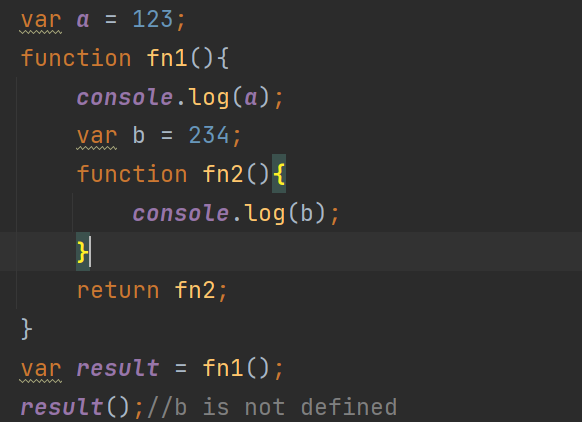

```
闭包就是fn2,既能够读取其它函数内部变量的函数
```

```
定义在一个函数内部的函数
```

```
闭包最大的特点:就是它可以记住诞生的环境,比如fn2记住了它诞生的环境是fn1,所以在fn2中可以得到fn1中的内部变量
```

### 闭包的用途

```
1.通过闭包制作计数器
作用:读取函数内部的变量,这些变量始终在内存中,使用闭包小心内存的泄露
```

```
2.闭包能够封装对象的私有属性和方法
```

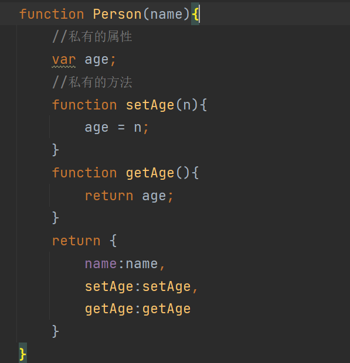

### 闭包的注意点

```
1.使用闭包使得函数中的变量始终在内存中,内存消耗很大,所以不能滥用闭包.否则会造成页面的性能问题.在ie中可能导致内存泄露.
```

```
每个父函数调用完成,都会形成新的闭包,父函数中的变量始终会在内存中,相当于缓存,小心内存的消耗问题
```

```
总结:
// 闭包需要三个条件
// 1.函数嵌套 2.访问所在的作用域 3.在所在作用域外被调用
```

### 立即执行函数

```
IIFE  ()是表达式 跟在函数后面 表示调用函数 fn()
立即执行函数:定义函数之后,立即调用该函数，这种函数叫做立即执行函数
注意: 如果function出现在行首 一律解释成函数声明语句
简称：自执行函数
1.常用的两种写法
```

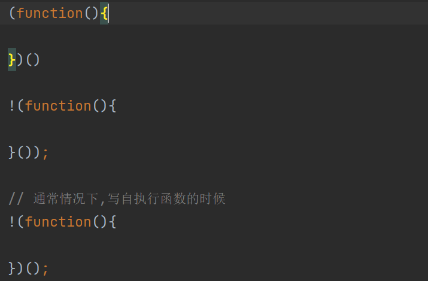

```
立即执行函数也叫闭包,可以封装私有的属性,同时可以减少对全局变量的污染
```

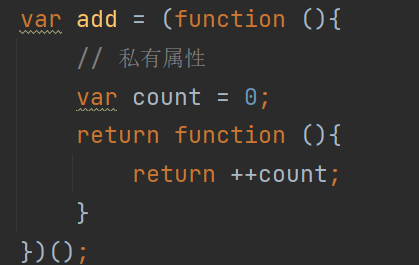

### 闭包的10种表示形式

```
1.返回值 最常见的一种形式
```

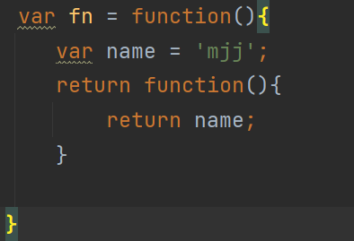

```
2.函数赋值 一种变形的形式是将内部函数赋值给一个外部的变量
```

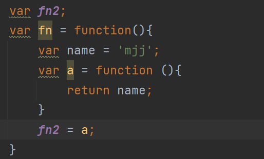

```
3.函数参数
```

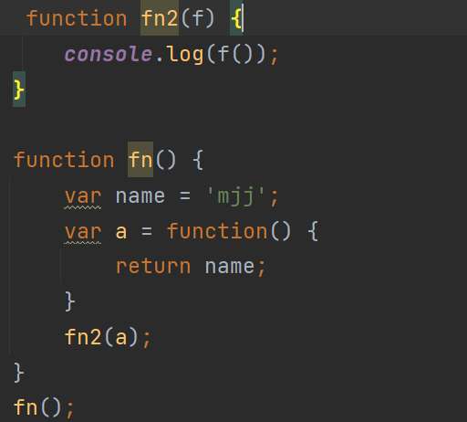

```
4.IIFE
```

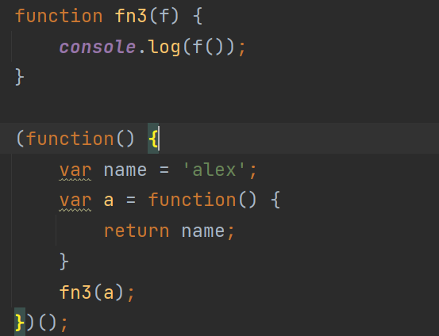

```
5.循环赋值
```

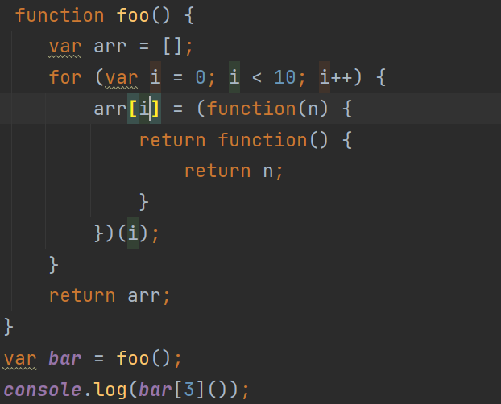

```
6.getter和setter函数来将要操作得变量保存在函数内部,防止暴露在外部
```

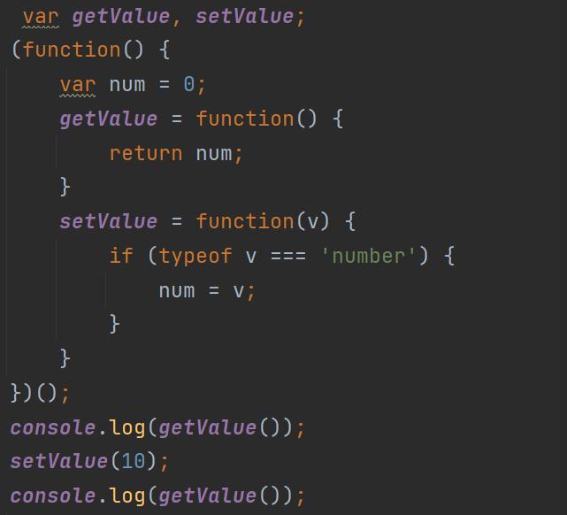

```
7.迭代器 
```

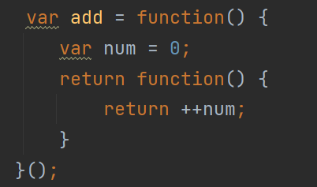

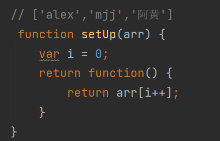

```
8.区分首次
```

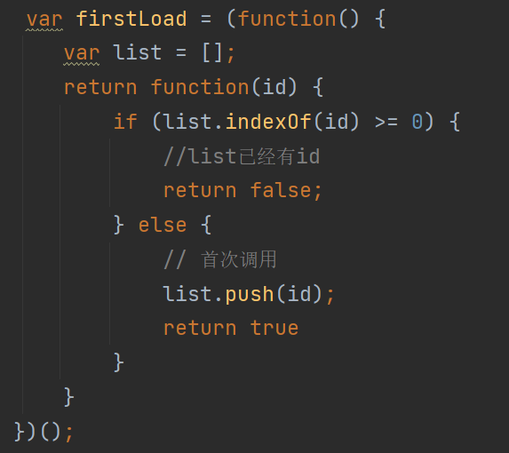

```
9.缓存机制
9.1 未加入缓存
```

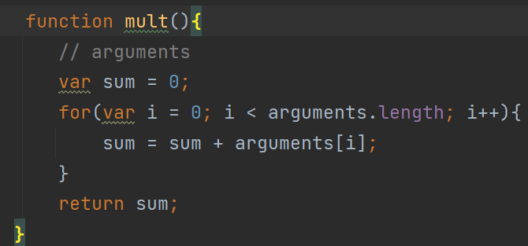

```
9.2 有缓存机制
```

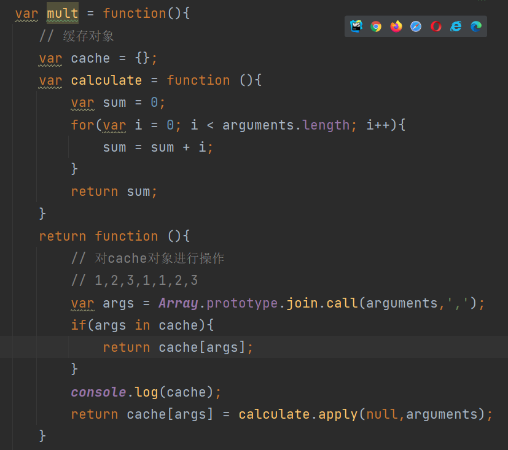

```
10.img图片对象上报
```

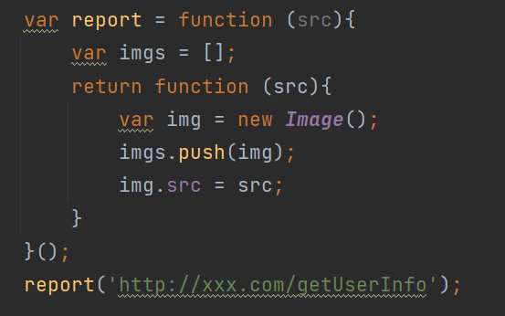
