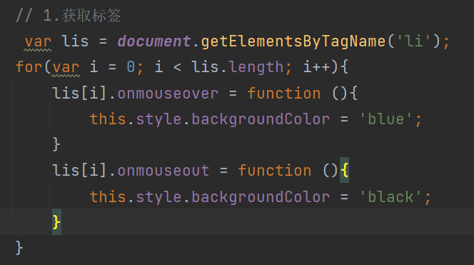
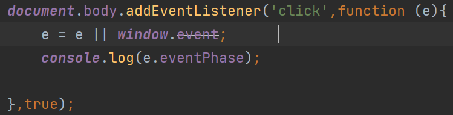
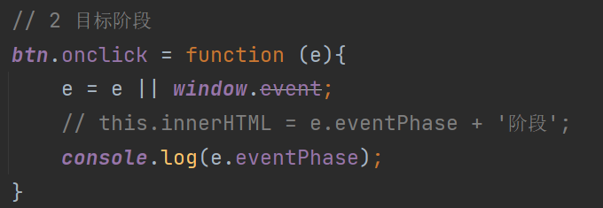
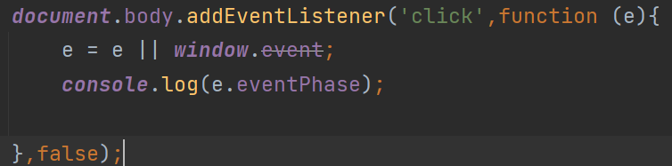
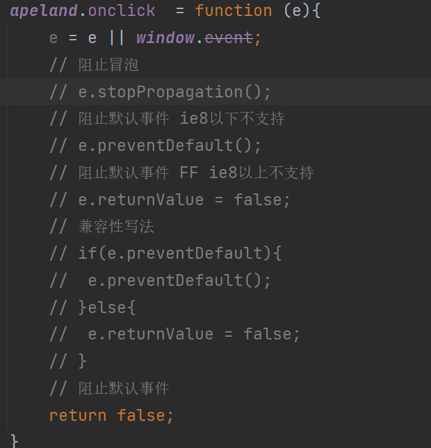

### 事件历史

```
js操作css称为脚本化的css,js与html交互通过事件完成
事件就是文档或浏览器窗口中发生一些特定的交互瞬间
事件流(事件传播)描述的是从页面中接收事件的顺序
历史
如果单击了某个按钮,他们认为单击事件不仅仅发生在按钮上,甚至单击整个页面
IE和Netscape
IE事件流是事件冒泡流
Netscape事件流式事件捕获流
```

### 事件冒泡介绍

```
事件冒泡: 事件开始时由最具体的元素接收,然后逐级向上传播到较为不具体的节点(文档)
```

事例

```html
<!DOCTYPE html>
<html>
   <head>
      <meta charset="utf-8">
      <title>02 事件冒泡介绍</title>
      <style type="text/css">
         #box{
            width: 200px;
            height: 200px;
            background-color: red;
         }
         body{
            background: #262626;
         }
      </style>
   </head>
   <body>
      <div id="box"></div>
      <script type="text/javascript">
         // 事件冒泡: 事件开始时由最具体的元素接收,然后逐级向上传播到较为不具体的节点(文档)
         // 注意: ie9以上 
         var box = document.getElementById('box');
         box.onclick = function (){
            box.innerHTML += 'div\n';
         }
         document.body.onclick = function (){
            box.innerHTML += 'body\n';
         }
         document.documentElement.onclick = function (){
            box.innerHTML += 'html\n';
         }
         document.onclick = function (){
            box.innerHTML += 'document\n';
         }
         window.onclick = function (){
            box.innerHTML += 'window\n';
         }
      </script>
   </body>
</html>
```

### 事件捕获介绍

```
事件捕获：有不太具体的节点更早的接收事件,而最具体的节点应该最后接收到事件
事件流: 事件捕获阶段,处于目标阶段，事件冒泡阶段
```

事例

```
<!DOCTYPE html>
<html>
   <head>
      <meta charset="utf-8">
      <title>02 事件捕获介绍</title>
      <style type="text/css">
         #box{
            width: 200px;
            height: 200px;
            background-color: red;
         }
      </style>
   </head>
   <body>
      <div id="box"></div>
      <script type="text/javascript">
         //事件捕获：由不太具体的节点更早的接收事件,而最具体的节点最后接收到事件.
         var box = document.getElementById('box');
         box.addEventListener('click',function (){
            box.innerHTML += 'box\n';
         },true);
         document.body.addEventListener('click',function (){
            box.innerHTML += 'body\n';
         },true);
         document.documentElement.addEventListener('click',function (){
            box.innerHTML += 'html\n';
         },true);
         document.addEventListener('click',function (){
            box.innerHTML += 'document\n';
         },true);
         window.addEventListener('click',function (){
            box.innerHTML += 'window\n';
         },true);
         
         box.addEventListener('click',function (){
            box.innerHTML += 'box\n';
         },false);
         document.body.addEventListener('click',function (){
            box.innerHTML += 'body\n';
         },false);
         document.documentElement.addEventListener('click',function (){
            box.innerHTML += 'html\n';
         },false);
         document.addEventListener('click',function (){
            box.innerHTML += 'document\n';
         },false);
         window.addEventListener('click',function (){
            box.innerHTML += 'window\n';
         },false);
         
         // 事件流: 事件捕获阶段,处于目标阶段，事件冒泡阶段
      </script>
   </body>
</html>
```

### 事件处理程序

#### DOM0级事件处理程序


#### DOM2级事件处理程序

~~~
布尔值默认为false是处于冒泡阶段,如果为true是处于捕获阶段
addEventListner(事件名,处理程序的函数，布尔值) removeEventListner()
IE8浏览器不支持DOM2级事件处理程序	
~~~


```
兼容IE
// IE: attachEvent()  detachEvent()
// IE10以下浏览器可以使用
var box = document.getElementById('box');
box.attachEvent('onclick',function (){
   this.innerHTML += '1';
})
```

#### 全浏览器 事件处理程序的兼容性代码

```
attachEvent()内部的this指向了window,我们要对this的指向也做兼容

function addEvent(target,eventType,handler){
   if(target.addEventListener){
      // chrome  ff safari
      target.addEventListener(eventType,handler,false);
   }else{
      target.attachEvent('on' + eventType,function (){
         handler.call(target);
      });
   }
   
} 
```

#### 总结

```
1.相同点,如果同时出现HTML事件处理程序和DOM0级事件处理程序,DOM0级会覆盖HTML事件处理程序
2.不同点
2.1 chrome,safari,FF浏览器以及IE11结果： DOM0级 DOM2级
2.2 IE9、10结果为：DOM0级 DOM2级 IE 
2.3 ie8结果： DOM0级 IE

// DOM0级事件处理程序
			box.onclick = function() {
				this.innerHTML += 'DOM0级\n';
			}
			//  DOM2级事件处理程序
			if (box.addEventListener) {
				box.addEventListener('click', function() {
					this.innerHTML += 'DOM2级\n'
				})
			}
			// IE事件处理程序
			if (box.attachEvent) {
				box.attachEvent('onclick', function() {
					box.innerHTML += 'IE\n'
				})
			}
```

#### 如何获取事件对象

```
1.如何获取事件对象
2.事件目标
3.事件代理
4.事件冒泡
5.事件流阶段 eventPhase
6.取消默认事件
```

```
1.event对象是事件处理程序的第一个参数 ie8浏览器不兼容
box.onclick = function (e){
					this.innerHTML = e;		}
2.直接可以使用event变量 火狐浏览器低版本获取出来的是undefined
box.onclick = function() {
					this.innerHTML = event;
				} 
				
				// 兼容性代码
				box.onclick = function(e){
					console.log(e);
					// 兼容性写法
					e = e || window.event;
					box.innerHTML = e;
				}
```

### 事件目标

```
e =  e || window.event;
```

```
1.currentTarget属性返回事件当前所在的节点,正在执行的监听函数所绑定的节点
2.target属性返回的是事件的实际目标对象
3.srcElement跟target功能是一致的,FF低版本的浏览器不支持
```

### 事件代理

```
常规方法实现
```



```
事件代理的方式实现 事件实际目标对象来实现
事件代理应用: 事件实际目标对象target和srcElement属性完成
优点: 提高性能以及降低代码的复杂度
```

### 事件冒泡

```
bubbles cancelBubble stopPropagation() stopImmediatePropagation()
1.bubbles 返回一个布尔值 表示当前事件是否会冒泡,只读
注意: 大部分事件都会冒泡,但是focus blur scroll事件不会冒泡
2.stopPropagation()表示取消事件的进一步冒泡 无返回值,但是无法阻止同一事件的其它监听函数被调用
3.stopImmediatePropagation()既可以阻止冒泡,也可以阻止同一事件的其它监听函数被调用
4.cancelBubble 属性用于阻止冒泡 可读写 默认值为false,当设置为true,cancelBubble可以取消事件冒泡
```

### 事件流阶段

```
e.eventPhase  0 表示事件没有发生  1 表示捕获阶段 2目标阶段  3冒泡阶段
```

####  捕获阶段



#### 目标阶段



#### 冒泡阶段



### 取消默认行为

```
事件对象中两个方法 阻止默认事件: preventDefault()  returnValue兼容ie8以下浏览器   return fasle;
1.preventDefault() ie8不支持
```



### 鼠标事件对象属性

```
事件对象中提供了:clientX/Y,x/y,offsetX/Y,screenX/Y,pageX/pageY
```

```
clientX/Y和x/y: 相对于浏览器（浏览器的有效区域）的X轴和Y轴的距离
this.innerHTML = `clientX:${e.clientX};clientY:${e.clientY};X:${e.x};Y:${e.y}`;
screenX/Y:相对于显示器屏幕的X轴和Y轴的距离
this.innerHTML = `screenX:${e.screenX};screenY:${e.screenY};`;
pageX/Y: 相对于页面的X轴和Y轴的距离
this.innerHTML = `pageX:${e.pageX};pageY:${e.pageY};`;
offsetX/Y:相对于事件源的X轴和Y轴的距离
```

总结

~~~
当事件源触发点击事件，可以知道鼠标指针
1.相对于浏览器(即页面)的X轴和Y轴的距离
2.相对于显示器屏幕的X轴和Y轴的距离
3.相对于事件源的X轴和Y轴的距离
~~~

