### 函数的声明方式

```
1.函数的声明语句
```

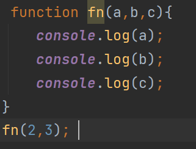

```
2.函数的表达式:将一个匿名函数赋值给一个新的变量
```

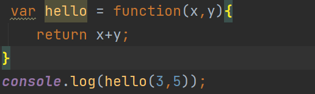

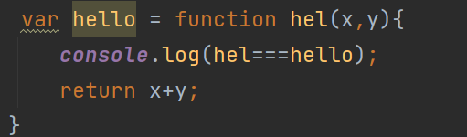

```
3.Function 构造函数
```

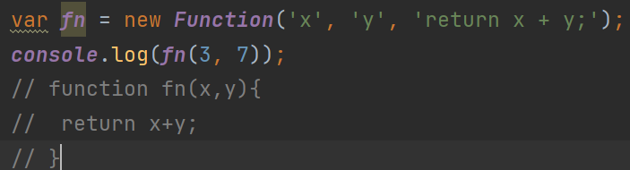

### 函数返回值

```
如果没有返回值，调用表达式的结果是undefined
```

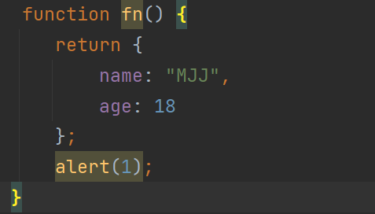

```
并不是所有的函数中的return之后的代码都不执行
```

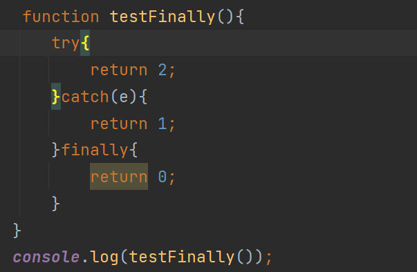

```
一个函数可以有多个return语句
```

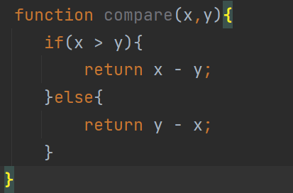

```
如果函数调用时在前面加上new前缀,且返回值不是一个对象,则返回该对象 (this)
```

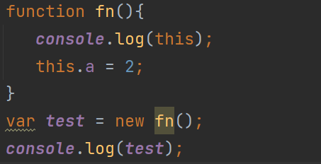

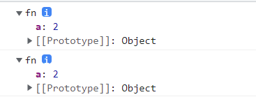

```
如果返回值是一个对象,则返回该对象
```

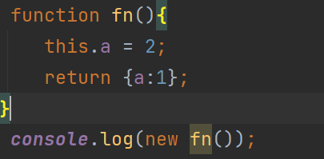

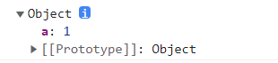

### 函数调用

```
函数调用4种方式: 函数调用模式,方法调用模式,构造调用模式,间接调用模式
```

#### 函数调用模式

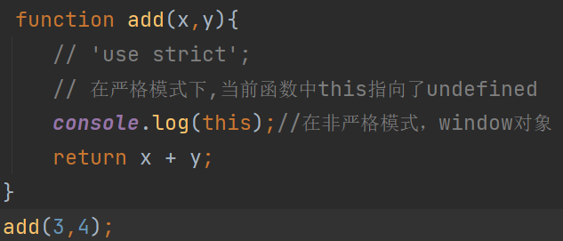

~~~
重写
~~~

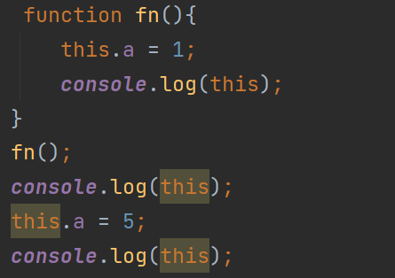

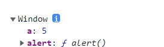

上图结果会发现控制台的所有window对象的a都是5

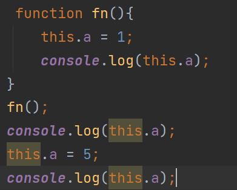

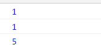

#### 构造函数调用模式

```
this指向问题: 当做普通函数调用,this指向了window,
当做构造函数调用,this指向当前的函数,
当做对象的方法,这个this一般情况指向了当前的对象
```

```
 function fn(x,y){
   this.a = x + y;
}
```

```
var a = new fn;//等价于var a = new fn();
```

#### 间接调用模式

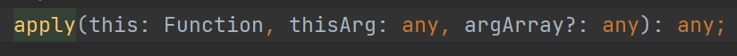

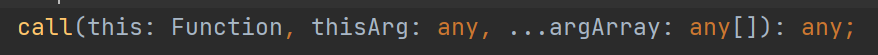

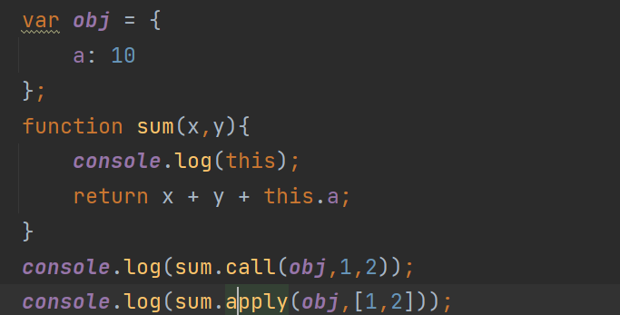

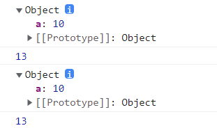

### 函数参数

```
arguments
函数不介意传递进来多少个参数,也不在乎传进来的参数是什么数据类型,甚至可以不传参数
```

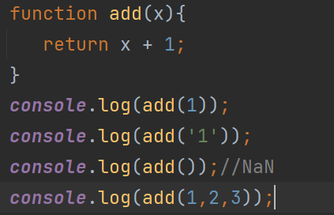

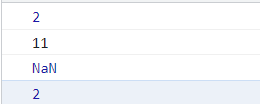

```
同名形参报错
```

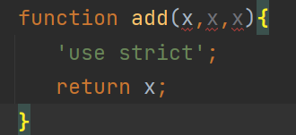

```
实参比形参个数少,剩下的形参都将设置为undefined
```

```
实参比形参个数多,考虑arguments
arguments它不是真正的数组,它是类数组,它能通过[]来访问它的每一个元素
```

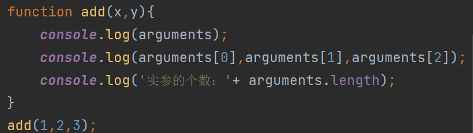

```
形参的个数 方法名.length 
```

### 函数重载

```
重载 :定义相同的函数名,传入的不同参数,实现不同的功能
```

```
在js中函数不存在重载现象
```

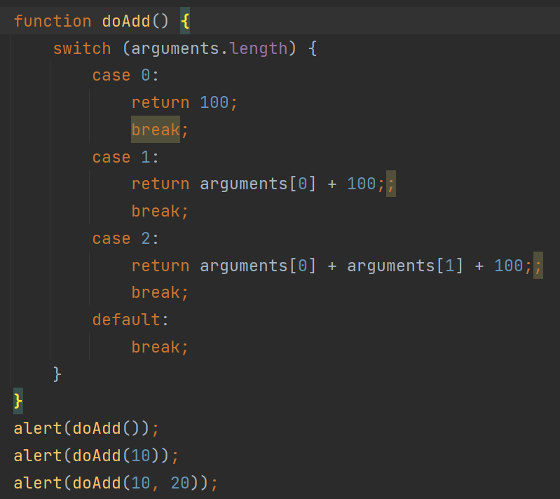

### 参数传递

```
1.基本数据类型
在向参数传递基本数据类型的值时,被传递的值会被复制到一个局部变量
```

```
2.引用数据类型
在向参数传递引用数据类型的值时，会把这个值在内存中的地址复制给局部变量
```

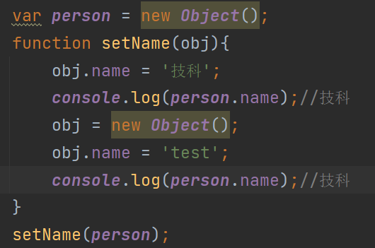

### 函数属性

```
arguments对象中的length属性表示实参,而函数参数length属性表示的是形参的个数
```

```
name指的是当前函数的名字
```

```
prototype 属性
每一个函数都有一个prototype属性
关于原型对象 后面面向对象的课程中会详细讲
```

### 函数的方法

```
每个函数都包含两个非继承而来的方法
apply() call()
```

```
在非严格模式下,如果我们使用call()或者是apply()方法,传入一个null或者undefined会被转换成一个全局window对象
```

```
在严格模式下,函数的指向始终是指定的值
```

### call和apply的应用

```
1.找出数组的最大元素 Math.max().apply(null,arr)
```

```
2.将类数组转换成真正的数组
Array.prototype.slice.apply(arguments)
```

```
3.数组追加
Array.prototype.push.apply(arr,[1,2,3,4]);
```

```
4.利用call和apply做继承
```

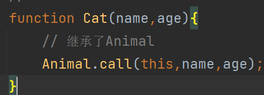

```
5.使用log代理console.log()
```

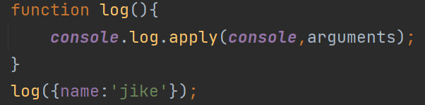

### bind方法的用法

```
bind es5新增的方法,主要作用:将函数绑定到某个对象中,并且有返回值(一个函数)
```

```
常见的函数式编程技术- 函数柯里化
```

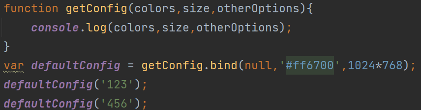

