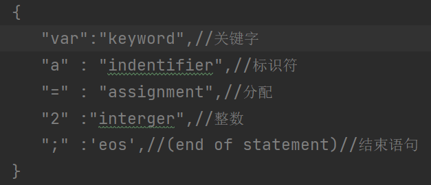
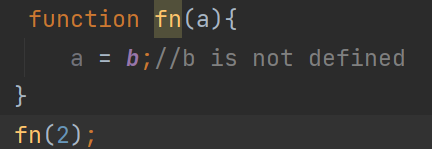
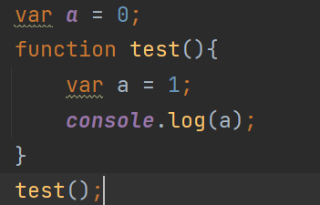
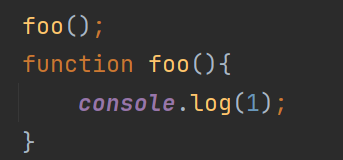

### 作用域的内部原理介绍

```
// 全局作用域  函数作用域
```

```
// 编译阶段 边解释边执行
```

```
// 内部原理分成 编译,执行,查询,嵌套,异常 (了解)
```

### 编译阶段(了解)

```
分词
var a = 2;
词法单元: var, a, =, 2,;
```



```
解析
抽象语法树(AST  Abstract Snatax Tree)
```

```
代码生成
将AST准换成可执行的代码的过程,转换成一组机器指令
```

```
简言之,编译过程就是编译器把程序分解成词法单元,将词法单元解析成AST,再把AST转换成机器指令等待执行得过程
```

### 执行阶段(了解)

```
1.引擎运行代码时首先查找当前的作用域,看a变量是否在当前的作用域下,如果是,引擎就会直接使用这个变量;如果否,引擎会继续查找该变量
```

```
2.如果找到了变量,就会将2赋值给当前的变量,否则引擎就会抛出异常
```

### 查询

```
LHS查询  RHS查询
有等号赋值的称为叫LHS查询,反之叫RHS查询
```

### 嵌套

```
// ********作用域变量的查找机制(*******重要*******)
// 在当前作用域中无法找到某个变量时,引擎就会在外层嵌套的作用域中继续查找你,直到找到该变量,或者是抵达最外层的作用域(全局作用域)为止
```

### 异常(了解)



### 遮蔽

```
作用域查找从运行时所处的最内部作用域开始,逐级向上进行,直到遇到第一个匹配的标识符为止
```

```
在多层的嵌套作用域可以定义同名的标识符,这叫做 "遮蔽效应"
```



### 变量的声明提升

```
声明从他们在代码中出现的位置被移动到最上面,这个过程叫做变量提升,预解释
```

### 函数声明提升



### 声明注意事项

```
声明提升: 变量声明提升和函数声明提升  变量的声明优先于函数的声明.但是 函数的声明会覆盖未定义的同名的变量
```

```
1.变量的重复声明是无用的,但是函数的重复声明会覆盖前面的声明(无论是变量还是函数声明)
```

```
2.函数声明提升优先级高于变量的声明提升
```

```
3.后面的函数声明会覆盖前面的函数声明
```

```
总结: 应该避免在同一作用域中重复声明
```

### 作用域链和自由变量

```
自由变量:在当前作用域中存在但未在当前作用域中声明的变量
```

```
一旦出现自由变量,就肯定会有作用域链,再根据作用域链查找机制,查找到对应的变量
```

```
查找机制:在当前作用域中发现没有该变量,然后沿着作用域链往上级查找,直到查到对应的变量为止,如果查找不到,直接报错
```

### 执行环境

```
相当于作用域链一样
```

```
总结：
1.在js中，除了全局作用域，每个函数都会创建自己的作用域。
2.作用域在函数定义的时候已经确定了，与函数调用无关。
3.通过作用域，可以查找作用域范围内的变量和函数有哪些，却不知道变量的值是什么。所以作用域是静态
4.对于函数来说，执行环境在函数调用时确定的。执行环境包含作用域内的所有的变量和函数的值。在同一个作用域下，不同的调用会产生不同的执行环境，从而产生不同的变量和值。所以执行环境是动态
```
