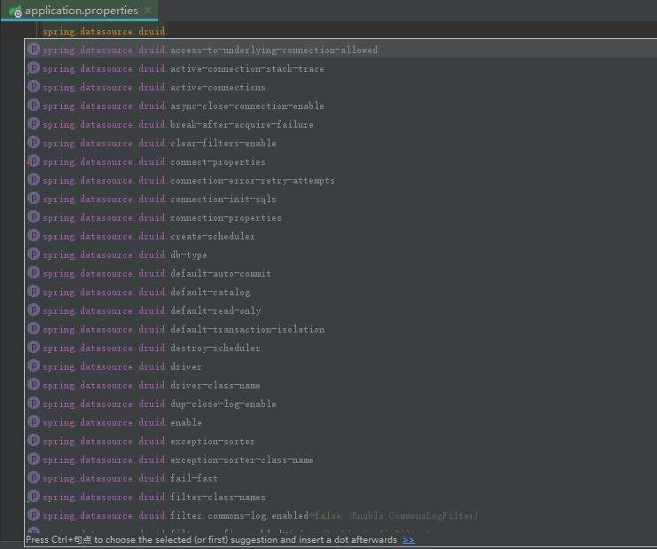

### 场景依赖

https://docs.spring.io/spring-boot/docs/current/reference/html/using-spring-boot.html#using-boot-starter

以下应用启动器由 Spring Boot`org.springframework.boot`组下提供：

| 名称                                          | 描述                                                         |
| :-------------------------------------------- | :----------------------------------------------------------- |
| `spring-boot-starter`                         | 核心启动器，包括自动配置支持、日志记录和 YAML                |
| `spring-boot-starter-activemq`                | 使用 Apache ActiveMQ 的 JMS 消息传递入门                     |
| `spring-boot-starter-amqp`                    | 使用 Spring AMQP 和 Rabbit MQ 的入门者                       |
| `spring-boot-starter-aop`                     | 使用 Spring AOP 和 AspectJ 进行面向方面编程的入门者          |
| `spring-boot-starter-artemis`                 | 使用 Apache Artemis 进行 JMS 消息传递的入门者                |
| `spring-boot-starter-batch`                   | 使用 Spring Batch 的启动器                                   |
| `spring-boot-starter-cache`                   | 使用 Spring Framework 的缓存支持的 Starter                   |
| `spring-boot-starter-data-cassandra`          | Starter 使用 Cassandra 分布式数据库和 Spring Data Cassandra  |
| `spring-boot-starter-data-cassandra-reactive` | Starter 使用 Cassandra 分布式数据库和 Spring Data Cassandra Reactive |
| `spring-boot-starter-data-couchbase`          | 使用 Couchbase 面向文档的数据库和 Spring Data Couchbase 的入门者 |
| `spring-boot-starter-data-couchbase-reactive` | Starter 使用 Couchbase 面向文档的数据库和 Spring Data Couchbase Reactive |
| `spring-boot-starter-data-elasticsearch`      | 使用 Elasticsearch 搜索和分析引擎以及 Spring Data Elasticsearch 的入门者 |
| `spring-boot-starter-data-jdbc`               | 使用 Spring Data JDBC 的入门者                               |
| `spring-boot-starter-data-jpa`                | 将 Spring Data JPA 与 Hibernate 结合使用的入门者             |
| `spring-boot-starter-data-ldap`               | 使用 Spring Data LDAP 的入门者                               |
| `spring-boot-starter-data-mongodb`            | 使用 MongoDB 面向文档的数据库和 Spring Data MongoDB 的入门者 |
| `spring-boot-starter-data-mongodb-reactive`   | Starter 使用 MongoDB 面向文档的数据库和 Spring Data MongoDB Reactive |
| `spring-boot-starter-data-neo4j`              | 使用 Neo4j 图形数据库和 Spring Data Neo4j 的入门者           |
| `spring-boot-starter-data-r2dbc`              | 使用 Spring Data R2DBC 的启动器                              |
| `spring-boot-starter-data-redis`              | 将 Redis 键值数据存储与 Spring Data Redis 和 Lettuce 客户端一起使用的入门者 |
| `spring-boot-starter-data-redis-reactive`     | 将 Redis 键值数据存储与 Spring Data Redis 反应式和 Lettuce 客户端一起使用的入门者 |
| `spring-boot-starter-data-rest`               | 使用 Spring Data REST 在 REST 上公开 Spring Data 存储库的启动器 |
| `spring-boot-starter-freemarker`              | 使用 FreeMarker 视图构建 MVC Web 应用程序的入门者            |
| `spring-boot-starter-groovy-templates`        | 使用 Groovy 模板视图构建 MVC Web 应用程序的入门者            |
| `spring-boot-starter-hateoas`                 | 使用 Spring MVC 和 Spring HATEOAS 构建基于超媒体的 RESTful Web 应用程序的入门者 |
| `spring-boot-starter-integration`             | 使用 Spring Integration 的入门者                             |
| `spring-boot-starter-jdbc`                    | 将 JDBC 与 HikariCP 连接池一起使用的 Starter                 |
| `spring-boot-starter-jersey`                  | 使用 JAX-RS 和 Jersey 构建 RESTful Web 应用程序的初学者。替代方案[`spring-boot-starter-web`](https://docs.spring.io/spring-boot/docs/current/reference/html/using.html#spring-boot-starter-web) |
| `spring-boot-starter-jooq`                    | 使用 jOOQ 访问 SQL 数据库的入门者。[`spring-boot-starter-data-jpa`](https://docs.spring.io/spring-boot/docs/current/reference/html/using.html#spring-boot-starter-data-jpa)或的替代品[`spring-boot-starter-jdbc`](https://docs.spring.io/spring-boot/docs/current/reference/html/using.html#spring-boot-starter-jdbc) |
| `spring-boot-starter-json`                    | 读写json的Starter                                            |
| `spring-boot-starter-jta-atomikos`            | 使用 Atomikos 的 JTA 事务入门                                |
| `spring-boot-starter-mail`                    | 使用 Java Mail 的 Starter 和 Spring Framework 的电子邮件发送支持 |
| `spring-boot-starter-mustache`                | 使用 Mustache 视图构建 Web 应用程序的入门者                  |
| `spring-boot-starter-oauth2-client`           | 使用 Spring Security 的 OAuth2/OpenID Connect 客户端功能的入门者 |
| `spring-boot-starter-oauth2-resource-server`  | 使用 Spring Security 的 OAuth2 资源服务器功能的入门者        |
| `spring-boot-starter-quartz`                  | 使用 Quartz 调度器的启动器                                   |
| `spring-boot-starter-rsocket`                 | 用于构建 RSocket 客户端和服务器的 Starter                    |
| `spring-boot-starter-security`                | 使用 Spring Security 的入门者                                |
| `spring-boot-starter-test`                    | Starter 用于使用包括 JUnit Jupiter、Hamcrest 和 Mockito 在内的库测试 Spring Boot 应用程序 |
| `spring-boot-starter-thymeleaf`               | 使用 Thymeleaf 视图构建 MVC Web 应用程序的初学者             |
| `spring-boot-starter-validation`              | 将 Java Bean 验证与 Hibernate Validator 结合使用的入门工具   |
| `spring-boot-starter-web`                     | 使用 Spring MVC 构建 Web（包括 RESTful）应用程序的入门者。使用 Tomcat 作为默认的嵌入式容器 |
| `spring-boot-starter-web-services`            | 使用 Spring Web 服务的入门者                                 |
| `spring-boot-starter-webflux`                 | 使用 Spring Framework 的 Reactive Web 支持构建 WebFlux 应用程序的 Starter |
| `spring-boot-starter-websocket`               | 使用 Spring Framework 的 WebSocket 支持构建 WebSocket 应用程序的 Starter |

除了应用程序启动器之外，以下启动器还可用于添加*[生产就绪](https://docs.spring.io/spring-boot/docs/current/reference/html/actuator.html#actuator)*功能：

| 名称                           | 描述                                                         |
| :----------------------------- | :----------------------------------------------------------- |
| `spring-boot-starter-actuator` | 使用 Spring Boot 的 Actuator 的 Starter，它提供了生产就绪的特性来帮助你监控和管理你的应用 |

最后，Spring Boot 还包括以下启动器，如果您想排除或交换特定的技术方面，可以使用它们：

| 名称                                | 描述                                                         |
| :---------------------------------- | :----------------------------------------------------------- |
| `spring-boot-starter-jetty`         | 使用 Jetty 作为嵌入式 servlet 容器的启动器。替代方案[`spring-boot-starter-tomcat`](https://docs.spring.io/spring-boot/docs/current/reference/html/using.html#spring-boot-starter-tomcat) |
| `spring-boot-starter-log4j2`        | 使用 Log4j2 进行日志记录的启动器。替代方案[`spring-boot-starter-logging`](https://docs.spring.io/spring-boot/docs/current/reference/html/using.html#spring-boot-starter-logging) |
| `spring-boot-starter-logging`       | 使用 Logback 进行日志记录的启动器。默认日志记录启动器        |
| `spring-boot-starter-reactor-netty` | 使用 Reactor Netty 作为嵌入式响应式 HTTP 服务器的启动器。    |
| `spring-boot-starter-tomcat`        | 使用 Tomcat 作为嵌入式 servlet 容器的启动器。使用的默认 servlet 容器启动器[`spring-boot-starter-web`](https://docs.spring.io/spring-boot/docs/current/reference/html/using.html#spring-boot-starter-web) |
| `spring-boot-starter-undertow`      | 使用 Undertow 作为嵌入式 servlet 容器的启动器。替代方案[`spring-boot-starter-tomcat`](https://docs.spring.io/spring-boot/docs/current/reference/html/using.html#spring-boot-starter-tomcat) |

### 通用应用程序属性

https://docs.spring.io/spring-boot/docs/current/reference/html/appendix-application-properties.html#common-application-properties

#### 核心属性

| 名称                                                         | 描述                                                         | 默认值                                                       |
| :----------------------------------------------------------- | :----------------------------------------------------------- | :----------------------------------------------------------- |
| [`debug`](https://docs.spring.io/spring-boot/docs/current/reference/html/application-properties.html#application-properties.core.debug) | 启用调试日志。                                               | `false`                                                      |
| [`info.*`](https://docs.spring.io/spring-boot/docs/current/reference/html/application-properties.html#application-properties.core.info) | 添加到信息端点的任意属性。                                   |                                                              |
| [`logging.charset.console`](https://docs.spring.io/spring-boot/docs/current/reference/html/application-properties.html#application-properties.core.logging.charset.console) | 用于控制台输出的字符集。                                     |                                                              |
| [`logging.charset.file`](https://docs.spring.io/spring-boot/docs/current/reference/html/application-properties.html#application-properties.core.logging.charset.file) | 用于文件输出的字符集。                                       |                                                              |
| [`logging.config`](https://docs.spring.io/spring-boot/docs/current/reference/html/application-properties.html#application-properties.core.logging.config) | 日志记录配置文件的位置。例如，Logback 的`classpath:logback.xml`。 |                                                              |
| [`logging.exception-conversion-word`](https://docs.spring.io/spring-boot/docs/current/reference/html/application-properties.html#application-properties.core.logging.exception-conversion-word) | 记录异常时使用的转换字。                                     | `%wEx`                                                       |
| [`logging.file.name`](https://docs.spring.io/spring-boot/docs/current/reference/html/application-properties.html#application-properties.core.logging.file.name) | 日志文件名（例如，`myapp.log`）。名称可以是确切位置或相对于当前目录。 |                                                              |
| [`logging.file.path`](https://docs.spring.io/spring-boot/docs/current/reference/html/application-properties.html#application-properties.core.logging.file.path) | 日志文件的位置。例如，`/var/log`。                           |                                                              |
| [`logging.group.*`](https://docs.spring.io/spring-boot/docs/current/reference/html/application-properties.html#application-properties.core.logging.group) | 日志组可同时快速更改多个记录器。例如，`logging.group.db=org.hibernate,org.springframework.jdbc`。 |                                                              |
| [`logging.level.*`](https://docs.spring.io/spring-boot/docs/current/reference/html/application-properties.html#application-properties.core.logging.level) | 日志级别严重性映射。例如，`logging.level.org.springframework=DEBUG`。 |                                                              |
| [`logging.logback.rollingpolicy.clean-history-on-start`](https://docs.spring.io/spring-boot/docs/current/reference/html/application-properties.html#application-properties.core.logging.logback.rollingpolicy.clean-history-on-start) | 是否在启动时清除存档日志文件。                               | `false`                                                      |
| [`logging.logback.rollingpolicy.file-name-pattern`](https://docs.spring.io/spring-boot/docs/current/reference/html/application-properties.html#application-properties.core.logging.logback.rollingpolicy.file-name-pattern) | 滚动日志文件名的模式。                                       | `${LOG_FILE}.%d{yyyy-MM-dd}.%i.gz`                           |
| [`logging.logback.rollingpolicy.max-file-size`](https://docs.spring.io/spring-boot/docs/current/reference/html/application-properties.html#application-properties.core.logging.logback.rollingpolicy.max-file-size) | 最大日志文件大小。                                           | `10MB`                                                       |
| [`logging.logback.rollingpolicy.max-history`](https://docs.spring.io/spring-boot/docs/current/reference/html/application-properties.html#application-properties.core.logging.logback.rollingpolicy.max-history) | 存档日志文件的最大保留天数。                                 | `7`                                                          |
| [`logging.logback.rollingpolicy.total-size-cap`](https://docs.spring.io/spring-boot/docs/current/reference/html/application-properties.html#application-properties.core.logging.logback.rollingpolicy.total-size-cap) | 要保留的日志备份的总大小。                                   | `0B`                                                         |
| [`logging.pattern.console`](https://docs.spring.io/spring-boot/docs/current/reference/html/application-properties.html#application-properties.core.logging.pattern.console) | 输出到控制台的 Appender 模式。仅支持默认的 Logback 设置。    | `%clr(%d{${LOG_DATEFORMAT_PATTERN:-yyyy-MM-dd HH:mm:ss.SSS}}){faint} %clr(${LOG_LEVEL_PATTERN:-%5p}) %clr(${PID:- }){magenta} %clr(---){faint} %clr([%15.15t]){faint} %clr(%-40.40logger{39}){cyan} %clr(:){faint} %m%n${LOG_EXCEPTION_CONVERSION_WORD:-%wEx}` |
| [`logging.pattern.dateformat`](https://docs.spring.io/spring-boot/docs/current/reference/html/application-properties.html#application-properties.core.logging.pattern.dateformat) | 日志日期格式的 Appender 模式。仅支持默认的 Logback 设置。    | `yyyy-MM-dd HH:mm:ss.SSS`                                    |
| [`logging.pattern.file`](https://docs.spring.io/spring-boot/docs/current/reference/html/application-properties.html#application-properties.core.logging.pattern.file) | 用于输出到文件的 Appender 模式。仅支持默认的 Logback 设置。  | `%d{${LOG_DATEFORMAT_PATTERN:-yyyy-MM-dd HH:mm:ss.SSS}} ${LOG_LEVEL_PATTERN:-%5p} ${PID:- } --- [%t] %-40.40logger{39} : %m%n${LOG_EXCEPTION_CONVERSION_WORD:-%wEx}` |
| [`logging.pattern.level`](https://docs.spring.io/spring-boot/docs/current/reference/html/application-properties.html#application-properties.core.logging.pattern.level) | 日志级别的 Appender 模式。仅支持默认的 Logback 设置。        | `%5p`                                                        |
| [`logging.register-shutdown-hook`](https://docs.spring.io/spring-boot/docs/current/reference/html/application-properties.html#application-properties.core.logging.register-shutdown-hook) | 在日志系统初始化时为它注册一个关闭钩子。部署为 war 文件时自动禁用。 | `true`                                                       |
| [`spring.aop.auto`](https://docs.spring.io/spring-boot/docs/current/reference/html/application-properties.html#application-properties.core.spring.aop.auto) | 添加@EnableAspectJAutoProxy。                                | `true`                                                       |
| [`spring.aop.proxy-target-class`](https://docs.spring.io/spring-boot/docs/current/reference/html/application-properties.html#application-properties.core.spring.aop.proxy-target-class) | 是否要创建基于子类 (CGLIB) 的代理 (true)，而不是基于标准 Java 接口的代理 (false)。 | `true`                                                       |
| [`spring.application.admin.enabled`](https://docs.spring.io/spring-boot/docs/current/reference/html/application-properties.html#application-properties.core.spring.application.admin.enabled) | 是否为应用程序启用管理功能。                                 | `false`                                                      |
| [`spring.application.admin.jmx-name`](https://docs.spring.io/spring-boot/docs/current/reference/html/application-properties.html#application-properties.core.spring.application.admin.jmx-name) | 应用程序管理 MBean 的 JMX 名称。                             | `org.springframework.boot:type=Admin,name=SpringApplication` |
| [`spring.application.name`](https://docs.spring.io/spring-boot/docs/current/reference/html/application-properties.html#application-properties.core.spring.application.name) | 应用名称。                                                   |                                                              |
| [`spring.autoconfigure.exclude`](https://docs.spring.io/spring-boot/docs/current/reference/html/application-properties.html#application-properties.core.spring.autoconfigure.exclude) | 要排除的自动配置类。                                         |                                                              |
| [`spring.banner.charset`](https://docs.spring.io/spring-boot/docs/current/reference/html/application-properties.html#application-properties.core.spring.banner.charset) | 横幅文件编码。                                               | `UTF-8`                                                      |
| [`spring.banner.image.bitdepth`](https://docs.spring.io/spring-boot/docs/current/reference/html/application-properties.html#application-properties.core.spring.banner.image.bitdepth) | 用于 ANSI 颜色的位深度。支持的值为 4（16 色）或 8（256 色）。 | `4`                                                          |
| [`spring.banner.image.height`](https://docs.spring.io/spring-boot/docs/current/reference/html/application-properties.html#application-properties.core.spring.banner.image.height) | 以字符为单位的横幅图像的高度（默认基于图像高度）。           |                                                              |
| [`spring.banner.image.invert`](https://docs.spring.io/spring-boot/docs/current/reference/html/application-properties.html#application-properties.core.spring.banner.image.invert) | 是否应为深色终端主题反转图像。                               | `false`                                                      |
| [`spring.banner.image.location`](https://docs.spring.io/spring-boot/docs/current/reference/html/application-properties.html#application-properties.core.spring.banner.image.location) | 横幅图像文件位置（也可以使用 jpg 或 png）。                  | `classpath:banner.gif`                                       |
| [`spring.banner.image.margin`](https://docs.spring.io/spring-boot/docs/current/reference/html/application-properties.html#application-properties.core.spring.banner.image.margin) | 以字符为单位的左侧图像边距。                                 | `2`                                                          |
| [`spring.banner.image.pixelmode`](https://docs.spring.io/spring-boot/docs/current/reference/html/application-properties.html#application-properties.core.spring.banner.image.pixelmode) | 渲染图像时使用的像素模式。                                   | `TEXT`                                                       |
| [`spring.banner.image.width`](https://docs.spring.io/spring-boot/docs/current/reference/html/application-properties.html#application-properties.core.spring.banner.image.width) | 横幅图像的宽度（以字符为单位）。                             | `76`                                                         |
| [`spring.banner.location`](https://docs.spring.io/spring-boot/docs/current/reference/html/application-properties.html#application-properties.core.spring.banner.location) | 横幅文本资源位置。                                           | `classpath:banner.txt`                                       |
| [`spring.beaninfo.ignore`](https://docs.spring.io/spring-boot/docs/current/reference/html/application-properties.html#application-properties.core.spring.beaninfo.ignore) | 是否跳过对 BeanInfo 类的搜索。                               | `true`                                                       |
| [`spring.codec.log-request-details`](https://docs.spring.io/spring-boot/docs/current/reference/html/application-properties.html#application-properties.core.spring.codec.log-request-details) | 是否在 DEBUG 级别记录表单数据，在 TRACE 级别记录标题。       | `false`                                                      |
| [`spring.codec.max-in-memory-size`](https://docs.spring.io/spring-boot/docs/current/reference/html/application-properties.html#application-properties.core.spring.codec.max-in-memory-size) | 限制每当需要聚合输入流时可以缓冲的字节数。这仅适用于自动配置的 WebFlux 服务器和 WebClient 实例。默认情况下未设置，在这种情况下，个别编解码器默认值适用。大多数编解码器默认限制为 256K。 |                                                              |
| [`spring.config.activate.on-cloud-platform`](https://docs.spring.io/spring-boot/docs/current/reference/html/application-properties.html#application-properties.core.spring.config.activate.on-cloud-platform) | 要包含的文档所需的云平台。                                   |                                                              |
| [`spring.config.activate.on-profile`](https://docs.spring.io/spring-boot/docs/current/reference/html/application-properties.html#application-properties.core.spring.config.activate.on-profile) | 应该与要包含的文档匹配的配置文件表达式。                     |                                                              |
| [`spring.config.additional-location`](https://docs.spring.io/spring-boot/docs/current/reference/html/application-properties.html#application-properties.core.spring.config.additional-location) | 除默认值外使用的配置文件位置。                               |                                                              |
| [`spring.config.import`](https://docs.spring.io/spring-boot/docs/current/reference/html/application-properties.html#application-properties.core.spring.config.import) | 导入额外的配置数据。                                         |                                                              |
| [`spring.config.location`](https://docs.spring.io/spring-boot/docs/current/reference/html/application-properties.html#application-properties.core.spring.config.location) | 替换默认值的配置文件位置。                                   |                                                              |
| [`spring.config.name`](https://docs.spring.io/spring-boot/docs/current/reference/html/application-properties.html#application-properties.core.spring.config.name) | 配置文件名。                                                 | `application`                                                |
| [`spring.config.use-legacy-processing`](https://docs.spring.io/spring-boot/docs/current/reference/html/application-properties.html#application-properties.core.spring.config.use-legacy-processing) | 是否启用配置数据处理遗留模式。                               | `false`                                                      |
| [`spring.info.build.encoding`](https://docs.spring.io/spring-boot/docs/current/reference/html/application-properties.html#application-properties.core.spring.info.build.encoding) | 文件编码。                                                   | `UTF-8`                                                      |
| [`spring.info.build.location`](https://docs.spring.io/spring-boot/docs/current/reference/html/application-properties.html#application-properties.core.spring.info.build.location) | 生成的 build-info.properties 文件的位置。                    | `classpath:META-INF/build-info.properties`                   |
| [`spring.info.git.encoding`](https://docs.spring.io/spring-boot/docs/current/reference/html/application-properties.html#application-properties.core.spring.info.git.encoding) | 文件编码。                                                   | `UTF-8`                                                      |
| [`spring.info.git.location`](https://docs.spring.io/spring-boot/docs/current/reference/html/application-properties.html#application-properties.core.spring.info.git.location) | 生成的 git.properties 文件的位置。                           | `classpath:git.properties`                                   |
| [`spring.jmx.default-domain`](https://docs.spring.io/spring-boot/docs/current/reference/html/application-properties.html#application-properties.core.spring.jmx.default-domain) | JMX 域名。                                                   |                                                              |
| [`spring.jmx.enabled`](https://docs.spring.io/spring-boot/docs/current/reference/html/application-properties.html#application-properties.core.spring.jmx.enabled) | 将管理 bean 暴露给 JMX 域。                                  | `false`                                                      |
| [`spring.jmx.server`](https://docs.spring.io/spring-boot/docs/current/reference/html/application-properties.html#application-properties.core.spring.jmx.server) | MBeanServer bean 名称。                                      | `mbeanServer`                                                |
| [`spring.jmx.unique-names`](https://docs.spring.io/spring-boot/docs/current/reference/html/application-properties.html#application-properties.core.spring.jmx.unique-names) | 是否应确保唯一的运行时对象名称。                             | `false`                                                      |
| [`spring.lifecycle.timeout-per-shutdown-phase`](https://docs.spring.io/spring-boot/docs/current/reference/html/application-properties.html#application-properties.core.spring.lifecycle.timeout-per-shutdown-phase) | 任何阶段（具有相同“阶段”值的 SmartLifecycle bean 组）关闭的超时时间。 | `30s`                                                        |
| [`spring.main.allow-bean-definition-overriding`](https://docs.spring.io/spring-boot/docs/current/reference/html/application-properties.html#application-properties.core.spring.main.allow-bean-definition-overriding) | 是否允许通过注册与现有定义同名的定义来覆盖 bean 定义。       | `false`                                                      |
| [`spring.main.banner-mode`](https://docs.spring.io/spring-boot/docs/current/reference/html/application-properties.html#application-properties.core.spring.main.banner-mode) | 用于在应用程序运行时显示横幅的模式。                         | `console`                                                    |
| [`spring.main.cloud-platform`](https://docs.spring.io/spring-boot/docs/current/reference/html/application-properties.html#application-properties.core.spring.main.cloud-platform) | 覆盖 Cloud Platform 自动检测。                               |                                                              |
| [`spring.main.lazy-initialization`](https://docs.spring.io/spring-boot/docs/current/reference/html/application-properties.html#application-properties.core.spring.main.lazy-initialization) | 是否应该延迟执行初始化。                                     | `false`                                                      |
| [`spring.main.log-startup-info`](https://docs.spring.io/spring-boot/docs/current/reference/html/application-properties.html#application-properties.core.spring.main.log-startup-info) | 是否在应用程序启动时记录有关应用程序的信息。                 | `true`                                                       |
| [`spring.main.register-shutdown-hook`](https://docs.spring.io/spring-boot/docs/current/reference/html/application-properties.html#application-properties.core.spring.main.register-shutdown-hook) | 应用程序是否应注册关闭挂钩。                                 | `true`                                                       |
| [`spring.main.sources`](https://docs.spring.io/spring-boot/docs/current/reference/html/application-properties.html#application-properties.core.spring.main.sources) | 要包含在 ApplicationContext 中的源（类名、包名或 XML 资源位置）。 |                                                              |
| [`spring.main.web-application-type`](https://docs.spring.io/spring-boot/docs/current/reference/html/application-properties.html#application-properties.core.spring.main.web-application-type) | 标记以明确请求特定类型的 Web 应用程序。如果未设置，则根据类路径自动检测。 |                                                              |
| [`spring.mandatory-file-encoding`](https://docs.spring.io/spring-boot/docs/current/reference/html/application-properties.html#application-properties.core.spring.mandatory-file-encoding) | 应用程序必须使用的预期字符编码。                             |                                                              |
| [`spring.messages.always-use-message-format`](https://docs.spring.io/spring-boot/docs/current/reference/html/application-properties.html#application-properties.core.spring.messages.always-use-message-format) | 是否始终应用 MessageFormat 规则，甚至解析没有参数的消息。    | `false`                                                      |
| [`spring.messages.basename`](https://docs.spring.io/spring-boot/docs/current/reference/html/application-properties.html#application-properties.core.spring.messages.basename) | 逗号分隔的基本名称列表（本质上是一个完全限定的类路径位置），每个都遵循 ResourceBundle 约定，并宽松地支持基于斜杠的位置。如果它不包含包限定符（例如“org.mypackage”），它将从类路径根目录解析。 | `messages`                                                   |
| [`spring.messages.cache-duration`](https://docs.spring.io/spring-boot/docs/current/reference/html/application-properties.html#application-properties.core.spring.messages.cache-duration) | 加载的资源包文件缓存持续时间。未设置时，bundle 将被永久缓存。如果未指定持续时间后缀，则将使用秒。 |                                                              |
| [`spring.messages.encoding`](https://docs.spring.io/spring-boot/docs/current/reference/html/application-properties.html#application-properties.core.spring.messages.encoding) | 消息包编码。                                                 | `UTF-8`                                                      |
| [`spring.messages.fallback-to-system-locale`](https://docs.spring.io/spring-boot/docs/current/reference/html/application-properties.html#application-properties.core.spring.messages.fallback-to-system-locale) | 如果没有找到特定语言环境的文件，是否回退到系统语言环境。如果它被关闭，唯一的回退将是默认文件（例如，基本名称“messages”的“messages.properties”）。 | `true`                                                       |
| [`spring.messages.use-code-as-default-message`](https://docs.spring.io/spring-boot/docs/current/reference/html/application-properties.html#application-properties.core.spring.messages.use-code-as-default-message) | 是否使用消息代码作为默认消息而不是抛出“NoSuchMessageException”。仅在开发期间推荐。 | `false`                                                      |
| [`spring.output.ansi.enabled`](https://docs.spring.io/spring-boot/docs/current/reference/html/application-properties.html#application-properties.core.spring.output.ansi.enabled) | 配置 ANSI 输出。                                             | `detect`                                                     |
| [`spring.pid.fail-on-write-error`](https://docs.spring.io/spring-boot/docs/current/reference/html/application-properties.html#application-properties.core.spring.pid.fail-on-write-error) | 如果使用 ApplicationPidFileWriter 失败，但它无法写入 PID 文件。 |                                                              |
| [`spring.pid.file`](https://docs.spring.io/spring-boot/docs/current/reference/html/application-properties.html#application-properties.core.spring.pid.file) | 要写入的 PID 文件的位置（如果使用 ApplicationPidFileWriter）。 |                                                              |
| [`spring.profiles.active`](https://docs.spring.io/spring-boot/docs/current/reference/html/application-properties.html#application-properties.core.spring.profiles.active) | 活动配置文件的逗号分隔列表。可以被命令行开关覆盖。           |                                                              |
| [`spring.profiles.default`](https://docs.spring.io/spring-boot/docs/current/reference/html/application-properties.html#application-properties.core.spring.profiles.default) | 如果没有配置文件处于活动状态，要启用的配置文件的名称。       | `default`                                                    |
| [`spring.profiles.group.*`](https://docs.spring.io/spring-boot/docs/current/reference/html/application-properties.html#application-properties.core.spring.profiles.group) | 配置文件组为相关的配置文件组定义逻辑名称。                   |                                                              |
| [`spring.profiles.include`](https://docs.spring.io/spring-boot/docs/current/reference/html/application-properties.html#application-properties.core.spring.profiles.include) | 无条件激活指定的以逗号分隔的配置文件列表（如果使用 YAML，则激活配置文件列表）。 |                                                              |
| [`spring.quartz.auto-startup`](https://docs.spring.io/spring-boot/docs/current/reference/html/application-properties.html#application-properties.core.spring.quartz.auto-startup) | 初始化后是否自动启动调度器。                                 | `true`                                                       |
| [`spring.quartz.jdbc.comment-prefix`](https://docs.spring.io/spring-boot/docs/current/reference/html/application-properties.html#application-properties.core.spring.quartz.jdbc.comment-prefix) | SQL 初始化脚本中单行注释的前缀。                             | `[#, --]`                                                    |
| [`spring.quartz.jdbc.initialize-schema`](https://docs.spring.io/spring-boot/docs/current/reference/html/application-properties.html#application-properties.core.spring.quartz.jdbc.initialize-schema) | 数据库模式初始化模式。                                       | `embedded`                                                   |
| [`spring.quartz.jdbc.schema`](https://docs.spring.io/spring-boot/docs/current/reference/html/application-properties.html#application-properties.core.spring.quartz.jdbc.schema) | 用于初始化数据库架构的 SQL 文件的路径。                      | `classpath:org/quartz/impl/jdbcjobstore/tables_@@platform@@.sql` |
| [`spring.quartz.job-store-type`](https://docs.spring.io/spring-boot/docs/current/reference/html/application-properties.html#application-properties.core.spring.quartz.job-store-type) | Quartz 作业存储类型。                                        | `memory`                                                     |
| [`spring.quartz.overwrite-existing-jobs`](https://docs.spring.io/spring-boot/docs/current/reference/html/application-properties.html#application-properties.core.spring.quartz.overwrite-existing-jobs) | 配置的作业是否应覆盖现有的作业定义。                         | `false`                                                      |
| [`spring.quartz.properties.*`](https://docs.spring.io/spring-boot/docs/current/reference/html/application-properties.html#application-properties.core.spring.quartz.properties) | 额外的 Quartz 调度器属性。                                   |                                                              |
| [`spring.quartz.scheduler-name`](https://docs.spring.io/spring-boot/docs/current/reference/html/application-properties.html#application-properties.core.spring.quartz.scheduler-name) | 调度程序的名称。                                             | `quartzScheduler`                                            |
| [`spring.quartz.startup-delay`](https://docs.spring.io/spring-boot/docs/current/reference/html/application-properties.html#application-properties.core.spring.quartz.startup-delay) | 初始化完成后启动调度程序的延迟。如果在整个应用程序启动之前不应运行任何作业，则设置此属性是有意义的。 | `0s`                                                         |
| [`spring.quartz.wait-for-jobs-to-complete-on-shutdown`](https://docs.spring.io/spring-boot/docs/current/reference/html/application-properties.html#application-properties.core.spring.quartz.wait-for-jobs-to-complete-on-shutdown) | 是否等待正在运行的作业在关机时完成。                         | `false`                                                      |
| [`spring.reactor.debug-agent.enabled`](https://docs.spring.io/spring-boot/docs/current/reference/html/application-properties.html#application-properties.core.spring.reactor.debug-agent.enabled) | 当反应器工具存在时是否应启用反应器调试代理。                 | `true`                                                       |
| [`spring.task.execution.pool.allow-core-thread-timeout`](https://docs.spring.io/spring-boot/docs/current/reference/html/application-properties.html#application-properties.core.spring.task.execution.pool.allow-core-thread-timeout) | 是否允许核心线程超时。这可以实现池的动态增长和收缩。         | `true`                                                       |
| [`spring.task.execution.pool.core-size`](https://docs.spring.io/spring-boot/docs/current/reference/html/application-properties.html#application-properties.core.spring.task.execution.pool.core-size) | 核心线程数。                                                 | `8`                                                          |
| [`spring.task.execution.pool.keep-alive`](https://docs.spring.io/spring-boot/docs/current/reference/html/application-properties.html#application-properties.core.spring.task.execution.pool.keep-alive) | 线程在终止之前可以保持空闲的时间限制。                       | `60s`                                                        |
| [`spring.task.execution.pool.max-size`](https://docs.spring.io/spring-boot/docs/current/reference/html/application-properties.html#application-properties.core.spring.task.execution.pool.max-size) | 允许的最大线程数。如果任务填满队列，池可以扩展到该大小以适应负载。如果队列是无界的，则忽略。 |                                                              |
| [`spring.task.execution.pool.queue-capacity`](https://docs.spring.io/spring-boot/docs/current/reference/html/application-properties.html#application-properties.core.spring.task.execution.pool.queue-capacity) | 队列容量。无限容量不会增加池，因此会忽略“max-size”属性。     |                                                              |
| [`spring.task.execution.shutdown.await-termination`](https://docs.spring.io/spring-boot/docs/current/reference/html/application-properties.html#application-properties.core.spring.task.execution.shutdown.await-termination) | 执行程序是否应该等待计划任务在关机时完成。                   | `false`                                                      |
| [`spring.task.execution.shutdown.await-termination-period`](https://docs.spring.io/spring-boot/docs/current/reference/html/application-properties.html#application-properties.core.spring.task.execution.shutdown.await-termination-period) | 执行器等待剩余任务完成的最长时间。                           |                                                              |
| [`spring.task.execution.thread-name-prefix`](https://docs.spring.io/spring-boot/docs/current/reference/html/application-properties.html#application-properties.core.spring.task.execution.thread-name-prefix) | 用于新创建线程名称的前缀。                                   | `task-`                                                      |
| [`spring.task.scheduling.pool.size`](https://docs.spring.io/spring-boot/docs/current/reference/html/application-properties.html#application-properties.core.spring.task.scheduling.pool.size) | 允许的最大线程数。                                           | `1`                                                          |
| [`spring.task.scheduling.shutdown.await-termination`](https://docs.spring.io/spring-boot/docs/current/reference/html/application-properties.html#application-properties.core.spring.task.scheduling.shutdown.await-termination) | 执行程序是否应该等待计划任务在关机时完成。                   | `false`                                                      |
| [`spring.task.scheduling.shutdown.await-termination-period`](https://docs.spring.io/spring-boot/docs/current/reference/html/application-properties.html#application-properties.core.spring.task.scheduling.shutdown.await-termination-period) | 执行器等待剩余任务完成的最长时间。                           |                                                              |
| [`spring.task.scheduling.thread-name-prefix`](https://docs.spring.io/spring-boot/docs/current/reference/html/application-properties.html#application-properties.core.spring.task.scheduling.thread-name-prefix) | 用于新创建线程名称的前缀。                                   | `scheduling-`                                                |
| [`trace`](https://docs.spring.io/spring-boot/docs/current/reference/html/application-properties.html#application-properties.core.trace) | 启用跟踪日志。                                               | `false`                                                      |

#### 缓存属性

|                                                              |                                                              |         |
| :----------------------------------------------------------- | :----------------------------------------------------------- | :------ |
| 名称                                                         | 描述                                                         | 默认值  |
| [`spring.cache.cache-names`](https://docs.spring.io/spring-boot/docs/current/reference/html/application-properties.html#application-properties.cache.spring.cache.cache-names) | 如果底层缓存管理器支持，则要创建的以逗号分隔的缓存名称列表。通常，这会禁用动态创建附加缓存的能力。 |         |
| [`spring.cache.caffeine.spec`](https://docs.spring.io/spring-boot/docs/current/reference/html/application-properties.html#application-properties.cache.spring.cache.caffeine.spec) | 用于创建缓存的规范。有关规范格式的更多详细信息，请参阅 CaffeineSpec。 |         |
| [`spring.cache.couchbase.expiration`](https://docs.spring.io/spring-boot/docs/current/reference/html/application-properties.html#application-properties.cache.spring.cache.couchbase.expiration) | 入境到期。默认情况下，条目永不过期。请注意，此值最终会转换为秒。 |         |
| [`spring.cache.ehcache.config`](https://docs.spring.io/spring-boot/docs/current/reference/html/application-properties.html#application-properties.cache.spring.cache.ehcache.config) | 用于初始化 EhCache 的配置文件的位置。                        |         |
| [`spring.cache.infinispan.config`](https://docs.spring.io/spring-boot/docs/current/reference/html/application-properties.html#application-properties.cache.spring.cache.infinispan.config) | 用于初始化 Infinispan 的配置文件的位置。                     |         |
| [`spring.cache.jcache.config`](https://docs.spring.io/spring-boot/docs/current/reference/html/application-properties.html#application-properties.cache.spring.cache.jcache.config) | 用于初始化缓存管理器的配置文件的位置。配置文件依赖于底层缓存实现。 |         |
| [`spring.cache.jcache.provider`](https://docs.spring.io/spring-boot/docs/current/reference/html/application-properties.html#application-properties.cache.spring.cache.jcache.provider) | 用于检索符合 JSR-107 的缓存管理器的 CachingProvider 实现的完全限定名称。仅当类路径上有多个 JSR-107 实现时才需要。 |         |
| [`spring.cache.redis.cache-null-values`](https://docs.spring.io/spring-boot/docs/current/reference/html/application-properties.html#application-properties.cache.spring.cache.redis.cache-null-values) | 允许缓存空值。                                               | `true`  |
| [`spring.cache.redis.enable-statistics`](https://docs.spring.io/spring-boot/docs/current/reference/html/application-properties.html#application-properties.cache.spring.cache.redis.enable-statistics) | 是否开启缓存统计。                                           | `false` |
| [`spring.cache.redis.key-prefix`](https://docs.spring.io/spring-boot/docs/current/reference/html/application-properties.html#application-properties.cache.spring.cache.redis.key-prefix) | 键前缀。                                                     |         |
| [`spring.cache.redis.time-to-live`](https://docs.spring.io/spring-boot/docs/current/reference/html/application-properties.html#application-properties.cache.spring.cache.redis.time-to-live) | 入境到期。默认情况下，条目永不过期。                         |         |
| [`spring.cache.redis.use-key-prefix`](https://docs.spring.io/spring-boot/docs/current/reference/html/application-properties.html#application-properties.cache.spring.cache.redis.use-key-prefix) | 写入Redis时是否使用键前缀。                                  | `true`  |
| [`spring.cache.type`](https://docs.spring.io/spring-boot/docs/current/reference/html/application-properties.html#application-properties.cache.spring.cache.type) | 缓存类型。默认情况下，根据环境自动检测。                     |         |

#### 邮件属性

| 名称                                                         | 描述                                         | 默认值  |
| :----------------------------------------------------------- | :------------------------------------------- | :------ |
| [`spring.mail.default-encoding`](https://docs.spring.io/spring-boot/docs/current/reference/html/application-properties.html#application-properties.mail.spring.mail.default-encoding) | 默认 MimeMessage 编码。                      | `UTF-8` |
| [`spring.mail.host`](https://docs.spring.io/spring-boot/docs/current/reference/html/application-properties.html#application-properties.mail.spring.mail.host) | SMTP 服务器主机。例如，`smtp.example.com`。  |         |
| [`spring.mail.jndi-name`](https://docs.spring.io/spring-boot/docs/current/reference/html/application-properties.html#application-properties.mail.spring.mail.jndi-name) | 会话 JNDI 名称。设置后，优先于其他会话设置。 |         |
| [`spring.mail.password`](https://docs.spring.io/spring-boot/docs/current/reference/html/application-properties.html#application-properties.mail.spring.mail.password) | SMTP 服务器的登录密码。                      |         |
| [`spring.mail.port`](https://docs.spring.io/spring-boot/docs/current/reference/html/application-properties.html#application-properties.mail.spring.mail.port) | SMTP 服务器端口。                            |         |
| [`spring.mail.properties.*`](https://docs.spring.io/spring-boot/docs/current/reference/html/application-properties.html#application-properties.mail.spring.mail.properties) | 其他 JavaMail 会话属性。                     |         |
| [`spring.mail.protocol`](https://docs.spring.io/spring-boot/docs/current/reference/html/application-properties.html#application-properties.mail.spring.mail.protocol) | SMTP 服务器使用的协议。                      | `smtp`  |
| [`spring.mail.test-connection`](https://docs.spring.io/spring-boot/docs/current/reference/html/application-properties.html#application-properties.mail.spring.mail.test-connection) | 是否在启动时测试邮件服务器是否可用。         | `false` |
| [`spring.mail.username`](https://docs.spring.io/spring-boot/docs/current/reference/html/application-properties.html#application-properties.mail.spring.mail.username) | SMTP 服务器的登录用户。                      |         |
| [`spring.sendgrid.api-key`](https://docs.spring.io/spring-boot/docs/current/reference/html/application-properties.html#application-properties.mail.spring.sendgrid.api-key) | SendGrid API 密钥。                          |         |
| [`spring.sendgrid.proxy.host`](https://docs.spring.io/spring-boot/docs/current/reference/html/application-properties.html#application-properties.mail.spring.sendgrid.proxy.host) | SendGrid 代理主机。                          |         |
| [`spring.sendgrid.proxy.port`](https://docs.spring.io/spring-boot/docs/current/reference/html/application-properties.html#application-properties.mail.spring.sendgrid.proxy.port) | SendGrid 代理端口。                          |         |

#### JSON属性

|                                                              |                                                              |        |
| :----------------------------------------------------------- | :----------------------------------------------------------- | :----- |
| 名称                                                         | 描述                                                         | 默认值 |
| [`spring.gson.date-format`](https://docs.spring.io/spring-boot/docs/current/reference/html/application-properties.html#application-properties.json.spring.gson.date-format) | 序列化 Date 对象时使用的格式。                               |        |
| [`spring.gson.disable-html-escaping`](https://docs.spring.io/spring-boot/docs/current/reference/html/application-properties.html#application-properties.json.spring.gson.disable-html-escaping) | 是否禁用'<'、'>'等HTML字符的转义。                           |        |
| [`spring.gson.disable-inner-class-serialization`](https://docs.spring.io/spring-boot/docs/current/reference/html/application-properties.html#application-properties.json.spring.gson.disable-inner-class-serialization) | 序列化时是否排除内部类。                                     |        |
| [`spring.gson.enable-complex-map-key-serialization`](https://docs.spring.io/spring-boot/docs/current/reference/html/application-properties.html#application-properties.json.spring.gson.enable-complex-map-key-serialization) | 是否启用复杂映射键（即非原语）的序列化。                     |        |
| [`spring.gson.exclude-fields-without-expose-annotation`](https://docs.spring.io/spring-boot/docs/current/reference/html/application-properties.html#application-properties.json.spring.gson.exclude-fields-without-expose-annotation) | 是否将所有没有“Expose”注释的字段排除在序列化或反序列化的考虑范围之外。 |        |
| [`spring.gson.field-naming-policy`](https://docs.spring.io/spring-boot/docs/current/reference/html/application-properties.html#application-properties.json.spring.gson.field-naming-policy) | 在序列化和反序列化期间应应用于对象字段的命名策略。           |        |
| [`spring.gson.generate-non-executable-json`](https://docs.spring.io/spring-boot/docs/current/reference/html/application-properties.html#application-properties.json.spring.gson.generate-non-executable-json) | 是否通过在输出前加上一些特殊文本来生成不可执行的 JSON。      |        |
| [`spring.gson.lenient`](https://docs.spring.io/spring-boot/docs/current/reference/html/application-properties.html#application-properties.json.spring.gson.lenient) | 是否对解析不符合 RFC 4627 的 JSON 宽容。                     |        |
| [`spring.gson.long-serialization-policy`](https://docs.spring.io/spring-boot/docs/current/reference/html/application-properties.html#application-properties.json.spring.gson.long-serialization-policy) | Long 和 long 类型的序列化策略。                              |        |
| [`spring.gson.pretty-printing`](https://docs.spring.io/spring-boot/docs/current/reference/html/application-properties.html#application-properties.json.spring.gson.pretty-printing) | 是否输出适合页面的序列化 JSON 以进行漂亮的打印。             |        |
| [`spring.gson.serialize-nulls`](https://docs.spring.io/spring-boot/docs/current/reference/html/application-properties.html#application-properties.json.spring.gson.serialize-nulls) | 是否序列化空字段。                                           |        |
| [`spring.jackson.date-format`](https://docs.spring.io/spring-boot/docs/current/reference/html/application-properties.html#application-properties.json.spring.jackson.date-format) | 日期格式字符串或完全限定的日期格式类名称。例如，`yyyy-MM-dd HH:mm:ss`。 |        |
| [`spring.jackson.default-property-inclusion`](https://docs.spring.io/spring-boot/docs/current/reference/html/application-properties.html#application-properties.json.spring.jackson.default-property-inclusion) | 在序列化期间控制属性的包含。使用 Jackson 的 JsonInclude.Include 枚举中的值之一进行配置。 |        |
| [`spring.jackson.deserialization.*`](https://docs.spring.io/spring-boot/docs/current/reference/html/application-properties.html#application-properties.json.spring.jackson.deserialization) | 影响 Java 对象反序列化方式的 Jackson 开/关功能。             |        |
| [`spring.jackson.generator.*`](https://docs.spring.io/spring-boot/docs/current/reference/html/application-properties.html#application-properties.json.spring.jackson.generator) | 生成器的 Jackson 开/关功能。                                 |        |
| [`spring.jackson.locale`](https://docs.spring.io/spring-boot/docs/current/reference/html/application-properties.html#application-properties.json.spring.jackson.locale) | 用于格式化的区域设置。                                       |        |
| [`spring.jackson.mapper.*`](https://docs.spring.io/spring-boot/docs/current/reference/html/application-properties.html#application-properties.json.spring.jackson.mapper) | Jackson 通用开/关功能。                                      |        |
| [`spring.jackson.parser.*`](https://docs.spring.io/spring-boot/docs/current/reference/html/application-properties.html#application-properties.json.spring.jackson.parser) | 解析器的 Jackson 开/关功能。                                 |        |
| [`spring.jackson.property-naming-strategy`](https://docs.spring.io/spring-boot/docs/current/reference/html/application-properties.html#application-properties.json.spring.jackson.property-naming-strategy) | Jackson 的 PropertyNamingStrategies 中的常量之一。也可以是 PropertyNamingStrategy 实现的完全限定类名。 |        |
| [`spring.jackson.serialization.*`](https://docs.spring.io/spring-boot/docs/current/reference/html/application-properties.html#application-properties.json.spring.jackson.serialization) | 影响 Java 对象序列化方式的 Jackson 开/关功能。               |        |
| [`spring.jackson.time-zone`](https://docs.spring.io/spring-boot/docs/current/reference/html/application-properties.html#application-properties.json.spring.jackson.time-zone) | 格式化日期时使用的时区。例如，“America/Los_Angeles”或“GMT+10”。 |        |
| [`spring.jackson.visibility.*`](https://docs.spring.io/spring-boot/docs/current/reference/html/application-properties.html#application-properties.json.spring.jackson.visibility) | Jackson 可见性阈值可用于限制自动检测哪些方法（和字段）。     |        |

#### 数据属性

| 名称                                                         | 描述                                                         | 默认值                                |
| :----------------------------------------------------------- | :----------------------------------------------------------- | :------------------------------------ |
| [`spring.couchbase.connection-string`](https://docs.spring.io/spring-boot/docs/current/reference/html/application-properties.html#application-properties.data.spring.couchbase.connection-string) | 用于定位 Couchbase 集群的连接字符串。                        |                                       |
| [`spring.couchbase.env.io.idle-http-connection-timeout`](https://docs.spring.io/spring-boot/docs/current/reference/html/application-properties.html#application-properties.data.spring.couchbase.env.io.idle-http-connection-timeout) | HTTP 连接在关闭并从池中删除之前可能保持空闲的时间长度。      | `4500ms`                              |
| [`spring.couchbase.env.io.max-endpoints`](https://docs.spring.io/spring-boot/docs/current/reference/html/application-properties.html#application-properties.data.spring.couchbase.env.io.max-endpoints) | 每个节点的最大套接字数。                                     | `12`                                  |
| [`spring.couchbase.env.io.min-endpoints`](https://docs.spring.io/spring-boot/docs/current/reference/html/application-properties.html#application-properties.data.spring.couchbase.env.io.min-endpoints) | 每个节点的最小套接字数。                                     | `1`                                   |
| [`spring.couchbase.env.ssl.enabled`](https://docs.spring.io/spring-boot/docs/current/reference/html/application-properties.html#application-properties.data.spring.couchbase.env.ssl.enabled) | 是否启用 SSL 支持。除非另有说明，否则如果提供了“keyStore”，则自动启用。 |                                       |
| [`spring.couchbase.env.ssl.key-store`](https://docs.spring.io/spring-boot/docs/current/reference/html/application-properties.html#application-properties.data.spring.couchbase.env.ssl.key-store) | 保存证书的 JVM 密钥库的路径。                                |                                       |
| [`spring.couchbase.env.ssl.key-store-password`](https://docs.spring.io/spring-boot/docs/current/reference/html/application-properties.html#application-properties.data.spring.couchbase.env.ssl.key-store-password) | 用于访问密钥库的密码。                                       |                                       |
| [`spring.couchbase.env.timeouts.analytics`](https://docs.spring.io/spring-boot/docs/current/reference/html/application-properties.html#application-properties.data.spring.couchbase.env.timeouts.analytics) | 分析服务超时。                                               | `75s`                                 |
| [`spring.couchbase.env.timeouts.connect`](https://docs.spring.io/spring-boot/docs/current/reference/html/application-properties.html#application-properties.data.spring.couchbase.env.timeouts.connect) | 存储桶连接超时。                                             | `10s`                                 |
| [`spring.couchbase.env.timeouts.disconnect`](https://docs.spring.io/spring-boot/docs/current/reference/html/application-properties.html#application-properties.data.spring.couchbase.env.timeouts.disconnect) | 存储桶断开超时。                                             | `10s`                                 |
| [`spring.couchbase.env.timeouts.key-value`](https://docs.spring.io/spring-boot/docs/current/reference/html/application-properties.html#application-properties.data.spring.couchbase.env.timeouts.key-value) | 对特定键值的操作超时。                                       | `2500ms`                              |
| [`spring.couchbase.env.timeouts.key-value-durable`](https://docs.spring.io/spring-boot/docs/current/reference/html/application-properties.html#application-properties.data.spring.couchbase.env.timeouts.key-value-durable) | 对具有持久性级别的特定键值的操作超时。                       | `10s`                                 |
| [`spring.couchbase.env.timeouts.management`](https://docs.spring.io/spring-boot/docs/current/reference/html/application-properties.html#application-properties.data.spring.couchbase.env.timeouts.management) | 管理操作超时。                                               | `75s`                                 |
| [`spring.couchbase.env.timeouts.query`](https://docs.spring.io/spring-boot/docs/current/reference/html/application-properties.html#application-properties.data.spring.couchbase.env.timeouts.query) | N1QL 查询操作超时。                                          | `75s`                                 |
| [`spring.couchbase.env.timeouts.search`](https://docs.spring.io/spring-boot/docs/current/reference/html/application-properties.html#application-properties.data.spring.couchbase.env.timeouts.search) | 搜索服务超时。                                               | `75s`                                 |
| [`spring.couchbase.env.timeouts.view`](https://docs.spring.io/spring-boot/docs/current/reference/html/application-properties.html#application-properties.data.spring.couchbase.env.timeouts.view) | 常规和地理空间视图操作超时。                                 | `75s`                                 |
| [`spring.couchbase.password`](https://docs.spring.io/spring-boot/docs/current/reference/html/application-properties.html#application-properties.data.spring.couchbase.password) | 集群密码。                                                   |                                       |
| [`spring.couchbase.username`](https://docs.spring.io/spring-boot/docs/current/reference/html/application-properties.html#application-properties.data.spring.couchbase.username) | 集群用户名。                                                 |                                       |
| [`spring.dao.exceptiontranslation.enabled`](https://docs.spring.io/spring-boot/docs/current/reference/html/application-properties.html#application-properties.data.spring.dao.exceptiontranslation.enabled) | 是否启用 PersistenceExceptionTranslationPostProcessor。      | `true`                                |
| [`spring.data.cassandra.compression`](https://docs.spring.io/spring-boot/docs/current/reference/html/application-properties.html#application-properties.data.spring.data.cassandra.compression) | Cassandra 二进制协议支持的压缩。                             | `none`                                |
| [`spring.data.cassandra.config`](https://docs.spring.io/spring-boot/docs/current/reference/html/application-properties.html#application-properties.data.spring.data.cassandra.config) | 要使用的配置文件的位置。                                     |                                       |
| [`spring.data.cassandra.connection.connect-timeout`](https://docs.spring.io/spring-boot/docs/current/reference/html/application-properties.html#application-properties.data.spring.data.cassandra.connection.connect-timeout) | 建立驱动程序连接时使用的超时。                               |                                       |
| [`spring.data.cassandra.connection.connection-timeout`](https://docs.spring.io/spring-boot/docs/current/reference/html/application-properties.html#application-properties.data.spring.data.cassandra.connection.connection-timeout) |                                                              | `5s`                                  |
| [`spring.data.cassandra.connection.init-query-timeout`](https://docs.spring.io/spring-boot/docs/current/reference/html/application-properties.html#application-properties.data.spring.data.cassandra.connection.init-query-timeout) | 用于作为初始化过程的一部分运行的内部查询的超时，就在连接打开之后。 | `5s`                                  |
| [`spring.data.cassandra.contact-points`](https://docs.spring.io/spring-boot/docs/current/reference/html/application-properties.html#application-properties.data.spring.data.cassandra.contact-points) | 'host:port' 形式的集群节点地址，或简单的'host' 以使用配置的端口。 | `[127.0.0.1:9042]`                    |
| [`spring.data.cassandra.controlconnection.timeout`](https://docs.spring.io/spring-boot/docs/current/reference/html/application-properties.html#application-properties.data.spring.data.cassandra.controlconnection.timeout) | 用于控制查询的超时。                                         | `5s`                                  |
| [`spring.data.cassandra.keyspace-name`](https://docs.spring.io/spring-boot/docs/current/reference/html/application-properties.html#application-properties.data.spring.data.cassandra.keyspace-name) | 要使用的键空间名称。                                         |                                       |
| [`spring.data.cassandra.local-datacenter`](https://docs.spring.io/spring-boot/docs/current/reference/html/application-properties.html#application-properties.data.spring.data.cassandra.local-datacenter) | 被视为“本地”的数据中心。联系点应该来自这个数据中心。         |                                       |
| [`spring.data.cassandra.password`](https://docs.spring.io/spring-boot/docs/current/reference/html/application-properties.html#application-properties.data.spring.data.cassandra.password) | 服务器的登录密码。                                           |                                       |
| [`spring.data.cassandra.pool.heartbeat-interval`](https://docs.spring.io/spring-boot/docs/current/reference/html/application-properties.html#application-properties.data.spring.data.cassandra.pool.heartbeat-interval) | 在空闲连接上发送消息以确保它仍然有效之前的心跳间隔。         | `30s`                                 |
| [`spring.data.cassandra.pool.idle-timeout`](https://docs.spring.io/spring-boot/docs/current/reference/html/application-properties.html#application-properties.data.spring.data.cassandra.pool.idle-timeout) | 删除空闲连接之前的空闲超时。                                 | `5s`                                  |
| [`spring.data.cassandra.port`](https://docs.spring.io/spring-boot/docs/current/reference/html/application-properties.html#application-properties.data.spring.data.cassandra.port) | 如果联系点未指定，要使用的端口。                             | `9042`                                |
| [`spring.data.cassandra.repositories.type`](https://docs.spring.io/spring-boot/docs/current/reference/html/application-properties.html#application-properties.data.spring.data.cassandra.repositories.type) | 要启用的 Cassandra 存储库类型。                              | `auto`                                |
| [`spring.data.cassandra.request.consistency`](https://docs.spring.io/spring-boot/docs/current/reference/html/application-properties.html#application-properties.data.spring.data.cassandra.request.consistency) | 查询一致性级别。                                             |                                       |
| [`spring.data.cassandra.request.page-size`](https://docs.spring.io/spring-boot/docs/current/reference/html/application-properties.html#application-properties.data.spring.data.cassandra.request.page-size) | 在单个网络往返中将同时检索多少行。                           | `5000`                                |
| [`spring.data.cassandra.request.serial-consistency`](https://docs.spring.io/spring-boot/docs/current/reference/html/application-properties.html#application-properties.data.spring.data.cassandra.request.serial-consistency) | 查询串行一致性级别。                                         |                                       |
| [`spring.data.cassandra.request.throttler.drain-interval`](https://docs.spring.io/spring-boot/docs/current/reference/html/application-properties.html#application-properties.data.spring.data.cassandra.request.throttler.drain-interval) | 节流器尝试使请求出列的频率。将此值设置得足够高，以便每次尝试都会处理队列中的多个条目，但不会过多延迟请求。 |                                       |
| [`spring.data.cassandra.request.throttler.max-concurrent-requests`](https://docs.spring.io/spring-boot/docs/current/reference/html/application-properties.html#application-properties.data.spring.data.cassandra.request.throttler.max-concurrent-requests) | 允许并行执行的最大请求数。                                   | `0`                                   |
| [`spring.data.cassandra.request.throttler.max-queue-size`](https://docs.spring.io/spring-boot/docs/current/reference/html/application-properties.html#application-properties.data.spring.data.cassandra.request.throttler.max-queue-size) | 超过限制阈值时可以排队的最大请求数。                         | `0`                                   |
| [`spring.data.cassandra.request.throttler.max-requests-per-second`](https://docs.spring.io/spring-boot/docs/current/reference/html/application-properties.html#application-properties.data.spring.data.cassandra.request.throttler.max-requests-per-second) | 最大允许请求率。                                             | `0`                                   |
| [`spring.data.cassandra.request.throttler.type`](https://docs.spring.io/spring-boot/docs/current/reference/html/application-properties.html#application-properties.data.spring.data.cassandra.request.throttler.type) | 请求限制类型。                                               | `none`                                |
| [`spring.data.cassandra.request.timeout`](https://docs.spring.io/spring-boot/docs/current/reference/html/application-properties.html#application-properties.data.spring.data.cassandra.request.timeout) | 驱动程序等待请求完成的时间。                                 | `2s`                                  |
| [`spring.data.cassandra.schema-action`](https://docs.spring.io/spring-boot/docs/current/reference/html/application-properties.html#application-properties.data.spring.data.cassandra.schema-action) | 在启动时采取的架构操作。                                     | `none`                                |
| [`spring.data.cassandra.session-name`](https://docs.spring.io/spring-boot/docs/current/reference/html/application-properties.html#application-properties.data.spring.data.cassandra.session-name) | Cassandra 会话的名称。                                       |                                       |
| [`spring.data.cassandra.ssl`](https://docs.spring.io/spring-boot/docs/current/reference/html/application-properties.html#application-properties.data.spring.data.cassandra.ssl) | 启用 SSL 支持。                                              | `false`                               |
| [`spring.data.cassandra.username`](https://docs.spring.io/spring-boot/docs/current/reference/html/application-properties.html#application-properties.data.spring.data.cassandra.username) | 服务器的登录用户。                                           |                                       |
| [`spring.data.couchbase.auto-index`](https://docs.spring.io/spring-boot/docs/current/reference/html/application-properties.html#application-properties.data.spring.data.couchbase.auto-index) | 自动创建视图和索引。使用“@ViewIndexed”、“@N1qlPrimaryIndexed”和“@N1qlSecondaryIndexed”提供的元数据。 | `false`                               |
| [`spring.data.couchbase.bucket-name`](https://docs.spring.io/spring-boot/docs/current/reference/html/application-properties.html#application-properties.data.spring.data.couchbase.bucket-name) | 要连接的存储桶的名称。                                       |                                       |
| [`spring.data.couchbase.field-naming-strategy`](https://docs.spring.io/spring-boot/docs/current/reference/html/application-properties.html#application-properties.data.spring.data.couchbase.field-naming-strategy) | 要使用的 FieldNamingStrategy 的完全限定名称。                |                                       |
| [`spring.data.couchbase.repositories.type`](https://docs.spring.io/spring-boot/docs/current/reference/html/application-properties.html#application-properties.data.spring.data.couchbase.repositories.type) | 要启用的 Couchbase 存储库类型。                              | `auto`                                |
| [`spring.data.couchbase.scope-name`](https://docs.spring.io/spring-boot/docs/current/reference/html/application-properties.html#application-properties.data.spring.data.couchbase.scope-name) | 用于所有集合访问的范围的名称。                               |                                       |
| [`spring.data.couchbase.type-key`](https://docs.spring.io/spring-boot/docs/current/reference/html/application-properties.html#application-properties.data.spring.data.couchbase.type-key) | 使用“MappingCouchbaseConverter”时存储复杂类型类型信息的字段名称。 | `_class`                              |
| [`spring.data.elasticsearch.client.reactive.connection-timeout`](https://docs.spring.io/spring-boot/docs/current/reference/html/application-properties.html#application-properties.data.spring.data.elasticsearch.client.reactive.connection-timeout) | 连接超时。                                                   |                                       |
| [`spring.data.elasticsearch.client.reactive.endpoints`](https://docs.spring.io/spring-boot/docs/current/reference/html/application-properties.html#application-properties.data.spring.data.elasticsearch.client.reactive.endpoints) | 要连接到的 Elasticsearch 端点的逗号分隔列表。                |                                       |
| [`spring.data.elasticsearch.client.reactive.max-in-memory-size`](https://docs.spring.io/spring-boot/docs/current/reference/html/application-properties.html#application-properties.data.spring.data.elasticsearch.client.reactive.max-in-memory-size) | 限制每当需要聚合输入流时可以缓冲的字节数。                   |                                       |
| [`spring.data.elasticsearch.client.reactive.password`](https://docs.spring.io/spring-boot/docs/current/reference/html/application-properties.html#application-properties.data.spring.data.elasticsearch.client.reactive.password) | 凭证密码。                                                   |                                       |
| [`spring.data.elasticsearch.client.reactive.socket-timeout`](https://docs.spring.io/spring-boot/docs/current/reference/html/application-properties.html#application-properties.data.spring.data.elasticsearch.client.reactive.socket-timeout) | 读写套接字超时。                                             |                                       |
| [`spring.data.elasticsearch.client.reactive.use-ssl`](https://docs.spring.io/spring-boot/docs/current/reference/html/application-properties.html#application-properties.data.spring.data.elasticsearch.client.reactive.use-ssl) | 客户端是否应使用 SSL 连接到端点。                            | `false`                               |
| [`spring.data.elasticsearch.client.reactive.username`](https://docs.spring.io/spring-boot/docs/current/reference/html/application-properties.html#application-properties.data.spring.data.elasticsearch.client.reactive.username) | 凭据用户名。                                                 |                                       |
| [`spring.data.elasticsearch.repositories.enabled`](https://docs.spring.io/spring-boot/docs/current/reference/html/application-properties.html#application-properties.data.spring.data.elasticsearch.repositories.enabled) | 是否启用 Elasticsearch 存储库。                              | `true`                                |
| [`spring.data.jdbc.repositories.enabled`](https://docs.spring.io/spring-boot/docs/current/reference/html/application-properties.html#application-properties.data.spring.data.jdbc.repositories.enabled) | 是否启用 JDBC 存储库。                                       | `true`                                |
| [`spring.data.jpa.repositories.bootstrap-mode`](https://docs.spring.io/spring-boot/docs/current/reference/html/application-properties.html#application-properties.data.spring.data.jpa.repositories.bootstrap-mode) | JPA 存储库的引导模式。                                       | `default`                             |
| [`spring.data.jpa.repositories.enabled`](https://docs.spring.io/spring-boot/docs/current/reference/html/application-properties.html#application-properties.data.spring.data.jpa.repositories.enabled) | 是否启用 JPA 存储库。                                        | `true`                                |
| [`spring.data.ldap.repositories.enabled`](https://docs.spring.io/spring-boot/docs/current/reference/html/application-properties.html#application-properties.data.spring.data.ldap.repositories.enabled) | 是否启用 LDAP 存储库。                                       | `true`                                |
| [`spring.data.mongodb.authentication-database`](https://docs.spring.io/spring-boot/docs/current/reference/html/application-properties.html#application-properties.data.spring.data.mongodb.authentication-database) | 身份验证数据库名称。                                         |                                       |
| [`spring.data.mongodb.auto-index-creation`](https://docs.spring.io/spring-boot/docs/current/reference/html/application-properties.html#application-properties.data.spring.data.mongodb.auto-index-creation) | 是否启用自动索引创建。                                       |                                       |
| [`spring.data.mongodb.database`](https://docs.spring.io/spring-boot/docs/current/reference/html/application-properties.html#application-properties.data.spring.data.mongodb.database) | 数据库名称。                                                 |                                       |
| [`spring.data.mongodb.field-naming-strategy`](https://docs.spring.io/spring-boot/docs/current/reference/html/application-properties.html#application-properties.data.spring.data.mongodb.field-naming-strategy) | 要使用的 FieldNamingStrategy 的完全限定名称。                |                                       |
| [`spring.data.mongodb.gridfs.bucket`](https://docs.spring.io/spring-boot/docs/current/reference/html/application-properties.html#application-properties.data.spring.data.mongodb.gridfs.bucket) | GridFS 存储桶名称。                                          |                                       |
| [`spring.data.mongodb.gridfs.database`](https://docs.spring.io/spring-boot/docs/current/reference/html/application-properties.html#application-properties.data.spring.data.mongodb.gridfs.database) | GridFS 数据库名称。                                          |                                       |
| [`spring.data.mongodb.host`](https://docs.spring.io/spring-boot/docs/current/reference/html/application-properties.html#application-properties.data.spring.data.mongodb.host) | Mongo 服务器主机。不能用 URI 设置。                          |                                       |
| [`spring.data.mongodb.password`](https://docs.spring.io/spring-boot/docs/current/reference/html/application-properties.html#application-properties.data.spring.data.mongodb.password) | mongo 服务器的登录密码。不能用 URI 设置。                    |                                       |
| [`spring.data.mongodb.port`](https://docs.spring.io/spring-boot/docs/current/reference/html/application-properties.html#application-properties.data.spring.data.mongodb.port) | Mongo 服务器端口。不能用 URI 设置。                          |                                       |
| [`spring.data.mongodb.replica-set-name`](https://docs.spring.io/spring-boot/docs/current/reference/html/application-properties.html#application-properties.data.spring.data.mongodb.replica-set-name) | 集群所需的副本集名称。不能用 URI 设置。                      |                                       |
| [`spring.data.mongodb.repositories.type`](https://docs.spring.io/spring-boot/docs/current/reference/html/application-properties.html#application-properties.data.spring.data.mongodb.repositories.type) | 要启用的 Mongo 存储库类型。                                  | `auto`                                |
| [`spring.data.mongodb.uri`](https://docs.spring.io/spring-boot/docs/current/reference/html/application-properties.html#application-properties.data.spring.data.mongodb.uri) | Mongo 数据库 URI。无法使用主机、端口、凭据和副本集名称进行设置。 | `mongodb://localhost/test`            |
| [`spring.data.mongodb.username`](https://docs.spring.io/spring-boot/docs/current/reference/html/application-properties.html#application-properties.data.spring.data.mongodb.username) | mongo 服务器的登录用户。不能用 URI 设置。                    |                                       |
| [`spring.data.mongodb.uuid-representation`](https://docs.spring.io/spring-boot/docs/current/reference/html/application-properties.html#application-properties.data.spring.data.mongodb.uuid-representation) | 将 UUID 转换为 BSON 二进制值时使用的表示。                   | `java-legacy`                         |
| [`spring.data.neo4j.database`](https://docs.spring.io/spring-boot/docs/current/reference/html/application-properties.html#application-properties.data.spring.data.neo4j.database) | 要使用的数据库名称。默认情况下，服务器决定要使用的默认数据库。 |                                       |
| [`spring.data.neo4j.repositories.type`](https://docs.spring.io/spring-boot/docs/current/reference/html/application-properties.html#application-properties.data.spring.data.neo4j.repositories.type) | 要启用的 Neo4j 存储库类型。                                  | `auto`                                |
| [`spring.data.r2dbc.repositories.enabled`](https://docs.spring.io/spring-boot/docs/current/reference/html/application-properties.html#application-properties.data.spring.data.r2dbc.repositories.enabled) | 是否启用 R2DBC 存储库。                                      | `true`                                |
| [`spring.data.redis.repositories.enabled`](https://docs.spring.io/spring-boot/docs/current/reference/html/application-properties.html#application-properties.data.spring.data.redis.repositories.enabled) | 是否启用 Redis 存储库。                                      | `true`                                |
| [`spring.data.rest.base-path`](https://docs.spring.io/spring-boot/docs/current/reference/html/application-properties.html#application-properties.data.spring.data.rest.base-path) | Spring Data REST 用于公开存储库资源的基本路径。              |                                       |
| [`spring.data.rest.default-media-type`](https://docs.spring.io/spring-boot/docs/current/reference/html/application-properties.html#application-properties.data.spring.data.rest.default-media-type) | 未指定时用作默认值的内容类型。                               |                                       |
| [`spring.data.rest.default-page-size`](https://docs.spring.io/spring-boot/docs/current/reference/html/application-properties.html#application-properties.data.spring.data.rest.default-page-size) | 页面的默认大小。                                             |                                       |
| [`spring.data.rest.detection-strategy`](https://docs.spring.io/spring-boot/docs/current/reference/html/application-properties.html#application-properties.data.spring.data.rest.detection-strategy) | 用于确定暴露哪些存储库的策略。                               | `default`                             |
| [`spring.data.rest.enable-enum-translation`](https://docs.spring.io/spring-boot/docs/current/reference/html/application-properties.html#application-properties.data.spring.data.rest.enable-enum-translation) | 是否通过 Spring Data REST 默认资源包启用枚举值转换。         |                                       |
| [`spring.data.rest.limit-param-name`](https://docs.spring.io/spring-boot/docs/current/reference/html/application-properties.html#application-properties.data.spring.data.rest.limit-param-name) | URL 查询字符串参数的名称，指示一次返回多少结果。             |                                       |
| [`spring.data.rest.max-page-size`](https://docs.spring.io/spring-boot/docs/current/reference/html/application-properties.html#application-properties.data.spring.data.rest.max-page-size) | 最大页面大小。                                               |                                       |
| [`spring.data.rest.page-param-name`](https://docs.spring.io/spring-boot/docs/current/reference/html/application-properties.html#application-properties.data.spring.data.rest.page-param-name) | 指示返回哪个页面的 URL 查询字符串参数的名称。                |                                       |
| [`spring.data.rest.return-body-on-create`](https://docs.spring.io/spring-boot/docs/current/reference/html/application-properties.html#application-properties.data.spring.data.rest.return-body-on-create) | 创建实体后是否返回响应体。                                   |                                       |
| [`spring.data.rest.return-body-on-update`](https://docs.spring.io/spring-boot/docs/current/reference/html/application-properties.html#application-properties.data.spring.data.rest.return-body-on-update) | 更新实体后是否返回响应正文。                                 |                                       |
| [`spring.data.rest.sort-param-name`](https://docs.spring.io/spring-boot/docs/current/reference/html/application-properties.html#application-properties.data.spring.data.rest.sort-param-name) | 指示排序结果的方向的 URL 查询字符串参数的名称。              |                                       |
| [`spring.data.solr.host`](https://docs.spring.io/spring-boot/docs/current/reference/html/application-properties.html#application-properties.data.spring.data.solr.host) | Solr 主机。如果设置了“zk-host”，则忽略。                     | `http://127.0.0.1:8983/solr`          |
| [`spring.data.solr.zk-host`](https://docs.spring.io/spring-boot/docs/current/reference/html/application-properties.html#application-properties.data.spring.data.solr.zk-host) | 格式为 HOST:PORT 的 ZooKeeper 主机地址。                     |                                       |
| [`spring.data.web.pageable.default-page-size`](https://docs.spring.io/spring-boot/docs/current/reference/html/application-properties.html#application-properties.data.spring.data.web.pageable.default-page-size) | 默认页面大小。                                               | `20`                                  |
| [`spring.data.web.pageable.max-page-size`](https://docs.spring.io/spring-boot/docs/current/reference/html/application-properties.html#application-properties.data.spring.data.web.pageable.max-page-size) | 要接受的最大页面大小。                                       | `2000`                                |
| [`spring.data.web.pageable.one-indexed-parameters`](https://docs.spring.io/spring-boot/docs/current/reference/html/application-properties.html#application-properties.data.spring.data.web.pageable.one-indexed-parameters) | 是否公开和假设基于 1 的页码索引。默认为“false”，表示请求中的页码 0 等于第一页。 | `false`                               |
| [`spring.data.web.pageable.page-parameter`](https://docs.spring.io/spring-boot/docs/current/reference/html/application-properties.html#application-properties.data.spring.data.web.pageable.page-parameter) | 页面索引参数名称。                                           | `page`                                |
| [`spring.data.web.pageable.prefix`](https://docs.spring.io/spring-boot/docs/current/reference/html/application-properties.html#application-properties.data.spring.data.web.pageable.prefix) | 要添加到页码和页面大小参数的通用前缀。                       |                                       |
| [`spring.data.web.pageable.qualifier-delimiter`](https://docs.spring.io/spring-boot/docs/current/reference/html/application-properties.html#application-properties.data.spring.data.web.pageable.qualifier-delimiter) | 在限定符和实际页码和大小属性之间使用的分隔符。               | `_`                                   |
| [`spring.data.web.pageable.size-parameter`](https://docs.spring.io/spring-boot/docs/current/reference/html/application-properties.html#application-properties.data.spring.data.web.pageable.size-parameter) | 页面大小参数名称。                                           | `size`                                |
| [`spring.data.web.sort.sort-parameter`](https://docs.spring.io/spring-boot/docs/current/reference/html/application-properties.html#application-properties.data.spring.data.web.sort.sort-parameter) | 排序参数名称。                                               | `sort`                                |
| [`spring.datasource.dbcp2.abandoned-usage-tracking` `spring.datasource.dbcp2.access-to-underlying-connection-allowed` `spring.datasource.dbcp2.auto-commit-on-return` `spring.datasource.dbcp2.cache-state` `spring.datasource.dbcp2.clear-statement-pool-on-return` `spring.datasource.dbcp2.connection-factory-class-name` `spring.datasource.dbcp2.connection-init-sqls` `spring.datasource.dbcp2.default-auto-commit` `spring.datasource.dbcp2.default-catalog` `spring.datasource.dbcp2.default-query-timeout` `spring.datasource.dbcp2.default-read-only` `spring.datasource.dbcp2.default-schema` `spring.datasource.dbcp2.default-transaction-isolation` `spring.datasource.dbcp2.disconnection-sql-codes` `spring.datasource.dbcp2.driver` `spring.datasource.dbcp2.driver-class-name` `spring.datasource.dbcp2.eviction-policy-class-name` `spring.datasource.dbcp2.fast-fail-validation` `spring.datasource.dbcp2.initial-size` `spring.datasource.dbcp2.jmx-name` `spring.datasource.dbcp2.lifo` `spring.datasource.dbcp2.log-abandoned` `spring.datasource.dbcp2.log-expired-connections` `spring.datasource.dbcp2.login-timeout` `spring.datasource.dbcp2.max-conn-lifetime-millis` `spring.datasource.dbcp2.max-idle` `spring.datasource.dbcp2.max-open-prepared-statements` `spring.datasource.dbcp2.max-total` `spring.datasource.dbcp2.max-wait-millis` `spring.datasource.dbcp2.min-evictable-idle-time-millis` `spring.datasource.dbcp2.min-idle` `spring.datasource.dbcp2.num-tests-per-eviction-run` `spring.datasource.dbcp2.password` `spring.datasource.dbcp2.pool-prepared-statements` `spring.datasource.dbcp2.remove-abandoned-on-borrow` `spring.datasource.dbcp2.remove-abandoned-on-maintenance` `spring.datasource.dbcp2.remove-abandoned-timeout` `spring.datasource.dbcp2.rollback-on-return` `spring.datasource.dbcp2.soft-min-evictable-idle-time-millis` `spring.datasource.dbcp2.test-on-borrow` `spring.datasource.dbcp2.test-on-create` `spring.datasource.dbcp2.test-on-return` `spring.datasource.dbcp2.test-while-idle` `spring.datasource.dbcp2.time-between-eviction-runs-millis` `spring.datasource.dbcp2.url` `spring.datasource.dbcp2.username` `spring.datasource.dbcp2.validation-query` `spring.datasource.dbcp2.validation-query-timeout` ](https://docs.spring.io/spring-boot/docs/current/reference/html/application-properties.html#application-properties.data.spring.datasource.dbcp2) | 绑定到 DBCP2 的 BasicDataSource 实例的 Commons DBCP2 特定设置 |                                       |
| [`spring.datasource.driver-class-name`](https://docs.spring.io/spring-boot/docs/current/reference/html/application-properties.html#application-properties.data.spring.datasource.driver-class-name) | JDBC 驱动程序的完全限定名称。默认根据 URL 自动检测。         |                                       |
| [`spring.datasource.embedded-database-connection`](https://docs.spring.io/spring-boot/docs/current/reference/html/application-properties.html#application-properties.data.spring.datasource.embedded-database-connection) | 嵌入式数据库的连接详细信息。默认为类路径上可用的最合适的嵌入式数据库。 |                                       |
| [`spring.datasource.generate-unique-name`](https://docs.spring.io/spring-boot/docs/current/reference/html/application-properties.html#application-properties.data.spring.datasource.generate-unique-name) | 是否生成随机数据源名称。                                     | `true`                                |
| [`spring.datasource.hikari.allow-pool-suspension` `spring.datasource.hikari.auto-commit` `spring.datasource.hikari.catalog` `spring.datasource.hikari.connection-init-sql` `spring.datasource.hikari.connection-test-query` `spring.datasource.hikari.connection-timeout` `spring.datasource.hikari.data-source-class-name` `spring.datasource.hikari.data-source-j-n-d-i` `spring.datasource.hikari.data-source-properties` `spring.datasource.hikari.driver-class-name` `spring.datasource.hikari.exception-override-class-name` `spring.datasource.hikari.health-check-properties` `spring.datasource.hikari.health-check-registry` `spring.datasource.hikari.idle-timeout` `spring.datasource.hikari.initialization-fail-timeout` `spring.datasource.hikari.isolate-internal-queries` `spring.datasource.hikari.jdbc-url` `spring.datasource.hikari.keepalive-time` `spring.datasource.hikari.leak-detection-threshold` `spring.datasource.hikari.login-timeout` `spring.datasource.hikari.max-lifetime` `spring.datasource.hikari.maximum-pool-size` `spring.datasource.hikari.metric-registry` `spring.datasource.hikari.metrics-tracker-factory` `spring.datasource.hikari.minimum-idle` `spring.datasource.hikari.password` `spring.datasource.hikari.pool-name` `spring.datasource.hikari.read-only` `spring.datasource.hikari.register-mbeans` `spring.datasource.hikari.scheduled-executor` `spring.datasource.hikari.schema` `spring.datasource.hikari.transaction-isolation` `spring.datasource.hikari.username` `spring.datasource.hikari.validation-timeout` ](https://docs.spring.io/spring-boot/docs/current/reference/html/application-properties.html#application-properties.data.spring.datasource.hikari) | 绑定到 Hikari 的 HikariDataSource 实例的 Hikari 特定设置     |                                       |
| [`spring.datasource.jndi-name`](https://docs.spring.io/spring-boot/docs/current/reference/html/application-properties.html#application-properties.data.spring.datasource.jndi-name) | 数据源的 JNDI 位置。设置时会忽略类、网址、用户名和密码。     |                                       |
| [`spring.datasource.name`](https://docs.spring.io/spring-boot/docs/current/reference/html/application-properties.html#application-properties.data.spring.datasource.name) | 如果“generate-unique-name”为false，则使用的数据源名称。使用嵌入式数据库时默认为“testdb”，否则为 null。 |                                       |
| [`spring.datasource.oracleucp.abandoned-connection-timeout` `spring.datasource.oracleucp.connection-factory-class-name` `spring.datasource.oracleucp.connection-factory-properties` `spring.datasource.oracleucp.connection-harvest-max-count` `spring.datasource.oracleucp.connection-harvest-trigger-count` `spring.datasource.oracleucp.connection-labeling-high-cost` `spring.datasource.oracleucp.connection-pool-name` `spring.datasource.oracleucp.connection-properties` `spring.datasource.oracleucp.connection-repurpose-threshold` `spring.datasource.oracleucp.connection-validation-timeout` `spring.datasource.oracleucp.connection-wait-timeout` `spring.datasource.oracleucp.data-source-name` `spring.datasource.oracleucp.database-name` `spring.datasource.oracleucp.description` `spring.datasource.oracleucp.fast-connection-failover-enabled` `spring.datasource.oracleucp.high-cost-connection-reuse-threshold` `spring.datasource.oracleucp.inactive-connection-timeout` `spring.datasource.oracleucp.initial-pool-size` `spring.datasource.oracleucp.login-timeout` `spring.datasource.oracleucp.max-connection-reuse-count` `spring.datasource.oracleucp.max-connection-reuse-time` `spring.datasource.oracleucp.max-connections-per-shard` `spring.datasource.oracleucp.max-idle-time` `spring.datasource.oracleucp.max-pool-size` `spring.datasource.oracleucp.max-statements` `spring.datasource.oracleucp.min-pool-size` `spring.datasource.oracleucp.network-protocol` `spring.datasource.oracleucp.o-n-s-configuration` `spring.datasource.oracleucp.password` `spring.datasource.oracleucp.pdb-roles` `spring.datasource.oracleucp.port-number` `spring.datasource.oracleucp.property-cycle` `spring.datasource.oracleucp.query-timeout` `spring.datasource.oracleucp.read-only-instance-allowed` `spring.datasource.oracleucp.role-name` `spring.datasource.oracleucp.s-q-l-for-validate-connection` `spring.datasource.oracleucp.seconds-to-trust-idle-connection` `spring.datasource.oracleucp.server-name` `spring.datasource.oracleucp.sharding-mode` `spring.datasource.oracleucp.time-to-live-connection-timeout` `spring.datasource.oracleucp.timeout-check-interval` `spring.datasource.oracleucp.u-r-l` `spring.datasource.oracleucp.user` `spring.datasource.oracleucp.validate-connection-on-borrow` ](https://docs.spring.io/spring-boot/docs/current/reference/html/application-properties.html#application-properties.data.spring.datasource.oracleucp) | 绑定到 Oracle UCP 的 PoolDataSource 实例的 Oracle UCP 特定设置 |                                       |
| [`spring.datasource.password`](https://docs.spring.io/spring-boot/docs/current/reference/html/application-properties.html#application-properties.data.spring.datasource.password) | 数据库的登录密码。                                           |                                       |
| [`spring.datasource.tomcat.abandon-when-percentage-full` `spring.datasource.tomcat.access-to-underlying-connection-allowed` `spring.datasource.tomcat.alternate-username-allowed` `spring.datasource.tomcat.commit-on-return` `spring.datasource.tomcat.connection-properties` `spring.datasource.tomcat.data-source` `spring.datasource.tomcat.data-source-j-n-d-i` `spring.datasource.tomcat.db-properties` `spring.datasource.tomcat.default-auto-commit` `spring.datasource.tomcat.default-catalog` `spring.datasource.tomcat.default-read-only` `spring.datasource.tomcat.default-transaction-isolation` `spring.datasource.tomcat.driver-class-name` `spring.datasource.tomcat.fair-queue` `spring.datasource.tomcat.ignore-exception-on-pre-load` `spring.datasource.tomcat.init-s-q-l` `spring.datasource.tomcat.initial-size` `spring.datasource.tomcat.jdbc-interceptors` `spring.datasource.tomcat.jmx-enabled` `spring.datasource.tomcat.log-abandoned` `spring.datasource.tomcat.log-validation-errors` `spring.datasource.tomcat.login-timeout` `spring.datasource.tomcat.max-active` `spring.datasource.tomcat.max-age` `spring.datasource.tomcat.max-idle` `spring.datasource.tomcat.max-wait` `spring.datasource.tomcat.min-evictable-idle-time-millis` `spring.datasource.tomcat.min-idle` `spring.datasource.tomcat.name` `spring.datasource.tomcat.num-tests-per-eviction-run` `spring.datasource.tomcat.password` `spring.datasource.tomcat.propagate-interrupt-state` `spring.datasource.tomcat.remove-abandoned` `spring.datasource.tomcat.remove-abandoned-timeout` `spring.datasource.tomcat.rollback-on-return` `spring.datasource.tomcat.suspect-timeout` `spring.datasource.tomcat.test-on-borrow` `spring.datasource.tomcat.test-on-connect` `spring.datasource.tomcat.test-on-return` `spring.datasource.tomcat.test-while-idle` `spring.datasource.tomcat.time-between-eviction-runs-millis` `spring.datasource.tomcat.url` `spring.datasource.tomcat.use-disposable-connection-facade` `spring.datasource.tomcat.use-equals` `spring.datasource.tomcat.use-lock` `spring.datasource.tomcat.use-statement-facade` `spring.datasource.tomcat.username` `spring.datasource.tomcat.validation-interval` `spring.datasource.tomcat.validation-query` `spring.datasource.tomcat.validation-query-timeout` `spring.datasource.tomcat.validator-class-name` ](https://docs.spring.io/spring-boot/docs/current/reference/html/application-properties.html#application-properties.data.spring.datasource.tomcat) | 绑定到 Tomcat JDBC 数据源实例的 Tomcat 数据源特定设置        |                                       |
| [`spring.datasource.type`](https://docs.spring.io/spring-boot/docs/current/reference/html/application-properties.html#application-properties.data.spring.datasource.type) | 要使用的连接池实现的完全限定名称。默认情况下，它是从类路径中自动检测到的。 |                                       |
| [`spring.datasource.url`](https://docs.spring.io/spring-boot/docs/current/reference/html/application-properties.html#application-properties.data.spring.datasource.url) | 数据库的 JDBC URL。                                          |                                       |
| [`spring.datasource.username`](https://docs.spring.io/spring-boot/docs/current/reference/html/application-properties.html#application-properties.data.spring.datasource.username) | 登录数据库的用户名。                                         |                                       |
| [`spring.datasource.xa.data-source-class-name`](https://docs.spring.io/spring-boot/docs/current/reference/html/application-properties.html#application-properties.data.spring.datasource.xa.data-source-class-name) | XA 数据源完全限定名称。                                      |                                       |
| [`spring.datasource.xa.properties.*`](https://docs.spring.io/spring-boot/docs/current/reference/html/application-properties.html#application-properties.data.spring.datasource.xa.properties) | 要传递给 XA 数据源的属性。                                   |                                       |
| [`spring.elasticsearch.rest.connection-timeout`](https://docs.spring.io/spring-boot/docs/current/reference/html/application-properties.html#application-properties.data.spring.elasticsearch.rest.connection-timeout) | 连接超时。                                                   | `1s`                                  |
| [`spring.elasticsearch.rest.password`](https://docs.spring.io/spring-boot/docs/current/reference/html/application-properties.html#application-properties.data.spring.elasticsearch.rest.password) | 凭证密码。                                                   |                                       |
| [`spring.elasticsearch.rest.read-timeout`](https://docs.spring.io/spring-boot/docs/current/reference/html/application-properties.html#application-properties.data.spring.elasticsearch.rest.read-timeout) | 读取超时。                                                   | `30s`                                 |
| [`spring.elasticsearch.rest.sniffer.delay-after-failure`](https://docs.spring.io/spring-boot/docs/current/reference/html/application-properties.html#application-properties.data.spring.elasticsearch.rest.sniffer.delay-after-failure) | 失败后调度的嗅探执行延迟。                                   | `1m`                                  |
| [`spring.elasticsearch.rest.sniffer.interval`](https://docs.spring.io/spring-boot/docs/current/reference/html/application-properties.html#application-properties.data.spring.elasticsearch.rest.sniffer.interval) | 连续普通嗅探执行之间的间隔。                                 | `5m`                                  |
| [`spring.elasticsearch.rest.uris`](https://docs.spring.io/spring-boot/docs/current/reference/html/application-properties.html#application-properties.data.spring.elasticsearch.rest.uris) | 要使用的 Elasticsearch 实例的逗号分隔列表。                  | `[http://localhost:9200]`             |
| [`spring.elasticsearch.rest.username`](https://docs.spring.io/spring-boot/docs/current/reference/html/application-properties.html#application-properties.data.spring.elasticsearch.rest.username) | 凭据用户名。                                                 |                                       |
| [`spring.h2.console.enabled`](https://docs.spring.io/spring-boot/docs/current/reference/html/application-properties.html#application-properties.data.spring.h2.console.enabled) | 是否启用控制台。                                             | `false`                               |
| [`spring.h2.console.path`](https://docs.spring.io/spring-boot/docs/current/reference/html/application-properties.html#application-properties.data.spring.h2.console.path) | 控制台可用的路径。                                           | `/h2-console`                         |
| [`spring.h2.console.settings.trace`](https://docs.spring.io/spring-boot/docs/current/reference/html/application-properties.html#application-properties.data.spring.h2.console.settings.trace) | 是否启用跟踪输出。                                           | `false`                               |
| [`spring.h2.console.settings.web-admin-password`](https://docs.spring.io/spring-boot/docs/current/reference/html/application-properties.html#application-properties.data.spring.h2.console.settings.web-admin-password) | 访问 H2 控制台首选项和工具的密码。                           |                                       |
| [`spring.h2.console.settings.web-allow-others`](https://docs.spring.io/spring-boot/docs/current/reference/html/application-properties.html#application-properties.data.spring.h2.console.settings.web-allow-others) | 是否开启远程访问。                                           | `false`                               |
| [`spring.influx.password`](https://docs.spring.io/spring-boot/docs/current/reference/html/application-properties.html#application-properties.data.spring.influx.password) | 登录密码。                                                   |                                       |
| [`spring.influx.url`](https://docs.spring.io/spring-boot/docs/current/reference/html/application-properties.html#application-properties.data.spring.influx.url) | 要连接的 InfluxDB 实例的 URL。                               |                                       |
| [`spring.influx.user`](https://docs.spring.io/spring-boot/docs/current/reference/html/application-properties.html#application-properties.data.spring.influx.user) | 登录用户。                                                   |                                       |
| [`spring.jdbc.template.fetch-size`](https://docs.spring.io/spring-boot/docs/current/reference/html/application-properties.html#application-properties.data.spring.jdbc.template.fetch-size) | 需要更多行时应从数据库中提取的行数。使用 -1 以使用 JDBC 驱动程序的默认配置。 | `-1`                                  |
| [`spring.jdbc.template.max-rows`](https://docs.spring.io/spring-boot/docs/current/reference/html/application-properties.html#application-properties.data.spring.jdbc.template.max-rows) | 最大行数。使用 -1 以使用 JDBC 驱动程序的默认配置。           | `-1`                                  |
| [`spring.jdbc.template.query-timeout`](https://docs.spring.io/spring-boot/docs/current/reference/html/application-properties.html#application-properties.data.spring.jdbc.template.query-timeout) | 查询超时。默认是使用 JDBC 驱动程序的默认配置。如果未指定持续时间后缀，则将使用秒。 |                                       |
| [`spring.jooq.sql-dialect`](https://docs.spring.io/spring-boot/docs/current/reference/html/application-properties.html#application-properties.data.spring.jooq.sql-dialect) | 要使用的 SQL 方言。默认自动检测。                            |                                       |
| [`spring.jpa.database`](https://docs.spring.io/spring-boot/docs/current/reference/html/application-properties.html#application-properties.data.spring.jpa.database) | 要操作的目标数据库，默认自动检测。也可以使用“databasePlatform”属性进行设置。 |                                       |
| [`spring.jpa.database-platform`](https://docs.spring.io/spring-boot/docs/current/reference/html/application-properties.html#application-properties.data.spring.jpa.database-platform) | 要操作的目标数据库的名称，默认情况下自动检测。也可以使用“数据库”枚举进行设置。 |                                       |
| [`spring.jpa.defer-datasource-initialization`](https://docs.spring.io/spring-boot/docs/current/reference/html/application-properties.html#application-properties.data.spring.jpa.defer-datasource-initialization) |                                                              | `false`                               |
| [`spring.jpa.generate-ddl`](https://docs.spring.io/spring-boot/docs/current/reference/html/application-properties.html#application-properties.data.spring.jpa.generate-ddl) | 是否在启动时初始化架构。                                     | `false`                               |
| [`spring.jpa.hibernate.ddl-auto`](https://docs.spring.io/spring-boot/docs/current/reference/html/application-properties.html#application-properties.data.spring.jpa.hibernate.ddl-auto) | DDL 模式。这实际上是“hibernate.hbm2ddl.auto”属性的快捷方式。使用嵌入式数据库且未检测到模式管理器时，默认为“create-drop”。否则，默认为“无”。 |                                       |
| [`spring.jpa.hibernate.naming.implicit-strategy`](https://docs.spring.io/spring-boot/docs/current/reference/html/application-properties.html#application-properties.data.spring.jpa.hibernate.naming.implicit-strategy) | 隐式命名策略的完全限定名称。                                 |                                       |
| [`spring.jpa.hibernate.naming.physical-strategy`](https://docs.spring.io/spring-boot/docs/current/reference/html/application-properties.html#application-properties.data.spring.jpa.hibernate.naming.physical-strategy) | 物理命名策略的完全限定名称。                                 |                                       |
| [`spring.jpa.hibernate.use-new-id-generator-mappings`](https://docs.spring.io/spring-boot/docs/current/reference/html/application-properties.html#application-properties.data.spring.jpa.hibernate.use-new-id-generator-mappings) | 是否为 AUTO、TABLE 和 SEQUENCE 使用 Hibernate 较新的 IdentifierGenerator。这实际上是“hibernate.id.new_generator_mappings”属性的快捷方式。未指定时将默认为“true”。 |                                       |
| [`spring.jpa.mapping-resources`](https://docs.spring.io/spring-boot/docs/current/reference/html/application-properties.html#application-properties.data.spring.jpa.mapping-resources) | 映射资源（相当于persistence.xml 中的“mapping-file”条目）。   |                                       |
| [`spring.jpa.open-in-view`](https://docs.spring.io/spring-boot/docs/current/reference/html/application-properties.html#application-properties.data.spring.jpa.open-in-view) | 注册 OpenEntityManagerInViewInterceptor。将 JPA EntityManager 绑定到线程以完成请求的整个处理。 | `true`                                |
| [`spring.jpa.properties.*`](https://docs.spring.io/spring-boot/docs/current/reference/html/application-properties.html#application-properties.data.spring.jpa.properties) | 要在 JPA 提供程序上设置的其他本机属性。                      |                                       |
| [`spring.jpa.show-sql`](https://docs.spring.io/spring-boot/docs/current/reference/html/application-properties.html#application-properties.data.spring.jpa.show-sql) | 是否启用 SQL 语句的日志记录。                                | `false`                               |
| [`spring.ldap.anonymous-read-only`](https://docs.spring.io/spring-boot/docs/current/reference/html/application-properties.html#application-properties.data.spring.ldap.anonymous-read-only) | 只读操作是否应该使用匿名环境。默认情况下禁用，除非设置了用户名。 |                                       |
| [`spring.ldap.base`](https://docs.spring.io/spring-boot/docs/current/reference/html/application-properties.html#application-properties.data.spring.ldap.base) | 所有操作都应源自的基本后缀。                                 |                                       |
| [`spring.ldap.base-environment.*`](https://docs.spring.io/spring-boot/docs/current/reference/html/application-properties.html#application-properties.data.spring.ldap.base-environment) | LDAP 规范设置。                                              |                                       |
| [`spring.ldap.embedded.base-dn`](https://docs.spring.io/spring-boot/docs/current/reference/html/application-properties.html#application-properties.data.spring.ldap.embedded.base-dn) | 基本 DN 列表。                                               |                                       |
| [`spring.ldap.embedded.credential.password`](https://docs.spring.io/spring-boot/docs/current/reference/html/application-properties.html#application-properties.data.spring.ldap.embedded.credential.password) | 嵌入式 LDAP 密码。                                           |                                       |
| [`spring.ldap.embedded.credential.username`](https://docs.spring.io/spring-boot/docs/current/reference/html/application-properties.html#application-properties.data.spring.ldap.embedded.credential.username) | 嵌入式 LDAP 用户名。                                         |                                       |
| [`spring.ldap.embedded.ldif`](https://docs.spring.io/spring-boot/docs/current/reference/html/application-properties.html#application-properties.data.spring.ldap.embedded.ldif) | 架构 (LDIF) 脚本资源参考。                                   | `classpath:schema.ldif`               |
| [`spring.ldap.embedded.port`](https://docs.spring.io/spring-boot/docs/current/reference/html/application-properties.html#application-properties.data.spring.ldap.embedded.port) | 嵌入式 LDAP 端口。                                           | `0`                                   |
| [`spring.ldap.embedded.validation.enabled`](https://docs.spring.io/spring-boot/docs/current/reference/html/application-properties.html#application-properties.data.spring.ldap.embedded.validation.enabled) | 是否启用 LDAP 模式验证。                                     | `true`                                |
| [`spring.ldap.embedded.validation.schema`](https://docs.spring.io/spring-boot/docs/current/reference/html/application-properties.html#application-properties.data.spring.ldap.embedded.validation.schema) | 自定义架构的路径。                                           |                                       |
| [`spring.ldap.password`](https://docs.spring.io/spring-boot/docs/current/reference/html/application-properties.html#application-properties.data.spring.ldap.password) | 服务器的登录密码。                                           |                                       |
| [`spring.ldap.template.ignore-name-not-found-exception`](https://docs.spring.io/spring-boot/docs/current/reference/html/application-properties.html#application-properties.data.spring.ldap.template.ignore-name-not-found-exception) | 在通过 LdapTemplate 进行的搜索中是否应忽略 NameNotFoundException。 | `false`                               |
| [`spring.ldap.template.ignore-partial-result-exception`](https://docs.spring.io/spring-boot/docs/current/reference/html/application-properties.html#application-properties.data.spring.ldap.template.ignore-partial-result-exception) | 在通过 LdapTemplate 进行的搜索中是否应忽略 PartialResultException。 | `false`                               |
| [`spring.ldap.template.ignore-size-limit-exceeded-exception`](https://docs.spring.io/spring-boot/docs/current/reference/html/application-properties.html#application-properties.data.spring.ldap.template.ignore-size-limit-exceeded-exception) | 在通过 LdapTemplate 的搜索中是否应忽略 SizeLimitExceededException。 | `true`                                |
| [`spring.ldap.urls`](https://docs.spring.io/spring-boot/docs/current/reference/html/application-properties.html#application-properties.data.spring.ldap.urls) | 服务器的 LDAP URL。                                          |                                       |
| [`spring.ldap.username`](https://docs.spring.io/spring-boot/docs/current/reference/html/application-properties.html#application-properties.data.spring.ldap.username) | 登录服务器的用户名。                                         |                                       |
| [`spring.mongodb.embedded.features`](https://docs.spring.io/spring-boot/docs/current/reference/html/application-properties.html#application-properties.data.spring.mongodb.embedded.features) | 要启用的以逗号分隔的功能列表。默认情况下使用配置版本的默认值。 | `[sync_delay]`                        |
| [`spring.mongodb.embedded.storage.database-dir`](https://docs.spring.io/spring-boot/docs/current/reference/html/application-properties.html#application-properties.data.spring.mongodb.embedded.storage.database-dir) | 用于数据存储的目录。                                         |                                       |
| [`spring.mongodb.embedded.storage.oplog-size`](https://docs.spring.io/spring-boot/docs/current/reference/html/application-properties.html#application-properties.data.spring.mongodb.embedded.storage.oplog-size) | oplog 的最大大小。                                           |                                       |
| [`spring.mongodb.embedded.storage.repl-set-name`](https://docs.spring.io/spring-boot/docs/current/reference/html/application-properties.html#application-properties.data.spring.mongodb.embedded.storage.repl-set-name) | 副本集的名称。                                               |                                       |
| [`spring.mongodb.embedded.version`](https://docs.spring.io/spring-boot/docs/current/reference/html/application-properties.html#application-properties.data.spring.mongodb.embedded.version) | 要使用的 Mongo 版本。                                        | `3.5.5`                               |
| [`spring.neo4j.authentication.kerberos-ticket`](https://docs.spring.io/spring-boot/docs/current/reference/html/application-properties.html#application-properties.data.spring.neo4j.authentication.kerberos-ticket) | 用于连接到数据库的 Kerberos 票证。与给定的用户名互斥。       |                                       |
| [`spring.neo4j.authentication.password`](https://docs.spring.io/spring-boot/docs/current/reference/html/application-properties.html#application-properties.data.spring.neo4j.authentication.password) | 服务器的登录密码。                                           |                                       |
| [`spring.neo4j.authentication.realm`](https://docs.spring.io/spring-boot/docs/current/reference/html/application-properties.html#application-properties.data.spring.neo4j.authentication.realm) | 要连接的领域。                                               |                                       |
| [`spring.neo4j.authentication.username`](https://docs.spring.io/spring-boot/docs/current/reference/html/application-properties.html#application-properties.data.spring.neo4j.authentication.username) | 服务器的登录用户。                                           |                                       |
| [`spring.neo4j.connection-timeout`](https://docs.spring.io/spring-boot/docs/current/reference/html/application-properties.html#application-properties.data.spring.neo4j.connection-timeout) | 从池中借用连接超时。                                         | `30s`                                 |
| [`spring.neo4j.max-transaction-retry-time`](https://docs.spring.io/spring-boot/docs/current/reference/html/application-properties.html#application-properties.data.spring.neo4j.max-transaction-retry-time) | 允许事务重试的最长时间。                                     | `30s`                                 |
| [`spring.neo4j.pool.connection-acquisition-timeout`](https://docs.spring.io/spring-boot/docs/current/reference/html/application-properties.html#application-properties.data.spring.neo4j.pool.connection-acquisition-timeout) | 最多在配置的超时时间内尝试获取新连接。                       | `60s`                                 |
| [`spring.neo4j.pool.idle-time-before-connection-test`](https://docs.spring.io/spring-boot/docs/current/reference/html/application-properties.html#application-properties.data.spring.neo4j.pool.idle-time-before-connection-test) | 在池中空闲时间超过此阈值的池连接将在再次使用之前进行测试。   |                                       |
| [`spring.neo4j.pool.log-leaked-sessions`](https://docs.spring.io/spring-boot/docs/current/reference/html/application-properties.html#application-properties.data.spring.neo4j.pool.log-leaked-sessions) | 是否记录泄露的会话。                                         | `false`                               |
| [`spring.neo4j.pool.max-connection-lifetime`](https://docs.spring.io/spring-boot/docs/current/reference/html/application-properties.html#application-properties.data.spring.neo4j.pool.max-connection-lifetime) | 超过此阈值的池连接将被关闭并从池中删除。                     | `1h`                                  |
| [`spring.neo4j.pool.max-connection-pool-size`](https://docs.spring.io/spring-boot/docs/current/reference/html/application-properties.html#application-properties.data.spring.neo4j.pool.max-connection-pool-size) | 连接池中单个数据库的最大连接数。                             | `100`                                 |
| [`spring.neo4j.pool.metrics-enabled`](https://docs.spring.io/spring-boot/docs/current/reference/html/application-properties.html#application-properties.data.spring.neo4j.pool.metrics-enabled) | 是否启用指标。                                               | `false`                               |
| [`spring.neo4j.security.cert-file`](https://docs.spring.io/spring-boot/docs/current/reference/html/application-properties.html#application-properties.data.spring.neo4j.security.cert-file) | 保存受信任证书的文件的路径。                                 |                                       |
| [`spring.neo4j.security.encrypted`](https://docs.spring.io/spring-boot/docs/current/reference/html/application-properties.html#application-properties.data.spring.neo4j.security.encrypted) | 驱动程序是否应使用加密流量。                                 | `false`                               |
| [`spring.neo4j.security.hostname-verification-enabled`](https://docs.spring.io/spring-boot/docs/current/reference/html/application-properties.html#application-properties.data.spring.neo4j.security.hostname-verification-enabled) | 是否需要主机名验证。                                         | `true`                                |
| [`spring.neo4j.security.trust-strategy`](https://docs.spring.io/spring-boot/docs/current/reference/html/application-properties.html#application-properties.data.spring.neo4j.security.trust-strategy) | 要使用的信任策略。                                           | `trust-system-ca-signed-certificates` |
| [`spring.neo4j.uri`](https://docs.spring.io/spring-boot/docs/current/reference/html/application-properties.html#application-properties.data.spring.neo4j.uri) | 驱动程序使用的 URI。                                         | `bolt://localhost:7687`               |
| [`spring.r2dbc.generate-unique-name`](https://docs.spring.io/spring-boot/docs/current/reference/html/application-properties.html#application-properties.data.spring.r2dbc.generate-unique-name) | 是否生成随机数据库名称。启用时忽略任何配置的名称。           | `false`                               |
| [`spring.r2dbc.name`](https://docs.spring.io/spring-boot/docs/current/reference/html/application-properties.html#application-properties.data.spring.r2dbc.name) | 数据库名称。如果 url 中未指定名称，则设置。使用嵌入式数据库时默认为“testdb”。 |                                       |
| [`spring.r2dbc.password`](https://docs.spring.io/spring-boot/docs/current/reference/html/application-properties.html#application-properties.data.spring.r2dbc.password) | 数据库的登录密码。设置是否在 url 中未指定密码。              |                                       |
| [`spring.r2dbc.pool.enabled`](https://docs.spring.io/spring-boot/docs/current/reference/html/application-properties.html#application-properties.data.spring.r2dbc.pool.enabled) | 是否启用池化。如果“r2dbc-pool”在类路径上，则自动启用。       |                                       |
| [`spring.r2dbc.pool.initial-size`](https://docs.spring.io/spring-boot/docs/current/reference/html/application-properties.html#application-properties.data.spring.r2dbc.pool.initial-size) | 初始连接池大小。                                             | `10`                                  |
| [`spring.r2dbc.pool.max-acquire-time`](https://docs.spring.io/spring-boot/docs/current/reference/html/application-properties.html#application-properties.data.spring.r2dbc.pool.max-acquire-time) | 从池中获取连接的最长时间。默认情况下，无限期等待。           |                                       |
| [`spring.r2dbc.pool.max-create-connection-time`](https://docs.spring.io/spring-boot/docs/current/reference/html/application-properties.html#application-properties.data.spring.r2dbc.pool.max-create-connection-time) | 等待创建新连接的最长时间。默认情况下，无限期等待。           |                                       |
| [`spring.r2dbc.pool.max-idle-time`](https://docs.spring.io/spring-boot/docs/current/reference/html/application-properties.html#application-properties.data.spring.r2dbc.pool.max-idle-time) | 允许连接在池中闲置的最长时间。                               | `30m`                                 |
| [`spring.r2dbc.pool.max-life-time`](https://docs.spring.io/spring-boot/docs/current/reference/html/application-properties.html#application-properties.data.spring.r2dbc.pool.max-life-time) | 池中连接的最长生命周期。默认情况下，连接的生命周期是无限的。 |                                       |
| [`spring.r2dbc.pool.max-size`](https://docs.spring.io/spring-boot/docs/current/reference/html/application-properties.html#application-properties.data.spring.r2dbc.pool.max-size) | 最大连接池大小。                                             | `10`                                  |
| [`spring.r2dbc.pool.validation-depth`](https://docs.spring.io/spring-boot/docs/current/reference/html/application-properties.html#application-properties.data.spring.r2dbc.pool.validation-depth) | 验证深度。                                                   | `local`                               |
| [`spring.r2dbc.pool.validation-query`](https://docs.spring.io/spring-boot/docs/current/reference/html/application-properties.html#application-properties.data.spring.r2dbc.pool.validation-query) | 验证查询。                                                   |                                       |
| [`spring.r2dbc.properties.*`](https://docs.spring.io/spring-boot/docs/current/reference/html/application-properties.html#application-properties.data.spring.r2dbc.properties) | 其他 R2DBC 选项。                                            |                                       |
| [`spring.r2dbc.url`](https://docs.spring.io/spring-boot/docs/current/reference/html/application-properties.html#application-properties.data.spring.r2dbc.url) | 数据库的 R2DBC URL。url 中指定的数据库名称、用户名、密码和池选项优先于单个选项。 |                                       |
| [`spring.r2dbc.username`](https://docs.spring.io/spring-boot/docs/current/reference/html/application-properties.html#application-properties.data.spring.r2dbc.username) | 登录数据库的用户名。设置是否在 url 中未指定用户名。          |                                       |
| [`spring.redis.client-name`](https://docs.spring.io/spring-boot/docs/current/reference/html/application-properties.html#application-properties.data.spring.redis.client-name) | 要在与 CLIENT SETNAME 的连接上设置的客户端名称。             |                                       |
| [`spring.redis.client-type`](https://docs.spring.io/spring-boot/docs/current/reference/html/application-properties.html#application-properties.data.spring.redis.client-type) | 要使用的客户端类型。默认情况下，根据类路径自动检测。         |                                       |
| [`spring.redis.cluster.max-redirects`](https://docs.spring.io/spring-boot/docs/current/reference/html/application-properties.html#application-properties.data.spring.redis.cluster.max-redirects) | 跨集群执行命令时要遵循的最大重定向数。                       |                                       |
| [`spring.redis.cluster.nodes`](https://docs.spring.io/spring-boot/docs/current/reference/html/application-properties.html#application-properties.data.spring.redis.cluster.nodes) | 以逗号分隔的“host:port”对列表，用于引导。这表示集群节点的“初始”列表，并且需要至少有一个条目。 |                                       |
| [`spring.redis.connect-timeout`](https://docs.spring.io/spring-boot/docs/current/reference/html/application-properties.html#application-properties.data.spring.redis.connect-timeout) | 连接超时。                                                   |                                       |
| [`spring.redis.database`](https://docs.spring.io/spring-boot/docs/current/reference/html/application-properties.html#application-properties.data.spring.redis.database) | 连接工厂使用的数据库索引。                                   | `0`                                   |
| [`spring.redis.host`](https://docs.spring.io/spring-boot/docs/current/reference/html/application-properties.html#application-properties.data.spring.redis.host) | Redis 服务器主机。                                           | `localhost`                           |
| [`spring.redis.jedis.pool.max-active`](https://docs.spring.io/spring-boot/docs/current/reference/html/application-properties.html#application-properties.data.spring.redis.jedis.pool.max-active) | 池在给定时间可以分配的最大连接数。使用负值表示没有限制。     | `8`                                   |
| [`spring.redis.jedis.pool.max-idle`](https://docs.spring.io/spring-boot/docs/current/reference/html/application-properties.html#application-properties.data.spring.redis.jedis.pool.max-idle) | 池中“空闲”连接的最大数量。使用负值表示无限数量的空闲连接。   | `8`                                   |
| [`spring.redis.jedis.pool.max-wait`](https://docs.spring.io/spring-boot/docs/current/reference/html/application-properties.html#application-properties.data.spring.redis.jedis.pool.max-wait) | 当池耗尽时，在抛出异常之前连接分配应该阻塞的最长时间。使用负值无限期阻止。 | `-1ms`                                |
| [`spring.redis.jedis.pool.min-idle`](https://docs.spring.io/spring-boot/docs/current/reference/html/application-properties.html#application-properties.data.spring.redis.jedis.pool.min-idle) | 池中要维护的最小空闲连接数的目标。此设置仅在驱逐运行之间的时间和时间均为正时才有效。 | `0`                                   |
| [`spring.redis.jedis.pool.time-between-eviction-runs`](https://docs.spring.io/spring-boot/docs/current/reference/html/application-properties.html#application-properties.data.spring.redis.jedis.pool.time-between-eviction-runs) | 空闲对象驱逐线程运行之间的时间。当为正时，空闲对象驱逐线程启动，否则不执行空闲对象驱逐。 |                                       |
| [`spring.redis.lettuce.cluster.refresh.adaptive`](https://docs.spring.io/spring-boot/docs/current/reference/html/application-properties.html#application-properties.data.spring.redis.lettuce.cluster.refresh.adaptive) | 是否应使用使用所有可用刷新触发器的自适应拓扑刷新。           | `false`                               |
| [`spring.redis.lettuce.cluster.refresh.dynamic-refresh-sources`](https://docs.spring.io/spring-boot/docs/current/reference/html/application-properties.html#application-properties.data.spring.redis.lettuce.cluster.refresh.dynamic-refresh-sources) | 是否发现并查询所有集群节点以获取集群拓扑。当设置为 false 时，只有初始种子节点用作拓扑发现的源。 | `true`                                |
| [`spring.redis.lettuce.cluster.refresh.period`](https://docs.spring.io/spring-boot/docs/current/reference/html/application-properties.html#application-properties.data.spring.redis.lettuce.cluster.refresh.period) | 集群拓扑刷新周期。                                           |                                       |
| [`spring.redis.lettuce.pool.max-active`](https://docs.spring.io/spring-boot/docs/current/reference/html/application-properties.html#application-properties.data.spring.redis.lettuce.pool.max-active) | 池在给定时间可以分配的最大连接数。使用负值表示没有限制。     | `8`                                   |
| [`spring.redis.lettuce.pool.max-idle`](https://docs.spring.io/spring-boot/docs/current/reference/html/application-properties.html#application-properties.data.spring.redis.lettuce.pool.max-idle) | 池中“空闲”连接的最大数量。使用负值表示无限数量的空闲连接。   | `8`                                   |
| [`spring.redis.lettuce.pool.max-wait`](https://docs.spring.io/spring-boot/docs/current/reference/html/application-properties.html#application-properties.data.spring.redis.lettuce.pool.max-wait) | 当池耗尽时，在抛出异常之前连接分配应该阻塞的最长时间。使用负值无限期阻止。 | `-1ms`                                |
| [`spring.redis.lettuce.pool.min-idle`](https://docs.spring.io/spring-boot/docs/current/reference/html/application-properties.html#application-properties.data.spring.redis.lettuce.pool.min-idle) | 池中要维护的最小空闲连接数的目标。此设置仅在驱逐运行之间的时间和时间均为正时才有效。 | `0`                                   |
| [`spring.redis.lettuce.pool.time-between-eviction-runs`](https://docs.spring.io/spring-boot/docs/current/reference/html/application-properties.html#application-properties.data.spring.redis.lettuce.pool.time-between-eviction-runs) | 空闲对象驱逐线程运行之间的时间。当为正时，空闲对象驱逐线程启动，否则不执行空闲对象驱逐。 |                                       |
| [`spring.redis.lettuce.shutdown-timeout`](https://docs.spring.io/spring-boot/docs/current/reference/html/application-properties.html#application-properties.data.spring.redis.lettuce.shutdown-timeout) | 关机超时。                                                   | `100ms`                               |
| [`spring.redis.password`](https://docs.spring.io/spring-boot/docs/current/reference/html/application-properties.html#application-properties.data.spring.redis.password) | redis服务器的登录密码。                                      |                                       |
| [`spring.redis.port`](https://docs.spring.io/spring-boot/docs/current/reference/html/application-properties.html#application-properties.data.spring.redis.port) | Redis 服务器端口。                                           | `6379`                                |
| [`spring.redis.sentinel.master`](https://docs.spring.io/spring-boot/docs/current/reference/html/application-properties.html#application-properties.data.spring.redis.sentinel.master) | Redis 服务器的名称。                                         |                                       |
| [`spring.redis.sentinel.nodes`](https://docs.spring.io/spring-boot/docs/current/reference/html/application-properties.html#application-properties.data.spring.redis.sentinel.nodes) | 逗号分隔的“主机：端口”对列表。                               |                                       |
| [`spring.redis.sentinel.password`](https://docs.spring.io/spring-boot/docs/current/reference/html/application-properties.html#application-properties.data.spring.redis.sentinel.password) | 用于与哨兵进行身份验证的密码。                               |                                       |
| [`spring.redis.ssl`](https://docs.spring.io/spring-boot/docs/current/reference/html/application-properties.html#application-properties.data.spring.redis.ssl) | 是否启用 SSL 支持。                                          | `false`                               |
| [`spring.redis.timeout`](https://docs.spring.io/spring-boot/docs/current/reference/html/application-properties.html#application-properties.data.spring.redis.timeout) | 读取超时。                                                   |                                       |
| [`spring.redis.url`](https://docs.spring.io/spring-boot/docs/current/reference/html/application-properties.html#application-properties.data.spring.redis.url) | 连接网址。覆盖主机、端口和密码。用户被忽略。示例：redis://user: password@example.com :6379 |                                       |
| [`spring.redis.username`](https://docs.spring.io/spring-boot/docs/current/reference/html/application-properties.html#application-properties.data.spring.redis.username) | redis服务器的登录用户名。                                    |                                       |

#### 交易属性

| 名称                                                         | 描述                                                         | 默认值                 |
| :----------------------------------------------------------- | :----------------------------------------------------------- | :--------------------- |
| [`spring.jta.atomikos.connectionfactory.borrow-connection-timeout`](https://docs.spring.io/spring-boot/docs/current/reference/html/application-properties.html#application-properties.transaction.spring.jta.atomikos.connectionfactory.borrow-connection-timeout) | 从池中借用连接的超时时间（以秒为单位）。                     | `30`                   |
| [`spring.jta.atomikos.connectionfactory.ignore-session-transacted-flag`](https://docs.spring.io/spring-boot/docs/current/reference/html/application-properties.html#application-properties.transaction.spring.jta.atomikos.connectionfactory.ignore-session-transacted-flag) | 创建会话时是否忽略事务处理标志。                             | `true`                 |
| [`spring.jta.atomikos.connectionfactory.local-transaction-mode`](https://docs.spring.io/spring-boot/docs/current/reference/html/application-properties.html#application-properties.transaction.spring.jta.atomikos.connectionfactory.local-transaction-mode) | 是否需要本地事务。                                           | `false`                |
| [`spring.jta.atomikos.connectionfactory.maintenance-interval`](https://docs.spring.io/spring-boot/docs/current/reference/html/application-properties.html#application-properties.transaction.spring.jta.atomikos.connectionfactory.maintenance-interval) | 池维护线程运行之间的时间（以秒为单位）。                     | `60`                   |
| [`spring.jta.atomikos.connectionfactory.max-idle-time`](https://docs.spring.io/spring-boot/docs/current/reference/html/application-properties.html#application-properties.transaction.spring.jta.atomikos.connectionfactory.max-idle-time) | 时间（以秒为单位），之后从池中清除连接。                     | `60`                   |
| [`spring.jta.atomikos.connectionfactory.max-lifetime`](https://docs.spring.io/spring-boot/docs/current/reference/html/application-properties.html#application-properties.transaction.spring.jta.atomikos.connectionfactory.max-lifetime) | 连接在被销毁之前可以池化的时间（以秒为单位）。0 表示没有限制。 | `0`                    |
| [`spring.jta.atomikos.connectionfactory.max-pool-size`](https://docs.spring.io/spring-boot/docs/current/reference/html/application-properties.html#application-properties.transaction.spring.jta.atomikos.connectionfactory.max-pool-size) | 池的最大大小。                                               | `1`                    |
| [`spring.jta.atomikos.connectionfactory.min-pool-size`](https://docs.spring.io/spring-boot/docs/current/reference/html/application-properties.html#application-properties.transaction.spring.jta.atomikos.connectionfactory.min-pool-size) | 池的最小大小。                                               | `1`                    |
| [`spring.jta.atomikos.connectionfactory.reap-timeout`](https://docs.spring.io/spring-boot/docs/current/reference/html/application-properties.html#application-properties.transaction.spring.jta.atomikos.connectionfactory.reap-timeout) | 借用连接的获取超时（以秒为单位）。0 表示没有限制。           | `0`                    |
| [`spring.jta.atomikos.connectionfactory.unique-resource-name`](https://docs.spring.io/spring-boot/docs/current/reference/html/application-properties.html#application-properties.transaction.spring.jta.atomikos.connectionfactory.unique-resource-name) | 用于在恢复期间标识资源的唯一名称。                           | `jmsConnectionFactory` |
| [`spring.jta.atomikos.connectionfactory.xa-connection-factory-class-name`](https://docs.spring.io/spring-boot/docs/current/reference/html/application-properties.html#application-properties.transaction.spring.jta.atomikos.connectionfactory.xa-connection-factory-class-name) | XAConnectionFactory 的供应商特定实现。                       |                        |
| [`spring.jta.atomikos.connectionfactory.xa-properties`](https://docs.spring.io/spring-boot/docs/current/reference/html/application-properties.html#application-properties.transaction.spring.jta.atomikos.connectionfactory.xa-properties) | 供应商特定的 XA 属性。                                       |                        |
| [`spring.jta.atomikos.datasource.borrow-connection-timeout`](https://docs.spring.io/spring-boot/docs/current/reference/html/application-properties.html#application-properties.transaction.spring.jta.atomikos.datasource.borrow-connection-timeout) | 从池中借用连接的超时时间（以秒为单位）。                     | `30`                   |
| [`spring.jta.atomikos.datasource.concurrent-connection-validation`](https://docs.spring.io/spring-boot/docs/current/reference/html/application-properties.html#application-properties.transaction.spring.jta.atomikos.datasource.concurrent-connection-validation) | 是否使用并发连接验证。                                       | `true`                 |
| [`spring.jta.atomikos.datasource.default-isolation-level`](https://docs.spring.io/spring-boot/docs/current/reference/html/application-properties.html#application-properties.transaction.spring.jta.atomikos.datasource.default-isolation-level) | 池提供的默认连接隔离级别。                                   |                        |
| [`spring.jta.atomikos.datasource.login-timeout`](https://docs.spring.io/spring-boot/docs/current/reference/html/application-properties.html#application-properties.transaction.spring.jta.atomikos.datasource.login-timeout) | 建立数据库连接的超时时间，以秒为单位。                       | `0`                    |
| [`spring.jta.atomikos.datasource.maintenance-interval`](https://docs.spring.io/spring-boot/docs/current/reference/html/application-properties.html#application-properties.transaction.spring.jta.atomikos.datasource.maintenance-interval) | 池维护线程运行之间的时间（以秒为单位）。                     | `60`                   |
| [`spring.jta.atomikos.datasource.max-idle-time`](https://docs.spring.io/spring-boot/docs/current/reference/html/application-properties.html#application-properties.transaction.spring.jta.atomikos.datasource.max-idle-time) | 时间（以秒为单位），之后从池中清除连接。                     | `60`                   |
| [`spring.jta.atomikos.datasource.max-lifetime`](https://docs.spring.io/spring-boot/docs/current/reference/html/application-properties.html#application-properties.transaction.spring.jta.atomikos.datasource.max-lifetime) | 连接在被销毁之前可以池化的时间（以秒为单位）。0 表示没有限制。 | `0`                    |
| [`spring.jta.atomikos.datasource.max-pool-size`](https://docs.spring.io/spring-boot/docs/current/reference/html/application-properties.html#application-properties.transaction.spring.jta.atomikos.datasource.max-pool-size) | 池的最大大小。                                               | `1`                    |
| [`spring.jta.atomikos.datasource.min-pool-size`](https://docs.spring.io/spring-boot/docs/current/reference/html/application-properties.html#application-properties.transaction.spring.jta.atomikos.datasource.min-pool-size) | 池的最小大小。                                               | `1`                    |
| [`spring.jta.atomikos.datasource.reap-timeout`](https://docs.spring.io/spring-boot/docs/current/reference/html/application-properties.html#application-properties.transaction.spring.jta.atomikos.datasource.reap-timeout) | 借用连接的获取超时（以秒为单位）。0 表示没有限制。           | `0`                    |
| [`spring.jta.atomikos.datasource.test-query`](https://docs.spring.io/spring-boot/docs/current/reference/html/application-properties.html#application-properties.transaction.spring.jta.atomikos.datasource.test-query) | 用于在返回连接之前验证连接的 SQL 查询或语句。                |                        |
| [`spring.jta.atomikos.datasource.unique-resource-name`](https://docs.spring.io/spring-boot/docs/current/reference/html/application-properties.html#application-properties.transaction.spring.jta.atomikos.datasource.unique-resource-name) | 用于在恢复期间标识资源的唯一名称。                           | `dataSource`           |
| [`spring.jta.atomikos.datasource.xa-data-source-class-name`](https://docs.spring.io/spring-boot/docs/current/reference/html/application-properties.html#application-properties.transaction.spring.jta.atomikos.datasource.xa-data-source-class-name) | XAConnectionFactory 的供应商特定实现。                       |                        |
| [`spring.jta.atomikos.datasource.xa-properties`](https://docs.spring.io/spring-boot/docs/current/reference/html/application-properties.html#application-properties.transaction.spring.jta.atomikos.datasource.xa-properties) | 供应商特定的 XA 属性。                                       |                        |
| [`spring.jta.atomikos.properties.allow-sub-transactions`](https://docs.spring.io/spring-boot/docs/current/reference/html/application-properties.html#application-properties.transaction.spring.jta.atomikos.properties.allow-sub-transactions) | 指定是否允许子事务。                                         | `true`                 |
| [`spring.jta.atomikos.properties.checkpoint-interval`](https://docs.spring.io/spring-boot/docs/current/reference/html/application-properties.html#application-properties.transaction.spring.jta.atomikos.properties.checkpoint-interval) | 检查点之间的间隔，表示为两个检查点之间的日志写入次数。检查点会减少日志文件的大小，但会增加运行时的一些开销。 | `500`                  |
| [`spring.jta.atomikos.properties.default-jta-timeout`](https://docs.spring.io/spring-boot/docs/current/reference/html/application-properties.html#application-properties.transaction.spring.jta.atomikos.properties.default-jta-timeout) | JTA 事务的默认超时。                                         | `10000ms`              |
| [`spring.jta.atomikos.properties.default-max-wait-time-on-shutdown`](https://docs.spring.io/spring-boot/docs/current/reference/html/application-properties.html#application-properties.transaction.spring.jta.atomikos.properties.default-max-wait-time-on-shutdown) | 正常关闭（无强制）应等待事务完成多长时间。                   |                        |
| [`spring.jta.atomikos.properties.enable-logging`](https://docs.spring.io/spring-boot/docs/current/reference/html/application-properties.html#application-properties.transaction.spring.jta.atomikos.properties.enable-logging) | 是否启用磁盘日志记录。                                       | `true`                 |
| [`spring.jta.atomikos.properties.force-shutdown-on-vm-exit`](https://docs.spring.io/spring-boot/docs/current/reference/html/application-properties.html#application-properties.transaction.spring.jta.atomikos.properties.force-shutdown-on-vm-exit) | VM 关闭是否应触发事务核心的强制关闭。                        | `false`                |
| [`spring.jta.atomikos.properties.log-base-dir`](https://docs.spring.io/spring-boot/docs/current/reference/html/application-properties.html#application-properties.transaction.spring.jta.atomikos.properties.log-base-dir) | 应存储日志文件的目录。默认为当前工作目录。                   |                        |
| [`spring.jta.atomikos.properties.log-base-name`](https://docs.spring.io/spring-boot/docs/current/reference/html/application-properties.html#application-properties.transaction.spring.jta.atomikos.properties.log-base-name) | 事务日志文件基本名称。                                       | `tmlog`                |
| [`spring.jta.atomikos.properties.max-actives`](https://docs.spring.io/spring-boot/docs/current/reference/html/application-properties.html#application-properties.transaction.spring.jta.atomikos.properties.max-actives) | 最大活动事务数。                                             | `50`                   |
| [`spring.jta.atomikos.properties.max-timeout`](https://docs.spring.io/spring-boot/docs/current/reference/html/application-properties.html#application-properties.transaction.spring.jta.atomikos.properties.max-timeout) | 事务可以允许的最大超时。                                     | `300000ms`             |
| [`spring.jta.atomikos.properties.recovery.delay`](https://docs.spring.io/spring-boot/docs/current/reference/html/application-properties.html#application-properties.transaction.spring.jta.atomikos.properties.recovery.delay) | 两次恢复扫描之间的延迟。                                     | `10000ms`              |
| [`spring.jta.atomikos.properties.recovery.forget-orphaned-log-entries-delay`](https://docs.spring.io/spring-boot/docs/current/reference/html/application-properties.html#application-properties.transaction.spring.jta.atomikos.properties.recovery.forget-orphaned-log-entries-delay) | 延迟之后恢复可以清除挂起（“孤立”）的日志条目。               | `86400000ms`           |
| [`spring.jta.atomikos.properties.recovery.max-retries`](https://docs.spring.io/spring-boot/docs/current/reference/html/application-properties.html#application-properties.transaction.spring.jta.atomikos.properties.recovery.max-retries) | 在抛出异常之前尝试提交事务的重试次数。                       | `5`                    |
| [`spring.jta.atomikos.properties.recovery.retry-interval`](https://docs.spring.io/spring-boot/docs/current/reference/html/application-properties.html#application-properties.transaction.spring.jta.atomikos.properties.recovery.retry-interval) | 重试尝试之间的延迟。                                         | `10000ms`              |
| [`spring.jta.atomikos.properties.serial-jta-transactions`](https://docs.spring.io/spring-boot/docs/current/reference/html/application-properties.html#application-properties.transaction.spring.jta.atomikos.properties.serial-jta-transactions) | 是否应在可能的情况下加入子事务。                             | `true`                 |
| [`spring.jta.atomikos.properties.service`](https://docs.spring.io/spring-boot/docs/current/reference/html/application-properties.html#application-properties.transaction.spring.jta.atomikos.properties.service) | 应该启动的事务管理器实现。                                   |                        |
| [`spring.jta.atomikos.properties.threaded-two-phase-commit`](https://docs.spring.io/spring-boot/docs/current/reference/html/application-properties.html#application-properties.transaction.spring.jta.atomikos.properties.threaded-two-phase-commit) | 是否对参与资源的两阶段提交使用不同的（和并发的）线程。       | `false`                |
| [`spring.jta.atomikos.properties.transaction-manager-unique-name`](https://docs.spring.io/spring-boot/docs/current/reference/html/application-properties.html#application-properties.transaction.spring.jta.atomikos.properties.transaction-manager-unique-name) | 事务管理器的唯一名称。默认为机器的 IP 地址。如果您计划对一个数据库运行多个事务管理器，则必须将此属性设置为唯一值。 |                        |
| [`spring.jta.enabled`](https://docs.spring.io/spring-boot/docs/current/reference/html/application-properties.html#application-properties.transaction.spring.jta.enabled) | 是否启用 JTA 支持。                                          | `true`                 |
| [`spring.jta.log-dir`](https://docs.spring.io/spring-boot/docs/current/reference/html/application-properties.html#application-properties.transaction.spring.jta.log-dir) | 事务日志目录。                                               |                        |
| [`spring.jta.transaction-manager-id`](https://docs.spring.io/spring-boot/docs/current/reference/html/application-properties.html#application-properties.transaction.spring.jta.transaction-manager-id) | 事务管理器唯一标识符。                                       |                        |
| [`spring.transaction.default-timeout`](https://docs.spring.io/spring-boot/docs/current/reference/html/application-properties.html#application-properties.transaction.spring.transaction.default-timeout) | 默认事务超时。如果未指定持续时间后缀，则将使用秒。           |                        |
| [`spring.transaction.rollback-on-commit-failure`](https://docs.spring.io/spring-boot/docs/current/reference/html/application-properties.html#application-properties.transaction.spring.transaction.rollback-on-commit-failure) | 是否在提交失败时回滚。                                       |                        |

#### 数据迁移属性

| 名称                                                         | 描述                                                         | 默认值                                             |
| :----------------------------------------------------------- | :----------------------------------------------------------- | :------------------------------------------------- |
| [`spring.flyway.baseline-description`](https://docs.spring.io/spring-boot/docs/current/reference/html/application-properties.html#application-properties.data-migration.spring.flyway.baseline-description) | 在应用基线时标记现有架构的描述。                             | `<< Flyway Baseline >>`                            |
| [`spring.flyway.baseline-on-migrate`](https://docs.spring.io/spring-boot/docs/current/reference/html/application-properties.html#application-properties.data-migration.spring.flyway.baseline-on-migrate) | 迁移非空模式时是否自动调用基线。                             | `false`                                            |
| [`spring.flyway.baseline-version`](https://docs.spring.io/spring-boot/docs/current/reference/html/application-properties.html#application-properties.data-migration.spring.flyway.baseline-version) | 执行基线时标记现有模式的版本。                               | `1`                                                |
| [`spring.flyway.batch`](https://docs.spring.io/spring-boot/docs/current/reference/html/application-properties.html#application-properties.data-migration.spring.flyway.batch) | 是否在执行时批处理 SQL 语句。需要飞行队。                    |                                                    |
| [`spring.flyway.cherry-pick`](https://docs.spring.io/spring-boot/docs/current/reference/html/application-properties.html#application-properties.data-migration.spring.flyway.cherry-pick) | Flyway 在迁移或撤消时应考虑的迁移。当为空时，会考虑所有可用的迁移。需要飞行队。 |                                                    |
| [`spring.flyway.clean-disabled`](https://docs.spring.io/spring-boot/docs/current/reference/html/application-properties.html#application-properties.data-migration.spring.flyway.clean-disabled) | 是否禁用数据库清理。                                         | `false`                                            |
| [`spring.flyway.clean-on-validation-error`](https://docs.spring.io/spring-boot/docs/current/reference/html/application-properties.html#application-properties.data-migration.spring.flyway.clean-on-validation-error) | 发生验证错误时是否自动调用clean。                            | `false`                                            |
| [`spring.flyway.connect-retries`](https://docs.spring.io/spring-boot/docs/current/reference/html/application-properties.html#application-properties.data-migration.spring.flyway.connect-retries) | 尝试连接到数据库时的最大重试次数。                           | `0`                                                |
| [`spring.flyway.create-schemas`](https://docs.spring.io/spring-boot/docs/current/reference/html/application-properties.html#application-properties.data-migration.spring.flyway.create-schemas) | Flyway 是否应该尝试创建 schemas 属性中指定的架构。           | `true`                                             |
| [`spring.flyway.default-schema`](https://docs.spring.io/spring-boot/docs/current/reference/html/application-properties.html#application-properties.data-migration.spring.flyway.default-schema) | Flyway 管理的默认架构名称（区分大小写）。                    |                                                    |
| [`spring.flyway.driver-class-name`](https://docs.spring.io/spring-boot/docs/current/reference/html/application-properties.html#application-properties.data-migration.spring.flyway.driver-class-name) | JDBC 驱动程序的完全限定名称。默认根据 URL 自动检测。         |                                                    |
| [`spring.flyway.enabled`](https://docs.spring.io/spring-boot/docs/current/reference/html/application-properties.html#application-properties.data-migration.spring.flyway.enabled) | 是否启用飞行路线。                                           | `true`                                             |
| [`spring.flyway.encoding`](https://docs.spring.io/spring-boot/docs/current/reference/html/application-properties.html#application-properties.data-migration.spring.flyway.encoding) | SQL 迁移的编码。                                             | `UTF-8`                                            |
| [`spring.flyway.error-overrides`](https://docs.spring.io/spring-boot/docs/current/reference/html/application-properties.html#application-properties.data-migration.spring.flyway.error-overrides) | 用于覆盖特定 SQL 状态和错误代码的内置错误处理规则。需要飞行队。 |                                                    |
| [`spring.flyway.group`](https://docs.spring.io/spring-boot/docs/current/reference/html/application-properties.html#application-properties.data-migration.spring.flyway.group) | 是否在应用它们时将所有挂起的迁移组合在同一事务中。           | `false`                                            |
| [`spring.flyway.ignore-future-migrations`](https://docs.spring.io/spring-boot/docs/current/reference/html/application-properties.html#application-properties.data-migration.spring.flyway.ignore-future-migrations) | 读取模式历史表时是否忽略未来的迁移。                         | `true`                                             |
| [`spring.flyway.ignore-ignored-migrations`](https://docs.spring.io/spring-boot/docs/current/reference/html/application-properties.html#application-properties.data-migration.spring.flyway.ignore-ignored-migrations) | 读取模式历史表时是否忽略忽略的迁移。                         | `false`                                            |
| [`spring.flyway.ignore-missing-migrations`](https://docs.spring.io/spring-boot/docs/current/reference/html/application-properties.html#application-properties.data-migration.spring.flyway.ignore-missing-migrations) | 读取模式历史表时是否忽略丢失的迁移。                         | `false`                                            |
| [`spring.flyway.ignore-pending-migrations`](https://docs.spring.io/spring-boot/docs/current/reference/html/application-properties.html#application-properties.data-migration.spring.flyway.ignore-pending-migrations) | 读取模式历史表时是否忽略挂起的迁移。                         | `false`                                            |
| [`spring.flyway.init-sqls`](https://docs.spring.io/spring-boot/docs/current/reference/html/application-properties.html#application-properties.data-migration.spring.flyway.init-sqls) | 获取连接后立即执行以初始化连接的 SQL 语句。                  |                                                    |
| [`spring.flyway.installed-by`](https://docs.spring.io/spring-boot/docs/current/reference/html/application-properties.html#application-properties.data-migration.spring.flyway.installed-by) | 模式历史记录表中记录的用户名已应用迁移。                     |                                                    |
| [`spring.flyway.jdbc-properties.*`](https://docs.spring.io/spring-boot/docs/current/reference/html/application-properties.html#application-properties.data-migration.spring.flyway.jdbc-properties) | 要传递给 JDBC 驱动程序的属性。需要飞行队。                   |                                                    |
| [`spring.flyway.license-key`](https://docs.spring.io/spring-boot/docs/current/reference/html/application-properties.html#application-properties.data-migration.spring.flyway.license-key) | Flyway 团队的许可证密钥。                                    |                                                    |
| [`spring.flyway.locations`](https://docs.spring.io/spring-boot/docs/current/reference/html/application-properties.html#application-properties.data-migration.spring.flyway.locations) | 迁移脚本的位置。可以包含特殊的“{vendor}”占位符以使用特定于供应商的位置。 | `[classpath:db/migration]`                         |
| [`spring.flyway.lock-retry-count`](https://docs.spring.io/spring-boot/docs/current/reference/html/application-properties.html#application-properties.data-migration.spring.flyway.lock-retry-count) | 尝试获取锁时的最大重试次数。                                 | `50`                                               |
| [`spring.flyway.mixed`](https://docs.spring.io/spring-boot/docs/current/reference/html/application-properties.html#application-properties.data-migration.spring.flyway.mixed) | 是否允许在同一迁移中混合事务性和非事务性语句。               | `false`                                            |
| [`spring.flyway.oracle-kerberos-cache-file`](https://docs.spring.io/spring-boot/docs/current/reference/html/application-properties.html#application-properties.data-migration.spring.flyway.oracle-kerberos-cache-file) | Oracle Kerberos 缓存文件的路径。需要飞行队。                 |                                                    |
| [`spring.flyway.oracle-kerberos-config-file`](https://docs.spring.io/spring-boot/docs/current/reference/html/application-properties.html#application-properties.data-migration.spring.flyway.oracle-kerberos-config-file) | Oracle Kerberos 配置文件的路径。需要飞行队。                 |                                                    |
| [`spring.flyway.oracle-sqlplus`](https://docs.spring.io/spring-boot/docs/current/reference/html/application-properties.html#application-properties.data-migration.spring.flyway.oracle-sqlplus) | 是否启用对 Oracle SQL*Plus 命令的支持。需要飞行队。          |                                                    |
| [`spring.flyway.oracle-sqlplus-warn`](https://docs.spring.io/spring-boot/docs/current/reference/html/application-properties.html#application-properties.data-migration.spring.flyway.oracle-sqlplus-warn) | 是否在遇到尚不支持的 Oracle SQL*Plus 语句时发出警告而不是错误。需要飞行队。 |                                                    |
| [`spring.flyway.out-of-order`](https://docs.spring.io/spring-boot/docs/current/reference/html/application-properties.html#application-properties.data-migration.spring.flyway.out-of-order) | 是否允许无序运行迁移。                                       | `false`                                            |
| [`spring.flyway.output-query-results`](https://docs.spring.io/spring-boot/docs/current/reference/html/application-properties.html#application-properties.data-migration.spring.flyway.output-query-results) | Flyway 在执行迁移时是否应该输出带有查询结果的表。需要飞行队。 |                                                    |
| [`spring.flyway.password`](https://docs.spring.io/spring-boot/docs/current/reference/html/application-properties.html#application-properties.data-migration.spring.flyway.password) | 要迁移的数据库的登录密码。                                   |                                                    |
| [`spring.flyway.placeholder-prefix`](https://docs.spring.io/spring-boot/docs/current/reference/html/application-properties.html#application-properties.data-migration.spring.flyway.placeholder-prefix) | 迁移脚本中占位符的前缀。                                     | `${`                                               |
| [`spring.flyway.placeholder-replacement`](https://docs.spring.io/spring-boot/docs/current/reference/html/application-properties.html#application-properties.data-migration.spring.flyway.placeholder-replacement) | 在迁移脚本中执行占位符替换。                                 | `true`                                             |
| [`spring.flyway.placeholder-suffix`](https://docs.spring.io/spring-boot/docs/current/reference/html/application-properties.html#application-properties.data-migration.spring.flyway.placeholder-suffix) | 迁移脚本中占位符的后缀。                                     | `}`                                                |
| [`spring.flyway.placeholders.*`](https://docs.spring.io/spring-boot/docs/current/reference/html/application-properties.html#application-properties.data-migration.spring.flyway.placeholders) | 适用于 sql 迁移脚本的占位符及其替代品。                      |                                                    |
| [`spring.flyway.repeatable-sql-migration-prefix`](https://docs.spring.io/spring-boot/docs/current/reference/html/application-properties.html#application-properties.data-migration.spring.flyway.repeatable-sql-migration-prefix) | 可重复 SQL 迁移的文件名前缀。                                | `R`                                                |
| [`spring.flyway.schemas`](https://docs.spring.io/spring-boot/docs/current/reference/html/application-properties.html#application-properties.data-migration.spring.flyway.schemas) | Flyway 管理的方案名称（区分大小写）。                        |                                                    |
| [`spring.flyway.skip-default-callbacks`](https://docs.spring.io/spring-boot/docs/current/reference/html/application-properties.html#application-properties.data-migration.spring.flyway.skip-default-callbacks) | 是否跳过默认回调。如果为 true，则仅使用自定义回调。          | `false`                                            |
| [`spring.flyway.skip-default-resolvers`](https://docs.spring.io/spring-boot/docs/current/reference/html/application-properties.html#application-properties.data-migration.spring.flyway.skip-default-resolvers) | 是否跳过默认解析器。如果为 true，则仅使用自定义解析器。      | `false`                                            |
| [`spring.flyway.skip-executing-migrations`](https://docs.spring.io/spring-boot/docs/current/reference/html/application-properties.html#application-properties.data-migration.spring.flyway.skip-executing-migrations) | Flyway 是否应该跳过执行迁移的内容而只更新架构历史表。需要 Flyway 团队。 |                                                    |
| [`spring.flyway.sql-migration-prefix`](https://docs.spring.io/spring-boot/docs/current/reference/html/application-properties.html#application-properties.data-migration.spring.flyway.sql-migration-prefix) | SQL 迁移的文件名前缀。                                       | `V`                                                |
| [`spring.flyway.sql-migration-separator`](https://docs.spring.io/spring-boot/docs/current/reference/html/application-properties.html#application-properties.data-migration.spring.flyway.sql-migration-separator) | SQL 迁移的文件名分隔符。                                     | `__`                                               |
| [`spring.flyway.sql-migration-suffixes`](https://docs.spring.io/spring-boot/docs/current/reference/html/application-properties.html#application-properties.data-migration.spring.flyway.sql-migration-suffixes) | SQL 迁移的文件名后缀。                                       | `[.sql]`                                           |
| [`spring.flyway.stream`](https://docs.spring.io/spring-boot/docs/current/reference/html/application-properties.html#application-properties.data-migration.spring.flyway.stream) | 是否在执行时流式传输 SQL 迁移。需要飞行队。                  |                                                    |
| [`spring.flyway.table`](https://docs.spring.io/spring-boot/docs/current/reference/html/application-properties.html#application-properties.data-migration.spring.flyway.table) | Flyway 将使用的模式历史表的名称。                            | `flyway_schema_history`                            |
| [`spring.flyway.tablespace`](https://docs.spring.io/spring-boot/docs/current/reference/html/application-properties.html#application-properties.data-migration.spring.flyway.tablespace) | 在其中创建模式历史表的表空间。使用不支持表空间的数据库时忽略。默认为 Flyway 使用的连接的默认表空间。 |                                                    |
| [`spring.flyway.target`](https://docs.spring.io/spring-boot/docs/current/reference/html/application-properties.html#application-properties.data-migration.spring.flyway.target) | 应考虑迁移的目标版本。                                       |                                                    |
| [`spring.flyway.url`](https://docs.spring.io/spring-boot/docs/current/reference/html/application-properties.html#application-properties.data-migration.spring.flyway.url) | 要迁移的数据库的 JDBC url。如果未设置，则使用主要配置的数据源。 |                                                    |
| [`spring.flyway.user`](https://docs.spring.io/spring-boot/docs/current/reference/html/application-properties.html#application-properties.data-migration.spring.flyway.user) | 要迁移的数据库的登录用户。                                   |                                                    |
| [`spring.flyway.validate-migration-naming`](https://docs.spring.io/spring-boot/docs/current/reference/html/application-properties.html#application-properties.data-migration.spring.flyway.validate-migration-naming) | 是否验证其脚本不遵守正确命名约定的迁移和回调。               | `false`                                            |
| [`spring.flyway.validate-on-migrate`](https://docs.spring.io/spring-boot/docs/current/reference/html/application-properties.html#application-properties.data-migration.spring.flyway.validate-on-migrate) | 是否在执行迁移时自动调用验证。                               | `true`                                             |
| [`spring.flyway.vault-secrets`](https://docs.spring.io/spring-boot/docs/current/reference/html/application-properties.html#application-properties.data-migration.spring.flyway.vault-secrets) | 包含 Flyway 配置的机密路径的逗号分隔列表。这必须以引擎名称开头，后跟“/data/”，并以机密名称结尾。结果形式是“{engine}/data/{path}/{to}/{secret_name}”。需要 Flyway 团队。 |                                                    |
| [`spring.flyway.vault-token`](https://docs.spring.io/spring-boot/docs/current/reference/html/application-properties.html#application-properties.data-migration.spring.flyway.vault-token) | 访问机密所需的保管库令牌。需要 Flyway 团队。                 |                                                    |
| [`spring.flyway.vault-url`](https://docs.spring.io/spring-boot/docs/current/reference/html/application-properties.html#application-properties.data-migration.spring.flyway.vault-url) | Vault 服务器的 REST API URL。需要 Flyway 团队。              |                                                    |
| [`spring.liquibase.change-log`](https://docs.spring.io/spring-boot/docs/current/reference/html/application-properties.html#application-properties.data-migration.spring.liquibase.change-log) | 更改日志配置路径。                                           | `classpath:/db/changelog/db.changelog-master.yaml` |
| [`spring.liquibase.clear-checksums`](https://docs.spring.io/spring-boot/docs/current/reference/html/application-properties.html#application-properties.data-migration.spring.liquibase.clear-checksums) | 是否清除当前变更日志中的所有校验和，以便下次更新时重新计算。 | `false`                                            |
| [`spring.liquibase.contexts`](https://docs.spring.io/spring-boot/docs/current/reference/html/application-properties.html#application-properties.data-migration.spring.liquibase.contexts) | 要使用的运行时上下文的逗号分隔列表。                         |                                                    |
| [`spring.liquibase.database-change-log-lock-table`](https://docs.spring.io/spring-boot/docs/current/reference/html/application-properties.html#application-properties.data-migration.spring.liquibase.database-change-log-lock-table) | 用于跟踪并发 Liquibase 使用情况的表名称。                    | `DATABASECHANGELOGLOCK`                            |
| [`spring.liquibase.database-change-log-table`](https://docs.spring.io/spring-boot/docs/current/reference/html/application-properties.html#application-properties.data-migration.spring.liquibase.database-change-log-table) | 用于跟踪更改历史记录的表名称。                               | `DATABASECHANGELOG`                                |
| [`spring.liquibase.default-schema`](https://docs.spring.io/spring-boot/docs/current/reference/html/application-properties.html#application-properties.data-migration.spring.liquibase.default-schema) | 默认数据库架构。                                             |                                                    |
| [`spring.liquibase.driver-class-name`](https://docs.spring.io/spring-boot/docs/current/reference/html/application-properties.html#application-properties.data-migration.spring.liquibase.driver-class-name) | JDBC 驱动程序的完全限定名称。默认根据 URL 自动检测。         |                                                    |
| [`spring.liquibase.drop-first`](https://docs.spring.io/spring-boot/docs/current/reference/html/application-properties.html#application-properties.data-migration.spring.liquibase.drop-first) | 是否先删除数据库模式。                                       | `false`                                            |
| [`spring.liquibase.enabled`](https://docs.spring.io/spring-boot/docs/current/reference/html/application-properties.html#application-properties.data-migration.spring.liquibase.enabled) | 是否启用 Liquibase 支持。                                    | `true`                                             |
| [`spring.liquibase.labels`](https://docs.spring.io/spring-boot/docs/current/reference/html/application-properties.html#application-properties.data-migration.spring.liquibase.labels) | 要使用的运行时标签的逗号分隔列表。                           |                                                    |
| [`spring.liquibase.liquibase-schema`](https://docs.spring.io/spring-boot/docs/current/reference/html/application-properties.html#application-properties.data-migration.spring.liquibase.liquibase-schema) | 用于 Liquibase 对象的架构。                                  |                                                    |
| [`spring.liquibase.liquibase-tablespace`](https://docs.spring.io/spring-boot/docs/current/reference/html/application-properties.html#application-properties.data-migration.spring.liquibase.liquibase-tablespace) | 用于 Liquibase 对象的表空间。                                |                                                    |
| [`spring.liquibase.parameters.*`](https://docs.spring.io/spring-boot/docs/current/reference/html/application-properties.html#application-properties.data-migration.spring.liquibase.parameters) | 更改日志参数。                                               |                                                    |
| [`spring.liquibase.password`](https://docs.spring.io/spring-boot/docs/current/reference/html/application-properties.html#application-properties.data-migration.spring.liquibase.password) | 要迁移的数据库的登录密码。                                   |                                                    |
| [`spring.liquibase.rollback-file`](https://docs.spring.io/spring-boot/docs/current/reference/html/application-properties.html#application-properties.data-migration.spring.liquibase.rollback-file) | 执行更新时写入回滚 SQL 的文件。                              |                                                    |
| [`spring.liquibase.tag`](https://docs.spring.io/spring-boot/docs/current/reference/html/application-properties.html#application-properties.data-migration.spring.liquibase.tag) | 应用数据库更改时使用的标记名称。还可以与“rollbackFile”一起使用，为与该标签关联的所有现有更改生成回滚脚本。 |                                                    |
| [`spring.liquibase.test-rollback-on-update`](https://docs.spring.io/spring-boot/docs/current/reference/html/application-properties.html#application-properties.data-migration.spring.liquibase.test-rollback-on-update) | 在执行更新之前是否应该测试回滚。                             | `false`                                            |
| [`spring.liquibase.url`](https://docs.spring.io/spring-boot/docs/current/reference/html/application-properties.html#application-properties.data-migration.spring.liquibase.url) | 要迁移的数据库的 JDBC URL。如果未设置，则使用主要配置的数据源。 |                                                    |
| [`spring.liquibase.user`](https://docs.spring.io/spring-boot/docs/current/reference/html/application-properties.html#application-properties.data-migration.spring.liquibase.user) | 要迁移的数据库的登录用户。                                   |                                                    |
| [`spring.sql.init.continue-on-error`](https://docs.spring.io/spring-boot/docs/current/reference/html/application-properties.html#application-properties.data-migration.spring.sql.init.continue-on-error) | 发生错误时是否应继续初始化。                                 | `false`                                            |
| [`spring.sql.init.data-locations`](https://docs.spring.io/spring-boot/docs/current/reference/html/application-properties.html#application-properties.data-migration.spring.sql.init.data-locations) | 要应用于数据库的数据 (DML) 脚本的位置。                      |                                                    |
| [`spring.sql.init.encoding`](https://docs.spring.io/spring-boot/docs/current/reference/html/application-properties.html#application-properties.data-migration.spring.sql.init.encoding) | 模式和数据脚本的编码。                                       |                                                    |
| [`spring.sql.init.mode`](https://docs.spring.io/spring-boot/docs/current/reference/html/application-properties.html#application-properties.data-migration.spring.sql.init.mode) | 确定是否应执行初始化时应用的模式。                           | `embedded`                                         |
| [`spring.sql.init.password`](https://docs.spring.io/spring-boot/docs/current/reference/html/application-properties.html#application-properties.data-migration.spring.sql.init.password) | 应用初始化脚本时使用的数据库密码（如果不同）。               |                                                    |
| [`spring.sql.init.platform`](https://docs.spring.io/spring-boot/docs/current/reference/html/application-properties.html#application-properties.data-migration.spring.sql.init.platform) | 在默认架构或数据脚本位置中使用的平台，schema-${platform}.sql 和 data-${platform}.sql。 | `all`                                              |
| [`spring.sql.init.schema-locations`](https://docs.spring.io/spring-boot/docs/current/reference/html/application-properties.html#application-properties.data-migration.spring.sql.init.schema-locations) | 要应用于数据库的模式 (DDL) 脚本的位置。                      |                                                    |
| [`spring.sql.init.separator`](https://docs.spring.io/spring-boot/docs/current/reference/html/application-properties.html#application-properties.data-migration.spring.sql.init.separator) | 模式和数据脚本中的语句分隔符。                               | `;`                                                |
| [`spring.sql.init.username`](https://docs.spring.io/spring-boot/docs/current/reference/html/application-properties.html#application-properties.data-migration.spring.sql.init.username) | 应用初始化脚本时使用的数据库用户名（如果不同）。             |                                                    |

#### 集成属性

| 名称                                                         | 描述                                                         | 默认值                                                       |
| :----------------------------------------------------------- | :----------------------------------------------------------- | :----------------------------------------------------------- |
| [`spring.activemq.broker-url`](https://docs.spring.io/spring-boot/docs/current/reference/html/application-properties.html#application-properties.integration.spring.activemq.broker-url) | ActiveMQ 代理的 URL。默认自动生成。                          |                                                              |
| [`spring.activemq.close-timeout`](https://docs.spring.io/spring-boot/docs/current/reference/html/application-properties.html#application-properties.integration.spring.activemq.close-timeout) | 在考虑关闭完成之前等待的时间。                               | `15s`                                                        |
| [`spring.activemq.in-memory`](https://docs.spring.io/spring-boot/docs/current/reference/html/application-properties.html#application-properties.integration.spring.activemq.in-memory) | 默认代理 URL 是否应在内存中。如果已指定显式代理，则忽略。    | `true`                                                       |
| [`spring.activemq.non-blocking-redelivery`](https://docs.spring.io/spring-boot/docs/current/reference/html/application-properties.html#application-properties.integration.spring.activemq.non-blocking-redelivery) | 是否在从回滚事务重新传递消息之前停止消息传递。这意味着启用此功能时不会保留消息顺序。 | `false`                                                      |
| [`spring.activemq.packages.trust-all`](https://docs.spring.io/spring-boot/docs/current/reference/html/application-properties.html#application-properties.integration.spring.activemq.packages.trust-all) | 是否信任所有包。                                             |                                                              |
| [`spring.activemq.packages.trusted`](https://docs.spring.io/spring-boot/docs/current/reference/html/application-properties.html#application-properties.integration.spring.activemq.packages.trusted) | 要信任的特定包的逗号分隔列表（不信任所有包时）。             |                                                              |
| [`spring.activemq.password`](https://docs.spring.io/spring-boot/docs/current/reference/html/application-properties.html#application-properties.integration.spring.activemq.password) | 经纪商的登录密码。                                           |                                                              |
| [`spring.activemq.pool.block-if-full`](https://docs.spring.io/spring-boot/docs/current/reference/html/application-properties.html#application-properties.integration.spring.activemq.pool.block-if-full) | 是否在请求连接且池已满时阻塞。将其设置为 false 以抛出“JMSException”。 | `true`                                                       |
| [`spring.activemq.pool.block-if-full-timeout`](https://docs.spring.io/spring-boot/docs/current/reference/html/application-properties.html#application-properties.integration.spring.activemq.pool.block-if-full-timeout) | 如果池仍然已满，则在抛出异常之前的阻塞期。                   | `-1ms`                                                       |
| [`spring.activemq.pool.enabled`](https://docs.spring.io/spring-boot/docs/current/reference/html/application-properties.html#application-properties.integration.spring.activemq.pool.enabled) | 是否应创建 JmsPoolConnectionFactory，而不是常规的 ConnectionFactory。 | `false`                                                      |
| [`spring.activemq.pool.idle-timeout`](https://docs.spring.io/spring-boot/docs/current/reference/html/application-properties.html#application-properties.integration.spring.activemq.pool.idle-timeout) | 连接空闲超时。                                               | `30s`                                                        |
| [`spring.activemq.pool.max-connections`](https://docs.spring.io/spring-boot/docs/current/reference/html/application-properties.html#application-properties.integration.spring.activemq.pool.max-connections) | 最大池连接数。                                               | `1`                                                          |
| [`spring.activemq.pool.max-sessions-per-connection`](https://docs.spring.io/spring-boot/docs/current/reference/html/application-properties.html#application-properties.integration.spring.activemq.pool.max-sessions-per-connection) | 池中每个连接的最大池会话数。                                 | `500`                                                        |
| [`spring.activemq.pool.time-between-expiration-check`](https://docs.spring.io/spring-boot/docs/current/reference/html/application-properties.html#application-properties.integration.spring.activemq.pool.time-between-expiration-check) | 在空闲连接驱逐线程的运行之间休眠的时间。当为负值时，没有空闲连接驱逐线程运行。 | `-1ms`                                                       |
| [`spring.activemq.pool.use-anonymous-producers`](https://docs.spring.io/spring-boot/docs/current/reference/html/application-properties.html#application-properties.integration.spring.activemq.pool.use-anonymous-producers) | 是否仅使用一个匿名“MessageProducer”实例。将其设置为 false 以在每次需要时创建一个“MessageProducer”。 | `true`                                                       |
| [`spring.activemq.send-timeout`](https://docs.spring.io/spring-boot/docs/current/reference/html/application-properties.html#application-properties.integration.spring.activemq.send-timeout) | 等待消息发送以获取响应的时间。将其设置为 0 以永远等待。      | `0ms`                                                        |
| [`spring.activemq.user`](https://docs.spring.io/spring-boot/docs/current/reference/html/application-properties.html#application-properties.integration.spring.activemq.user) | 代理的登录用户。                                             |                                                              |
| [`spring.artemis.broker-url`](https://docs.spring.io/spring-boot/docs/current/reference/html/application-properties.html#application-properties.integration.spring.artemis.broker-url) | Artemis 代理端口。                                           | `tcp://localhost:61616`                                      |
| [`spring.artemis.embedded.cluster-password`](https://docs.spring.io/spring-boot/docs/current/reference/html/application-properties.html#application-properties.integration.spring.artemis.embedded.cluster-password) | 集群密码。默认在启动时随机生成。                             |                                                              |
| [`spring.artemis.embedded.data-directory`](https://docs.spring.io/spring-boot/docs/current/reference/html/application-properties.html#application-properties.integration.spring.artemis.embedded.data-directory) | 日志文件目录。如果持久性关闭，则不需要。                     |                                                              |
| [`spring.artemis.embedded.enabled`](https://docs.spring.io/spring-boot/docs/current/reference/html/application-properties.html#application-properties.integration.spring.artemis.embedded.enabled) | 如果 Artemis 服务器 API 可用，是否启用嵌入模式。             | `true`                                                       |
| [`spring.artemis.embedded.persistent`](https://docs.spring.io/spring-boot/docs/current/reference/html/application-properties.html#application-properties.integration.spring.artemis.embedded.persistent) | 是否开启持久化存储。                                         | `false`                                                      |
| [`spring.artemis.embedded.queues`](https://docs.spring.io/spring-boot/docs/current/reference/html/application-properties.html#application-properties.integration.spring.artemis.embedded.queues) | 要在启动时创建的以逗号分隔的队列列表。                       | `[]`                                                         |
| [`spring.artemis.embedded.server-id`](https://docs.spring.io/spring-boot/docs/current/reference/html/application-properties.html#application-properties.integration.spring.artemis.embedded.server-id) | 服务器标识。默认情况下，使用自动递增计数器。                 | `0`                                                          |
| [`spring.artemis.embedded.topics`](https://docs.spring.io/spring-boot/docs/current/reference/html/application-properties.html#application-properties.integration.spring.artemis.embedded.topics) | 要在启动时创建的以逗号分隔的主题列表。                       | `[]`                                                         |
| [`spring.artemis.mode`](https://docs.spring.io/spring-boot/docs/current/reference/html/application-properties.html#application-properties.integration.spring.artemis.mode) | Artemis 部署模式，默认自动检测。                             |                                                              |
| [`spring.artemis.password`](https://docs.spring.io/spring-boot/docs/current/reference/html/application-properties.html#application-properties.integration.spring.artemis.password) | 经纪商的登录密码。                                           |                                                              |
| [`spring.artemis.pool.block-if-full`](https://docs.spring.io/spring-boot/docs/current/reference/html/application-properties.html#application-properties.integration.spring.artemis.pool.block-if-full) | 是否在请求连接且池已满时阻塞。将其设置为 false 以抛出“JMSException”。 | `true`                                                       |
| [`spring.artemis.pool.block-if-full-timeout`](https://docs.spring.io/spring-boot/docs/current/reference/html/application-properties.html#application-properties.integration.spring.artemis.pool.block-if-full-timeout) | 如果池仍然已满，则在抛出异常之前的阻塞期。                   | `-1ms`                                                       |
| [`spring.artemis.pool.enabled`](https://docs.spring.io/spring-boot/docs/current/reference/html/application-properties.html#application-properties.integration.spring.artemis.pool.enabled) | 是否应创建 JmsPoolConnectionFactory，而不是常规的 ConnectionFactory。 | `false`                                                      |
| [`spring.artemis.pool.idle-timeout`](https://docs.spring.io/spring-boot/docs/current/reference/html/application-properties.html#application-properties.integration.spring.artemis.pool.idle-timeout) | 连接空闲超时。                                               | `30s`                                                        |
| [`spring.artemis.pool.max-connections`](https://docs.spring.io/spring-boot/docs/current/reference/html/application-properties.html#application-properties.integration.spring.artemis.pool.max-connections) | 最大池连接数。                                               | `1`                                                          |
| [`spring.artemis.pool.max-sessions-per-connection`](https://docs.spring.io/spring-boot/docs/current/reference/html/application-properties.html#application-properties.integration.spring.artemis.pool.max-sessions-per-connection) | 池中每个连接的最大池会话数。                                 | `500`                                                        |
| [`spring.artemis.pool.time-between-expiration-check`](https://docs.spring.io/spring-boot/docs/current/reference/html/application-properties.html#application-properties.integration.spring.artemis.pool.time-between-expiration-check) | 在空闲连接驱逐线程的运行之间休眠的时间。当为负值时，没有空闲连接驱逐线程运行。 | `-1ms`                                                       |
| [`spring.artemis.pool.use-anonymous-producers`](https://docs.spring.io/spring-boot/docs/current/reference/html/application-properties.html#application-properties.integration.spring.artemis.pool.use-anonymous-producers) | 是否仅使用一个匿名“MessageProducer”实例。将其设置为 false 以在每次需要时创建一个“MessageProducer”。 | `true`                                                       |
| [`spring.artemis.user`](https://docs.spring.io/spring-boot/docs/current/reference/html/application-properties.html#application-properties.integration.spring.artemis.user) | 代理的登录用户。                                             |                                                              |
| [`spring.batch.jdbc.initialize-schema`](https://docs.spring.io/spring-boot/docs/current/reference/html/application-properties.html#application-properties.integration.spring.batch.jdbc.initialize-schema) | 数据库模式初始化模式。                                       | `embedded`                                                   |
| [`spring.batch.jdbc.schema`](https://docs.spring.io/spring-boot/docs/current/reference/html/application-properties.html#application-properties.integration.spring.batch.jdbc.schema) | 用于初始化数据库架构的 SQL 文件的路径。                      | `classpath:org/springframework/batch/core/schema-@@platform@@.sql` |
| [`spring.batch.jdbc.table-prefix`](https://docs.spring.io/spring-boot/docs/current/reference/html/application-properties.html#application-properties.integration.spring.batch.jdbc.table-prefix) | 所有批处理元数据表的表前缀。                                 |                                                              |
| [`spring.batch.job.enabled`](https://docs.spring.io/spring-boot/docs/current/reference/html/application-properties.html#application-properties.integration.spring.batch.job.enabled) | 在启动时在上下文中执行所有 Spring Batch 作业。               | `true`                                                       |
| [`spring.batch.job.names`](https://docs.spring.io/spring-boot/docs/current/reference/html/application-properties.html#application-properties.integration.spring.batch.job.names) | 要在启动时执行的以逗号分隔的作业名称列表（例如，`job1,job2`）。默认情况下，执行上下文中找到的所有作业。 |                                                              |
| [`spring.hazelcast.config`](https://docs.spring.io/spring-boot/docs/current/reference/html/application-properties.html#application-properties.integration.spring.hazelcast.config) | 用于初始化 Hazelcast 的配置文件的位置。                      |                                                              |
| [`spring.integration.channel.auto-create`](https://docs.spring.io/spring-boot/docs/current/reference/html/application-properties.html#application-properties.integration.spring.integration.channel.auto-create) | 是否在必要时创建输入通道。                                   | `true`                                                       |
| [`spring.integration.channel.max-broadcast-subscribers`](https://docs.spring.io/spring-boot/docs/current/reference/html/application-properties.html#application-properties.integration.spring.integration.channel.max-broadcast-subscribers) | 允许的默认订阅者数量，例如，“PublishSubscribeChannel”。      |                                                              |
| [`spring.integration.channel.max-unicast-subscribers`](https://docs.spring.io/spring-boot/docs/current/reference/html/application-properties.html#application-properties.integration.spring.integration.channel.max-unicast-subscribers) | 例如，“DirectChannel”允许的默认订户数。                      |                                                              |
| [`spring.integration.endpoint.no-auto-startup`](https://docs.spring.io/spring-boot/docs/current/reference/html/application-properties.html#application-properties.integration.spring.integration.endpoint.no-auto-startup) | 在应用程序启动期间不应自动启动的端点 bean 名称模式的逗号分隔列表。 |                                                              |
| [`spring.integration.endpoint.read-only-headers`](https://docs.spring.io/spring-boot/docs/current/reference/html/application-properties.html#application-properties.integration.spring.integration.endpoint.read-only-headers) | 邮件头名称的逗号分隔列表，不应在头复制操作期间填充到 Message 实例中。 |                                                              |
| [`spring.integration.endpoint.throw-exception-on-late-reply`](https://docs.spring.io/spring-boot/docs/current/reference/html/application-properties.html#application-properties.integration.spring.integration.endpoint.throw-exception-on-late-reply) | 当网关不再期望回复时是否抛出异常。                           | `false`                                                      |
| [`spring.integration.error.ignore-failures`](https://docs.spring.io/spring-boot/docs/current/reference/html/application-properties.html#application-properties.integration.spring.integration.error.ignore-failures) | 是否忽略全局“errorChannel”的一个或多个处理程序的失败。       | `true`                                                       |
| [`spring.integration.error.require-subscribers`](https://docs.spring.io/spring-boot/docs/current/reference/html/application-properties.html#application-properties.integration.spring.integration.error.require-subscribers) | 当它们不是订阅者时，是否不静默忽略全局“errorChannel”上的消息。 | `true`                                                       |
| [`spring.integration.jdbc.initialize-schema`](https://docs.spring.io/spring-boot/docs/current/reference/html/application-properties.html#application-properties.integration.spring.integration.jdbc.initialize-schema) | 数据库模式初始化模式。                                       | `embedded`                                                   |
| [`spring.integration.jdbc.schema`](https://docs.spring.io/spring-boot/docs/current/reference/html/application-properties.html#application-properties.integration.spring.integration.jdbc.schema) | 用于初始化数据库架构的 SQL 文件的路径。                      | `classpath:org/springframework/integration/jdbc/schema-@@platform@@.sql` |
| [`spring.integration.rsocket.client.host`](https://docs.spring.io/spring-boot/docs/current/reference/html/application-properties.html#application-properties.integration.spring.integration.rsocket.client.host) | 要连接的 TCP RSocket 服务器主机。                            |                                                              |
| [`spring.integration.rsocket.client.port`](https://docs.spring.io/spring-boot/docs/current/reference/html/application-properties.html#application-properties.integration.spring.integration.rsocket.client.port) | 要连接的 TCP RSocket 服务器端口。                            |                                                              |
| [`spring.integration.rsocket.client.uri`](https://docs.spring.io/spring-boot/docs/current/reference/html/application-properties.html#application-properties.integration.spring.integration.rsocket.client.uri) | 要连接到的 WebSocket RSocket 服务器 uri。                    |                                                              |
| [`spring.integration.rsocket.server.message-mapping-enabled`](https://docs.spring.io/spring-boot/docs/current/reference/html/application-properties.html#application-properties.integration.spring.integration.rsocket.server.message-mapping-enabled) | 是否通过 Spring Integration 处理 RSocket 的消息映射。        | `false`                                                      |
| [`spring.jms.cache.consumers`](https://docs.spring.io/spring-boot/docs/current/reference/html/application-properties.html#application-properties.integration.spring.jms.cache.consumers) | 是否缓存消息消费者。                                         | `false`                                                      |
| [`spring.jms.cache.enabled`](https://docs.spring.io/spring-boot/docs/current/reference/html/application-properties.html#application-properties.integration.spring.jms.cache.enabled) | 是否缓存会话。                                               | `true`                                                       |
| [`spring.jms.cache.producers`](https://docs.spring.io/spring-boot/docs/current/reference/html/application-properties.html#application-properties.integration.spring.jms.cache.producers) | 是否缓存消息生产者。                                         | `true`                                                       |
| [`spring.jms.cache.session-cache-size`](https://docs.spring.io/spring-boot/docs/current/reference/html/application-properties.html#application-properties.integration.spring.jms.cache.session-cache-size) | 会话缓存的大小（每个 JMS 会话类型）。                        | `1`                                                          |
| [`spring.jms.jndi-name`](https://docs.spring.io/spring-boot/docs/current/reference/html/application-properties.html#application-properties.integration.spring.jms.jndi-name) | 连接工厂 JNDI 名称。设置后，优先于其他连接工厂自动配置。     |                                                              |
| [`spring.jms.listener.acknowledge-mode`](https://docs.spring.io/spring-boot/docs/current/reference/html/application-properties.html#application-properties.integration.spring.jms.listener.acknowledge-mode) | 容器的确认模式。默认情况下，侦听器通过自动确认进行交易。     |                                                              |
| [`spring.jms.listener.auto-startup`](https://docs.spring.io/spring-boot/docs/current/reference/html/application-properties.html#application-properties.integration.spring.jms.listener.auto-startup) | 启动时自动启动容器。                                         | `true`                                                       |
| [`spring.jms.listener.concurrency`](https://docs.spring.io/spring-boot/docs/current/reference/html/application-properties.html#application-properties.integration.spring.jms.listener.concurrency) | 最小并发消费者数。                                           |                                                              |
| [`spring.jms.listener.max-concurrency`](https://docs.spring.io/spring-boot/docs/current/reference/html/application-properties.html#application-properties.integration.spring.jms.listener.max-concurrency) | 最大并发消费者数。                                           |                                                              |
| [`spring.jms.listener.receive-timeout`](https://docs.spring.io/spring-boot/docs/current/reference/html/application-properties.html#application-properties.integration.spring.jms.listener.receive-timeout) | 用于接收呼叫的超时。使用 -1 表示无等待接收或 0 表示根本没有超时。后者仅在不在事务管理器中运行时才可行，并且通常不鼓励使用，因为它会阻止干净关闭。 | `1s`                                                         |
| [`spring.jms.pub-sub-domain`](https://docs.spring.io/spring-boot/docs/current/reference/html/application-properties.html#application-properties.integration.spring.jms.pub-sub-domain) | 默认目标类型是否为主题。                                     | `false`                                                      |
| [`spring.jms.template.default-destination`](https://docs.spring.io/spring-boot/docs/current/reference/html/application-properties.html#application-properties.integration.spring.jms.template.default-destination) | 用于没有目标参数的发送和接收操作的默认目标。                 |                                                              |
| [`spring.jms.template.delivery-delay`](https://docs.spring.io/spring-boot/docs/current/reference/html/application-properties.html#application-properties.integration.spring.jms.template.delivery-delay) | 用于发送呼叫的传递延迟。                                     |                                                              |
| [`spring.jms.template.delivery-mode`](https://docs.spring.io/spring-boot/docs/current/reference/html/application-properties.html#application-properties.integration.spring.jms.template.delivery-mode) | 交付模式。设置时启用 QoS（服务质量）。                       |                                                              |
| [`spring.jms.template.priority`](https://docs.spring.io/spring-boot/docs/current/reference/html/application-properties.html#application-properties.integration.spring.jms.template.priority) | 发送时消息的优先级。设置时启用 QoS（服务质量）。             |                                                              |
| [`spring.jms.template.qos-enabled`](https://docs.spring.io/spring-boot/docs/current/reference/html/application-properties.html#application-properties.integration.spring.jms.template.qos-enabled) | 是否在发送消息时启用显式 QoS（服务质量）。启用后，发送消息时将使用传递模式、优先级和生存时间属性。至少在自定义其中一项设置时，会自动启用 QoS。 |                                                              |
| [`spring.jms.template.receive-timeout`](https://docs.spring.io/spring-boot/docs/current/reference/html/application-properties.html#application-properties.integration.spring.jms.template.receive-timeout) | 用于接收呼叫的超时。                                         |                                                              |
| [`spring.jms.template.time-to-live`](https://docs.spring.io/spring-boot/docs/current/reference/html/application-properties.html#application-properties.integration.spring.jms.template.time-to-live) | 发送时消息的生存时间。设置时启用 QoS（服务质量）。           |                                                              |
| [`spring.kafka.admin.client-id`](https://docs.spring.io/spring-boot/docs/current/reference/html/application-properties.html#application-properties.integration.spring.kafka.admin.client-id) | 发出请求时传递给服务器的 ID。用于服务器端日志记录。          |                                                              |
| [`spring.kafka.admin.fail-fast`](https://docs.spring.io/spring-boot/docs/current/reference/html/application-properties.html#application-properties.integration.spring.kafka.admin.fail-fast) | 如果代理在启动时不可用，是否快速失败。                       | `false`                                                      |
| [`spring.kafka.admin.properties.*`](https://docs.spring.io/spring-boot/docs/current/reference/html/application-properties.html#application-properties.integration.spring.kafka.admin.properties) | 用于配置客户端的其他特定于管理员的属性。                     |                                                              |
| [`spring.kafka.admin.security.protocol`](https://docs.spring.io/spring-boot/docs/current/reference/html/application-properties.html#application-properties.integration.spring.kafka.admin.security.protocol) | 用于与代理通信的安全协议。                                   |                                                              |
| [`spring.kafka.admin.ssl.key-password`](https://docs.spring.io/spring-boot/docs/current/reference/html/application-properties.html#application-properties.integration.spring.kafka.admin.ssl.key-password) | 密钥库文件中私钥的密码。                                     |                                                              |
| [`spring.kafka.admin.ssl.key-store-location`](https://docs.spring.io/spring-boot/docs/current/reference/html/application-properties.html#application-properties.integration.spring.kafka.admin.ssl.key-store-location) | 密钥存储文件的位置。                                         |                                                              |
| [`spring.kafka.admin.ssl.key-store-password`](https://docs.spring.io/spring-boot/docs/current/reference/html/application-properties.html#application-properties.integration.spring.kafka.admin.ssl.key-store-password) | 存储密钥存储文件的密码。                                     |                                                              |
| [`spring.kafka.admin.ssl.key-store-type`](https://docs.spring.io/spring-boot/docs/current/reference/html/application-properties.html#application-properties.integration.spring.kafka.admin.ssl.key-store-type) | 密钥库的类型。                                               |                                                              |
| [`spring.kafka.admin.ssl.protocol`](https://docs.spring.io/spring-boot/docs/current/reference/html/application-properties.html#application-properties.integration.spring.kafka.admin.ssl.protocol) | 要使用的 SSL 协议。                                          |                                                              |
| [`spring.kafka.admin.ssl.trust-store-location`](https://docs.spring.io/spring-boot/docs/current/reference/html/application-properties.html#application-properties.integration.spring.kafka.admin.ssl.trust-store-location) | 信任存储文件的位置。                                         |                                                              |
| [`spring.kafka.admin.ssl.trust-store-password`](https://docs.spring.io/spring-boot/docs/current/reference/html/application-properties.html#application-properties.integration.spring.kafka.admin.ssl.trust-store-password) | 存储信任存储文件的密码。                                     |                                                              |
| [`spring.kafka.admin.ssl.trust-store-type`](https://docs.spring.io/spring-boot/docs/current/reference/html/application-properties.html#application-properties.integration.spring.kafka.admin.ssl.trust-store-type) | 信任存储的类型。                                             |                                                              |
| [`spring.kafka.bootstrap-servers`](https://docs.spring.io/spring-boot/docs/current/reference/html/application-properties.html#application-properties.integration.spring.kafka.bootstrap-servers) | 逗号分隔的主机：端口对列表，用于建立与 Kafka 集群的初始连接。除非被覆盖，否则适用于所有组件。 |                                                              |
| [`spring.kafka.client-id`](https://docs.spring.io/spring-boot/docs/current/reference/html/application-properties.html#application-properties.integration.spring.kafka.client-id) | 发出请求时传递给服务器的 ID。用于服务器端日志记录。          |                                                              |
| [`spring.kafka.consumer.auto-commit-interval`](https://docs.spring.io/spring-boot/docs/current/reference/html/application-properties.html#application-properties.integration.spring.kafka.consumer.auto-commit-interval) | 如果 'enable.auto.commit' 设置为 true，则消费者偏移量自动提交给 Kafka 的频率。 |                                                              |
| [`spring.kafka.consumer.auto-offset-reset`](https://docs.spring.io/spring-boot/docs/current/reference/html/application-properties.html#application-properties.integration.spring.kafka.consumer.auto-offset-reset) | 当Kafka中没有初始偏移量或服务器上不再存在当前偏移量时该怎么办。 |                                                              |
| [`spring.kafka.consumer.bootstrap-servers`](https://docs.spring.io/spring-boot/docs/current/reference/html/application-properties.html#application-properties.integration.spring.kafka.consumer.bootstrap-servers) | 逗号分隔的主机：端口对列表，用于建立与 Kafka 集群的初始连接。为消费者覆盖全局属性。 |                                                              |
| [`spring.kafka.consumer.client-id`](https://docs.spring.io/spring-boot/docs/current/reference/html/application-properties.html#application-properties.integration.spring.kafka.consumer.client-id) | 发出请求时传递给服务器的 ID。用于服务器端日志记录。          |                                                              |
| [`spring.kafka.consumer.enable-auto-commit`](https://docs.spring.io/spring-boot/docs/current/reference/html/application-properties.html#application-properties.integration.spring.kafka.consumer.enable-auto-commit) | 消费者的偏移量是否在后台定期提交。                           |                                                              |
| [`spring.kafka.consumer.fetch-max-wait`](https://docs.spring.io/spring-boot/docs/current/reference/html/application-properties.html#application-properties.integration.spring.kafka.consumer.fetch-max-wait) | 如果没有足够的数据立即满足“fetch-min-size”给出的要求，服务器在响应获取请求之前阻塞的最长时间。 |                                                              |
| [`spring.kafka.consumer.fetch-min-size`](https://docs.spring.io/spring-boot/docs/current/reference/html/application-properties.html#application-properties.integration.spring.kafka.consumer.fetch-min-size) | 服务器应为获取请求返回的最小数据量。                         |                                                              |
| [`spring.kafka.consumer.group-id`](https://docs.spring.io/spring-boot/docs/current/reference/html/application-properties.html#application-properties.integration.spring.kafka.consumer.group-id) | 标识此消费者所属的消费者组的唯一字符串。                     |                                                              |
| [`spring.kafka.consumer.heartbeat-interval`](https://docs.spring.io/spring-boot/docs/current/reference/html/application-properties.html#application-properties.integration.spring.kafka.consumer.heartbeat-interval) | 到消费者协调器的心跳之间的预期时间。                         |                                                              |
| [`spring.kafka.consumer.isolation-level`](https://docs.spring.io/spring-boot/docs/current/reference/html/application-properties.html#application-properties.integration.spring.kafka.consumer.isolation-level) | 读取以事务方式写入的消息的隔离级别。                         | `read-uncommitted`                                           |
| [`spring.kafka.consumer.key-deserializer`](https://docs.spring.io/spring-boot/docs/current/reference/html/application-properties.html#application-properties.integration.spring.kafka.consumer.key-deserializer) | 键的解串器类。                                               |                                                              |
| [`spring.kafka.consumer.max-poll-records`](https://docs.spring.io/spring-boot/docs/current/reference/html/application-properties.html#application-properties.integration.spring.kafka.consumer.max-poll-records) | 单次调用 poll() 时返回的最大记录数。                         |                                                              |
| [`spring.kafka.consumer.properties.*`](https://docs.spring.io/spring-boot/docs/current/reference/html/application-properties.html#application-properties.integration.spring.kafka.consumer.properties) | 用于配置客户端的其他特定于消费者的属性。                     |                                                              |
| [`spring.kafka.consumer.security.protocol`](https://docs.spring.io/spring-boot/docs/current/reference/html/application-properties.html#application-properties.integration.spring.kafka.consumer.security.protocol) | 用于与代理通信的安全协议。                                   |                                                              |
| [`spring.kafka.consumer.ssl.key-password`](https://docs.spring.io/spring-boot/docs/current/reference/html/application-properties.html#application-properties.integration.spring.kafka.consumer.ssl.key-password) | 密钥库文件中私钥的密码。                                     |                                                              |
| [`spring.kafka.consumer.ssl.key-store-location`](https://docs.spring.io/spring-boot/docs/current/reference/html/application-properties.html#application-properties.integration.spring.kafka.consumer.ssl.key-store-location) | 密钥存储文件的位置。                                         |                                                              |
| [`spring.kafka.consumer.ssl.key-store-password`](https://docs.spring.io/spring-boot/docs/current/reference/html/application-properties.html#application-properties.integration.spring.kafka.consumer.ssl.key-store-password) | 存储密钥存储文件的密码。                                     |                                                              |
| [`spring.kafka.consumer.ssl.key-store-type`](https://docs.spring.io/spring-boot/docs/current/reference/html/application-properties.html#application-properties.integration.spring.kafka.consumer.ssl.key-store-type) | 密钥库的类型。                                               |                                                              |
| [`spring.kafka.consumer.ssl.protocol`](https://docs.spring.io/spring-boot/docs/current/reference/html/application-properties.html#application-properties.integration.spring.kafka.consumer.ssl.protocol) | 要使用的 SSL 协议。                                          |                                                              |
| [`spring.kafka.consumer.ssl.trust-store-location`](https://docs.spring.io/spring-boot/docs/current/reference/html/application-properties.html#application-properties.integration.spring.kafka.consumer.ssl.trust-store-location) | 信任存储文件的位置。                                         |                                                              |
| [`spring.kafka.consumer.ssl.trust-store-password`](https://docs.spring.io/spring-boot/docs/current/reference/html/application-properties.html#application-properties.integration.spring.kafka.consumer.ssl.trust-store-password) | 存储信任存储文件的密码。                                     |                                                              |
| [`spring.kafka.consumer.ssl.trust-store-type`](https://docs.spring.io/spring-boot/docs/current/reference/html/application-properties.html#application-properties.integration.spring.kafka.consumer.ssl.trust-store-type) | 信任存储的类型。                                             |                                                              |
| [`spring.kafka.consumer.value-deserializer`](https://docs.spring.io/spring-boot/docs/current/reference/html/application-properties.html#application-properties.integration.spring.kafka.consumer.value-deserializer) | 值的反序列化器类。                                           |                                                              |
| [`spring.kafka.jaas.control-flag`](https://docs.spring.io/spring-boot/docs/current/reference/html/application-properties.html#application-properties.integration.spring.kafka.jaas.control-flag) | 登录配置的控制标志。                                         | `required`                                                   |
| [`spring.kafka.jaas.enabled`](https://docs.spring.io/spring-boot/docs/current/reference/html/application-properties.html#application-properties.integration.spring.kafka.jaas.enabled) | 是否启用 JAAS 配置。                                         | `false`                                                      |
| [`spring.kafka.jaas.login-module`](https://docs.spring.io/spring-boot/docs/current/reference/html/application-properties.html#application-properties.integration.spring.kafka.jaas.login-module) | 登录模块。                                                   | `com.sun.security.auth.module.Krb5LoginModule`               |
| [`spring.kafka.jaas.options.*`](https://docs.spring.io/spring-boot/docs/current/reference/html/application-properties.html#application-properties.integration.spring.kafka.jaas.options) | 其他 JAAS 选项。                                             |                                                              |
| [`spring.kafka.listener.ack-count`](https://docs.spring.io/spring-boot/docs/current/reference/html/application-properties.html#application-properties.integration.spring.kafka.listener.ack-count) | 当 ackMode 为“COUNT”或“COUNT_TIME”时，偏移提交之间的记录数。 |                                                              |
| [`spring.kafka.listener.ack-mode`](https://docs.spring.io/spring-boot/docs/current/reference/html/application-properties.html#application-properties.integration.spring.kafka.listener.ack-mode) | 侦听器确认模式。请参阅 spring-kafka 文档。                   |                                                              |
| [`spring.kafka.listener.ack-time`](https://docs.spring.io/spring-boot/docs/current/reference/html/application-properties.html#application-properties.integration.spring.kafka.listener.ack-time) | 当 ackMode 为“TIME”或“COUNT_TIME”时，偏移提交之间的时间。    |                                                              |
| [`spring.kafka.listener.client-id`](https://docs.spring.io/spring-boot/docs/current/reference/html/application-properties.html#application-properties.integration.spring.kafka.listener.client-id) | 侦听器的使用者 client.id 属性的前缀。                        |                                                              |
| [`spring.kafka.listener.concurrency`](https://docs.spring.io/spring-boot/docs/current/reference/html/application-properties.html#application-properties.integration.spring.kafka.listener.concurrency) | 要在侦听器容器中运行的线程数。                               |                                                              |
| [`spring.kafka.listener.idle-between-polls`](https://docs.spring.io/spring-boot/docs/current/reference/html/application-properties.html#application-properties.integration.spring.kafka.listener.idle-between-polls) | Consumer.poll(Duration) 调用之间的睡眠间隔。                 | `0`                                                          |
| [`spring.kafka.listener.idle-event-interval`](https://docs.spring.io/spring-boot/docs/current/reference/html/application-properties.html#application-properties.integration.spring.kafka.listener.idle-event-interval) | 发布空闲消费者事件之间的时间（未收到数据）。                 |                                                              |
| [`spring.kafka.listener.log-container-config`](https://docs.spring.io/spring-boot/docs/current/reference/html/application-properties.html#application-properties.integration.spring.kafka.listener.log-container-config) | 是否在初始化期间记录容器配置（INFO 级别）。                  |                                                              |
| [`spring.kafka.listener.missing-topics-fatal`](https://docs.spring.io/spring-boot/docs/current/reference/html/application-properties.html#application-properties.integration.spring.kafka.listener.missing-topics-fatal) | 如果代理上不存在至少一个配置的主题，容器是否应该无法启动。   | `false`                                                      |
| [`spring.kafka.listener.monitor-interval`](https://docs.spring.io/spring-boot/docs/current/reference/html/application-properties.html#application-properties.integration.spring.kafka.listener.monitor-interval) | 检查无响应消费者的时间间隔。如果未指定持续时间后缀，则将使用秒。 |                                                              |
| [`spring.kafka.listener.no-poll-threshold`](https://docs.spring.io/spring-boot/docs/current/reference/html/application-properties.html#application-properties.integration.spring.kafka.listener.no-poll-threshold) | 乘数应用于“pollTimeout”以确定消费者是否无响应。              |                                                              |
| [`spring.kafka.listener.only-log-record-metadata`](https://docs.spring.io/spring-boot/docs/current/reference/html/application-properties.html#application-properties.integration.spring.kafka.listener.only-log-record-metadata) | 尝试重试时是否禁止将整个记录写入日志。                       | `true`                                                       |
| [`spring.kafka.listener.poll-timeout`](https://docs.spring.io/spring-boot/docs/current/reference/html/application-properties.html#application-properties.integration.spring.kafka.listener.poll-timeout) | 轮询消费者时使用的超时。                                     |                                                              |
| [`spring.kafka.listener.type`](https://docs.spring.io/spring-boot/docs/current/reference/html/application-properties.html#application-properties.integration.spring.kafka.listener.type) | 侦听器类型。                                                 | `single`                                                     |
| [`spring.kafka.producer.acks`](https://docs.spring.io/spring-boot/docs/current/reference/html/application-properties.html#application-properties.integration.spring.kafka.producer.acks) | 在认为请求完成之前，生产者要求领导者收到的确认数。           |                                                              |
| [`spring.kafka.producer.batch-size`](https://docs.spring.io/spring-boot/docs/current/reference/html/application-properties.html#application-properties.integration.spring.kafka.producer.batch-size) | 默认批量大小。小批量将使批处理不那么常见，并可能降低吞吐量（零批量将完全禁用批处理）。 |                                                              |
| [`spring.kafka.producer.bootstrap-servers`](https://docs.spring.io/spring-boot/docs/current/reference/html/application-properties.html#application-properties.integration.spring.kafka.producer.bootstrap-servers) | 逗号分隔的主机：端口对列表，用于建立与 Kafka 集群的初始连接。为生产者覆盖全局属性。 |                                                              |
| [`spring.kafka.producer.buffer-memory`](https://docs.spring.io/spring-boot/docs/current/reference/html/application-properties.html#application-properties.integration.spring.kafka.producer.buffer-memory) | 生产者可用于缓冲等待发送到服务器的记录的总内存大小。         |                                                              |
| [`spring.kafka.producer.client-id`](https://docs.spring.io/spring-boot/docs/current/reference/html/application-properties.html#application-properties.integration.spring.kafka.producer.client-id) | 发出请求时传递给服务器的 ID。用于服务器端日志记录。          |                                                              |
| [`spring.kafka.producer.compression-type`](https://docs.spring.io/spring-boot/docs/current/reference/html/application-properties.html#application-properties.integration.spring.kafka.producer.compression-type) | 生产者生成的所有数据的压缩类型。                             |                                                              |
| [`spring.kafka.producer.key-serializer`](https://docs.spring.io/spring-boot/docs/current/reference/html/application-properties.html#application-properties.integration.spring.kafka.producer.key-serializer) | 键的序列化器类。                                             |                                                              |
| [`spring.kafka.producer.properties.*`](https://docs.spring.io/spring-boot/docs/current/reference/html/application-properties.html#application-properties.integration.spring.kafka.producer.properties) | 用于配置客户端的其他特定于生产者的属性。                     |                                                              |
| [`spring.kafka.producer.retries`](https://docs.spring.io/spring-boot/docs/current/reference/html/application-properties.html#application-properties.integration.spring.kafka.producer.retries) | 当大于零时，启用重试失败的发送。                             |                                                              |
| [`spring.kafka.producer.security.protocol`](https://docs.spring.io/spring-boot/docs/current/reference/html/application-properties.html#application-properties.integration.spring.kafka.producer.security.protocol) | 用于与代理通信的安全协议。                                   |                                                              |
| [`spring.kafka.producer.ssl.key-password`](https://docs.spring.io/spring-boot/docs/current/reference/html/application-properties.html#application-properties.integration.spring.kafka.producer.ssl.key-password) | 密钥库文件中私钥的密码。                                     |                                                              |
| [`spring.kafka.producer.ssl.key-store-location`](https://docs.spring.io/spring-boot/docs/current/reference/html/application-properties.html#application-properties.integration.spring.kafka.producer.ssl.key-store-location) | 密钥存储文件的位置。                                         |                                                              |
| [`spring.kafka.producer.ssl.key-store-password`](https://docs.spring.io/spring-boot/docs/current/reference/html/application-properties.html#application-properties.integration.spring.kafka.producer.ssl.key-store-password) | 存储密钥存储文件的密码。                                     |                                                              |
| [`spring.kafka.producer.ssl.key-store-type`](https://docs.spring.io/spring-boot/docs/current/reference/html/application-properties.html#application-properties.integration.spring.kafka.producer.ssl.key-store-type) | 密钥库的类型。                                               |                                                              |
| [`spring.kafka.producer.ssl.protocol`](https://docs.spring.io/spring-boot/docs/current/reference/html/application-properties.html#application-properties.integration.spring.kafka.producer.ssl.protocol) | 要使用的 SSL 协议。                                          |                                                              |
| [`spring.kafka.producer.ssl.trust-store-location`](https://docs.spring.io/spring-boot/docs/current/reference/html/application-properties.html#application-properties.integration.spring.kafka.producer.ssl.trust-store-location) | 信任存储文件的位置。                                         |                                                              |
| [`spring.kafka.producer.ssl.trust-store-password`](https://docs.spring.io/spring-boot/docs/current/reference/html/application-properties.html#application-properties.integration.spring.kafka.producer.ssl.trust-store-password) | 存储信任存储文件的密码。                                     |                                                              |
| [`spring.kafka.producer.ssl.trust-store-type`](https://docs.spring.io/spring-boot/docs/current/reference/html/application-properties.html#application-properties.integration.spring.kafka.producer.ssl.trust-store-type) | 信任存储的类型。                                             |                                                              |
| [`spring.kafka.producer.transaction-id-prefix`](https://docs.spring.io/spring-boot/docs/current/reference/html/application-properties.html#application-properties.integration.spring.kafka.producer.transaction-id-prefix) | 当非空时，为生产者启用事务支持。                             |                                                              |
| [`spring.kafka.producer.value-serializer`](https://docs.spring.io/spring-boot/docs/current/reference/html/application-properties.html#application-properties.integration.spring.kafka.producer.value-serializer) | 值的序列化器类。                                             |                                                              |
| [`spring.kafka.properties.*`](https://docs.spring.io/spring-boot/docs/current/reference/html/application-properties.html#application-properties.integration.spring.kafka.properties) | 生产者和消费者共有的附加属性，用于配置客户端。               |                                                              |
| [`spring.kafka.security.protocol`](https://docs.spring.io/spring-boot/docs/current/reference/html/application-properties.html#application-properties.integration.spring.kafka.security.protocol) | 用于与代理通信的安全协议。                                   |                                                              |
| [`spring.kafka.ssl.key-password`](https://docs.spring.io/spring-boot/docs/current/reference/html/application-properties.html#application-properties.integration.spring.kafka.ssl.key-password) | 密钥库文件中私钥的密码。                                     |                                                              |
| [`spring.kafka.ssl.key-store-location`](https://docs.spring.io/spring-boot/docs/current/reference/html/application-properties.html#application-properties.integration.spring.kafka.ssl.key-store-location) | 密钥存储文件的位置。                                         |                                                              |
| [`spring.kafka.ssl.key-store-password`](https://docs.spring.io/spring-boot/docs/current/reference/html/application-properties.html#application-properties.integration.spring.kafka.ssl.key-store-password) | 存储密钥存储文件的密码。                                     |                                                              |
| [`spring.kafka.ssl.key-store-type`](https://docs.spring.io/spring-boot/docs/current/reference/html/application-properties.html#application-properties.integration.spring.kafka.ssl.key-store-type) | 密钥库的类型。                                               |                                                              |
| [`spring.kafka.ssl.protocol`](https://docs.spring.io/spring-boot/docs/current/reference/html/application-properties.html#application-properties.integration.spring.kafka.ssl.protocol) | 要使用的 SSL 协议。                                          |                                                              |
| [`spring.kafka.ssl.trust-store-location`](https://docs.spring.io/spring-boot/docs/current/reference/html/application-properties.html#application-properties.integration.spring.kafka.ssl.trust-store-location) | 信任存储文件的位置。                                         |                                                              |
| [`spring.kafka.ssl.trust-store-password`](https://docs.spring.io/spring-boot/docs/current/reference/html/application-properties.html#application-properties.integration.spring.kafka.ssl.trust-store-password) | 存储信任存储文件的密码。                                     |                                                              |
| [`spring.kafka.ssl.trust-store-type`](https://docs.spring.io/spring-boot/docs/current/reference/html/application-properties.html#application-properties.integration.spring.kafka.ssl.trust-store-type) | 信任存储的类型。                                             |                                                              |
| [`spring.kafka.streams.application-id`](https://docs.spring.io/spring-boot/docs/current/reference/html/application-properties.html#application-properties.integration.spring.kafka.streams.application-id) | Kafka 流 application.id 属性；默认 spring.application.name。 |                                                              |
| [`spring.kafka.streams.auto-startup`](https://docs.spring.io/spring-boot/docs/current/reference/html/application-properties.html#application-properties.integration.spring.kafka.streams.auto-startup) | 是否自动启动流工厂 bean。                                    | `true`                                                       |
| [`spring.kafka.streams.bootstrap-servers`](https://docs.spring.io/spring-boot/docs/current/reference/html/application-properties.html#application-properties.integration.spring.kafka.streams.bootstrap-servers) | 逗号分隔的主机：端口对列表，用于建立与 Kafka 集群的初始连接。覆盖流的全局属性。 |                                                              |
| [`spring.kafka.streams.cache-max-size-buffering`](https://docs.spring.io/spring-boot/docs/current/reference/html/application-properties.html#application-properties.integration.spring.kafka.streams.cache-max-size-buffering) | 用于跨所有线程进行缓冲的最大内存大小。                       |                                                              |
| [`spring.kafka.streams.cleanup.on-shutdown`](https://docs.spring.io/spring-boot/docs/current/reference/html/application-properties.html#application-properties.integration.spring.kafka.streams.cleanup.on-shutdown) | 关闭时清理应用程序的本地状态目录。                           | `false`                                                      |
| [`spring.kafka.streams.cleanup.on-startup`](https://docs.spring.io/spring-boot/docs/current/reference/html/application-properties.html#application-properties.integration.spring.kafka.streams.cleanup.on-startup) | 在启动时清理应用程序的本地状态目录。                         | `false`                                                      |
| [`spring.kafka.streams.client-id`](https://docs.spring.io/spring-boot/docs/current/reference/html/application-properties.html#application-properties.integration.spring.kafka.streams.client-id) | 发出请求时传递给服务器的 ID。用于服务器端日志记录。          |                                                              |
| [`spring.kafka.streams.properties.*`](https://docs.spring.io/spring-boot/docs/current/reference/html/application-properties.html#application-properties.integration.spring.kafka.streams.properties) | 用于配置流的其他 Kafka 属性。                                |                                                              |
| [`spring.kafka.streams.replication-factor`](https://docs.spring.io/spring-boot/docs/current/reference/html/application-properties.html#application-properties.integration.spring.kafka.streams.replication-factor) | 流处理应用程序创建的更改日志主题和重新分区主题的复制因子。   |                                                              |
| [`spring.kafka.streams.security.protocol`](https://docs.spring.io/spring-boot/docs/current/reference/html/application-properties.html#application-properties.integration.spring.kafka.streams.security.protocol) | 用于与代理通信的安全协议。                                   |                                                              |
| [`spring.kafka.streams.ssl.key-password`](https://docs.spring.io/spring-boot/docs/current/reference/html/application-properties.html#application-properties.integration.spring.kafka.streams.ssl.key-password) | 密钥库文件中私钥的密码。                                     |                                                              |
| [`spring.kafka.streams.ssl.key-store-location`](https://docs.spring.io/spring-boot/docs/current/reference/html/application-properties.html#application-properties.integration.spring.kafka.streams.ssl.key-store-location) | 密钥存储文件的位置。                                         |                                                              |
| [`spring.kafka.streams.ssl.key-store-password`](https://docs.spring.io/spring-boot/docs/current/reference/html/application-properties.html#application-properties.integration.spring.kafka.streams.ssl.key-store-password) | 存储密钥存储文件的密码。                                     |                                                              |
| [`spring.kafka.streams.ssl.key-store-type`](https://docs.spring.io/spring-boot/docs/current/reference/html/application-properties.html#application-properties.integration.spring.kafka.streams.ssl.key-store-type) | 密钥库的类型。                                               |                                                              |
| [`spring.kafka.streams.ssl.protocol`](https://docs.spring.io/spring-boot/docs/current/reference/html/application-properties.html#application-properties.integration.spring.kafka.streams.ssl.protocol) | 要使用的 SSL 协议。                                          |                                                              |
| [`spring.kafka.streams.ssl.trust-store-location`](https://docs.spring.io/spring-boot/docs/current/reference/html/application-properties.html#application-properties.integration.spring.kafka.streams.ssl.trust-store-location) | 信任存储文件的位置。                                         |                                                              |
| [`spring.kafka.streams.ssl.trust-store-password`](https://docs.spring.io/spring-boot/docs/current/reference/html/application-properties.html#application-properties.integration.spring.kafka.streams.ssl.trust-store-password) | 存储信任存储文件的密码。                                     |                                                              |
| [`spring.kafka.streams.ssl.trust-store-type`](https://docs.spring.io/spring-boot/docs/current/reference/html/application-properties.html#application-properties.integration.spring.kafka.streams.ssl.trust-store-type) | 信任存储的类型。                                             |                                                              |
| [`spring.kafka.streams.state-dir`](https://docs.spring.io/spring-boot/docs/current/reference/html/application-properties.html#application-properties.integration.spring.kafka.streams.state-dir) | 状态存储的目录位置。                                         |                                                              |
| [`spring.kafka.template.default-topic`](https://docs.spring.io/spring-boot/docs/current/reference/html/application-properties.html#application-properties.integration.spring.kafka.template.default-topic) | 消息发送到的默认主题。                                       |                                                              |
| [`spring.rabbitmq.address-shuffle-mode`](https://docs.spring.io/spring-boot/docs/current/reference/html/application-properties.html#application-properties.integration.spring.rabbitmq.address-shuffle-mode) | 用于混洗配置地址的模式。                                     | `none`                                                       |
| [`spring.rabbitmq.addresses`](https://docs.spring.io/spring-boot/docs/current/reference/html/application-properties.html#application-properties.integration.spring.rabbitmq.addresses) | 客户端应连接到的地址的逗号分隔列表。设置后，主机和端口将被忽略。 |                                                              |
| [`spring.rabbitmq.cache.channel.checkout-timeout`](https://docs.spring.io/spring-boot/docs/current/reference/html/application-properties.html#application-properties.integration.spring.rabbitmq.cache.channel.checkout-timeout) | 如果已达到缓存大小，则等待获取通道的持续时间。如果为 0，则始终创建一个新频道。 |                                                              |
| [`spring.rabbitmq.cache.channel.size`](https://docs.spring.io/spring-boot/docs/current/reference/html/application-properties.html#application-properties.integration.spring.rabbitmq.cache.channel.size) | 要保留在缓存中的通道数。当“检查超时”> 0 时，每个连接的最大通道数。 |                                                              |
| [`spring.rabbitmq.cache.connection.mode`](https://docs.spring.io/spring-boot/docs/current/reference/html/application-properties.html#application-properties.integration.spring.rabbitmq.cache.connection.mode) | 连接工厂缓存模式。                                           | `channel`                                                    |
| [`spring.rabbitmq.cache.connection.size`](https://docs.spring.io/spring-boot/docs/current/reference/html/application-properties.html#application-properties.integration.spring.rabbitmq.cache.connection.size) | 缓存的连接数。仅在模式为 CONNECTION 时适用。                 |                                                              |
| [`spring.rabbitmq.channel-rpc-timeout`](https://docs.spring.io/spring-boot/docs/current/reference/html/application-properties.html#application-properties.integration.spring.rabbitmq.channel-rpc-timeout) | 通道中 RPC 调用的继续超时。将其设置为零以永远等待。          | `10m`                                                        |
| [`spring.rabbitmq.connection-timeout`](https://docs.spring.io/spring-boot/docs/current/reference/html/application-properties.html#application-properties.integration.spring.rabbitmq.connection-timeout) | 连接超时。将其设置为零以永远等待。                           |                                                              |
| [`spring.rabbitmq.dynamic`](https://docs.spring.io/spring-boot/docs/current/reference/html/application-properties.html#application-properties.integration.spring.rabbitmq.dynamic) | 是否创建 AmqpAdmin bean。                                    | `true`                                                       |
| [`spring.rabbitmq.host`](https://docs.spring.io/spring-boot/docs/current/reference/html/application-properties.html#application-properties.integration.spring.rabbitmq.host) | RabbitMQ 主机。如果设置了地址，则忽略。                      | `localhost`                                                  |
| [`spring.rabbitmq.listener.direct.acknowledge-mode`](https://docs.spring.io/spring-boot/docs/current/reference/html/application-properties.html#application-properties.integration.spring.rabbitmq.listener.direct.acknowledge-mode) | 容器的确认模式。                                             |                                                              |
| [`spring.rabbitmq.listener.direct.auto-startup`](https://docs.spring.io/spring-boot/docs/current/reference/html/application-properties.html#application-properties.integration.spring.rabbitmq.listener.direct.auto-startup) | 是否在启动时自动启动容器。                                   | `true`                                                       |
| [`spring.rabbitmq.listener.direct.consumers-per-queue`](https://docs.spring.io/spring-boot/docs/current/reference/html/application-properties.html#application-properties.integration.spring.rabbitmq.listener.direct.consumers-per-queue) | 每个队列的消费者数量。                                       |                                                              |
| [`spring.rabbitmq.listener.direct.de-batching-enabled`](https://docs.spring.io/spring-boot/docs/current/reference/html/application-properties.html#application-properties.integration.spring.rabbitmq.listener.direct.de-batching-enabled) | 容器是否应将批处理消息显示为离散消息，还是使用批处理调用侦听器。 | `true`                                                       |
| [`spring.rabbitmq.listener.direct.default-requeue-rejected`](https://docs.spring.io/spring-boot/docs/current/reference/html/application-properties.html#application-properties.integration.spring.rabbitmq.listener.direct.default-requeue-rejected) | 默认情况下是否重新排队被拒绝的交货。                         |                                                              |
| [`spring.rabbitmq.listener.direct.idle-event-interval`](https://docs.spring.io/spring-boot/docs/current/reference/html/application-properties.html#application-properties.integration.spring.rabbitmq.listener.direct.idle-event-interval) | 应该多久发布一次空闲容器事件。                               |                                                              |
| [`spring.rabbitmq.listener.direct.missing-queues-fatal`](https://docs.spring.io/spring-boot/docs/current/reference/html/application-properties.html#application-properties.integration.spring.rabbitmq.listener.direct.missing-queues-fatal) | 如果容器声明的队列在代理上不可用，是否失败。                 | `false`                                                      |
| [`spring.rabbitmq.listener.direct.prefetch`](https://docs.spring.io/spring-boot/docs/current/reference/html/application-properties.html#application-properties.integration.spring.rabbitmq.listener.direct.prefetch) | 每个消费者可以未确认的最大未确认消息数。                     |                                                              |
| [`spring.rabbitmq.listener.direct.retry.enabled`](https://docs.spring.io/spring-boot/docs/current/reference/html/application-properties.html#application-properties.integration.spring.rabbitmq.listener.direct.retry.enabled) | 是否启用发布重试。                                           | `false`                                                      |
| [`spring.rabbitmq.listener.direct.retry.initial-interval`](https://docs.spring.io/spring-boot/docs/current/reference/html/application-properties.html#application-properties.integration.spring.rabbitmq.listener.direct.retry.initial-interval) | 第一次和第二次尝试传递消息之间的持续时间。                   | `1000ms`                                                     |
| [`spring.rabbitmq.listener.direct.retry.max-attempts`](https://docs.spring.io/spring-boot/docs/current/reference/html/application-properties.html#application-properties.integration.spring.rabbitmq.listener.direct.retry.max-attempts) | 传递消息的最大尝试次数。                                     | `3`                                                          |
| [`spring.rabbitmq.listener.direct.retry.max-interval`](https://docs.spring.io/spring-boot/docs/current/reference/html/application-properties.html#application-properties.integration.spring.rabbitmq.listener.direct.retry.max-interval) | 尝试之间的最长持续时间。                                     | `10000ms`                                                    |
| [`spring.rabbitmq.listener.direct.retry.multiplier`](https://docs.spring.io/spring-boot/docs/current/reference/html/application-properties.html#application-properties.integration.spring.rabbitmq.listener.direct.retry.multiplier) | 应用于前一个重试间隔的乘数。                                 | `1`                                                          |
| [`spring.rabbitmq.listener.direct.retry.stateless`](https://docs.spring.io/spring-boot/docs/current/reference/html/application-properties.html#application-properties.integration.spring.rabbitmq.listener.direct.retry.stateless) | 重试是无状态的还是有状态的。                                 | `true`                                                       |
| [`spring.rabbitmq.listener.simple.acknowledge-mode`](https://docs.spring.io/spring-boot/docs/current/reference/html/application-properties.html#application-properties.integration.spring.rabbitmq.listener.simple.acknowledge-mode) | 容器的确认模式。                                             |                                                              |
| [`spring.rabbitmq.listener.simple.auto-startup`](https://docs.spring.io/spring-boot/docs/current/reference/html/application-properties.html#application-properties.integration.spring.rabbitmq.listener.simple.auto-startup) | 是否在启动时自动启动容器。                                   | `true`                                                       |
| [`spring.rabbitmq.listener.simple.batch-size`](https://docs.spring.io/spring-boot/docs/current/reference/html/application-properties.html#application-properties.integration.spring.rabbitmq.listener.simple.batch-size) | 批处理大小，表示为容器要使用的物理消息的数量。               |                                                              |
| [`spring.rabbitmq.listener.simple.concurrency`](https://docs.spring.io/spring-boot/docs/current/reference/html/application-properties.html#application-properties.integration.spring.rabbitmq.listener.simple.concurrency) | 侦听器调用线程的最小数量。                                   |                                                              |
| [`spring.rabbitmq.listener.simple.consumer-batch-enabled`](https://docs.spring.io/spring-boot/docs/current/reference/html/application-properties.html#application-properties.integration.spring.rabbitmq.listener.simple.consumer-batch-enabled) | 容器是否根据 'receive-timeout' 和 'batch-size' 创建一批消息。将 'de-batching-enabled' 强制为 true 以将生产者创建的批次的内容作为离散记录包含在批次中。 | `false`                                                      |
| [`spring.rabbitmq.listener.simple.de-batching-enabled`](https://docs.spring.io/spring-boot/docs/current/reference/html/application-properties.html#application-properties.integration.spring.rabbitmq.listener.simple.de-batching-enabled) | 容器是否应将批处理消息显示为离散消息，还是使用批处理调用侦听器。 | `true`                                                       |
| [`spring.rabbitmq.listener.simple.default-requeue-rejected`](https://docs.spring.io/spring-boot/docs/current/reference/html/application-properties.html#application-properties.integration.spring.rabbitmq.listener.simple.default-requeue-rejected) | 默认情况下是否重新排队被拒绝的交货。                         |                                                              |
| [`spring.rabbitmq.listener.simple.idle-event-interval`](https://docs.spring.io/spring-boot/docs/current/reference/html/application-properties.html#application-properties.integration.spring.rabbitmq.listener.simple.idle-event-interval) | 应该多久发布一次空闲容器事件。                               |                                                              |
| [`spring.rabbitmq.listener.simple.max-concurrency`](https://docs.spring.io/spring-boot/docs/current/reference/html/application-properties.html#application-properties.integration.spring.rabbitmq.listener.simple.max-concurrency) | 侦听器调用程序线程的最大数量。                               |                                                              |
| [`spring.rabbitmq.listener.simple.missing-queues-fatal`](https://docs.spring.io/spring-boot/docs/current/reference/html/application-properties.html#application-properties.integration.spring.rabbitmq.listener.simple.missing-queues-fatal) | 如果容器声明的队列在代理上不可用，是否失败和/或如果在运行时删除一个或多个队列是否停止容器。 | `true`                                                       |
| [`spring.rabbitmq.listener.simple.prefetch`](https://docs.spring.io/spring-boot/docs/current/reference/html/application-properties.html#application-properties.integration.spring.rabbitmq.listener.simple.prefetch) | 每个消费者可以未确认的最大未确认消息数。                     |                                                              |
| [`spring.rabbitmq.listener.simple.retry.enabled`](https://docs.spring.io/spring-boot/docs/current/reference/html/application-properties.html#application-properties.integration.spring.rabbitmq.listener.simple.retry.enabled) | 是否启用发布重试。                                           | `false`                                                      |
| [`spring.rabbitmq.listener.simple.retry.initial-interval`](https://docs.spring.io/spring-boot/docs/current/reference/html/application-properties.html#application-properties.integration.spring.rabbitmq.listener.simple.retry.initial-interval) | 第一次和第二次尝试传递消息之间的持续时间。                   | `1000ms`                                                     |
| [`spring.rabbitmq.listener.simple.retry.max-attempts`](https://docs.spring.io/spring-boot/docs/current/reference/html/application-properties.html#application-properties.integration.spring.rabbitmq.listener.simple.retry.max-attempts) | 传递消息的最大尝试次数。                                     | `3`                                                          |
| [`spring.rabbitmq.listener.simple.retry.max-interval`](https://docs.spring.io/spring-boot/docs/current/reference/html/application-properties.html#application-properties.integration.spring.rabbitmq.listener.simple.retry.max-interval) | 尝试之间的最长持续时间。                                     | `10000ms`                                                    |
| [`spring.rabbitmq.listener.simple.retry.multiplier`](https://docs.spring.io/spring-boot/docs/current/reference/html/application-properties.html#application-properties.integration.spring.rabbitmq.listener.simple.retry.multiplier) | 应用于前一个重试间隔的乘数。                                 | `1`                                                          |
| [`spring.rabbitmq.listener.simple.retry.stateless`](https://docs.spring.io/spring-boot/docs/current/reference/html/application-properties.html#application-properties.integration.spring.rabbitmq.listener.simple.retry.stateless) | 重试是无状态的还是有状态的。                                 | `true`                                                       |
| [`spring.rabbitmq.listener.type`](https://docs.spring.io/spring-boot/docs/current/reference/html/application-properties.html#application-properties.integration.spring.rabbitmq.listener.type) | 侦听器容器类型。                                             | `simple`                                                     |
| [`spring.rabbitmq.password`](https://docs.spring.io/spring-boot/docs/current/reference/html/application-properties.html#application-properties.integration.spring.rabbitmq.password) | 登录以对代理进行身份验证。                                   | `guest`                                                      |
| [`spring.rabbitmq.port`](https://docs.spring.io/spring-boot/docs/current/reference/html/application-properties.html#application-properties.integration.spring.rabbitmq.port) | RabbitMQ 端口。如果设置了地址，则忽略。默认为 5672，如果启用 SSL，则为 5671。 |                                                              |
| [`spring.rabbitmq.publisher-confirm-type`](https://docs.spring.io/spring-boot/docs/current/reference/html/application-properties.html#application-properties.integration.spring.rabbitmq.publisher-confirm-type) | 确认使用的发布者类型。                                       |                                                              |
| [`spring.rabbitmq.publisher-returns`](https://docs.spring.io/spring-boot/docs/current/reference/html/application-properties.html#application-properties.integration.spring.rabbitmq.publisher-returns) | 是否启用发布者退货。                                         | `false`                                                      |
| [`spring.rabbitmq.requested-channel-max`](https://docs.spring.io/spring-boot/docs/current/reference/html/application-properties.html#application-properties.integration.spring.rabbitmq.requested-channel-max) | 客户端请求的每个连接的通道数。使用 0 表示无限。              | `2047`                                                       |
| [`spring.rabbitmq.requested-heartbeat`](https://docs.spring.io/spring-boot/docs/current/reference/html/application-properties.html#application-properties.integration.spring.rabbitmq.requested-heartbeat) | 请求的心跳超时；零表示没有。如果未指定持续时间后缀，则将使用秒。 |                                                              |
| [`spring.rabbitmq.ssl.algorithm`](https://docs.spring.io/spring-boot/docs/current/reference/html/application-properties.html#application-properties.integration.spring.rabbitmq.ssl.algorithm) | 要使用的 SSL 算法。默认情况下，由 Rabbit 客户端库配置。      |                                                              |
| [`spring.rabbitmq.ssl.enabled`](https://docs.spring.io/spring-boot/docs/current/reference/html/application-properties.html#application-properties.integration.spring.rabbitmq.ssl.enabled) | 是否启用 SSL 支持。自动确定地址是否随协议一起提供（amqp:// 与 amqps://）。 |                                                              |
| [`spring.rabbitmq.ssl.key-store`](https://docs.spring.io/spring-boot/docs/current/reference/html/application-properties.html#application-properties.integration.spring.rabbitmq.ssl.key-store) | 保存 SSL 证书的密钥库的路径。                                |                                                              |
| [`spring.rabbitmq.ssl.key-store-algorithm`](https://docs.spring.io/spring-boot/docs/current/reference/html/application-properties.html#application-properties.integration.spring.rabbitmq.ssl.key-store-algorithm) | 密钥存储算法。                                               | `SunX509`                                                    |
| [`spring.rabbitmq.ssl.key-store-password`](https://docs.spring.io/spring-boot/docs/current/reference/html/application-properties.html#application-properties.integration.spring.rabbitmq.ssl.key-store-password) | 用于访问密钥库的密码。                                       |                                                              |
| [`spring.rabbitmq.ssl.key-store-type`](https://docs.spring.io/spring-boot/docs/current/reference/html/application-properties.html#application-properties.integration.spring.rabbitmq.ssl.key-store-type) | 密钥存储类型。                                               | `PKCS12`                                                     |
| [`spring.rabbitmq.ssl.trust-store`](https://docs.spring.io/spring-boot/docs/current/reference/html/application-properties.html#application-properties.integration.spring.rabbitmq.ssl.trust-store) | 持有 SSL 证书的信任库。                                      |                                                              |
| [`spring.rabbitmq.ssl.trust-store-algorithm`](https://docs.spring.io/spring-boot/docs/current/reference/html/application-properties.html#application-properties.integration.spring.rabbitmq.ssl.trust-store-algorithm) | 信任存储算法。                                               | `SunX509`                                                    |
| [`spring.rabbitmq.ssl.trust-store-password`](https://docs.spring.io/spring-boot/docs/current/reference/html/application-properties.html#application-properties.integration.spring.rabbitmq.ssl.trust-store-password) | 用于访问信任存储的密码。                                     |                                                              |
| [`spring.rabbitmq.ssl.trust-store-type`](https://docs.spring.io/spring-boot/docs/current/reference/html/application-properties.html#application-properties.integration.spring.rabbitmq.ssl.trust-store-type) | 信托商店类型。                                               | `JKS`                                                        |
| [`spring.rabbitmq.ssl.validate-server-certificate`](https://docs.spring.io/spring-boot/docs/current/reference/html/application-properties.html#application-properties.integration.spring.rabbitmq.ssl.validate-server-certificate) | 是否启用服务器端证书验证。                                   | `true`                                                       |
| [`spring.rabbitmq.ssl.verify-hostname`](https://docs.spring.io/spring-boot/docs/current/reference/html/application-properties.html#application-properties.integration.spring.rabbitmq.ssl.verify-hostname) | 是否启用主机名验证。                                         | `true`                                                       |
| [`spring.rabbitmq.template.default-receive-queue`](https://docs.spring.io/spring-boot/docs/current/reference/html/application-properties.html#application-properties.integration.spring.rabbitmq.template.default-receive-queue) | 当没有明确指定时接收消息的默认队列的名称。                   |                                                              |
| [`spring.rabbitmq.template.exchange`](https://docs.spring.io/spring-boot/docs/current/reference/html/application-properties.html#application-properties.integration.spring.rabbitmq.template.exchange) | 用于发送操作的默认交换的名称。                               |                                                              |
| [`spring.rabbitmq.template.mandatory`](https://docs.spring.io/spring-boot/docs/current/reference/html/application-properties.html#application-properties.integration.spring.rabbitmq.template.mandatory) | 是否启用强制消息。                                           |                                                              |
| [`spring.rabbitmq.template.receive-timeout`](https://docs.spring.io/spring-boot/docs/current/reference/html/application-properties.html#application-properties.integration.spring.rabbitmq.template.receive-timeout) | `receive()` 操作超时。                                       |                                                              |
| [`spring.rabbitmq.template.reply-timeout`](https://docs.spring.io/spring-boot/docs/current/reference/html/application-properties.html#application-properties.integration.spring.rabbitmq.template.reply-timeout) | `sendAndReceive()` 操作超时。                                |                                                              |
| [`spring.rabbitmq.template.retry.enabled`](https://docs.spring.io/spring-boot/docs/current/reference/html/application-properties.html#application-properties.integration.spring.rabbitmq.template.retry.enabled) | 是否启用发布重试。                                           | `false`                                                      |
| [`spring.rabbitmq.template.retry.initial-interval`](https://docs.spring.io/spring-boot/docs/current/reference/html/application-properties.html#application-properties.integration.spring.rabbitmq.template.retry.initial-interval) | 第一次和第二次尝试传递消息之间的持续时间。                   | `1000ms`                                                     |
| [`spring.rabbitmq.template.retry.max-attempts`](https://docs.spring.io/spring-boot/docs/current/reference/html/application-properties.html#application-properties.integration.spring.rabbitmq.template.retry.max-attempts) | 传递消息的最大尝试次数。                                     | `3`                                                          |
| [`spring.rabbitmq.template.retry.max-interval`](https://docs.spring.io/spring-boot/docs/current/reference/html/application-properties.html#application-properties.integration.spring.rabbitmq.template.retry.max-interval) | 尝试之间的最长持续时间。                                     | `10000ms`                                                    |
| [`spring.rabbitmq.template.retry.multiplier`](https://docs.spring.io/spring-boot/docs/current/reference/html/application-properties.html#application-properties.integration.spring.rabbitmq.template.retry.multiplier) | 应用于前一个重试间隔的乘数。                                 | `1`                                                          |
| [`spring.rabbitmq.template.routing-key`](https://docs.spring.io/spring-boot/docs/current/reference/html/application-properties.html#application-properties.integration.spring.rabbitmq.template.routing-key) | 用于发送操作的默认路由键的值。                               |                                                              |
| [`spring.rabbitmq.username`](https://docs.spring.io/spring-boot/docs/current/reference/html/application-properties.html#application-properties.integration.spring.rabbitmq.username) | 登录用户以向代理进行身份验证。                               | `guest`                                                      |
| [`spring.rabbitmq.virtual-host`](https://docs.spring.io/spring-boot/docs/current/reference/html/application-properties.html#application-properties.integration.spring.rabbitmq.virtual-host) | 连接到代理时使用的虚拟主机。                                 |                                                              |
| [`spring.webservices.path`](https://docs.spring.io/spring-boot/docs/current/reference/html/application-properties.html#application-properties.integration.spring.webservices.path) | 用作服务的基本 URI 的路径。                                  | `/services`                                                  |
| [`spring.webservices.servlet.init.*`](https://docs.spring.io/spring-boot/docs/current/reference/html/application-properties.html#application-properties.integration.spring.webservices.servlet.init) | 传递给 Spring Web 服务的 Servlet 初始化参数。                |                                                              |
| [`spring.webservices.servlet.load-on-startup`](https://docs.spring.io/spring-boot/docs/current/reference/html/application-properties.html#application-properties.integration.spring.webservices.servlet.load-on-startup) | 加载 Spring Web 服务 servlet 的启动优先级。                  | `-1`                                                         |
| [`spring.webservices.wsdl-locations`](https://docs.spring.io/spring-boot/docs/current/reference/html/application-properties.html#application-properties.integration.spring.webservices.wsdl-locations) | 以逗号分隔的 WSDL 位置列表以及要作为 bean 公开的随附 XSD。   |                                                              |

#### 网络属性

| 名称                                                         | 描述                                                         | 默认值                                                       |
| :----------------------------------------------------------- | :----------------------------------------------------------- | :----------------------------------------------------------- |
| [`spring.hateoas.use-hal-as-default-json-media-type`](https://docs.spring.io/spring-boot/docs/current/reference/html/application-properties.html#application-properties.web.spring.hateoas.use-hal-as-default-json-media-type) | 是否应将 application/hal+json 响应发送到接受 application/json 的请求。 | `true`                                                       |
| [`spring.jersey.application-path`](https://docs.spring.io/spring-boot/docs/current/reference/html/application-properties.html#application-properties.web.spring.jersey.application-path) | 用作应用程序基本 URI 的路径。如果指定，则覆盖“@ApplicationPath”的值。 |                                                              |
| [`spring.jersey.filter.order`](https://docs.spring.io/spring-boot/docs/current/reference/html/application-properties.html#application-properties.web.spring.jersey.filter.order) | Jersey 过滤器链顺序。                                        | `0`                                                          |
| [`spring.jersey.init.*`](https://docs.spring.io/spring-boot/docs/current/reference/html/application-properties.html#application-properties.web.spring.jersey.init) | 通过 servlet 或过滤器传递给 Jersey 的初始化参数。            |                                                              |
| [`spring.jersey.servlet.load-on-startup`](https://docs.spring.io/spring-boot/docs/current/reference/html/application-properties.html#application-properties.web.spring.jersey.servlet.load-on-startup) | 加载 Jersey servlet 的启动优先级。                           | `-1`                                                         |
| [`spring.jersey.type`](https://docs.spring.io/spring-boot/docs/current/reference/html/application-properties.html#application-properties.web.spring.jersey.type) | 泽西一体化类型。                                             | `servlet`                                                    |
| [`spring.mvc.async.request-timeout`](https://docs.spring.io/spring-boot/docs/current/reference/html/application-properties.html#application-properties.web.spring.mvc.async.request-timeout) | 异步请求处理超时之前的时间量。如果未设置此值，则使用底层实现的默认超时。 |                                                              |
| [`spring.mvc.contentnegotiation.favor-parameter`](https://docs.spring.io/spring-boot/docs/current/reference/html/application-properties.html#application-properties.web.spring.mvc.contentnegotiation.favor-parameter) | 是否应使用请求参数（默认为“格式”）来确定请求的媒体类型。     | `false`                                                      |
| [`spring.mvc.contentnegotiation.media-types.*`](https://docs.spring.io/spring-boot/docs/current/reference/html/application-properties.html#application-properties.web.spring.mvc.contentnegotiation.media-types) | 将文件扩展名映射到媒体类型以进行内容协商。例如，yml 到 text/yaml。 |                                                              |
| [`spring.mvc.contentnegotiation.parameter-name`](https://docs.spring.io/spring-boot/docs/current/reference/html/application-properties.html#application-properties.web.spring.mvc.contentnegotiation.parameter-name) | 启用“favor-parameter”时要使用的查询参数名称。                |                                                              |
| [`spring.mvc.converters.preferred-json-mapper`](https://docs.spring.io/spring-boot/docs/current/reference/html/application-properties.html#application-properties.web.spring.mvc.converters.preferred-json-mapper) | 用于 HTTP 消息转换的首选 JSON 映射器。默认情况下，根据环境自动检测。 |                                                              |
| [`spring.mvc.dispatch-options-request`](https://docs.spring.io/spring-boot/docs/current/reference/html/application-properties.html#application-properties.web.spring.mvc.dispatch-options-request) | 是否将 OPTIONS 请求分派给 FrameworkServlet doService 方法。  | `true`                                                       |
| [`spring.mvc.dispatch-trace-request`](https://docs.spring.io/spring-boot/docs/current/reference/html/application-properties.html#application-properties.web.spring.mvc.dispatch-trace-request) | 是否将 TRACE 请求分派给 FrameworkServlet doService 方法。    | `false`                                                      |
| [`spring.mvc.format.date`](https://docs.spring.io/spring-boot/docs/current/reference/html/application-properties.html#application-properties.web.spring.mvc.format.date) | 要使用的日期格式，例如`dd/MM/yyyy`。                         |                                                              |
| [`spring.mvc.format.date-time`](https://docs.spring.io/spring-boot/docs/current/reference/html/application-properties.html#application-properties.web.spring.mvc.format.date-time) | 要使用的日期时间格式，例如`yyyy-MM-dd HH:mm:ss`。            |                                                              |
| [`spring.mvc.format.time`](https://docs.spring.io/spring-boot/docs/current/reference/html/application-properties.html#application-properties.web.spring.mvc.format.time) | 要使用的时间格式，例如`HH:mm:ss`。                           |                                                              |
| [`spring.mvc.formcontent.filter.enabled`](https://docs.spring.io/spring-boot/docs/current/reference/html/application-properties.html#application-properties.web.spring.mvc.formcontent.filter.enabled) | 是否启用 Spring 的 FormContentFilter。                       | `true`                                                       |
| [`spring.mvc.hiddenmethod.filter.enabled`](https://docs.spring.io/spring-boot/docs/current/reference/html/application-properties.html#application-properties.web.spring.mvc.hiddenmethod.filter.enabled) | 是否启用 Spring 的 HiddenHttpMethodFilter。                  | `false`                                                      |
| [`spring.mvc.ignore-default-model-on-redirect`](https://docs.spring.io/spring-boot/docs/current/reference/html/application-properties.html#application-properties.web.spring.mvc.ignore-default-model-on-redirect) | 在重定向场景中是否应忽略“默认”模型的内容。                   | `true`                                                       |
| [`spring.mvc.log-request-details`](https://docs.spring.io/spring-boot/docs/current/reference/html/application-properties.html#application-properties.web.spring.mvc.log-request-details) | 是否允许在 DEBUG 和 TRACE 级别记录（潜在敏感）请求详细信息。 | `false`                                                      |
| [`spring.mvc.log-resolved-exception`](https://docs.spring.io/spring-boot/docs/current/reference/html/application-properties.html#application-properties.web.spring.mvc.log-resolved-exception) | 是否启用对由“HandlerExceptionResolver”解决的异常的警告日志记录，“DefaultHandlerExceptionResolver”除外。 | `false`                                                      |
| [`spring.mvc.message-codes-resolver-format`](https://docs.spring.io/spring-boot/docs/current/reference/html/application-properties.html#application-properties.web.spring.mvc.message-codes-resolver-format) | 消息代码的格式化策略。例如，`PREFIX_ERROR_CODE`。            |                                                              |
| [`spring.mvc.pathmatch.matching-strategy`](https://docs.spring.io/spring-boot/docs/current/reference/html/application-properties.html#application-properties.web.spring.mvc.pathmatch.matching-strategy) | 选择匹配请求路径与注册映射的策略。                           | `ant-path-matcher`                                           |
| [`spring.mvc.publish-request-handled-events`](https://docs.spring.io/spring-boot/docs/current/reference/html/application-properties.html#application-properties.web.spring.mvc.publish-request-handled-events) | 是否在每次请求结束时发布 ServletRequestHandledEvent。        | `true`                                                       |
| [`spring.mvc.servlet.load-on-startup`](https://docs.spring.io/spring-boot/docs/current/reference/html/application-properties.html#application-properties.web.spring.mvc.servlet.load-on-startup) | 加载调度程序 servlet 的启动优先级。                          | `-1`                                                         |
| [`spring.mvc.servlet.path`](https://docs.spring.io/spring-boot/docs/current/reference/html/application-properties.html#application-properties.web.spring.mvc.servlet.path) | 调度程序 servlet 的路径。为此属性设置自定义值与 PathPatternParser 匹配策略不兼容。 | `/`                                                          |
| [`spring.mvc.static-path-pattern`](https://docs.spring.io/spring-boot/docs/current/reference/html/application-properties.html#application-properties.web.spring.mvc.static-path-pattern) | 用于静态资源的路径模式。                                     | `/**`                                                        |
| [`spring.mvc.throw-exception-if-no-handler-found`](https://docs.spring.io/spring-boot/docs/current/reference/html/application-properties.html#application-properties.web.spring.mvc.throw-exception-if-no-handler-found) | 如果没有找到处理请求的处理程序，是否应该抛出“NoHandlerFoundException”。 | `false`                                                      |
| [`spring.mvc.view.prefix`](https://docs.spring.io/spring-boot/docs/current/reference/html/application-properties.html#application-properties.web.spring.mvc.view.prefix) | Spring MVC 视图前缀。                                        |                                                              |
| [`spring.mvc.view.suffix`](https://docs.spring.io/spring-boot/docs/current/reference/html/application-properties.html#application-properties.web.spring.mvc.view.suffix) | Spring MVC 视图后缀。                                        |                                                              |
| [`spring.netty.leak-detection`](https://docs.spring.io/spring-boot/docs/current/reference/html/application-properties.html#application-properties.web.spring.netty.leak-detection) | 参考计数缓冲区的泄漏检测级别。                               | `disabled`                                                   |
| [`spring.servlet.multipart.enabled`](https://docs.spring.io/spring-boot/docs/current/reference/html/application-properties.html#application-properties.web.spring.servlet.multipart.enabled) | 是否启用对分段上传的支持。                                   | `true`                                                       |
| [`spring.servlet.multipart.file-size-threshold`](https://docs.spring.io/spring-boot/docs/current/reference/html/application-properties.html#application-properties.web.spring.servlet.multipart.file-size-threshold) | 文件写入磁盘的阈值。                                         | `0B`                                                         |
| [`spring.servlet.multipart.location`](https://docs.spring.io/spring-boot/docs/current/reference/html/application-properties.html#application-properties.web.spring.servlet.multipart.location) | 上传文件的中间位置。                                         |                                                              |
| [`spring.servlet.multipart.max-file-size`](https://docs.spring.io/spring-boot/docs/current/reference/html/application-properties.html#application-properties.web.spring.servlet.multipart.max-file-size) | 最大文件大小。                                               | `1MB`                                                        |
| [`spring.servlet.multipart.max-request-size`](https://docs.spring.io/spring-boot/docs/current/reference/html/application-properties.html#application-properties.web.spring.servlet.multipart.max-request-size) | 最大请求大小。                                               | `10MB`                                                       |
| [`spring.servlet.multipart.resolve-lazily`](https://docs.spring.io/spring-boot/docs/current/reference/html/application-properties.html#application-properties.web.spring.servlet.multipart.resolve-lazily) | 是否在文件或参数访问时延迟解析多部分请求。                   | `false`                                                      |
| [`spring.session.hazelcast.flush-mode`](https://docs.spring.io/spring-boot/docs/current/reference/html/application-properties.html#application-properties.web.spring.session.hazelcast.flush-mode) | 会话刷新模式。确定会话更改何时写入会话存储。                 | `on-save`                                                    |
| [`spring.session.hazelcast.map-name`](https://docs.spring.io/spring-boot/docs/current/reference/html/application-properties.html#application-properties.web.spring.session.hazelcast.map-name) | 用于存储会话的地图名称。                                     | `spring:session:sessions`                                    |
| [`spring.session.hazelcast.save-mode`](https://docs.spring.io/spring-boot/docs/current/reference/html/application-properties.html#application-properties.web.spring.session.hazelcast.save-mode) | 会话保存模式。确定如何跟踪会话更改并将其保存到会话存储中。   | `on-set-attribute`                                           |
| [`spring.session.jdbc.cleanup-cron`](https://docs.spring.io/spring-boot/docs/current/reference/html/application-properties.html#application-properties.web.spring.session.jdbc.cleanup-cron) | 过期会话清理作业的 Cron 表达式。                             | `0 * * * * *`                                                |
| [`spring.session.jdbc.flush-mode`](https://docs.spring.io/spring-boot/docs/current/reference/html/application-properties.html#application-properties.web.spring.session.jdbc.flush-mode) | 会话刷新模式。确定会话更改何时写入会话存储。                 | `on-save`                                                    |
| [`spring.session.jdbc.initialize-schema`](https://docs.spring.io/spring-boot/docs/current/reference/html/application-properties.html#application-properties.web.spring.session.jdbc.initialize-schema) | 数据库模式初始化模式。                                       | `embedded`                                                   |
| [`spring.session.jdbc.save-mode`](https://docs.spring.io/spring-boot/docs/current/reference/html/application-properties.html#application-properties.web.spring.session.jdbc.save-mode) | 会话保存模式。确定如何跟踪会话更改并将其保存到会话存储中。   | `on-set-attribute`                                           |
| [`spring.session.jdbc.schema`](https://docs.spring.io/spring-boot/docs/current/reference/html/application-properties.html#application-properties.web.spring.session.jdbc.schema) | 用于初始化数据库架构的 SQL 文件的路径。                      | `classpath:org/springframework/session/jdbc/schema-@@platform@@.sql` |
| [`spring.session.jdbc.table-name`](https://docs.spring.io/spring-boot/docs/current/reference/html/application-properties.html#application-properties.web.spring.session.jdbc.table-name) | 用于存储会话的数据库表的名称。                               | `SPRING_SESSION`                                             |
| [`spring.session.mongodb.collection-name`](https://docs.spring.io/spring-boot/docs/current/reference/html/application-properties.html#application-properties.web.spring.session.mongodb.collection-name) | 用于存储会话的集合名称。                                     | `sessions`                                                   |
| [`spring.session.redis.cleanup-cron`](https://docs.spring.io/spring-boot/docs/current/reference/html/application-properties.html#application-properties.web.spring.session.redis.cleanup-cron) | 过期会话清理作业的 Cron 表达式。                             | `0 * * * * *`                                                |
| [`spring.session.redis.configure-action`](https://docs.spring.io/spring-boot/docs/current/reference/html/application-properties.html#application-properties.web.spring.session.redis.configure-action) | 当不存在用户定义的 ConfigureRedisAction bean 时应用的配置操作。 | `notify-keyspace-events`                                     |
| [`spring.session.redis.flush-mode`](https://docs.spring.io/spring-boot/docs/current/reference/html/application-properties.html#application-properties.web.spring.session.redis.flush-mode) | 会话刷新模式。确定会话更改何时写入会话存储。                 | `on-save`                                                    |
| [`spring.session.redis.namespace`](https://docs.spring.io/spring-boot/docs/current/reference/html/application-properties.html#application-properties.web.spring.session.redis.namespace) | 用于存储会话的键的命名空间。                                 | `spring:session`                                             |
| [`spring.session.redis.save-mode`](https://docs.spring.io/spring-boot/docs/current/reference/html/application-properties.html#application-properties.web.spring.session.redis.save-mode) | 会话保存模式。确定如何跟踪会话更改并将其保存到会话存储中。   | `on-set-attribute`                                           |
| [`spring.session.servlet.filter-dispatcher-types`](https://docs.spring.io/spring-boot/docs/current/reference/html/application-properties.html#application-properties.web.spring.session.servlet.filter-dispatcher-types) | 会话存储库过滤器调度程序类型。                               | `[async, error, request]`                                    |
| [`spring.session.servlet.filter-order`](https://docs.spring.io/spring-boot/docs/current/reference/html/application-properties.html#application-properties.web.spring.session.servlet.filter-order) | 会话存储库过滤顺序。                                         |                                                              |
| [`spring.session.store-type`](https://docs.spring.io/spring-boot/docs/current/reference/html/application-properties.html#application-properties.web.spring.session.store-type) | 会话存储类型。                                               |                                                              |
| [`spring.session.timeout`](https://docs.spring.io/spring-boot/docs/current/reference/html/application-properties.html#application-properties.web.spring.session.timeout) | 会话超时。如果未指定持续时间后缀，则将使用秒。               |                                                              |
| [`spring.web.locale`](https://docs.spring.io/spring-boot/docs/current/reference/html/application-properties.html#application-properties.web.spring.web.locale) | 要使用的语言环境。默认情况下，此语言环境被“Accept-Language”标头覆盖。 |                                                              |
| [`spring.web.locale-resolver`](https://docs.spring.io/spring-boot/docs/current/reference/html/application-properties.html#application-properties.web.spring.web.locale-resolver) | 定义应如何解析语言环境。                                     | `accept-header`                                              |
| [`spring.web.resources.add-mappings`](https://docs.spring.io/spring-boot/docs/current/reference/html/application-properties.html#application-properties.web.spring.web.resources.add-mappings) | 是否启用默认资源处理。                                       | `true`                                                       |
| [`spring.web.resources.cache.cachecontrol.cache-private`](https://docs.spring.io/spring-boot/docs/current/reference/html/application-properties.html#application-properties.web.spring.web.resources.cache.cachecontrol.cache-private) | 指示响应消息是为单个用户准备的，不能由共享缓存存储。         |                                                              |
| [`spring.web.resources.cache.cachecontrol.cache-public`](https://docs.spring.io/spring-boot/docs/current/reference/html/application-properties.html#application-properties.web.spring.web.resources.cache.cachecontrol.cache-public) | 指示任何缓存都可以存储响应。                                 |                                                              |
| [`spring.web.resources.cache.cachecontrol.max-age`](https://docs.spring.io/spring-boot/docs/current/reference/html/application-properties.html#application-properties.web.spring.web.resources.cache.cachecontrol.max-age) | 如果未指定持续时间后缀，则应缓存响应的最长时间，以秒为单位。 |                                                              |
| [`spring.web.resources.cache.cachecontrol.must-revalidate`](https://docs.spring.io/spring-boot/docs/current/reference/html/application-properties.html#application-properties.web.spring.web.resources.cache.cachecontrol.must-revalidate) | 表明一旦它变得陈旧，缓存不得使用响应而不用服务器重新验证它。 |                                                              |
| [`spring.web.resources.cache.cachecontrol.no-cache`](https://docs.spring.io/spring-boot/docs/current/reference/html/application-properties.html#application-properties.web.spring.web.resources.cache.cachecontrol.no-cache) | 指示缓存的响应只有在与服务器重新验证后才能重用。             |                                                              |
| [`spring.web.resources.cache.cachecontrol.no-store`](https://docs.spring.io/spring-boot/docs/current/reference/html/application-properties.html#application-properties.web.spring.web.resources.cache.cachecontrol.no-store) | 指示在任何情况下都不缓存响应。                               |                                                              |
| [`spring.web.resources.cache.cachecontrol.no-transform`](https://docs.spring.io/spring-boot/docs/current/reference/html/application-properties.html#application-properties.web.spring.web.resources.cache.cachecontrol.no-transform) | 指示中介（缓存和其他）他们不应转换响应内容。                 |                                                              |
| [`spring.web.resources.cache.cachecontrol.proxy-revalidate`](https://docs.spring.io/spring-boot/docs/current/reference/html/application-properties.html#application-properties.web.spring.web.resources.cache.cachecontrol.proxy-revalidate) | 与“must-revalidate”指令含义相同，只是它不适用于私有缓存。    |                                                              |
| [`spring.web.resources.cache.cachecontrol.s-max-age`](https://docs.spring.io/spring-boot/docs/current/reference/html/application-properties.html#application-properties.web.spring.web.resources.cache.cachecontrol.s-max-age) | 共享缓存应缓存响应的最长时间，如果未指定持续时间后缀，则以秒为单位。 |                                                              |
| [`spring.web.resources.cache.cachecontrol.stale-if-error`](https://docs.spring.io/spring-boot/docs/current/reference/html/application-properties.html#application-properties.web.spring.web.resources.cache.cachecontrol.stale-if-error) | 遇到错误时可以使用响应的最长时间，如果未指定持续时间后缀，则以秒为单位。 |                                                              |
| [`spring.web.resources.cache.cachecontrol.stale-while-revalidate`](https://docs.spring.io/spring-boot/docs/current/reference/html/application-properties.html#application-properties.web.spring.web.resources.cache.cachecontrol.stale-while-revalidate) | 响应变得陈旧后可以提供的最长时间，如果未指定持续时间后缀，则以秒为单位。 |                                                              |
| [`spring.web.resources.cache.period`](https://docs.spring.io/spring-boot/docs/current/reference/html/application-properties.html#application-properties.web.spring.web.resources.cache.period) | 资源处理程序服务的资源的缓存周期。如果未指定持续时间后缀，则将使用秒。可以被 'spring.web.resources.cache.cachecontrol' 属性覆盖。 |                                                              |
| [`spring.web.resources.cache.use-last-modified`](https://docs.spring.io/spring-boot/docs/current/reference/html/application-properties.html#application-properties.web.spring.web.resources.cache.use-last-modified) | 我们是否应该在 HTTP 缓存标头中使用文件的“lastModified”元数据。 | `true`                                                       |
| [`spring.web.resources.chain.cache`](https://docs.spring.io/spring-boot/docs/current/reference/html/application-properties.html#application-properties.web.spring.web.resources.chain.cache) | 是否启用资源链中的缓存。                                     | `true`                                                       |
| [`spring.web.resources.chain.compressed`](https://docs.spring.io/spring-boot/docs/current/reference/html/application-properties.html#application-properties.web.spring.web.resources.chain.compressed) | 是否启用已压缩资源的解析（gzip、brotli）。检查具有“.gz”或“.br”文件扩展名的资源名称。 | `false`                                                      |
| [`spring.web.resources.chain.enabled`](https://docs.spring.io/spring-boot/docs/current/reference/html/application-properties.html#application-properties.web.spring.web.resources.chain.enabled) | 是否启用 Spring 资源处理链。默认情况下，除非至少启用了一种策略，否则禁用。 |                                                              |
| [`spring.web.resources.chain.strategy.content.enabled`](https://docs.spring.io/spring-boot/docs/current/reference/html/application-properties.html#application-properties.web.spring.web.resources.chain.strategy.content.enabled) | 是否启用内容版本策略。                                       | `false`                                                      |
| [`spring.web.resources.chain.strategy.content.paths`](https://docs.spring.io/spring-boot/docs/current/reference/html/application-properties.html#application-properties.web.spring.web.resources.chain.strategy.content.paths) | 应用于内容版本策略的以逗号分隔的模式列表。                   | `[/**]`                                                      |
| [`spring.web.resources.chain.strategy.fixed.enabled`](https://docs.spring.io/spring-boot/docs/current/reference/html/application-properties.html#application-properties.web.spring.web.resources.chain.strategy.fixed.enabled) | 是否启用固定版本策略。                                       | `false`                                                      |
| [`spring.web.resources.chain.strategy.fixed.paths`](https://docs.spring.io/spring-boot/docs/current/reference/html/application-properties.html#application-properties.web.spring.web.resources.chain.strategy.fixed.paths) | 应用于固定版本策略的以逗号分隔的模式列表。                   | `[/**]`                                                      |
| [`spring.web.resources.chain.strategy.fixed.version`](https://docs.spring.io/spring-boot/docs/current/reference/html/application-properties.html#application-properties.web.spring.web.resources.chain.strategy.fixed.version) | 用于固定版本策略的版本字符串。                               |                                                              |
| [`spring.web.resources.static-locations`](https://docs.spring.io/spring-boot/docs/current/reference/html/application-properties.html#application-properties.web.spring.web.resources.static-locations) | 静态资源的位置。默认为类路径：[/META-INF/resources/、/resources/、/static/、/public/]。 | `[classpath:/META-INF/resources/, classpath:/resources/, classpath:/static/, classpath:/public/]` |
| [`spring.webflux.base-path`](https://docs.spring.io/spring-boot/docs/current/reference/html/application-properties.html#application-properties.web.spring.webflux.base-path) | 所有 Web 处理程序的基本路径。                                |                                                              |
| [`spring.webflux.format.date`](https://docs.spring.io/spring-boot/docs/current/reference/html/application-properties.html#application-properties.web.spring.webflux.format.date) | 要使用的日期格式，例如`dd/MM/yyyy`。                         |                                                              |
| [`spring.webflux.format.date-time`](https://docs.spring.io/spring-boot/docs/current/reference/html/application-properties.html#application-properties.web.spring.webflux.format.date-time) | 要使用的日期时间格式，例如`yyyy-MM-dd HH:mm:ss`。            |                                                              |
| [`spring.webflux.format.time`](https://docs.spring.io/spring-boot/docs/current/reference/html/application-properties.html#application-properties.web.spring.webflux.format.time) | 要使用的时间格式，例如`HH:mm:ss`。                           |                                                              |
| [`spring.webflux.hiddenmethod.filter.enabled`](https://docs.spring.io/spring-boot/docs/current/reference/html/application-properties.html#application-properties.web.spring.webflux.hiddenmethod.filter.enabled) | 是否启用 Spring 的 HiddenHttpMethodFilter。                  | `false`                                                      |
| [`spring.webflux.session.cookie.same-site`](https://docs.spring.io/spring-boot/docs/current/reference/html/application-properties.html#application-properties.web.spring.webflux.session.cookie.same-site) | 会话 Cookie 的 SameSite 属性值。                             | `lax`                                                        |
| [`spring.webflux.static-path-pattern`](https://docs.spring.io/spring-boot/docs/current/reference/html/application-properties.html#application-properties.web.spring.webflux.static-path-pattern) | 用于静态资源的路径模式。                                     | `/**`                                                        |

#### 模板属性

|                                                              |                                                              |                           |
| :----------------------------------------------------------- | :----------------------------------------------------------- | :------------------------ |
| 名称                                                         | 描述                                                         | 默认值                    |
| [`spring.freemarker.allow-request-override`](https://docs.spring.io/spring-boot/docs/current/reference/html/application-properties.html#application-properties.templating.spring.freemarker.allow-request-override) | 是否允许 HttpServletRequest 属性覆盖（隐藏）控制器生成的同名模型属性。 | `false`                   |
| [`spring.freemarker.allow-session-override`](https://docs.spring.io/spring-boot/docs/current/reference/html/application-properties.html#application-properties.templating.spring.freemarker.allow-session-override) | 是否允许 HttpSession 属性覆盖（隐藏）控制器生成的同名模型属性。 | `false`                   |
| [`spring.freemarker.cache`](https://docs.spring.io/spring-boot/docs/current/reference/html/application-properties.html#application-properties.templating.spring.freemarker.cache) | 是否启用模板缓存。                                           | `false`                   |
| [`spring.freemarker.charset`](https://docs.spring.io/spring-boot/docs/current/reference/html/application-properties.html#application-properties.templating.spring.freemarker.charset) | 模板编码。                                                   | `UTF-8`                   |
| [`spring.freemarker.check-template-location`](https://docs.spring.io/spring-boot/docs/current/reference/html/application-properties.html#application-properties.templating.spring.freemarker.check-template-location) | 是否检查模板位置是否存在。                                   | `true`                    |
| [`spring.freemarker.content-type`](https://docs.spring.io/spring-boot/docs/current/reference/html/application-properties.html#application-properties.templating.spring.freemarker.content-type) | 内容类型值。                                                 | `text/html`               |
| [`spring.freemarker.enabled`](https://docs.spring.io/spring-boot/docs/current/reference/html/application-properties.html#application-properties.templating.spring.freemarker.enabled) | 是否为此技术启用 MVC 视图解析。                              | `true`                    |
| [`spring.freemarker.expose-request-attributes`](https://docs.spring.io/spring-boot/docs/current/reference/html/application-properties.html#application-properties.templating.spring.freemarker.expose-request-attributes) | 在与模板合并之前，是否应将所有请求属性添加到模型中。         | `false`                   |
| [`spring.freemarker.expose-session-attributes`](https://docs.spring.io/spring-boot/docs/current/reference/html/application-properties.html#application-properties.templating.spring.freemarker.expose-session-attributes) | 在与模板合并之前，是否应将所有 HttpSession 属性添加到模型中。 | `false`                   |
| [`spring.freemarker.expose-spring-macro-helpers`](https://docs.spring.io/spring-boot/docs/current/reference/html/application-properties.html#application-properties.templating.spring.freemarker.expose-spring-macro-helpers) | 是否公开一个 RequestContext 以供 Spring 的宏库使用，名称为“springMacroRequestContext”。 | `true`                    |
| [`spring.freemarker.prefer-file-system-access`](https://docs.spring.io/spring-boot/docs/current/reference/html/application-properties.html#application-properties.templating.spring.freemarker.prefer-file-system-access) | 是否首选文件系统访问进行模板加载以启用模板更改的热检测。当模板路径被检测为目录时，仅从该目录加载模板，不会考虑其他匹配的类路径位置。 | `false`                   |
| [`spring.freemarker.prefix`](https://docs.spring.io/spring-boot/docs/current/reference/html/application-properties.html#application-properties.templating.spring.freemarker.prefix) | 在构建 URL 时预先添加到查看名称的前缀。                      |                           |
| [`spring.freemarker.request-context-attribute`](https://docs.spring.io/spring-boot/docs/current/reference/html/application-properties.html#application-properties.templating.spring.freemarker.request-context-attribute) | 所有视图的 RequestContext 属性的名称。                       |                           |
| [`spring.freemarker.settings.*`](https://docs.spring.io/spring-boot/docs/current/reference/html/application-properties.html#application-properties.templating.spring.freemarker.settings) | 众所周知的 FreeMarker 键，它们被传递给 FreeMarker 的配置。   |                           |
| [`spring.freemarker.suffix`](https://docs.spring.io/spring-boot/docs/current/reference/html/application-properties.html#application-properties.templating.spring.freemarker.suffix) | 构建 URL 时附加到视图名称的后缀。                            | `.ftlh`                   |
| [`spring.freemarker.template-loader-path`](https://docs.spring.io/spring-boot/docs/current/reference/html/application-properties.html#application-properties.templating.spring.freemarker.template-loader-path) | 逗号分隔的模板路径列表。                                     | `[classpath:/templates/]` |
| [`spring.freemarker.view-names`](https://docs.spring.io/spring-boot/docs/current/reference/html/application-properties.html#application-properties.templating.spring.freemarker.view-names) | 查看可以解析的名称。                                         |                           |
| [`spring.groovy.template.allow-request-override`](https://docs.spring.io/spring-boot/docs/current/reference/html/application-properties.html#application-properties.templating.spring.groovy.template.allow-request-override) | 是否允许 HttpServletRequest 属性覆盖（隐藏）控制器生成的同名模型属性。 | `false`                   |
| [`spring.groovy.template.allow-session-override`](https://docs.spring.io/spring-boot/docs/current/reference/html/application-properties.html#application-properties.templating.spring.groovy.template.allow-session-override) | 是否允许 HttpSession 属性覆盖（隐藏）控制器生成的同名模型属性。 | `false`                   |
| [`spring.groovy.template.cache`](https://docs.spring.io/spring-boot/docs/current/reference/html/application-properties.html#application-properties.templating.spring.groovy.template.cache) | 是否启用模板缓存。                                           | `false`                   |
| [`spring.groovy.template.charset`](https://docs.spring.io/spring-boot/docs/current/reference/html/application-properties.html#application-properties.templating.spring.groovy.template.charset) | 模板编码。                                                   | `UTF-8`                   |
| [`spring.groovy.template.check-template-location`](https://docs.spring.io/spring-boot/docs/current/reference/html/application-properties.html#application-properties.templating.spring.groovy.template.check-template-location) | 是否检查模板位置是否存在。                                   | `true`                    |
| [`spring.groovy.template.configuration.auto-escape` `spring.groovy.template.configuration.auto-indent` `spring.groovy.template.configuration.auto-indent-string` `spring.groovy.template.configuration.auto-new-line` `spring.groovy.template.configuration.base-template-class` `spring.groovy.template.configuration.cache-templates` `spring.groovy.template.configuration.declaration-encoding` `spring.groovy.template.configuration.expand-empty-elements` `spring.groovy.template.configuration.locale` `spring.groovy.template.configuration.new-line-string` `spring.groovy.template.configuration.resource-loader-path` `spring.groovy.template.configuration.use-double-quotes` ](https://docs.spring.io/spring-boot/docs/current/reference/html/application-properties.html#application-properties.templating.spring.groovy.template.configuration) | 参见 GroovyMarkupConfigurer                                  |                           |
| [`spring.groovy.template.content-type`](https://docs.spring.io/spring-boot/docs/current/reference/html/application-properties.html#application-properties.templating.spring.groovy.template.content-type) | 内容类型值。                                                 | `text/html`               |
| [`spring.groovy.template.enabled`](https://docs.spring.io/spring-boot/docs/current/reference/html/application-properties.html#application-properties.templating.spring.groovy.template.enabled) | 是否为此技术启用 MVC 视图解析。                              | `true`                    |
| [`spring.groovy.template.expose-request-attributes`](https://docs.spring.io/spring-boot/docs/current/reference/html/application-properties.html#application-properties.templating.spring.groovy.template.expose-request-attributes) | 在与模板合并之前，是否应将所有请求属性添加到模型中。         | `false`                   |
| [`spring.groovy.template.expose-session-attributes`](https://docs.spring.io/spring-boot/docs/current/reference/html/application-properties.html#application-properties.templating.spring.groovy.template.expose-session-attributes) | 在与模板合并之前，是否应将所有 HttpSession 属性添加到模型中。 | `false`                   |
| [`spring.groovy.template.expose-spring-macro-helpers`](https://docs.spring.io/spring-boot/docs/current/reference/html/application-properties.html#application-properties.templating.spring.groovy.template.expose-spring-macro-helpers) | 是否公开一个 RequestContext 以供 Spring 的宏库使用，名称为“springMacroRequestContext”。 | `true`                    |
| [`spring.groovy.template.prefix`](https://docs.spring.io/spring-boot/docs/current/reference/html/application-properties.html#application-properties.templating.spring.groovy.template.prefix) | 在构建 URL 时预先添加到查看名称的前缀。                      |                           |
| [`spring.groovy.template.request-context-attribute`](https://docs.spring.io/spring-boot/docs/current/reference/html/application-properties.html#application-properties.templating.spring.groovy.template.request-context-attribute) | 所有视图的 RequestContext 属性的名称。                       |                           |
| [`spring.groovy.template.resource-loader-path`](https://docs.spring.io/spring-boot/docs/current/reference/html/application-properties.html#application-properties.templating.spring.groovy.template.resource-loader-path) | 模板路径。                                                   | `classpath:/templates/`   |
| [`spring.groovy.template.suffix`](https://docs.spring.io/spring-boot/docs/current/reference/html/application-properties.html#application-properties.templating.spring.groovy.template.suffix) | 构建 URL 时附加到视图名称的后缀。                            | `.tpl`                    |
| [`spring.groovy.template.view-names`](https://docs.spring.io/spring-boot/docs/current/reference/html/application-properties.html#application-properties.templating.spring.groovy.template.view-names) | 查看可以解析的名称。                                         |                           |
| [`spring.mustache.allow-request-override`](https://docs.spring.io/spring-boot/docs/current/reference/html/application-properties.html#application-properties.templating.spring.mustache.allow-request-override) | 是否允许 HttpServletRequest 属性覆盖（隐藏）控制器生成的同名模型属性。 | `false`                   |
| [`spring.mustache.allow-session-override`](https://docs.spring.io/spring-boot/docs/current/reference/html/application-properties.html#application-properties.templating.spring.mustache.allow-session-override) | 是否允许 HttpSession 属性覆盖（隐藏）控制器生成的同名模型属性。 | `false`                   |
| [`spring.mustache.cache`](https://docs.spring.io/spring-boot/docs/current/reference/html/application-properties.html#application-properties.templating.spring.mustache.cache) | 是否启用模板缓存。                                           | `false`                   |
| [`spring.mustache.charset`](https://docs.spring.io/spring-boot/docs/current/reference/html/application-properties.html#application-properties.templating.spring.mustache.charset) | 模板编码。                                                   | `UTF-8`                   |
| [`spring.mustache.check-template-location`](https://docs.spring.io/spring-boot/docs/current/reference/html/application-properties.html#application-properties.templating.spring.mustache.check-template-location) | 是否检查模板位置是否存在。                                   | `true`                    |
| [`spring.mustache.content-type`](https://docs.spring.io/spring-boot/docs/current/reference/html/application-properties.html#application-properties.templating.spring.mustache.content-type) | 内容类型值。                                                 | `text/html`               |
| [`spring.mustache.enabled`](https://docs.spring.io/spring-boot/docs/current/reference/html/application-properties.html#application-properties.templating.spring.mustache.enabled) | 是否为此技术启用 MVC 视图解析。                              | `true`                    |
| [`spring.mustache.expose-request-attributes`](https://docs.spring.io/spring-boot/docs/current/reference/html/application-properties.html#application-properties.templating.spring.mustache.expose-request-attributes) | 在与模板合并之前，是否应将所有请求属性添加到模型中。         | `false`                   |
| [`spring.mustache.expose-session-attributes`](https://docs.spring.io/spring-boot/docs/current/reference/html/application-properties.html#application-properties.templating.spring.mustache.expose-session-attributes) | 在与模板合并之前，是否应将所有 HttpSession 属性添加到模型中。 | `false`                   |
| [`spring.mustache.expose-spring-macro-helpers`](https://docs.spring.io/spring-boot/docs/current/reference/html/application-properties.html#application-properties.templating.spring.mustache.expose-spring-macro-helpers) | 是否公开一个 RequestContext 以供 Spring 的宏库使用，名称为“springMacroRequestContext”。 | `true`                    |
| [`spring.mustache.prefix`](https://docs.spring.io/spring-boot/docs/current/reference/html/application-properties.html#application-properties.templating.spring.mustache.prefix) | 应用于模板名称的前缀。                                       | `classpath:/templates/`   |
| [`spring.mustache.request-context-attribute`](https://docs.spring.io/spring-boot/docs/current/reference/html/application-properties.html#application-properties.templating.spring.mustache.request-context-attribute) | 所有视图的 RequestContext 属性的名称。                       |                           |
| [`spring.mustache.suffix`](https://docs.spring.io/spring-boot/docs/current/reference/html/application-properties.html#application-properties.templating.spring.mustache.suffix) | 应用于模板名称的后缀。                                       | `.mustache`               |
| [`spring.mustache.view-names`](https://docs.spring.io/spring-boot/docs/current/reference/html/application-properties.html#application-properties.templating.spring.mustache.view-names) | 查看可以解析的名称。                                         |                           |
| [`spring.thymeleaf.cache`](https://docs.spring.io/spring-boot/docs/current/reference/html/application-properties.html#application-properties.templating.spring.thymeleaf.cache) | 是否启用模板缓存。                                           | `true`                    |
| [`spring.thymeleaf.check-template`](https://docs.spring.io/spring-boot/docs/current/reference/html/application-properties.html#application-properties.templating.spring.thymeleaf.check-template) | 渲染前是否检查模板是否存在。                                 | `true`                    |
| [`spring.thymeleaf.check-template-location`](https://docs.spring.io/spring-boot/docs/current/reference/html/application-properties.html#application-properties.templating.spring.thymeleaf.check-template-location) | 是否检查模板位置是否存在。                                   | `true`                    |
| [`spring.thymeleaf.enable-spring-el-compiler`](https://docs.spring.io/spring-boot/docs/current/reference/html/application-properties.html#application-properties.templating.spring.thymeleaf.enable-spring-el-compiler) | 在 SpringEL 表达式中启用 SpringEL 编译器。                   | `false`                   |
| [`spring.thymeleaf.enabled`](https://docs.spring.io/spring-boot/docs/current/reference/html/application-properties.html#application-properties.templating.spring.thymeleaf.enabled) | 是否为 Web 框架启用 Thymeleaf 视图解析。                     | `true`                    |
| [`spring.thymeleaf.encoding`](https://docs.spring.io/spring-boot/docs/current/reference/html/application-properties.html#application-properties.templating.spring.thymeleaf.encoding) | 模板文件编码。                                               | `UTF-8`                   |
| [`spring.thymeleaf.excluded-view-names`](https://docs.spring.io/spring-boot/docs/current/reference/html/application-properties.html#application-properties.templating.spring.thymeleaf.excluded-view-names) | 应从解析中排除的以逗号分隔的视图名称列表（允许的模式）。     |                           |
| [`spring.thymeleaf.mode`](https://docs.spring.io/spring-boot/docs/current/reference/html/application-properties.html#application-properties.templating.spring.thymeleaf.mode) | 要应用于模板的模板模式。另请参阅 Thymeleaf 的 TemplateMode 枚举。 | `HTML`                    |
| [`spring.thymeleaf.prefix`](https://docs.spring.io/spring-boot/docs/current/reference/html/application-properties.html#application-properties.templating.spring.thymeleaf.prefix) | 在构建 URL 时预先添加到查看名称的前缀。                      | `classpath:/templates/`   |
| [`spring.thymeleaf.reactive.chunked-mode-view-names`](https://docs.spring.io/spring-boot/docs/current/reference/html/application-properties.html#application-properties.templating.spring.thymeleaf.reactive.chunked-mode-view-names) | 逗号分隔的视图名称列表（允许模式），当设置了最大块大小时，应该是在 CHUNKED 模式下唯一执行的视图名称列表。 |                           |
| [`spring.thymeleaf.reactive.full-mode-view-names`](https://docs.spring.io/spring-boot/docs/current/reference/html/application-properties.html#application-properties.templating.spring.thymeleaf.reactive.full-mode-view-names) | 即使设置了最大块大小，也应在 FULL 模式下执行的视图名称（允许模式）的逗号分隔列表。 |                           |
| [`spring.thymeleaf.reactive.max-chunk-size`](https://docs.spring.io/spring-boot/docs/current/reference/html/application-properties.html#application-properties.templating.spring.thymeleaf.reactive.max-chunk-size) | 用于写入响应的数据缓冲区的最大大小。如果设置，默认情况下模板将在 CHUNKED 模式下执行。 | `0B`                      |
| [`spring.thymeleaf.reactive.media-types`](https://docs.spring.io/spring-boot/docs/current/reference/html/application-properties.html#application-properties.templating.spring.thymeleaf.reactive.media-types) | 视图技术支持的媒体类型。                                     |                           |
| [`spring.thymeleaf.render-hidden-markers-before-checkboxes`](https://docs.spring.io/spring-boot/docs/current/reference/html/application-properties.html#application-properties.templating.spring.thymeleaf.render-hidden-markers-before-checkboxes) | 是否应在复选框元素本身之前呈现充当复选框标记的隐藏表单输入。 | `false`                   |
| [`spring.thymeleaf.servlet.content-type`](https://docs.spring.io/spring-boot/docs/current/reference/html/application-properties.html#application-properties.templating.spring.thymeleaf.servlet.content-type) | 写入 HTTP 响应的 Content-Type 值。                           | `text/html`               |
| [`spring.thymeleaf.servlet.produce-partial-output-while-processing`](https://docs.spring.io/spring-boot/docs/current/reference/html/application-properties.html#application-properties.templating.spring.thymeleaf.servlet.produce-partial-output-while-processing) | Thymeleaf 是应该尽快开始写入部分输出还是缓冲直到模板处理完成。 | `true`                    |
| [`spring.thymeleaf.suffix`](https://docs.spring.io/spring-boot/docs/current/reference/html/application-properties.html#application-properties.templating.spring.thymeleaf.suffix) | 构建 URL 时附加到视图名称的后缀。                            | `.html`                   |
| [`spring.thymeleaf.template-resolver-order`](https://docs.spring.io/spring-boot/docs/current/reference/html/application-properties.html#application-properties.templating.spring.thymeleaf.template-resolver-order) | 链中模板解析器的顺序。默认情况下，模板解析器是链中的第一个。顺序从 1 开始，只有在您定义了额外的“TemplateResolver”bean 时才应该设置。 |                           |
| [`spring.thymeleaf.view-names`](https://docs.spring.io/spring-boot/docs/current/reference/html/application-properties.html#application-properties.templating.spring.thymeleaf.view-names) | 可以解析的视图名称（允许的模式）的逗号分隔列表。             |                           |

#### 服务器属性

| 名称                                                         | 描述                                                         | 默认值                                                       |
| :----------------------------------------------------------- | :----------------------------------------------------------- | :----------------------------------------------------------- |
| [`server.address`](https://docs.spring.io/spring-boot/docs/current/reference/html/application-properties.html#application-properties.server.server.address) | 服务器应绑定到的网络地址。                                   |                                                              |
| [`server.compression.enabled`](https://docs.spring.io/spring-boot/docs/current/reference/html/application-properties.html#application-properties.server.server.compression.enabled) | 是否启用响应压缩。                                           | `false`                                                      |
| [`server.compression.excluded-user-agents`](https://docs.spring.io/spring-boot/docs/current/reference/html/application-properties.html#application-properties.server.server.compression.excluded-user-agents) | 不应压缩响应的用户代理的逗号分隔列表。                       |                                                              |
| [`server.compression.mime-types`](https://docs.spring.io/spring-boot/docs/current/reference/html/application-properties.html#application-properties.server.server.compression.mime-types) | 应压缩的 MIME 类型的逗号分隔列表。                           | `[text/html, text/xml, text/plain, text/css, text/javascript, application/javascript, application/json, application/xml]` |
| [`server.compression.min-response-size`](https://docs.spring.io/spring-boot/docs/current/reference/html/application-properties.html#application-properties.server.server.compression.min-response-size) | 执行压缩所需的最小“内容长度”值。                             | `2KB`                                                        |
| [`server.error.include-binding-errors`](https://docs.spring.io/spring-boot/docs/current/reference/html/application-properties.html#application-properties.server.server.error.include-binding-errors) | 何时包含“错误”属性。                                         | `never`                                                      |
| [`server.error.include-exception`](https://docs.spring.io/spring-boot/docs/current/reference/html/application-properties.html#application-properties.server.server.error.include-exception) | 包括“异常”属性。                                             | `false`                                                      |
| [`server.error.include-message`](https://docs.spring.io/spring-boot/docs/current/reference/html/application-properties.html#application-properties.server.server.error.include-message) | 何时包含“消息”属性。                                         | `never`                                                      |
| [`server.error.include-stacktrace`](https://docs.spring.io/spring-boot/docs/current/reference/html/application-properties.html#application-properties.server.server.error.include-stacktrace) | 何时包含“跟踪”属性。                                         | `never`                                                      |
| [`server.error.path`](https://docs.spring.io/spring-boot/docs/current/reference/html/application-properties.html#application-properties.server.server.error.path) | 错误控制器的路径。                                           | `/error`                                                     |
| [`server.error.whitelabel.enabled`](https://docs.spring.io/spring-boot/docs/current/reference/html/application-properties.html#application-properties.server.server.error.whitelabel.enabled) | 服务器出错时是否启用浏览器中显示的默认错误页面。             | `true`                                                       |
| [`server.forward-headers-strategy`](https://docs.spring.io/spring-boot/docs/current/reference/html/application-properties.html#application-properties.server.server.forward-headers-strategy) | 处理 X-Forwarded-* 标头的策略。                              |                                                              |
| [`server.http2.enabled`](https://docs.spring.io/spring-boot/docs/current/reference/html/application-properties.html#application-properties.server.server.http2.enabled) | 是否启用 HTTP/2 支持，如果当前环境支持。                     | `false`                                                      |
| [`server.jetty.accesslog.append`](https://docs.spring.io/spring-boot/docs/current/reference/html/application-properties.html#application-properties.server.server.jetty.accesslog.append) | 附加到日志。                                                 | `false`                                                      |
| [`server.jetty.accesslog.custom-format`](https://docs.spring.io/spring-boot/docs/current/reference/html/application-properties.html#application-properties.server.server.jetty.accesslog.custom-format) | 自定义日志格式，见org.eclipse.jetty.server.CustomRequestLog。如果定义，则覆盖“格式”配置键。 |                                                              |
| [`server.jetty.accesslog.enabled`](https://docs.spring.io/spring-boot/docs/current/reference/html/application-properties.html#application-properties.server.server.jetty.accesslog.enabled) | 启用访问日志。                                               | `false`                                                      |
| [`server.jetty.accesslog.file-date-format`](https://docs.spring.io/spring-boot/docs/current/reference/html/application-properties.html#application-properties.server.server.jetty.accesslog.file-date-format) | 放置在日志文件名中的日期格式。                               |                                                              |
| [`server.jetty.accesslog.filename`](https://docs.spring.io/spring-boot/docs/current/reference/html/application-properties.html#application-properties.server.server.jetty.accesslog.filename) | 日志文件名。如果未指定，日志将重定向到“System.err”。         |                                                              |
| [`server.jetty.accesslog.format`](https://docs.spring.io/spring-boot/docs/current/reference/html/application-properties.html#application-properties.server.server.jetty.accesslog.format) | 日志格式。                                                   | `ncsa`                                                       |
| [`server.jetty.accesslog.ignore-paths`](https://docs.spring.io/spring-boot/docs/current/reference/html/application-properties.html#application-properties.server.server.jetty.accesslog.ignore-paths) | 不应记录的请求路径。                                         |                                                              |
| [`server.jetty.accesslog.retention-period`](https://docs.spring.io/spring-boot/docs/current/reference/html/application-properties.html#application-properties.server.server.jetty.accesslog.retention-period) | 删除轮换日志文件之前的天数。                                 | `31`                                                         |
| [`server.jetty.connection-idle-timeout`](https://docs.spring.io/spring-boot/docs/current/reference/html/application-properties.html#application-properties.server.server.jetty.connection-idle-timeout) | 连接在关闭之前可以空闲的时间。                               |                                                              |
| [`server.jetty.max-http-form-post-size`](https://docs.spring.io/spring-boot/docs/current/reference/html/application-properties.html#application-properties.server.server.jetty.max-http-form-post-size) | 任何 HTTP post 请求中表单内容的最大大小。                    | `200000B`                                                    |
| [`server.jetty.threads.acceptors`](https://docs.spring.io/spring-boot/docs/current/reference/html/application-properties.html#application-properties.server.server.jetty.threads.acceptors) | 要使用的接受者线程数。当值为 -1 时，默认情况下，接受器的数量来自运行环境。 | `-1`                                                         |
| [`server.jetty.threads.idle-timeout`](https://docs.spring.io/spring-boot/docs/current/reference/html/application-properties.html#application-properties.server.server.jetty.threads.idle-timeout) | 最大线程空闲时间。                                           | `60000ms`                                                    |
| [`server.jetty.threads.max`](https://docs.spring.io/spring-boot/docs/current/reference/html/application-properties.html#application-properties.server.server.jetty.threads.max) | 最大线程数。                                                 | `200`                                                        |
| [`server.jetty.threads.max-queue-capacity`](https://docs.spring.io/spring-boot/docs/current/reference/html/application-properties.html#application-properties.server.server.jetty.threads.max-queue-capacity) | 线程池后备队列的最大容量。默认值是根据线程配置计算的。       |                                                              |
| [`server.jetty.threads.min`](https://docs.spring.io/spring-boot/docs/current/reference/html/application-properties.html#application-properties.server.server.jetty.threads.min) | 最小线程数。                                                 | `8`                                                          |
| [`server.jetty.threads.selectors`](https://docs.spring.io/spring-boot/docs/current/reference/html/application-properties.html#application-properties.server.server.jetty.threads.selectors) | 要使用的选择器线程数。当值为 -1 时，默认情况下，选择器的数量来自运行环境。 | `-1`                                                         |
| [`server.max-http-header-size`](https://docs.spring.io/spring-boot/docs/current/reference/html/application-properties.html#application-properties.server.server.max-http-header-size) | HTTP 消息头的最大大小。                                      | `8KB`                                                        |
| [`server.netty.connection-timeout`](https://docs.spring.io/spring-boot/docs/current/reference/html/application-properties.html#application-properties.server.server.netty.connection-timeout) | Netty 通道的连接超时。                                       |                                                              |
| [`server.netty.h2c-max-content-length`](https://docs.spring.io/spring-boot/docs/current/reference/html/application-properties.html#application-properties.server.server.netty.h2c-max-content-length) | H2C升级请求的最大内容长度。                                  | `0B`                                                         |
| [`server.netty.initial-buffer-size`](https://docs.spring.io/spring-boot/docs/current/reference/html/application-properties.html#application-properties.server.server.netty.initial-buffer-size) | HTTP 请求解码的初始缓冲区大小。                              | `128B`                                                       |
| [`server.netty.max-chunk-size`](https://docs.spring.io/spring-boot/docs/current/reference/html/application-properties.html#application-properties.server.server.netty.max-chunk-size) | 可以为 HTTP 请求解码的最大块大小。                           | `8KB`                                                        |
| [`server.netty.max-initial-line-length`](https://docs.spring.io/spring-boot/docs/current/reference/html/application-properties.html#application-properties.server.server.netty.max-initial-line-length) | 可以为 HTTP 请求的初始行解码的最大长度。                     | `4KB`                                                        |
| [`server.netty.validate-headers`](https://docs.spring.io/spring-boot/docs/current/reference/html/application-properties.html#application-properties.server.server.netty.validate-headers) | 解码请求时是否验证标头。                                     | `true`                                                       |
| [`server.port`](https://docs.spring.io/spring-boot/docs/current/reference/html/application-properties.html#application-properties.server.server.port) | 服务器 HTTP 端口。                                           | `8080`                                                       |
| [`server.server-header`](https://docs.spring.io/spring-boot/docs/current/reference/html/application-properties.html#application-properties.server.server.server-header) | 用于服务器响应标头的值（如果为空，则不发送标头）。           |                                                              |
| [`server.servlet.application-display-name`](https://docs.spring.io/spring-boot/docs/current/reference/html/application-properties.html#application-properties.server.server.servlet.application-display-name) | 应用程序的显示名称。                                         | `application`                                                |
| [`server.servlet.context-parameters.*`](https://docs.spring.io/spring-boot/docs/current/reference/html/application-properties.html#application-properties.server.server.servlet.context-parameters) | Servlet 上下文初始化参数。                                   |                                                              |
| [`server.servlet.context-path`](https://docs.spring.io/spring-boot/docs/current/reference/html/application-properties.html#application-properties.server.server.servlet.context-path) | 应用程序的上下文路径。                                       |                                                              |
| [`server.servlet.encoding.charset`](https://docs.spring.io/spring-boot/docs/current/reference/html/application-properties.html#application-properties.server.server.servlet.encoding.charset) |                                                              |                                                              |
| [`server.servlet.encoding.enabled`](https://docs.spring.io/spring-boot/docs/current/reference/html/application-properties.html#application-properties.server.server.servlet.encoding.enabled) | 是否开启http编码支持。                                       | `true`                                                       |
| [`server.servlet.encoding.force`](https://docs.spring.io/spring-boot/docs/current/reference/html/application-properties.html#application-properties.server.server.servlet.encoding.force) |                                                              |                                                              |
| [`server.servlet.encoding.force-request`](https://docs.spring.io/spring-boot/docs/current/reference/html/application-properties.html#application-properties.server.server.servlet.encoding.force-request) |                                                              |                                                              |
| [`server.servlet.encoding.force-response`](https://docs.spring.io/spring-boot/docs/current/reference/html/application-properties.html#application-properties.server.server.servlet.encoding.force-response) |                                                              |                                                              |
| [`server.servlet.encoding.mapping.*`](https://docs.spring.io/spring-boot/docs/current/reference/html/application-properties.html#application-properties.server.server.servlet.encoding.mapping) |                                                              |                                                              |
| [`server.servlet.jsp.class-name`](https://docs.spring.io/spring-boot/docs/current/reference/html/application-properties.html#application-properties.server.server.servlet.jsp.class-name) | 用于 JSP 的 servlet 的类名。如果registered 为true 并且这个类* 在类路径上，那么它将被注册。 | `org.apache.jasper.servlet.JspServlet`                       |
| [`server.servlet.jsp.init-parameters.*`](https://docs.spring.io/spring-boot/docs/current/reference/html/application-properties.html#application-properties.server.server.servlet.jsp.init-parameters) | 用于配置 JSP servlet 的初始化参数。                          |                                                              |
| [`server.servlet.jsp.registered`](https://docs.spring.io/spring-boot/docs/current/reference/html/application-properties.html#application-properties.server.server.servlet.jsp.registered) | JSP servlet 是否已注册。                                     | `true`                                                       |
| [`server.servlet.register-default-servlet`](https://docs.spring.io/spring-boot/docs/current/reference/html/application-properties.html#application-properties.server.server.servlet.register-default-servlet) | 是否向容器注册默认的 Servlet。                               | `false`                                                      |
| [`server.servlet.session.cookie.comment`](https://docs.spring.io/spring-boot/docs/current/reference/html/application-properties.html#application-properties.server.server.servlet.session.cookie.comment) | 会话 cookie 的注释。                                         |                                                              |
| [`server.servlet.session.cookie.domain`](https://docs.spring.io/spring-boot/docs/current/reference/html/application-properties.html#application-properties.server.server.servlet.session.cookie.domain) | 会话 cookie 的域。                                           |                                                              |
| [`server.servlet.session.cookie.http-only`](https://docs.spring.io/spring-boot/docs/current/reference/html/application-properties.html#application-properties.server.server.servlet.session.cookie.http-only) | 是否对会话 cookie 使用“HttpOnly”cookie。                     |                                                              |
| [`server.servlet.session.cookie.max-age`](https://docs.spring.io/spring-boot/docs/current/reference/html/application-properties.html#application-properties.server.server.servlet.session.cookie.max-age) | 会话 cookie 的最大年龄。如果未指定持续时间后缀，则将使用秒。 |                                                              |
| [`server.servlet.session.cookie.name`](https://docs.spring.io/spring-boot/docs/current/reference/html/application-properties.html#application-properties.server.server.servlet.session.cookie.name) | 会话 cookie 名称。                                           |                                                              |
| [`server.servlet.session.cookie.path`](https://docs.spring.io/spring-boot/docs/current/reference/html/application-properties.html#application-properties.server.server.servlet.session.cookie.path) | 会话 cookie 的路径。                                         |                                                              |
| [`server.servlet.session.cookie.secure`](https://docs.spring.io/spring-boot/docs/current/reference/html/application-properties.html#application-properties.server.server.servlet.session.cookie.secure) | 是否始终将会话 cookie 标记为安全。                           |                                                              |
| [`server.servlet.session.persistent`](https://docs.spring.io/spring-boot/docs/current/reference/html/application-properties.html#application-properties.server.server.servlet.session.persistent) | 是否在重新启动之间保留会话数据。                             | `false`                                                      |
| [`server.servlet.session.store-dir`](https://docs.spring.io/spring-boot/docs/current/reference/html/application-properties.html#application-properties.server.server.servlet.session.store-dir) | 用于存储会话数据的目录。                                     |                                                              |
| [`server.servlet.session.timeout`](https://docs.spring.io/spring-boot/docs/current/reference/html/application-properties.html#application-properties.server.server.servlet.session.timeout) | 会话超时。如果未指定持续时间后缀，则将使用秒。               | `30m`                                                        |
| [`server.servlet.session.tracking-modes`](https://docs.spring.io/spring-boot/docs/current/reference/html/application-properties.html#application-properties.server.server.servlet.session.tracking-modes) | 会话跟踪模式。                                               |                                                              |
| [`server.shutdown`](https://docs.spring.io/spring-boot/docs/current/reference/html/application-properties.html#application-properties.server.server.shutdown) | 服务器将支持的关闭类型。                                     | `immediate`                                                  |
| [`server.ssl.ciphers`](https://docs.spring.io/spring-boot/docs/current/reference/html/application-properties.html#application-properties.server.server.ssl.ciphers) | 支持的 SSL 密码。                                            |                                                              |
| [`server.ssl.client-auth`](https://docs.spring.io/spring-boot/docs/current/reference/html/application-properties.html#application-properties.server.server.ssl.client-auth) | 客户端认证模式。需要信任商店。                               |                                                              |
| [`server.ssl.enabled`](https://docs.spring.io/spring-boot/docs/current/reference/html/application-properties.html#application-properties.server.server.ssl.enabled) | 是否启用 SSL 支持。                                          | `true`                                                       |
| [`server.ssl.enabled-protocols`](https://docs.spring.io/spring-boot/docs/current/reference/html/application-properties.html#application-properties.server.server.ssl.enabled-protocols) | 启用 SSL 协议。                                              |                                                              |
| [`server.ssl.key-alias`](https://docs.spring.io/spring-boot/docs/current/reference/html/application-properties.html#application-properties.server.server.ssl.key-alias) | 标识密钥库中的密钥的别名。                                   |                                                              |
| [`server.ssl.key-password`](https://docs.spring.io/spring-boot/docs/current/reference/html/application-properties.html#application-properties.server.server.ssl.key-password) | 用于访问密钥库中的密钥的密码。                               |                                                              |
| [`server.ssl.key-store`](https://docs.spring.io/spring-boot/docs/current/reference/html/application-properties.html#application-properties.server.server.ssl.key-store) | 保存 SSL 证书（通常是 jks 文件）的密钥库的路径。             |                                                              |
| [`server.ssl.key-store-password`](https://docs.spring.io/spring-boot/docs/current/reference/html/application-properties.html#application-properties.server.server.ssl.key-store-password) | 用于访问密钥库的密码。                                       |                                                              |
| [`server.ssl.key-store-provider`](https://docs.spring.io/spring-boot/docs/current/reference/html/application-properties.html#application-properties.server.server.ssl.key-store-provider) | 密钥库的提供者。                                             |                                                              |
| [`server.ssl.key-store-type`](https://docs.spring.io/spring-boot/docs/current/reference/html/application-properties.html#application-properties.server.server.ssl.key-store-type) | 密钥库的类型。                                               |                                                              |
| [`server.ssl.protocol`](https://docs.spring.io/spring-boot/docs/current/reference/html/application-properties.html#application-properties.server.server.ssl.protocol) | 要使用的 SSL 协议。                                          | `TLS`                                                        |
| [`server.ssl.trust-store`](https://docs.spring.io/spring-boot/docs/current/reference/html/application-properties.html#application-properties.server.server.ssl.trust-store) | 持有 SSL 证书的信任库。                                      |                                                              |
| [`server.ssl.trust-store-password`](https://docs.spring.io/spring-boot/docs/current/reference/html/application-properties.html#application-properties.server.server.ssl.trust-store-password) | 用于访问信任存储的密码。                                     |                                                              |
| [`server.ssl.trust-store-provider`](https://docs.spring.io/spring-boot/docs/current/reference/html/application-properties.html#application-properties.server.server.ssl.trust-store-provider) | 信任存储的提供者。                                           |                                                              |
| [`server.ssl.trust-store-type`](https://docs.spring.io/spring-boot/docs/current/reference/html/application-properties.html#application-properties.server.server.ssl.trust-store-type) | 信任存储的类型。                                             |                                                              |
| [`server.tomcat.accept-count`](https://docs.spring.io/spring-boot/docs/current/reference/html/application-properties.html#application-properties.server.server.tomcat.accept-count) | 当所有可能的请求处理线程都在使用时，传入连接请求的最大队列长度。 | `100`                                                        |
| [`server.tomcat.accesslog.buffered`](https://docs.spring.io/spring-boot/docs/current/reference/html/application-properties.html#application-properties.server.server.tomcat.accesslog.buffered) | 是否缓冲输出，使其仅定期刷新。                               | `true`                                                       |
| [`server.tomcat.accesslog.check-exists`](https://docs.spring.io/spring-boot/docs/current/reference/html/application-properties.html#application-properties.server.server.tomcat.accesslog.check-exists) | 是否检查日志文件是否存在，以便在外部进程重命名它时可以重新创建它。 | `false`                                                      |
| [`server.tomcat.accesslog.condition-if`](https://docs.spring.io/spring-boot/docs/current/reference/html/application-properties.html#application-properties.server.server.tomcat.accesslog.condition-if) | 是否仅在“ServletRequest.getAttribute(conditionIf)”不产生 null 时才启用请求的日志记录。 |                                                              |
| [`server.tomcat.accesslog.condition-unless`](https://docs.spring.io/spring-boot/docs/current/reference/html/application-properties.html#application-properties.server.server.tomcat.accesslog.condition-unless) | 是否仅在“ServletRequest.getAttribute(conditionUnless)”产生 null 时才启用请求的日志记录。 |                                                              |
| [`server.tomcat.accesslog.directory`](https://docs.spring.io/spring-boot/docs/current/reference/html/application-properties.html#application-properties.server.server.tomcat.accesslog.directory) | 创建日志文件的目录。可以是绝对的，也可以是相对于 Tomcat 基础目录的。 | `logs`                                                       |
| [`server.tomcat.accesslog.enabled`](https://docs.spring.io/spring-boot/docs/current/reference/html/application-properties.html#application-properties.server.server.tomcat.accesslog.enabled) | 启用访问日志。                                               | `false`                                                      |
| [`server.tomcat.accesslog.encoding`](https://docs.spring.io/spring-boot/docs/current/reference/html/application-properties.html#application-properties.server.server.tomcat.accesslog.encoding) | 日志文件使用的字符集。默认为系统默认字符集。                 |                                                              |
| [`server.tomcat.accesslog.file-date-format`](https://docs.spring.io/spring-boot/docs/current/reference/html/application-properties.html#application-properties.server.server.tomcat.accesslog.file-date-format) | 放置在日志文件名中的日期格式。                               | `.yyyy-MM-dd`                                                |
| [`server.tomcat.accesslog.ipv6-canonical`](https://docs.spring.io/spring-boot/docs/current/reference/html/application-properties.html#application-properties.server.server.tomcat.accesslog.ipv6-canonical) | 是否使用 RFC 5952 定义的 IPv6 规范表示格式。                 | `false`                                                      |
| [`server.tomcat.accesslog.locale`](https://docs.spring.io/spring-boot/docs/current/reference/html/application-properties.html#application-properties.server.server.tomcat.accesslog.locale) | 用于格式化日志条目和日志文件名后缀中的时间戳的语言环境。默认为 Java 进程的默认语言环境。 |                                                              |
| [`server.tomcat.accesslog.max-days`](https://docs.spring.io/spring-boot/docs/current/reference/html/application-properties.html#application-properties.server.server.tomcat.accesslog.max-days) | 访问日志文件被删除之前保留的天数。                           | `-1`                                                         |
| [`server.tomcat.accesslog.pattern`](https://docs.spring.io/spring-boot/docs/current/reference/html/application-properties.html#application-properties.server.server.tomcat.accesslog.pattern) | 访问日志的格式模式。                                         | `common`                                                     |
| [`server.tomcat.accesslog.prefix`](https://docs.spring.io/spring-boot/docs/current/reference/html/application-properties.html#application-properties.server.server.tomcat.accesslog.prefix) | 日志文件名前缀。                                             | `access_log`                                                 |
| [`server.tomcat.accesslog.rename-on-rotate`](https://docs.spring.io/spring-boot/docs/current/reference/html/application-properties.html#application-properties.server.server.tomcat.accesslog.rename-on-rotate) | 是否推迟在文件名中包含日期戳直到轮换时间。                   | `false`                                                      |
| [`server.tomcat.accesslog.request-attributes-enabled`](https://docs.spring.io/spring-boot/docs/current/reference/html/application-properties.html#application-properties.server.server.tomcat.accesslog.request-attributes-enabled) | 为请求使用的 IP 地址、主机名、协议和端口设置请求属性。       | `false`                                                      |
| [`server.tomcat.accesslog.rotate`](https://docs.spring.io/spring-boot/docs/current/reference/html/application-properties.html#application-properties.server.server.tomcat.accesslog.rotate) | 是否启用访问日志轮换。                                       | `true`                                                       |
| [`server.tomcat.accesslog.suffix`](https://docs.spring.io/spring-boot/docs/current/reference/html/application-properties.html#application-properties.server.server.tomcat.accesslog.suffix) | 日志文件名后缀。                                             | `.log`                                                       |
| [`server.tomcat.additional-tld-skip-patterns`](https://docs.spring.io/spring-boot/docs/current/reference/html/application-properties.html#application-properties.server.server.tomcat.additional-tld-skip-patterns) | 以逗号分隔的附加模式列表，这些模式与 TLD 扫描要忽略的 jar 匹配。特别的“？” 和 '*' 字符可用于模式中，分别匹配一个和仅一个字符以及零个或多个字符。 |                                                              |
| [`server.tomcat.background-processor-delay`](https://docs.spring.io/spring-boot/docs/current/reference/html/application-properties.html#application-properties.server.server.tomcat.background-processor-delay) | 调用 backgroundProcess 方法之间的延迟。如果未指定持续时间后缀，则将使用秒。 | `10s`                                                        |
| [`server.tomcat.basedir`](https://docs.spring.io/spring-boot/docs/current/reference/html/application-properties.html#application-properties.server.server.tomcat.basedir) | Tomcat 基目录。如果未指定，则使用临时目录。                  |                                                              |
| [`server.tomcat.connection-timeout`](https://docs.spring.io/spring-boot/docs/current/reference/html/application-properties.html#application-properties.server.server.tomcat.connection-timeout) | 连接器在接受连接后等待显示请求 URI 行的时间。                |                                                              |
| [`server.tomcat.keep-alive-timeout`](https://docs.spring.io/spring-boot/docs/current/reference/html/application-properties.html#application-properties.server.server.tomcat.keep-alive-timeout) | 在连接关闭之前等待另一个 HTTP 请求的时间。如果未设置，则使用 connectionTimeout。设置为 -1 时不会超时。 |                                                              |
| [`server.tomcat.max-connections`](https://docs.spring.io/spring-boot/docs/current/reference/html/application-properties.html#application-properties.server.server.tomcat.max-connections) | 服务器在任何给定时间接受和处理的最大连接数。一旦达到限制，操作系统仍可以接受基于“acceptCount”属性的连接。 | `8192`                                                       |
| [`server.tomcat.max-http-form-post-size`](https://docs.spring.io/spring-boot/docs/current/reference/html/application-properties.html#application-properties.server.server.tomcat.max-http-form-post-size) | 任何 HTTP post 请求中表单内容的最大大小。                    | `2MB`                                                        |
| [`server.tomcat.max-keep-alive-requests`](https://docs.spring.io/spring-boot/docs/current/reference/html/application-properties.html#application-properties.server.server.tomcat.max-keep-alive-requests) | 在连接关闭之前可以通过管道传输的最大 HTTP 请求数。当设置为 0 或 1 时，保持活动和流水线被禁用。设置为 -1 时，允许无限数量的流水线或保持活动请求。 | `100`                                                        |
| [`server.tomcat.max-swallow-size`](https://docs.spring.io/spring-boot/docs/current/reference/html/application-properties.html#application-properties.server.server.tomcat.max-swallow-size) | 要吞下的最大请求正文量。                                     | `2MB`                                                        |
| [`server.tomcat.mbeanregistry.enabled`](https://docs.spring.io/spring-boot/docs/current/reference/html/application-properties.html#application-properties.server.server.tomcat.mbeanregistry.enabled) | 是否应启用 Tomcat 的 MBean 注册表。                          | `false`                                                      |
| [`server.tomcat.processor-cache`](https://docs.spring.io/spring-boot/docs/current/reference/html/application-properties.html#application-properties.server.server.tomcat.processor-cache) | 将保留在缓存中并在后续请求中重用的空闲处理器的最大数量。当设置为 -1 时，缓存将不受限制，理论上的最大大小等于最大连接数。 | `200`                                                        |
| [`server.tomcat.redirect-context-root`](https://docs.spring.io/spring-boot/docs/current/reference/html/application-properties.html#application-properties.server.server.tomcat.redirect-context-root) | 是否应通过将 / 附加到路径来重定向对上下文根的请求。使用在代理处终止的 SSL 时，应将此属性设置为 false。 | `true`                                                       |
| [`server.tomcat.relaxed-path-chars`](https://docs.spring.io/spring-boot/docs/current/reference/html/application-properties.html#application-properties.server.server.tomcat.relaxed-path-chars) | URI 路径中应允许的其他未编码字符的逗号分隔列表。只允许使用“< > [ \ ] ^ ` { \| }”。 |                                                              |
| [`server.tomcat.relaxed-query-chars`](https://docs.spring.io/spring-boot/docs/current/reference/html/application-properties.html#application-properties.server.server.tomcat.relaxed-query-chars) | URI 查询字符串中应允许的其他未编码字符的逗号分隔列表。只允许使用“< > [ \ ] ^ ` { \| }”。 |                                                              |
| [`server.tomcat.remoteip.host-header`](https://docs.spring.io/spring-boot/docs/current/reference/html/application-properties.html#application-properties.server.server.tomcat.remoteip.host-header) | 从中提取远程主机的 HTTP 标头的名称。                         | `X-Forwarded-Host`                                           |
| [`server.tomcat.remoteip.internal-proxies`](https://docs.spring.io/spring-boot/docs/current/reference/html/application-properties.html#application-properties.server.server.tomcat.remoteip.internal-proxies) | 匹配要信任的代理的正则表达式。                               | `10\\.\\d{1,3}\\.\\d{1,3}\\.\\d{1,3}|192\\.168\\.\\d{1,3}\\.\\d{1,3}|169\\.254\\.\\d{1,3}\\.\\d{1,3}|127\\.\\d{1,3}\\.\\d{1,3}\\.\\d{1,3}|172\\.1[6-9]{1}\\.\\d{1,3}\\.\\d{1,3}|172\\.2[0-9]{1}\\.\\d{1,3}\\.\\d{1,3}|172\\.3[0-1]{1}\\.\\d{1,3}\\.\\d{1,3}|0:0:0:0:0:0:0:1|::1` |
| [`server.tomcat.remoteip.port-header`](https://docs.spring.io/spring-boot/docs/current/reference/html/application-properties.html#application-properties.server.server.tomcat.remoteip.port-header) | 用于覆盖原始端口值的 HTTP 标头的名称。                       | `X-Forwarded-Port`                                           |
| [`server.tomcat.remoteip.protocol-header`](https://docs.spring.io/spring-boot/docs/current/reference/html/application-properties.html#application-properties.server.server.tomcat.remoteip.protocol-header) | 包含传入协议的标头，通常命名为“X-Forwarded-Proto”。          |                                                              |
| [`server.tomcat.remoteip.protocol-header-https-value`](https://docs.spring.io/spring-boot/docs/current/reference/html/application-properties.html#application-properties.server.server.tomcat.remoteip.protocol-header-https-value) | 指示传入请求是否使用 SSL 的协议标头值。                      | `https`                                                      |
| [`server.tomcat.remoteip.remote-ip-header`](https://docs.spring.io/spring-boot/docs/current/reference/html/application-properties.html#application-properties.server.server.tomcat.remoteip.remote-ip-header) | 从中提取远程 IP 的 HTTP 标头的名称。例如，`X-FORWARDED-FOR`。 |                                                              |
| [`server.tomcat.resource.allow-caching`](https://docs.spring.io/spring-boot/docs/current/reference/html/application-properties.html#application-properties.server.server.tomcat.resource.allow-caching) | 此 Web 应用程序是否允许静态资源缓存。                        | `true`                                                       |
| [`server.tomcat.resource.cache-ttl`](https://docs.spring.io/spring-boot/docs/current/reference/html/application-properties.html#application-properties.server.server.tomcat.resource.cache-ttl) | 静态资源缓存的生存时间。                                     |                                                              |
| [`server.tomcat.threads.max`](https://docs.spring.io/spring-boot/docs/current/reference/html/application-properties.html#application-properties.server.server.tomcat.threads.max) | 最大工作线程数。                                             | `200`                                                        |
| [`server.tomcat.threads.min-spare`](https://docs.spring.io/spring-boot/docs/current/reference/html/application-properties.html#application-properties.server.server.tomcat.threads.min-spare) | 最小工作线程数。                                             | `10`                                                         |
| [`server.tomcat.uri-encoding`](https://docs.spring.io/spring-boot/docs/current/reference/html/application-properties.html#application-properties.server.server.tomcat.uri-encoding) | 用于解码 URI 的字符编码。                                    | `UTF-8`                                                      |
| [`server.tomcat.use-relative-redirects`](https://docs.spring.io/spring-boot/docs/current/reference/html/application-properties.html#application-properties.server.server.tomcat.use-relative-redirects) | 由调用 sendRedirect 生成的 HTTP 1.1 和更高版本的位置标头是使用相对重定向还是绝对重定向。 | `false`                                                      |
| [`server.undertow.accesslog.dir`](https://docs.spring.io/spring-boot/docs/current/reference/html/application-properties.html#application-properties.server.server.undertow.accesslog.dir) | Undertow 访问日志目录。                                      |                                                              |
| [`server.undertow.accesslog.enabled`](https://docs.spring.io/spring-boot/docs/current/reference/html/application-properties.html#application-properties.server.server.undertow.accesslog.enabled) | 是否开启访问日志。                                           | `false`                                                      |
| [`server.undertow.accesslog.pattern`](https://docs.spring.io/spring-boot/docs/current/reference/html/application-properties.html#application-properties.server.server.undertow.accesslog.pattern) | 访问日志的格式模式。                                         | `common`                                                     |
| [`server.undertow.accesslog.prefix`](https://docs.spring.io/spring-boot/docs/current/reference/html/application-properties.html#application-properties.server.server.undertow.accesslog.prefix) | 日志文件名前缀。                                             | `access_log.`                                                |
| [`server.undertow.accesslog.rotate`](https://docs.spring.io/spring-boot/docs/current/reference/html/application-properties.html#application-properties.server.server.undertow.accesslog.rotate) | 是否启用访问日志轮换。                                       | `true`                                                       |
| [`server.undertow.accesslog.suffix`](https://docs.spring.io/spring-boot/docs/current/reference/html/application-properties.html#application-properties.server.server.undertow.accesslog.suffix) | 日志文件名后缀。                                             | `log`                                                        |
| [`server.undertow.allow-encoded-slash`](https://docs.spring.io/spring-boot/docs/current/reference/html/application-properties.html#application-properties.server.server.undertow.allow-encoded-slash) | 服务器是否应解码百分比编码的斜杠字符。由于不同的服务器对斜杠的解释不同，启用编码斜杠可能会产生安全隐患。仅当您有需要它的旧应用程序时才启用此功能。 | `false`                                                      |
| [`server.undertow.always-set-keep-alive`](https://docs.spring.io/spring-boot/docs/current/reference/html/application-properties.html#application-properties.server.server.undertow.always-set-keep-alive) | 是否应将 'Connection: keep-alive' 标头添加到所有响应中，即使 HTTP 规范不需要。 | `true`                                                       |
| [`server.undertow.buffer-size`](https://docs.spring.io/spring-boot/docs/current/reference/html/application-properties.html#application-properties.server.server.undertow.buffer-size) | 每个缓冲区的大小。默认值源自 JVM 可用的最大内存量。          |                                                              |
| [`server.undertow.decode-url`](https://docs.spring.io/spring-boot/docs/current/reference/html/application-properties.html#application-properties.server.server.undertow.decode-url) | 是否应解码 URL。禁用时，URL 中的百分比编码字符将保持原样。   | `true`                                                       |
| [`server.undertow.direct-buffers`](https://docs.spring.io/spring-boot/docs/current/reference/html/application-properties.html#application-properties.server.server.undertow.direct-buffers) | 是否在 Java 堆外分配缓冲区。默认值源自 JVM 可用的最大内存量。 |                                                              |
| [`server.undertow.eager-filter-init`](https://docs.spring.io/spring-boot/docs/current/reference/html/application-properties.html#application-properties.server.server.undertow.eager-filter-init) | 是否应在启动时初始化 servlet 过滤器。                        | `true`                                                       |
| [`server.undertow.max-cookies`](https://docs.spring.io/spring-boot/docs/current/reference/html/application-properties.html#application-properties.server.server.undertow.max-cookies) | 允许的最大 cookie 数量。此限制的存在是为了防止基于哈希冲突的 DOS 攻击。 | `200`                                                        |
| [`server.undertow.max-headers`](https://docs.spring.io/spring-boot/docs/current/reference/html/application-properties.html#application-properties.server.server.undertow.max-headers) | 允许的最大标头数。此限制的存在是为了防止基于哈希冲突的 DOS 攻击。 |                                                              |
| [`server.undertow.max-http-post-size`](https://docs.spring.io/spring-boot/docs/current/reference/html/application-properties.html#application-properties.server.server.undertow.max-http-post-size) | HTTP 帖子内容的最大大小。当值为-1 时，默认大小为无限制。     | `-1B`                                                        |
| [`server.undertow.max-parameters`](https://docs.spring.io/spring-boot/docs/current/reference/html/application-properties.html#application-properties.server.server.undertow.max-parameters) | 允许的最大查询或路径参数数。此限制的存在是为了防止基于哈希冲突的 DOS 攻击。 |                                                              |
| [`server.undertow.no-request-timeout`](https://docs.spring.io/spring-boot/docs/current/reference/html/application-properties.html#application-properties.server.server.undertow.no-request-timeout) | 在服务器关闭连接之前，连接可以闲置而不处理请求的时间。       |                                                              |
| [`server.undertow.options.server.*`](https://docs.spring.io/spring-boot/docs/current/reference/html/application-properties.html#application-properties.server.server.undertow.options.server) |                                                              |                                                              |
| [`server.undertow.options.socket.*`](https://docs.spring.io/spring-boot/docs/current/reference/html/application-properties.html#application-properties.server.server.undertow.options.socket) |                                                              |                                                              |
| [`server.undertow.preserve-path-on-forward`](https://docs.spring.io/spring-boot/docs/current/reference/html/application-properties.html#application-properties.server.server.undertow.preserve-path-on-forward) | 转发时是否保留请求的路径。                                   | `false`                                                      |
| [`server.undertow.threads.io`](https://docs.spring.io/spring-boot/docs/current/reference/html/application-properties.html#application-properties.server.server.undertow.threads.io) | 为工作线程创建的 I/O 线程数。默认值来自可用处理器的数量。    |                                                              |
| [`server.undertow.threads.worker`](https://docs.spring.io/spring-boot/docs/current/reference/html/application-properties.html#application-properties.server.server.undertow.threads.worker) | 工作线程数。默认值为 I/O 线程数的 8 倍。                     |                                                              |
| [`server.undertow.url-charset`](https://docs.spring.io/spring-boot/docs/current/reference/html/application-properties.html#application-properties.server.server.undertow.url-charset) | 用于解码 URL 的字符集。                                      | `UTF-8`                                                      |

#### 安全属性

| 名称                                                         | 描述                                                         | 默认值                    |
| :----------------------------------------------------------- | :----------------------------------------------------------- | :------------------------ |
| [`spring.security.filter.dispatcher-types`](https://docs.spring.io/spring-boot/docs/current/reference/html/application-properties.html#application-properties.security.spring.security.filter.dispatcher-types) | 安全过滤器链调度程序类型。                                   | `[async, error, request]` |
| [`spring.security.filter.order`](https://docs.spring.io/spring-boot/docs/current/reference/html/application-properties.html#application-properties.security.spring.security.filter.order) | 安全过滤器链顺序。                                           | `-100`                    |
| [`spring.security.oauth2.client.provider.*`](https://docs.spring.io/spring-boot/docs/current/reference/html/application-properties.html#application-properties.security.spring.security.oauth2.client.provider) | OAuth 提供程序详细信息。                                     |                           |
| [`spring.security.oauth2.client.registration.*`](https://docs.spring.io/spring-boot/docs/current/reference/html/application-properties.html#application-properties.security.spring.security.oauth2.client.registration) | OAuth 客户端注册。                                           |                           |
| [`spring.security.oauth2.resourceserver.jwt.issuer-uri`](https://docs.spring.io/spring-boot/docs/current/reference/html/application-properties.html#application-properties.security.spring.security.oauth2.resourceserver.jwt.issuer-uri) | URI 可以是 OpenID Connect 发现端点或 RFC 8414 定义的 OAuth 2.0 授权服务器元数据端点。 |                           |
| [`spring.security.oauth2.resourceserver.jwt.jwk-set-uri`](https://docs.spring.io/spring-boot/docs/current/reference/html/application-properties.html#application-properties.security.spring.security.oauth2.resourceserver.jwt.jwk-set-uri) | 用于验证 JWT 令牌的 JSON Web 密钥 URI。                      |                           |
| [`spring.security.oauth2.resourceserver.jwt.jws-algorithm`](https://docs.spring.io/spring-boot/docs/current/reference/html/application-properties.html#application-properties.security.spring.security.oauth2.resourceserver.jwt.jws-algorithm) | 用于验证数字签名的 JSON Web 算法。                           | `RS256`                   |
| [`spring.security.oauth2.resourceserver.jwt.public-key-location`](https://docs.spring.io/spring-boot/docs/current/reference/html/application-properties.html#application-properties.security.spring.security.oauth2.resourceserver.jwt.public-key-location) | 包含用于验证 JWT 的公钥的文件的位置。                        |                           |
| [`spring.security.oauth2.resourceserver.opaquetoken.client-id`](https://docs.spring.io/spring-boot/docs/current/reference/html/application-properties.html#application-properties.security.spring.security.oauth2.resourceserver.opaquetoken.client-id) | 用于使用令牌自省端点进行身份验证的客户端 ID。                |                           |
| [`spring.security.oauth2.resourceserver.opaquetoken.client-secret`](https://docs.spring.io/spring-boot/docs/current/reference/html/application-properties.html#application-properties.security.spring.security.oauth2.resourceserver.opaquetoken.client-secret) | 用于通过令牌自省端点进行身份验证的客户端密钥。               |                           |
| [`spring.security.oauth2.resourceserver.opaquetoken.introspection-uri`](https://docs.spring.io/spring-boot/docs/current/reference/html/application-properties.html#application-properties.security.spring.security.oauth2.resourceserver.opaquetoken.introspection-uri) | OAuth 2.0 端点，通过它完成令牌自省。                         |                           |
| [`spring.security.saml2.relyingparty.registration.*`](https://docs.spring.io/spring-boot/docs/current/reference/html/application-properties.html#application-properties.security.spring.security.saml2.relyingparty.registration) | SAML2 依赖方注册。                                           |                           |
| [`spring.security.user.name`](https://docs.spring.io/spring-boot/docs/current/reference/html/application-properties.html#application-properties.security.spring.security.user.name) | 默认用户名。                                                 | `user`                    |
| [`spring.security.user.password`](https://docs.spring.io/spring-boot/docs/current/reference/html/application-properties.html#application-properties.security.spring.security.user.password) | 默认用户名的密码。                                           |                           |
| [`spring.security.user.roles`](https://docs.spring.io/spring-boot/docs/current/reference/html/application-properties.html#application-properties.security.spring.security.user.roles) | 为默认用户名授予的角色。                                     |                           |

#### RSocket属性

| 名称                                                         | 描述                                                | 默认值 |
| :----------------------------------------------------------- | :-------------------------------------------------- | :----- |
| [`spring.rsocket.server.address`](https://docs.spring.io/spring-boot/docs/current/reference/html/application-properties.html#application-properties.rsocket.spring.rsocket.server.address) | 服务器应绑定到的网络地址。                          |        |
| [`spring.rsocket.server.fragment-size`](https://docs.spring.io/spring-boot/docs/current/reference/html/application-properties.html#application-properties.rsocket.spring.rsocket.server.fragment-size) | 最大传输单位。大于指定值的帧被分段。                |        |
| [`spring.rsocket.server.mapping-path`](https://docs.spring.io/spring-boot/docs/current/reference/html/application-properties.html#application-properties.rsocket.spring.rsocket.server.mapping-path) | RSocket 处理请求的路径（仅适用于 websocket 传输）。 |        |
| [`spring.rsocket.server.port`](https://docs.spring.io/spring-boot/docs/current/reference/html/application-properties.html#application-properties.rsocket.spring.rsocket.server.port) | 服务器端口。                                        |        |
| [`spring.rsocket.server.ssl.ciphers`](https://docs.spring.io/spring-boot/docs/current/reference/html/application-properties.html#application-properties.rsocket.spring.rsocket.server.ssl.ciphers) |                                                     |        |
| [`spring.rsocket.server.ssl.client-auth`](https://docs.spring.io/spring-boot/docs/current/reference/html/application-properties.html#application-properties.rsocket.spring.rsocket.server.ssl.client-auth) |                                                     |        |
| [`spring.rsocket.server.ssl.enabled`](https://docs.spring.io/spring-boot/docs/current/reference/html/application-properties.html#application-properties.rsocket.spring.rsocket.server.ssl.enabled) |                                                     |        |
| [`spring.rsocket.server.ssl.enabled-protocols`](https://docs.spring.io/spring-boot/docs/current/reference/html/application-properties.html#application-properties.rsocket.spring.rsocket.server.ssl.enabled-protocols) |                                                     |        |
| [`spring.rsocket.server.ssl.key-alias`](https://docs.spring.io/spring-boot/docs/current/reference/html/application-properties.html#application-properties.rsocket.spring.rsocket.server.ssl.key-alias) |                                                     |        |
| [`spring.rsocket.server.ssl.key-password`](https://docs.spring.io/spring-boot/docs/current/reference/html/application-properties.html#application-properties.rsocket.spring.rsocket.server.ssl.key-password) |                                                     |        |
| [`spring.rsocket.server.ssl.key-store`](https://docs.spring.io/spring-boot/docs/current/reference/html/application-properties.html#application-properties.rsocket.spring.rsocket.server.ssl.key-store) |                                                     |        |
| [`spring.rsocket.server.ssl.key-store-password`](https://docs.spring.io/spring-boot/docs/current/reference/html/application-properties.html#application-properties.rsocket.spring.rsocket.server.ssl.key-store-password) |                                                     |        |
| [`spring.rsocket.server.ssl.key-store-provider`](https://docs.spring.io/spring-boot/docs/current/reference/html/application-properties.html#application-properties.rsocket.spring.rsocket.server.ssl.key-store-provider) |                                                     |        |
| [`spring.rsocket.server.ssl.key-store-type`](https://docs.spring.io/spring-boot/docs/current/reference/html/application-properties.html#application-properties.rsocket.spring.rsocket.server.ssl.key-store-type) |                                                     |        |
| [`spring.rsocket.server.ssl.protocol`](https://docs.spring.io/spring-boot/docs/current/reference/html/application-properties.html#application-properties.rsocket.spring.rsocket.server.ssl.protocol) |                                                     |        |
| [`spring.rsocket.server.ssl.trust-store`](https://docs.spring.io/spring-boot/docs/current/reference/html/application-properties.html#application-properties.rsocket.spring.rsocket.server.ssl.trust-store) |                                                     |        |
| [`spring.rsocket.server.ssl.trust-store-password`](https://docs.spring.io/spring-boot/docs/current/reference/html/application-properties.html#application-properties.rsocket.spring.rsocket.server.ssl.trust-store-password) |                                                     |        |
| [`spring.rsocket.server.ssl.trust-store-provider`](https://docs.spring.io/spring-boot/docs/current/reference/html/application-properties.html#application-properties.rsocket.spring.rsocket.server.ssl.trust-store-provider) |                                                     |        |
| [`spring.rsocket.server.ssl.trust-store-type`](https://docs.spring.io/spring-boot/docs/current/reference/html/application-properties.html#application-properties.rsocket.spring.rsocket.server.ssl.trust-store-type) |                                                     |        |
| [`spring.rsocket.server.transport`](https://docs.spring.io/spring-boot/docs/current/reference/html/application-properties.html#application-properties.rsocket.spring.rsocket.server.transport) | RSocket 传输协议。                                  | `tcp`  |

#### 执行器属性

| 名称                                                         | 描述                                                         | 默认值                                                       |
| :----------------------------------------------------------- | :----------------------------------------------------------- | :----------------------------------------------------------- |
| [`management.auditevents.enabled`](https://docs.spring.io/spring-boot/docs/current/reference/html/application-properties.html#application-properties.actuator.management.auditevents.enabled) | 是否启用审计事件的存储。                                     | `true`                                                       |
| [`management.cloudfoundry.enabled`](https://docs.spring.io/spring-boot/docs/current/reference/html/application-properties.html#application-properties.actuator.management.cloudfoundry.enabled) | 是否启用扩展的 Cloud Foundry 执行器端点。                    | `true`                                                       |
| [`management.cloudfoundry.skip-ssl-validation`](https://docs.spring.io/spring-boot/docs/current/reference/html/application-properties.html#application-properties.actuator.management.cloudfoundry.skip-ssl-validation) | 是否跳过 Cloud Foundry 执行器端点安全调用的 SSL 验证。       | `false`                                                      |
| [`management.endpoint.auditevents.cache.time-to-live`](https://docs.spring.io/spring-boot/docs/current/reference/html/application-properties.html#application-properties.actuator.management.endpoint.auditevents.cache.time-to-live) | 可以缓存响应的最长时间。                                     | `0ms`                                                        |
| [`management.endpoint.auditevents.enabled`](https://docs.spring.io/spring-boot/docs/current/reference/html/application-properties.html#application-properties.actuator.management.endpoint.auditevents.enabled) | 是否启用审计事件端点。                                       | `true`                                                       |
| [`management.endpoint.beans.cache.time-to-live`](https://docs.spring.io/spring-boot/docs/current/reference/html/application-properties.html#application-properties.actuator.management.endpoint.beans.cache.time-to-live) | 可以缓存响应的最长时间。                                     | `0ms`                                                        |
| [`management.endpoint.beans.enabled`](https://docs.spring.io/spring-boot/docs/current/reference/html/application-properties.html#application-properties.actuator.management.endpoint.beans.enabled) | 是否启用 beans 端点。                                        | `true`                                                       |
| [`management.endpoint.caches.cache.time-to-live`](https://docs.spring.io/spring-boot/docs/current/reference/html/application-properties.html#application-properties.actuator.management.endpoint.caches.cache.time-to-live) | 可以缓存响应的最长时间。                                     | `0ms`                                                        |
| [`management.endpoint.caches.enabled`](https://docs.spring.io/spring-boot/docs/current/reference/html/application-properties.html#application-properties.actuator.management.endpoint.caches.enabled) | 是否启用缓存端点。                                           | `true`                                                       |
| [`management.endpoint.conditions.cache.time-to-live`](https://docs.spring.io/spring-boot/docs/current/reference/html/application-properties.html#application-properties.actuator.management.endpoint.conditions.cache.time-to-live) | 可以缓存响应的最长时间。                                     | `0ms`                                                        |
| [`management.endpoint.conditions.enabled`](https://docs.spring.io/spring-boot/docs/current/reference/html/application-properties.html#application-properties.actuator.management.endpoint.conditions.enabled) | 是否启用条件端点。                                           | `true`                                                       |
| [`management.endpoint.configprops.additional-keys-to-sanitize`](https://docs.spring.io/spring-boot/docs/current/reference/html/application-properties.html#application-properties.actuator.management.endpoint.configprops.additional-keys-to-sanitize) | 除了已配置的密钥之外，还应清理密钥。键可以是属性以或正则表达式结尾的简单字符串。 |                                                              |
| [`management.endpoint.configprops.cache.time-to-live`](https://docs.spring.io/spring-boot/docs/current/reference/html/application-properties.html#application-properties.actuator.management.endpoint.configprops.cache.time-to-live) | 可以缓存响应的最长时间。                                     | `0ms`                                                        |
| [`management.endpoint.configprops.enabled`](https://docs.spring.io/spring-boot/docs/current/reference/html/application-properties.html#application-properties.actuator.management.endpoint.configprops.enabled) | 是否启用 configprops 端点。                                  | `true`                                                       |
| [`management.endpoint.configprops.keys-to-sanitize`](https://docs.spring.io/spring-boot/docs/current/reference/html/application-properties.html#application-properties.actuator.management.endpoint.configprops.keys-to-sanitize) | 应该消毒的钥匙。键可以是属性以或正则表达式结尾的简单字符串。 | `[password, secret, key, token, .*credentials.*, vcap_services, sun.java.command]` |
| [`management.endpoint.env.additional-keys-to-sanitize`](https://docs.spring.io/spring-boot/docs/current/reference/html/application-properties.html#application-properties.actuator.management.endpoint.env.additional-keys-to-sanitize) | 除了已配置的密钥之外，还应清理密钥。键可以是属性以或正则表达式结尾的简单字符串。 |                                                              |
| [`management.endpoint.env.cache.time-to-live`](https://docs.spring.io/spring-boot/docs/current/reference/html/application-properties.html#application-properties.actuator.management.endpoint.env.cache.time-to-live) | 可以缓存响应的最长时间。                                     | `0ms`                                                        |
| [`management.endpoint.env.enabled`](https://docs.spring.io/spring-boot/docs/current/reference/html/application-properties.html#application-properties.actuator.management.endpoint.env.enabled) | 是否启用 env 端点。                                          | `true`                                                       |
| [`management.endpoint.env.keys-to-sanitize`](https://docs.spring.io/spring-boot/docs/current/reference/html/application-properties.html#application-properties.actuator.management.endpoint.env.keys-to-sanitize) | 应该消毒的钥匙。键可以是属性以或正则表达式结尾的简单字符串。 | `[password, secret, key, token, .*credentials.*, vcap_services, sun.java.command]` |
| [`management.endpoint.flyway.cache.time-to-live`](https://docs.spring.io/spring-boot/docs/current/reference/html/application-properties.html#application-properties.actuator.management.endpoint.flyway.cache.time-to-live) | 可以缓存响应的最长时间。                                     | `0ms`                                                        |
| [`management.endpoint.flyway.enabled`](https://docs.spring.io/spring-boot/docs/current/reference/html/application-properties.html#application-properties.actuator.management.endpoint.flyway.enabled) | 是否启用飞行路线端点。                                       | `true`                                                       |
| [`management.endpoint.health.cache.time-to-live`](https://docs.spring.io/spring-boot/docs/current/reference/html/application-properties.html#application-properties.actuator.management.endpoint.health.cache.time-to-live) | 可以缓存响应的最长时间。                                     | `0ms`                                                        |
| [`management.endpoint.health.enabled`](https://docs.spring.io/spring-boot/docs/current/reference/html/application-properties.html#application-properties.actuator.management.endpoint.health.enabled) | 是否启用健康端点。                                           | `true`                                                       |
| [`management.endpoint.health.group.*`](https://docs.spring.io/spring-boot/docs/current/reference/html/application-properties.html#application-properties.actuator.management.endpoint.health.group) | 健康端点组。                                                 |                                                              |
| [`management.endpoint.health.probes.enabled`](https://docs.spring.io/spring-boot/docs/current/reference/html/application-properties.html#application-properties.actuator.management.endpoint.health.probes.enabled) | 是否启用 liveness 和 readiness 探针。                        | `false`                                                      |
| [`management.endpoint.health.roles`](https://docs.spring.io/spring-boot/docs/current/reference/html/application-properties.html#application-properties.actuator.management.endpoint.health.roles) | 用于确定用户是否有权显示详细信息的角色。当为空时，所有经过身份验证的用户都被授权。 |                                                              |
| [`management.endpoint.health.show-components`](https://docs.spring.io/spring-boot/docs/current/reference/html/application-properties.html#application-properties.actuator.management.endpoint.health.show-components) | 何时显示组件。如果未指定，将使用 'show-details' 设置。       |                                                              |
| [`management.endpoint.health.show-details`](https://docs.spring.io/spring-boot/docs/current/reference/html/application-properties.html#application-properties.actuator.management.endpoint.health.show-details) | 何时显示完整的健康详情。                                     | `never`                                                      |
| [`management.endpoint.health.status.http-mapping.*`](https://docs.spring.io/spring-boot/docs/current/reference/html/application-properties.html#application-properties.actuator.management.endpoint.health.status.http-mapping) | 健康状态到 HTTP 状态代码的映射。默认情况下，注册的健康状态映射到合理的默认值（例如，UP 映射到 200）。 |                                                              |
| [`management.endpoint.health.status.order`](https://docs.spring.io/spring-boot/docs/current/reference/html/application-properties.html#application-properties.actuator.management.endpoint.health.status.order) | 以逗号分隔的健康状态列表，按严重程度排序。                   | `[DOWN, OUT_OF_SERVICE, UP, UNKNOWN]`                        |
| [`management.endpoint.heapdump.cache.time-to-live`](https://docs.spring.io/spring-boot/docs/current/reference/html/application-properties.html#application-properties.actuator.management.endpoint.heapdump.cache.time-to-live) | 可以缓存响应的最长时间。                                     | `0ms`                                                        |
| [`management.endpoint.heapdump.enabled`](https://docs.spring.io/spring-boot/docs/current/reference/html/application-properties.html#application-properties.actuator.management.endpoint.heapdump.enabled) | 是否启用 heapdump 端点。                                     | `true`                                                       |
| [`management.endpoint.httptrace.cache.time-to-live`](https://docs.spring.io/spring-boot/docs/current/reference/html/application-properties.html#application-properties.actuator.management.endpoint.httptrace.cache.time-to-live) | 可以缓存响应的最长时间。                                     | `0ms`                                                        |
| [`management.endpoint.httptrace.enabled`](https://docs.spring.io/spring-boot/docs/current/reference/html/application-properties.html#application-properties.actuator.management.endpoint.httptrace.enabled) | 是否启用 httptrace 端点。                                    | `true`                                                       |
| [`management.endpoint.info.cache.time-to-live`](https://docs.spring.io/spring-boot/docs/current/reference/html/application-properties.html#application-properties.actuator.management.endpoint.info.cache.time-to-live) | 可以缓存响应的最长时间。                                     | `0ms`                                                        |
| [`management.endpoint.info.enabled`](https://docs.spring.io/spring-boot/docs/current/reference/html/application-properties.html#application-properties.actuator.management.endpoint.info.enabled) | 是否启用信息端点。                                           | `true`                                                       |
| [`management.endpoint.integrationgraph.cache.time-to-live`](https://docs.spring.io/spring-boot/docs/current/reference/html/application-properties.html#application-properties.actuator.management.endpoint.integrationgraph.cache.time-to-live) | 可以缓存响应的最长时间。                                     | `0ms`                                                        |
| [`management.endpoint.integrationgraph.enabled`](https://docs.spring.io/spring-boot/docs/current/reference/html/application-properties.html#application-properties.actuator.management.endpoint.integrationgraph.enabled) | 是否启用集成图端点。                                         | `true`                                                       |
| [`management.endpoint.jolokia.config.*`](https://docs.spring.io/spring-boot/docs/current/reference/html/application-properties.html#application-properties.actuator.management.endpoint.jolokia.config) | Jolokia 设置。有关详细信息，请参阅 Jolokia 的文档。          |                                                              |
| [`management.endpoint.jolokia.enabled`](https://docs.spring.io/spring-boot/docs/current/reference/html/application-properties.html#application-properties.actuator.management.endpoint.jolokia.enabled) | 是否启用 jolokia 端点。                                      | `true`                                                       |
| [`management.endpoint.liquibase.cache.time-to-live`](https://docs.spring.io/spring-boot/docs/current/reference/html/application-properties.html#application-properties.actuator.management.endpoint.liquibase.cache.time-to-live) | 可以缓存响应的最长时间。                                     | `0ms`                                                        |
| [`management.endpoint.liquibase.enabled`](https://docs.spring.io/spring-boot/docs/current/reference/html/application-properties.html#application-properties.actuator.management.endpoint.liquibase.enabled) | 是否启用 liquibase 端点。                                    | `true`                                                       |
| [`management.endpoint.logfile.cache.time-to-live`](https://docs.spring.io/spring-boot/docs/current/reference/html/application-properties.html#application-properties.actuator.management.endpoint.logfile.cache.time-to-live) | 可以缓存响应的最长时间。                                     | `0ms`                                                        |
| [`management.endpoint.logfile.enabled`](https://docs.spring.io/spring-boot/docs/current/reference/html/application-properties.html#application-properties.actuator.management.endpoint.logfile.enabled) | 是否启用日志文件端点。                                       | `true`                                                       |
| [`management.endpoint.logfile.external-file`](https://docs.spring.io/spring-boot/docs/current/reference/html/application-properties.html#application-properties.actuator.management.endpoint.logfile.external-file) | 要访问的外部日志文件。如果日志文件是由输出重定向而不是日志系统本身写入的，则可以使用。 |                                                              |
| [`management.endpoint.loggers.cache.time-to-live`](https://docs.spring.io/spring-boot/docs/current/reference/html/application-properties.html#application-properties.actuator.management.endpoint.loggers.cache.time-to-live) | 可以缓存响应的最长时间。                                     | `0ms`                                                        |
| [`management.endpoint.loggers.enabled`](https://docs.spring.io/spring-boot/docs/current/reference/html/application-properties.html#application-properties.actuator.management.endpoint.loggers.enabled) | 是否启用记录器端点。                                         | `true`                                                       |
| [`management.endpoint.mappings.cache.time-to-live`](https://docs.spring.io/spring-boot/docs/current/reference/html/application-properties.html#application-properties.actuator.management.endpoint.mappings.cache.time-to-live) | 可以缓存响应的最长时间。                                     | `0ms`                                                        |
| [`management.endpoint.mappings.enabled`](https://docs.spring.io/spring-boot/docs/current/reference/html/application-properties.html#application-properties.actuator.management.endpoint.mappings.enabled) | 是否启用映射端点。                                           | `true`                                                       |
| [`management.endpoint.metrics.cache.time-to-live`](https://docs.spring.io/spring-boot/docs/current/reference/html/application-properties.html#application-properties.actuator.management.endpoint.metrics.cache.time-to-live) | 可以缓存响应的最长时间。                                     | `0ms`                                                        |
| [`management.endpoint.metrics.enabled`](https://docs.spring.io/spring-boot/docs/current/reference/html/application-properties.html#application-properties.actuator.management.endpoint.metrics.enabled) | 是否启用指标端点。                                           | `true`                                                       |
| [`management.endpoint.prometheus.enabled`](https://docs.spring.io/spring-boot/docs/current/reference/html/application-properties.html#application-properties.actuator.management.endpoint.prometheus.enabled) | 是否启用 prometheus 端点。                                   | `true`                                                       |
| [`management.endpoint.quartz.cache.time-to-live`](https://docs.spring.io/spring-boot/docs/current/reference/html/application-properties.html#application-properties.actuator.management.endpoint.quartz.cache.time-to-live) | 可以缓存响应的最长时间。                                     | `0ms`                                                        |
| [`management.endpoint.quartz.enabled`](https://docs.spring.io/spring-boot/docs/current/reference/html/application-properties.html#application-properties.actuator.management.endpoint.quartz.enabled) | 是否启用石英端点。                                           | `true`                                                       |
| [`management.endpoint.scheduledtasks.cache.time-to-live`](https://docs.spring.io/spring-boot/docs/current/reference/html/application-properties.html#application-properties.actuator.management.endpoint.scheduledtasks.cache.time-to-live) | 可以缓存响应的最长时间。                                     | `0ms`                                                        |
| [`management.endpoint.scheduledtasks.enabled`](https://docs.spring.io/spring-boot/docs/current/reference/html/application-properties.html#application-properties.actuator.management.endpoint.scheduledtasks.enabled) | 是否启用调度任务端点。                                       | `true`                                                       |
| [`management.endpoint.sessions.enabled`](https://docs.spring.io/spring-boot/docs/current/reference/html/application-properties.html#application-properties.actuator.management.endpoint.sessions.enabled) | 是否启用会话端点。                                           | `true`                                                       |
| [`management.endpoint.shutdown.enabled`](https://docs.spring.io/spring-boot/docs/current/reference/html/application-properties.html#application-properties.actuator.management.endpoint.shutdown.enabled) | 是否启用关闭端点。                                           | `false`                                                      |
| [`management.endpoint.startup.cache.time-to-live`](https://docs.spring.io/spring-boot/docs/current/reference/html/application-properties.html#application-properties.actuator.management.endpoint.startup.cache.time-to-live) | 可以缓存响应的最长时间。                                     | `0ms`                                                        |
| [`management.endpoint.startup.enabled`](https://docs.spring.io/spring-boot/docs/current/reference/html/application-properties.html#application-properties.actuator.management.endpoint.startup.enabled) | 是否启用启动端点。                                           | `true`                                                       |
| [`management.endpoint.threaddump.cache.time-to-live`](https://docs.spring.io/spring-boot/docs/current/reference/html/application-properties.html#application-properties.actuator.management.endpoint.threaddump.cache.time-to-live) | 可以缓存响应的最长时间。                                     | `0ms`                                                        |
| [`management.endpoint.threaddump.enabled`](https://docs.spring.io/spring-boot/docs/current/reference/html/application-properties.html#application-properties.actuator.management.endpoint.threaddump.enabled) | 是否启用线程转储端点。                                       | `true`                                                       |
| [`management.endpoints.enabled-by-default`](https://docs.spring.io/spring-boot/docs/current/reference/html/application-properties.html#application-properties.actuator.management.endpoints.enabled-by-default) | 默认情况下是启用还是禁用所有端点。                           |                                                              |
| [`management.endpoints.jmx.domain`](https://docs.spring.io/spring-boot/docs/current/reference/html/application-properties.html#application-properties.actuator.management.endpoints.jmx.domain) | 端点 JMX 域名。如果设置，则回退到“spring.jmx.default-domain”。 | `org.springframework.boot`                                   |
| [`management.endpoints.jmx.exposure.exclude`](https://docs.spring.io/spring-boot/docs/current/reference/html/application-properties.html#application-properties.actuator.management.endpoints.jmx.exposure.exclude) | 应排除的端点 ID 或全部为“*”。                                |                                                              |
| [`management.endpoints.jmx.exposure.include`](https://docs.spring.io/spring-boot/docs/current/reference/html/application-properties.html#application-properties.actuator.management.endpoints.jmx.exposure.include) | 应包含的端点 ID 或全部为“*”。                                | `*`                                                          |
| [`management.endpoints.jmx.static-names`](https://docs.spring.io/spring-boot/docs/current/reference/html/application-properties.html#application-properties.actuator.management.endpoints.jmx.static-names) | 附加到表示端点的 MBean 的所有 ObjectName 的附加静态属性。    |                                                              |
| [`management.endpoints.migrate-legacy-ids`](https://docs.spring.io/spring-boot/docs/current/reference/html/application-properties.html#application-properties.actuator.management.endpoints.migrate-legacy-ids) | 是否透明地迁移旧端点 ID。                                    | `false`                                                      |
| [`management.endpoints.web.base-path`](https://docs.spring.io/spring-boot/docs/current/reference/html/application-properties.html#application-properties.actuator.management.endpoints.web.base-path) | Web 端点的基本路径。当管理服务器共享主服务器端口时，相对于 servlet 上下文路径（server.servlet.context-path）或 WebFlux 基本路径（spring.webflux.base-path）。当配置了单独的管理服务器端口 (management.server.port) 时，相对于管理服务器基本路径 (management.server.base-path)。 | `/actuator`                                                  |
| [`management.endpoints.web.cors.allow-credentials`](https://docs.spring.io/spring-boot/docs/current/reference/html/application-properties.html#application-properties.actuator.management.endpoints.web.cors.allow-credentials) | 是否支持凭据。如果未设置，则不支持凭据。                     |                                                              |
| [`management.endpoints.web.cors.allowed-headers`](https://docs.spring.io/spring-boot/docs/current/reference/html/application-properties.html#application-properties.actuator.management.endpoints.web.cors.allowed-headers) | 请求中允许的以逗号分隔的标头列表。'*' 允许所有标题。         |                                                              |
| [`management.endpoints.web.cors.allowed-methods`](https://docs.spring.io/spring-boot/docs/current/reference/html/application-properties.html#application-properties.actuator.management.endpoints.web.cors.allowed-methods) | 逗号分隔的方法列表。'*' 允许所有方法。未设置时，默认为 GET。 |                                                              |
| [`management.endpoints.web.cors.allowed-origin-patterns`](https://docs.spring.io/spring-boot/docs/current/reference/html/application-properties.html#application-properties.actuator.management.endpoints.web.cors.allowed-origin-patterns) | 允许的原始模式的逗号分隔列表。与仅支持“*”的允许来源不同，来源模式更灵活（例如“https://*.example.com”）并且可以在允许凭据时使用。如果未设置允许的源模式或允许的源，则禁用 CORS 支持。 |                                                              |
| [`management.endpoints.web.cors.allowed-origins`](https://docs.spring.io/spring-boot/docs/current/reference/html/application-properties.html#application-properties.actuator.management.endpoints.web.cors.allowed-origins) | 允许的以逗号分隔的来源列表。'*' 允许所有来源。允许凭据时，不能使用“*”，而应配置源模式。如果未设置允许的来源或允许的来源模式，则禁用 CORS 支持。 |                                                              |
| [`management.endpoints.web.cors.exposed-headers`](https://docs.spring.io/spring-boot/docs/current/reference/html/application-properties.html#application-properties.actuator.management.endpoints.web.cors.exposed-headers) | 要包含在响应中的以逗号分隔的标头列表。                       |                                                              |
| [`management.endpoints.web.cors.max-age`](https://docs.spring.io/spring-boot/docs/current/reference/html/application-properties.html#application-properties.actuator.management.endpoints.web.cors.max-age) | 客户端可以缓存来自飞行前请求的响应多长时间。如果未指定持续时间后缀，则将使用秒。 | `1800s`                                                      |
| [`management.endpoints.web.discovery.enabled`](https://docs.spring.io/spring-boot/docs/current/reference/html/application-properties.html#application-properties.actuator.management.endpoints.web.discovery.enabled) | 是否启用发现页面。                                           | `true`                                                       |
| [`management.endpoints.web.exposure.exclude`](https://docs.spring.io/spring-boot/docs/current/reference/html/application-properties.html#application-properties.actuator.management.endpoints.web.exposure.exclude) | 应排除的端点 ID 或全部为“*”。                                |                                                              |
| [`management.endpoints.web.exposure.include`](https://docs.spring.io/spring-boot/docs/current/reference/html/application-properties.html#application-properties.actuator.management.endpoints.web.exposure.include) | 应包含的端点 ID 或全部为“*”。                                | `[health]`                                                   |
| [`management.endpoints.web.path-mapping.*`](https://docs.spring.io/spring-boot/docs/current/reference/html/application-properties.html#application-properties.actuator.management.endpoints.web.path-mapping) | 端点 ID 与应公开它们的路径之间的映射。                       |                                                              |
| [`management.health.cassandra.enabled`](https://docs.spring.io/spring-boot/docs/current/reference/html/application-properties.html#application-properties.actuator.management.health.cassandra.enabled) | 是否启用 Cassandra 健康检查。                                | `true`                                                       |
| [`management.health.couchbase.enabled`](https://docs.spring.io/spring-boot/docs/current/reference/html/application-properties.html#application-properties.actuator.management.health.couchbase.enabled) | 是否启用 Couchbase 健康检查。                                | `true`                                                       |
| [`management.health.db.enabled`](https://docs.spring.io/spring-boot/docs/current/reference/html/application-properties.html#application-properties.actuator.management.health.db.enabled) | 是否开启数据库健康检查。                                     | `true`                                                       |
| [`management.health.db.ignore-routing-data-sources`](https://docs.spring.io/spring-boot/docs/current/reference/html/application-properties.html#application-properties.actuator.management.health.db.ignore-routing-data-sources) | 创建数据库健康指标时是否忽略 AbstractRoutingDataSources。    | `false`                                                      |
| [`management.health.defaults.enabled`](https://docs.spring.io/spring-boot/docs/current/reference/html/application-properties.html#application-properties.actuator.management.health.defaults.enabled) | 是否启用默认健康指标。                                       | `true`                                                       |
| [`management.health.diskspace.enabled`](https://docs.spring.io/spring-boot/docs/current/reference/html/application-properties.html#application-properties.actuator.management.health.diskspace.enabled) | 是否开启磁盘空间健康检查。                                   | `true`                                                       |
| [`management.health.diskspace.path`](https://docs.spring.io/spring-boot/docs/current/reference/html/application-properties.html#application-properties.actuator.management.health.diskspace.path) | 用于计算可用磁盘空间的路径。                                 |                                                              |
| [`management.health.diskspace.threshold`](https://docs.spring.io/spring-boot/docs/current/reference/html/application-properties.html#application-properties.actuator.management.health.diskspace.threshold) | 应该可用的最小磁盘空间。                                     | `10MB`                                                       |
| [`management.health.elasticsearch.enabled`](https://docs.spring.io/spring-boot/docs/current/reference/html/application-properties.html#application-properties.actuator.management.health.elasticsearch.enabled) | 是否开启 Elasticsearch 健康检查。                            | `true`                                                       |
| [`management.health.influxdb.enabled`](https://docs.spring.io/spring-boot/docs/current/reference/html/application-properties.html#application-properties.actuator.management.health.influxdb.enabled) | 是否开启 InfluxDB 健康检查。                                 | `true`                                                       |
| [`management.health.jms.enabled`](https://docs.spring.io/spring-boot/docs/current/reference/html/application-properties.html#application-properties.actuator.management.health.jms.enabled) | 是否开启 JMS 健康检查。                                      | `true`                                                       |
| [`management.health.ldap.enabled`](https://docs.spring.io/spring-boot/docs/current/reference/html/application-properties.html#application-properties.actuator.management.health.ldap.enabled) | 是否开启 LDAP 健康检查。                                     | `true`                                                       |
| [`management.health.livenessstate.enabled`](https://docs.spring.io/spring-boot/docs/current/reference/html/application-properties.html#application-properties.actuator.management.health.livenessstate.enabled) | 是否开启活性状态健康检查。                                   | `false`                                                      |
| [`management.health.mail.enabled`](https://docs.spring.io/spring-boot/docs/current/reference/html/application-properties.html#application-properties.actuator.management.health.mail.enabled) | 是否开启邮件健康检查。                                       | `true`                                                       |
| [`management.health.mongo.enabled`](https://docs.spring.io/spring-boot/docs/current/reference/html/application-properties.html#application-properties.actuator.management.health.mongo.enabled) | 是否开启MongoDB健康检查。                                    | `true`                                                       |
| [`management.health.neo4j.enabled`](https://docs.spring.io/spring-boot/docs/current/reference/html/application-properties.html#application-properties.actuator.management.health.neo4j.enabled) | 是否开启 Neo4j 健康检查。                                    | `true`                                                       |
| [`management.health.ping.enabled`](https://docs.spring.io/spring-boot/docs/current/reference/html/application-properties.html#application-properties.actuator.management.health.ping.enabled) | 是否开启ping健康检查。                                       | `true`                                                       |
| [`management.health.rabbit.enabled`](https://docs.spring.io/spring-boot/docs/current/reference/html/application-properties.html#application-properties.actuator.management.health.rabbit.enabled) | 是否开启RabbitMQ健康检查。                                   | `true`                                                       |
| [`management.health.readinessstate.enabled`](https://docs.spring.io/spring-boot/docs/current/reference/html/application-properties.html#application-properties.actuator.management.health.readinessstate.enabled) | 是否启用就绪状态健康检查。                                   | `false`                                                      |
| [`management.health.redis.enabled`](https://docs.spring.io/spring-boot/docs/current/reference/html/application-properties.html#application-properties.actuator.management.health.redis.enabled) | 是否开启Redis健康检查。                                      | `true`                                                       |
| [`management.health.solr.enabled`](https://docs.spring.io/spring-boot/docs/current/reference/html/application-properties.html#application-properties.actuator.management.health.solr.enabled) | 是否开启 Solr 健康检查。                                     | `true`                                                       |
| [`management.health.status.order`](https://docs.spring.io/spring-boot/docs/current/reference/html/application-properties.html#application-properties.actuator.management.health.status.order) |                                                              | `[DOWN, OUT_OF_SERVICE, UP, UNKNOWN]`                        |
| [`management.info.build.enabled`](https://docs.spring.io/spring-boot/docs/current/reference/html/application-properties.html#application-properties.actuator.management.info.build.enabled) | 是否启用构建信息。                                           | `true`                                                       |
| [`management.info.defaults.enabled`](https://docs.spring.io/spring-boot/docs/current/reference/html/application-properties.html#application-properties.actuator.management.info.defaults.enabled) | 是否启用默认信息贡献者。                                     | `true`                                                       |
| [`management.info.env.enabled`](https://docs.spring.io/spring-boot/docs/current/reference/html/application-properties.html#application-properties.actuator.management.info.env.enabled) | 是否启用环境信息。                                           | `true`                                                       |
| [`management.info.git.enabled`](https://docs.spring.io/spring-boot/docs/current/reference/html/application-properties.html#application-properties.actuator.management.info.git.enabled) | 是否启用git信息。                                            | `true`                                                       |
| [`management.info.git.mode`](https://docs.spring.io/spring-boot/docs/current/reference/html/application-properties.html#application-properties.actuator.management.info.git.mode) | 用于公开 git 信息的模式。                                    | `simple`                                                     |
| [`management.metrics.data.repository.autotime.enabled`](https://docs.spring.io/spring-boot/docs/current/reference/html/application-properties.html#application-properties.actuator.management.metrics.data.repository.autotime.enabled) |                                                              | `true`                                                       |
| [`management.metrics.data.repository.autotime.percentiles`](https://docs.spring.io/spring-boot/docs/current/reference/html/application-properties.html#application-properties.actuator.management.metrics.data.repository.autotime.percentiles) |                                                              |                                                              |
| [`management.metrics.data.repository.autotime.percentiles-histogram`](https://docs.spring.io/spring-boot/docs/current/reference/html/application-properties.html#application-properties.actuator.management.metrics.data.repository.autotime.percentiles-histogram) |                                                              | `false`                                                      |
| [`management.metrics.data.repository.metric-name`](https://docs.spring.io/spring-boot/docs/current/reference/html/application-properties.html#application-properties.actuator.management.metrics.data.repository.metric-name) | 已发送请求的指标名称。                                       | `spring.data.repository.invocations`                         |
| [`management.metrics.distribution.maximum-expected-value.*`](https://docs.spring.io/spring-boot/docs/current/reference/html/application-properties.html#application-properties.actuator.management.metrics.distribution.maximum-expected-value) | 以指定名称开头的计量器 ID 应遵守的最大值。最长的比赛获胜。值可以指定为 long 或 Duration 值（对于计时器仪表，如果未指定单位，则默认为 ms）。 |                                                              |
| [`management.metrics.distribution.minimum-expected-value.*`](https://docs.spring.io/spring-boot/docs/current/reference/html/application-properties.html#application-properties.actuator.management.metrics.distribution.minimum-expected-value) | 以指定名称开头的仪表 ID 应遵守的最小值。最长的比赛获胜。值可以指定为 long 或 Duration 值（对于计时器仪表，如果未指定单位，则默认为 ms）。 |                                                              |
| [`management.metrics.distribution.percentiles.*`](https://docs.spring.io/spring-boot/docs/current/reference/html/application-properties.html#application-properties.actuator.management.metrics.distribution.percentiles) | 特定计算的不可聚合百分位数，以指定名称开头的计量 ID 发送到后端。最长的匹配获胜，键`all`也可以用于配置所有仪表。 |                                                              |
| [`management.metrics.distribution.percentiles-histogram.*`](https://docs.spring.io/spring-boot/docs/current/reference/html/application-properties.html#application-properties.actuator.management.metrics.distribution.percentiles-histogram) | 以指定名称开头的仪表 ID 是否应发布百分位直方图。对于支持基于直方图的可聚合百分比计算的监控系统，可以将其设置为 true。对于其他系统，这没有影响。最长的匹配获胜，键`all`也可以用于配置所有仪表。 |                                                              |
| [`management.metrics.distribution.slo.*`](https://docs.spring.io/spring-boot/docs/current/reference/html/application-properties.html#application-properties.actuator.management.metrics.distribution.slo) | 以指定名称开头的计量 ID 的特定服务级别目标边界。最长的比赛获胜。将为每个指定的边界发布计数器。值可以指定为 long 或 Duration 值（对于计时器仪表，如果未指定单位，则默认为 ms）。 |                                                              |
| [`management.metrics.enable.*`](https://docs.spring.io/spring-boot/docs/current/reference/html/application-properties.html#application-properties.actuator.management.metrics.enable) | 是否应启用以指定名称开头的计量 ID。最长的匹配获胜，键`all`也可以用于配置所有仪表。 |                                                              |
| [`management.metrics.export.appoptics.api-token`](https://docs.spring.io/spring-boot/docs/current/reference/html/application-properties.html#application-properties.actuator.management.metrics.export.appoptics.api-token) | AppOptics API 令牌。                                         |                                                              |
| [`management.metrics.export.appoptics.batch-size`](https://docs.spring.io/spring-boot/docs/current/reference/html/application-properties.html#application-properties.actuator.management.metrics.export.appoptics.batch-size) | 用于此后端的每个请求的测量数。如果找到更多测量值，则将发出多个请求。 | `500`                                                        |
| [`management.metrics.export.appoptics.connect-timeout`](https://docs.spring.io/spring-boot/docs/current/reference/html/application-properties.html#application-properties.actuator.management.metrics.export.appoptics.connect-timeout) | 对此后端的请求的连接超时。                                   | `5s`                                                         |
| [`management.metrics.export.appoptics.enabled`](https://docs.spring.io/spring-boot/docs/current/reference/html/application-properties.html#application-properties.actuator.management.metrics.export.appoptics.enabled) | 是否启用将指标导出到此后端。                                 | `true`                                                       |
| [`management.metrics.export.appoptics.floor-times`](https://docs.spring.io/spring-boot/docs/current/reference/html/application-properties.html#application-properties.actuator.management.metrics.export.appoptics.floor-times) | 是否发送固定时间，当从多个主机发送测量以在给定的时间边界上对齐它们时很有用。 | `false`                                                      |
| [`management.metrics.export.appoptics.host-tag`](https://docs.spring.io/spring-boot/docs/current/reference/html/application-properties.html#application-properties.actuator.management.metrics.export.appoptics.host-tag) | 将指标传送到 AppOptics 时将映射到“@host”的标签。             | `instance`                                                   |
| [`management.metrics.export.appoptics.read-timeout`](https://docs.spring.io/spring-boot/docs/current/reference/html/application-properties.html#application-properties.actuator.management.metrics.export.appoptics.read-timeout) | 对此后端的请求的读取超时。                                   | `10s`                                                        |
| [`management.metrics.export.appoptics.step`](https://docs.spring.io/spring-boot/docs/current/reference/html/application-properties.html#application-properties.actuator.management.metrics.export.appoptics.step) | 要使用的步长（即报告频率）。                                 | `1m`                                                         |
| [`management.metrics.export.appoptics.uri`](https://docs.spring.io/spring-boot/docs/current/reference/html/application-properties.html#application-properties.actuator.management.metrics.export.appoptics.uri) | 要将指标发送到的 URI。                                       | `https://api.appoptics.com/v1/measurements`                  |
| [`management.metrics.export.atlas.batch-size`](https://docs.spring.io/spring-boot/docs/current/reference/html/application-properties.html#application-properties.actuator.management.metrics.export.atlas.batch-size) | 用于此后端的每个请求的测量数。如果找到更多测量值，则将发出多个请求。 | `10000`                                                      |
| [`management.metrics.export.atlas.config-refresh-frequency`](https://docs.spring.io/spring-boot/docs/current/reference/html/application-properties.html#application-properties.actuator.management.metrics.export.atlas.config-refresh-frequency) | 从 LWC 服务刷新配置设置的频率。                              | `10s`                                                        |
| [`management.metrics.export.atlas.config-time-to-live`](https://docs.spring.io/spring-boot/docs/current/reference/html/application-properties.html#application-properties.actuator.management.metrics.export.atlas.config-time-to-live) | 来自 LWC 服务的订阅的生存时间。                              | `150s`                                                       |
| [`management.metrics.export.atlas.config-uri`](https://docs.spring.io/spring-boot/docs/current/reference/html/application-properties.html#application-properties.actuator.management.metrics.export.atlas.config-uri) | 用于检索当前订阅的 Atlas LWC 端点的 URI。                    | `http://localhost:7101/lwc/api/v1/expressions/local-dev`     |
| [`management.metrics.export.atlas.connect-timeout`](https://docs.spring.io/spring-boot/docs/current/reference/html/application-properties.html#application-properties.actuator.management.metrics.export.atlas.connect-timeout) | 对此后端的请求的连接超时。                                   | `1s`                                                         |
| [`management.metrics.export.atlas.enabled`](https://docs.spring.io/spring-boot/docs/current/reference/html/application-properties.html#application-properties.actuator.management.metrics.export.atlas.enabled) | 是否启用将指标导出到此后端。                                 | `true`                                                       |
| [`management.metrics.export.atlas.eval-uri`](https://docs.spring.io/spring-boot/docs/current/reference/html/application-properties.html#application-properties.actuator.management.metrics.export.atlas.eval-uri) | 用于评估订阅数据的 Atlas LWC 端点的 URI。                    | `http://localhost:7101/lwc/api/v1/evaluate`                  |
| [`management.metrics.export.atlas.lwc-enabled`](https://docs.spring.io/spring-boot/docs/current/reference/html/application-properties.html#application-properties.actuator.management.metrics.export.atlas.lwc-enabled) | 是否启用流式传输到 Atlas LWC。                               | `false`                                                      |
| [`management.metrics.export.atlas.meter-time-to-live`](https://docs.spring.io/spring-boot/docs/current/reference/html/application-properties.html#application-properties.actuator.management.metrics.export.atlas.meter-time-to-live) | 没有任何活动的仪表的生存时间。在此期间之后，仪表将被视为已过期且不会被报告。 | `15m`                                                        |
| [`management.metrics.export.atlas.num-threads`](https://docs.spring.io/spring-boot/docs/current/reference/html/application-properties.html#application-properties.actuator.management.metrics.export.atlas.num-threads) | 与指标发布调度程序一起使用的线程数。                         | `4`                                                          |
| [`management.metrics.export.atlas.read-timeout`](https://docs.spring.io/spring-boot/docs/current/reference/html/application-properties.html#application-properties.actuator.management.metrics.export.atlas.read-timeout) | 对此后端的请求的读取超时。                                   | `10s`                                                        |
| [`management.metrics.export.atlas.step`](https://docs.spring.io/spring-boot/docs/current/reference/html/application-properties.html#application-properties.actuator.management.metrics.export.atlas.step) | 要使用的步长（即报告频率）。                                 | `1m`                                                         |
| [`management.metrics.export.atlas.uri`](https://docs.spring.io/spring-boot/docs/current/reference/html/application-properties.html#application-properties.actuator.management.metrics.export.atlas.uri) | Atlas 服务器的 URI。                                         | `http://localhost:7101/api/v1/publish`                       |
| [`management.metrics.export.datadog.api-key`](https://docs.spring.io/spring-boot/docs/current/reference/html/application-properties.html#application-properties.actuator.management.metrics.export.datadog.api-key) | Datadog API 密钥。                                           |                                                              |
| [`management.metrics.export.datadog.application-key`](https://docs.spring.io/spring-boot/docs/current/reference/html/application-properties.html#application-properties.actuator.management.metrics.export.datadog.application-key) | Datadog 应用程序密钥。并非严格要求，但通过向 Datadog 发送仪表描述、类型和基本单位来改善 Datadog 体验。 |                                                              |
| [`management.metrics.export.datadog.batch-size`](https://docs.spring.io/spring-boot/docs/current/reference/html/application-properties.html#application-properties.actuator.management.metrics.export.datadog.batch-size) | 用于此后端的每个请求的测量数。如果找到更多测量值，则将发出多个请求。 | `10000`                                                      |
| [`management.metrics.export.datadog.connect-timeout`](https://docs.spring.io/spring-boot/docs/current/reference/html/application-properties.html#application-properties.actuator.management.metrics.export.datadog.connect-timeout) | 对此后端的请求的连接超时。                                   | `1s`                                                         |
| [`management.metrics.export.datadog.descriptions`](https://docs.spring.io/spring-boot/docs/current/reference/html/application-properties.html#application-properties.actuator.management.metrics.export.datadog.descriptions) | 是否将描述元数据发布到 Datadog。关闭此选项以最大限度地减少发送的元数据量。 | `true`                                                       |
| [`management.metrics.export.datadog.enabled`](https://docs.spring.io/spring-boot/docs/current/reference/html/application-properties.html#application-properties.actuator.management.metrics.export.datadog.enabled) | 是否启用将指标导出到此后端。                                 | `true`                                                       |
| [`management.metrics.export.datadog.host-tag`](https://docs.spring.io/spring-boot/docs/current/reference/html/application-properties.html#application-properties.actuator.management.metrics.export.datadog.host-tag) | 将指标传送到 Datadog 时将映射到“主机”的标签。                | `instance`                                                   |
| [`management.metrics.export.datadog.read-timeout`](https://docs.spring.io/spring-boot/docs/current/reference/html/application-properties.html#application-properties.actuator.management.metrics.export.datadog.read-timeout) | 对此后端的请求的读取超时。                                   | `10s`                                                        |
| [`management.metrics.export.datadog.step`](https://docs.spring.io/spring-boot/docs/current/reference/html/application-properties.html#application-properties.actuator.management.metrics.export.datadog.step) | 要使用的步长（即报告频率）。                                 | `1m`                                                         |
| [`management.metrics.export.datadog.uri`](https://docs.spring.io/spring-boot/docs/current/reference/html/application-properties.html#application-properties.actuator.management.metrics.export.datadog.uri) | 要将指标发送到的 URI。如果您需要在到 Datadog 的途中将指标发布到内部代理，您可以使用它来定义代理的位置。 | `https://api.datadoghq.com`                                  |
| [`management.metrics.export.defaults.enabled`](https://docs.spring.io/spring-boot/docs/current/reference/html/application-properties.html#application-properties.actuator.management.metrics.export.defaults.enabled) | 是否启用默认指标导出器。                                     | `true`                                                       |
| [`management.metrics.export.dynatrace.api-token`](https://docs.spring.io/spring-boot/docs/current/reference/html/application-properties.html#application-properties.actuator.management.metrics.export.dynatrace.api-token) | Dynatrace 身份验证令牌。                                     |                                                              |
| [`management.metrics.export.dynatrace.batch-size`](https://docs.spring.io/spring-boot/docs/current/reference/html/application-properties.html#application-properties.actuator.management.metrics.export.dynatrace.batch-size) | 用于此后端的每个请求的测量数。如果找到更多测量值，则将发出多个请求。 | `10000`                                                      |
| [`management.metrics.export.dynatrace.connect-timeout`](https://docs.spring.io/spring-boot/docs/current/reference/html/application-properties.html#application-properties.actuator.management.metrics.export.dynatrace.connect-timeout) | 对此后端的请求的连接超时。                                   | `1s`                                                         |
| [`management.metrics.export.dynatrace.device-id`](https://docs.spring.io/spring-boot/docs/current/reference/html/application-properties.html#application-properties.actuator.management.metrics.export.dynatrace.device-id) | 将指标导出到 Dynatrace 的自定义设备的 ID。                   |                                                              |
| [`management.metrics.export.dynatrace.enabled`](https://docs.spring.io/spring-boot/docs/current/reference/html/application-properties.html#application-properties.actuator.management.metrics.export.dynatrace.enabled) | 是否启用将指标导出到此后端。                                 | `true`                                                       |
| [`management.metrics.export.dynatrace.group`](https://docs.spring.io/spring-boot/docs/current/reference/html/application-properties.html#application-properties.actuator.management.metrics.export.dynatrace.group) | 导出指标的组。用于在 Dynatrace UI 中指定自定义设备组名称。   |                                                              |
| [`management.metrics.export.dynatrace.read-timeout`](https://docs.spring.io/spring-boot/docs/current/reference/html/application-properties.html#application-properties.actuator.management.metrics.export.dynatrace.read-timeout) | 对此后端的请求的读取超时。                                   | `10s`                                                        |
| [`management.metrics.export.dynatrace.step`](https://docs.spring.io/spring-boot/docs/current/reference/html/application-properties.html#application-properties.actuator.management.metrics.export.dynatrace.step) | 要使用的步长（即报告频率）。                                 | `1m`                                                         |
| [`management.metrics.export.dynatrace.technology-type`](https://docs.spring.io/spring-boot/docs/current/reference/html/application-properties.html#application-properties.actuator.management.metrics.export.dynatrace.technology-type) | 导出指标的技术类型。用于在 Dynatrace UI 中以逻辑技术名称对指标进行分组。 | `java`                                                       |
| [`management.metrics.export.dynatrace.uri`](https://docs.spring.io/spring-boot/docs/current/reference/html/application-properties.html#application-properties.actuator.management.metrics.export.dynatrace.uri) | 要将指标发送到的 URI。应用于 SaaS、自我管理的实例或通过内部代理进行路由。 |                                                              |
| [`management.metrics.export.elastic.auto-create-index`](https://docs.spring.io/spring-boot/docs/current/reference/html/application-properties.html#application-properties.actuator.management.metrics.export.elastic.auto-create-index) | 如果索引不存在，是否自动创建索引。                           | `true`                                                       |
| [`management.metrics.export.elastic.batch-size`](https://docs.spring.io/spring-boot/docs/current/reference/html/application-properties.html#application-properties.actuator.management.metrics.export.elastic.batch-size) | 用于此后端的每个请求的测量数。如果找到更多测量值，则将发出多个请求。 | `10000`                                                      |
| [`management.metrics.export.elastic.connect-timeout`](https://docs.spring.io/spring-boot/docs/current/reference/html/application-properties.html#application-properties.actuator.management.metrics.export.elastic.connect-timeout) | 对此后端的请求的连接超时。                                   | `1s`                                                         |
| [`management.metrics.export.elastic.enabled`](https://docs.spring.io/spring-boot/docs/current/reference/html/application-properties.html#application-properties.actuator.management.metrics.export.elastic.enabled) | 是否启用将指标导出到此后端。                                 | `true`                                                       |
| [`management.metrics.export.elastic.host`](https://docs.spring.io/spring-boot/docs/current/reference/html/application-properties.html#application-properties.actuator.management.metrics.export.elastic.host) | 要将指标导出到的主机。                                       | `http://localhost:9200`                                      |
| [`management.metrics.export.elastic.index`](https://docs.spring.io/spring-boot/docs/current/reference/html/application-properties.html#application-properties.actuator.management.metrics.export.elastic.index) | 要导出指标的索引。                                           | `micrometer-metrics`                                         |
| [`management.metrics.export.elastic.index-date-format`](https://docs.spring.io/spring-boot/docs/current/reference/html/application-properties.html#application-properties.actuator.management.metrics.export.elastic.index-date-format) | 用于滚动索引的索引日期格式。附加到索引名称。                 | `yyyy-MM`                                                    |
| [`management.metrics.export.elastic.index-date-separator`](https://docs.spring.io/spring-boot/docs/current/reference/html/application-properties.html#application-properties.actuator.management.metrics.export.elastic.index-date-separator) | 将索引名称与用于滚动索引的日期格式分开的前缀。               | `-`                                                          |
| [`management.metrics.export.elastic.password`](https://docs.spring.io/spring-boot/docs/current/reference/html/application-properties.html#application-properties.actuator.management.metrics.export.elastic.password) | 弹性服务器的登录密码。                                       |                                                              |
| [`management.metrics.export.elastic.pipeline`](https://docs.spring.io/spring-boot/docs/current/reference/html/application-properties.html#application-properties.actuator.management.metrics.export.elastic.pipeline) | 摄取管道名称。默认情况下，事件不被预处理。                   |                                                              |
| [`management.metrics.export.elastic.read-timeout`](https://docs.spring.io/spring-boot/docs/current/reference/html/application-properties.html#application-properties.actuator.management.metrics.export.elastic.read-timeout) | 对此后端的请求的读取超时。                                   | `10s`                                                        |
| [`management.metrics.export.elastic.step`](https://docs.spring.io/spring-boot/docs/current/reference/html/application-properties.html#application-properties.actuator.management.metrics.export.elastic.step) | 要使用的步长（即报告频率）。                                 | `1m`                                                         |
| [`management.metrics.export.elastic.timestamp-field-name`](https://docs.spring.io/spring-boot/docs/current/reference/html/application-properties.html#application-properties.actuator.management.metrics.export.elastic.timestamp-field-name) | 时间戳字段的名称。                                           | `@timestamp`                                                 |
| [`management.metrics.export.elastic.user-name`](https://docs.spring.io/spring-boot/docs/current/reference/html/application-properties.html#application-properties.actuator.management.metrics.export.elastic.user-name) | 弹性服务器的登录用户。                                       |                                                              |
| [`management.metrics.export.ganglia.addressing-mode`](https://docs.spring.io/spring-boot/docs/current/reference/html/application-properties.html#application-properties.actuator.management.metrics.export.ganglia.addressing-mode) | UDP 寻址模式，单播或多播。                                   | `multicast`                                                  |
| [`management.metrics.export.ganglia.duration-units`](https://docs.spring.io/spring-boot/docs/current/reference/html/application-properties.html#application-properties.actuator.management.metrics.export.ganglia.duration-units) | 用于报告持续时间的基本时间单位。                             | `milliseconds`                                               |
| [`management.metrics.export.ganglia.enabled`](https://docs.spring.io/spring-boot/docs/current/reference/html/application-properties.html#application-properties.actuator.management.metrics.export.ganglia.enabled) | 是否启用将指标导出到 Ganglia。                               | `true`                                                       |
| [`management.metrics.export.ganglia.host`](https://docs.spring.io/spring-boot/docs/current/reference/html/application-properties.html#application-properties.actuator.management.metrics.export.ganglia.host) | Ganglia 服务器的主机，用于接收导出的指标。                   | `localhost`                                                  |
| [`management.metrics.export.ganglia.port`](https://docs.spring.io/spring-boot/docs/current/reference/html/application-properties.html#application-properties.actuator.management.metrics.export.ganglia.port) | Ganglia 服务器的端口，用于接收导出的指标。                   | `8649`                                                       |
| [`management.metrics.export.ganglia.step`](https://docs.spring.io/spring-boot/docs/current/reference/html/application-properties.html#application-properties.actuator.management.metrics.export.ganglia.step) | 要使用的步长（即报告频率）。                                 | `1m`                                                         |
| [`management.metrics.export.ganglia.time-to-live`](https://docs.spring.io/spring-boot/docs/current/reference/html/application-properties.html#application-properties.actuator.management.metrics.export.ganglia.time-to-live) | 是时候了解 Ganglia 的指标了。将多播 Time-To-Live 设置为比主机之间的跃点（路由器）数大 1。 | `1`                                                          |
| [`management.metrics.export.graphite.duration-units`](https://docs.spring.io/spring-boot/docs/current/reference/html/application-properties.html#application-properties.actuator.management.metrics.export.graphite.duration-units) | 用于报告持续时间的基本时间单位。                             | `milliseconds`                                               |
| [`management.metrics.export.graphite.enabled`](https://docs.spring.io/spring-boot/docs/current/reference/html/application-properties.html#application-properties.actuator.management.metrics.export.graphite.enabled) | 是否启用将指标导出到 Graphite。                              | `true`                                                       |
| [`management.metrics.export.graphite.graphite-tags-enabled`](https://docs.spring.io/spring-boot/docs/current/reference/html/application-properties.html#application-properties.actuator.management.metrics.export.graphite.graphite-tags-enabled) | 是否应该使用 Graphite 标签，而不是分层命名约定。除非设置了“tagsAsPrefix”，否则默认启用。 |                                                              |
| [`management.metrics.export.graphite.host`](https://docs.spring.io/spring-boot/docs/current/reference/html/application-properties.html#application-properties.actuator.management.metrics.export.graphite.host) | Graphite 服务器的主机，用于接收导出的指标。                  | `localhost`                                                  |
| [`management.metrics.export.graphite.port`](https://docs.spring.io/spring-boot/docs/current/reference/html/application-properties.html#application-properties.actuator.management.metrics.export.graphite.port) | 用于接收导出指标的 Graphite 服务器端口。                     | `2004`                                                       |
| [`management.metrics.export.graphite.protocol`](https://docs.spring.io/spring-boot/docs/current/reference/html/application-properties.html#application-properties.actuator.management.metrics.export.graphite.protocol) | 将数据传送到 Graphite 时使用的协议。                         | `pickled`                                                    |
| [`management.metrics.export.graphite.rate-units`](https://docs.spring.io/spring-boot/docs/current/reference/html/application-properties.html#application-properties.actuator.management.metrics.export.graphite.rate-units) | 用于报告费率的基本时间单位。                                 | `seconds`                                                    |
| [`management.metrics.export.graphite.step`](https://docs.spring.io/spring-boot/docs/current/reference/html/application-properties.html#application-properties.actuator.management.metrics.export.graphite.step) | 要使用的步长（即报告频率）。                                 | `1m`                                                         |
| [`management.metrics.export.graphite.tags-as-prefix`](https://docs.spring.io/spring-boot/docs/current/reference/html/application-properties.html#application-properties.actuator.management.metrics.export.graphite.tags-as-prefix) | 对于分层命名约定，将指定的标签键转换为度量前缀的一部分。如果“graphiteTagsEnabled”为真，则忽略。 | `[]`                                                         |
| [`management.metrics.export.humio.api-token`](https://docs.spring.io/spring-boot/docs/current/reference/html/application-properties.html#application-properties.actuator.management.metrics.export.humio.api-token) | Humio API 令牌。                                             |                                                              |
| [`management.metrics.export.humio.batch-size`](https://docs.spring.io/spring-boot/docs/current/reference/html/application-properties.html#application-properties.actuator.management.metrics.export.humio.batch-size) | 用于此后端的每个请求的测量数。如果找到更多测量值，则将发出多个请求。 | `10000`                                                      |
| [`management.metrics.export.humio.connect-timeout`](https://docs.spring.io/spring-boot/docs/current/reference/html/application-properties.html#application-properties.actuator.management.metrics.export.humio.connect-timeout) | 对此后端的请求的连接超时。                                   | `5s`                                                         |
| [`management.metrics.export.humio.enabled`](https://docs.spring.io/spring-boot/docs/current/reference/html/application-properties.html#application-properties.actuator.management.metrics.export.humio.enabled) | 是否启用将指标导出到此后端。                                 | `true`                                                       |
| [`management.metrics.export.humio.read-timeout`](https://docs.spring.io/spring-boot/docs/current/reference/html/application-properties.html#application-properties.actuator.management.metrics.export.humio.read-timeout) | 对此后端的请求的读取超时。                                   | `10s`                                                        |
| [`management.metrics.export.humio.step`](https://docs.spring.io/spring-boot/docs/current/reference/html/application-properties.html#application-properties.actuator.management.metrics.export.humio.step) | 要使用的步长（即报告频率）。                                 | `1m`                                                         |
| [`management.metrics.export.humio.tags.*`](https://docs.spring.io/spring-boot/docs/current/reference/html/application-properties.html#application-properties.actuator.management.metrics.export.humio.tags) | Humio 标记描述将存储指标的数据源。Humio 标签是与 Micrometer 标签不同的概念。Micrometer 的标签用于沿维度边界划分度量。 |                                                              |
| [`management.metrics.export.humio.uri`](https://docs.spring.io/spring-boot/docs/current/reference/html/application-properties.html#application-properties.actuator.management.metrics.export.humio.uri) | 要将指标发送到的 URI。如果您需要在通往 Humio 的途中将指标发布到内部代理，您可以使用它来定义代理的位置。 | `https://cloud.humio.com`                                    |
| [`management.metrics.export.influx.api-version`](https://docs.spring.io/spring-boot/docs/current/reference/html/application-properties.html#application-properties.actuator.management.metrics.export.influx.api-version) | 要使用的 InfluxDB 的 API 版本。除非配置了组织，否则默认为“v1”。如果配置了组织，则默认为“v2”。 |                                                              |
| [`management.metrics.export.influx.auto-create-db`](https://docs.spring.io/spring-boot/docs/current/reference/html/application-properties.html#application-properties.actuator.management.metrics.export.influx.auto-create-db) | 如果 Influx 数据库不存在，则在尝试向其发布指标之前是否创建该数据库。仅限 InfluxDB v1。 | `true`                                                       |
| [`management.metrics.export.influx.batch-size`](https://docs.spring.io/spring-boot/docs/current/reference/html/application-properties.html#application-properties.actuator.management.metrics.export.influx.batch-size) | 用于此后端的每个请求的测量数。如果找到更多测量值，则将发出多个请求。 | `10000`                                                      |
| [`management.metrics.export.influx.bucket`](https://docs.spring.io/spring-boot/docs/current/reference/html/application-properties.html#application-properties.actuator.management.metrics.export.influx.bucket) | 指标的存储桶。使用存储桶名称或 ID。如果未设置，则默认为 db 属性的值。仅限 InfluxDB v2。 |                                                              |
| [`management.metrics.export.influx.compressed`](https://docs.spring.io/spring-boot/docs/current/reference/html/application-properties.html#application-properties.actuator.management.metrics.export.influx.compressed) | 是否启用发布到 Influx 的指标批次的 GZIP 压缩。               | `true`                                                       |
| [`management.metrics.export.influx.connect-timeout`](https://docs.spring.io/spring-boot/docs/current/reference/html/application-properties.html#application-properties.actuator.management.metrics.export.influx.connect-timeout) | 对此后端的请求的连接超时。                                   | `1s`                                                         |
| [`management.metrics.export.influx.consistency`](https://docs.spring.io/spring-boot/docs/current/reference/html/application-properties.html#application-properties.actuator.management.metrics.export.influx.consistency) | 为每个点写一致性。                                           | `one`                                                        |
| [`management.metrics.export.influx.db`](https://docs.spring.io/spring-boot/docs/current/reference/html/application-properties.html#application-properties.actuator.management.metrics.export.influx.db) | 要将指标发送到的数据库。仅限 InfluxDB v1。                   | `mydb`                                                       |
| [`management.metrics.export.influx.enabled`](https://docs.spring.io/spring-boot/docs/current/reference/html/application-properties.html#application-properties.actuator.management.metrics.export.influx.enabled) | 是否启用将指标导出到此后端。                                 | `true`                                                       |
| [`management.metrics.export.influx.org`](https://docs.spring.io/spring-boot/docs/current/reference/html/application-properties.html#application-properties.actuator.management.metrics.export.influx.org) | 将指标写入的组织。仅限 InfluxDB v2。                         |                                                              |
| [`management.metrics.export.influx.password`](https://docs.spring.io/spring-boot/docs/current/reference/html/application-properties.html#application-properties.actuator.management.metrics.export.influx.password) | Influx 服务器的登录密码。仅限 InfluxDB v1。                  |                                                              |
| [`management.metrics.export.influx.read-timeout`](https://docs.spring.io/spring-boot/docs/current/reference/html/application-properties.html#application-properties.actuator.management.metrics.export.influx.read-timeout) | 对此后端的请求的读取超时。                                   | `10s`                                                        |
| [`management.metrics.export.influx.retention-duration`](https://docs.spring.io/spring-boot/docs/current/reference/html/application-properties.html#application-properties.actuator.management.metrics.export.influx.retention-duration) | Influx 应在当前数据库中保留数据的时间段。例如 7d，查看 influx 文档以获取有关持续时间格式的更多详细信息。仅限 InfluxDB v1。 |                                                              |
| [`management.metrics.export.influx.retention-policy`](https://docs.spring.io/spring-boot/docs/current/reference/html/application-properties.html#application-properties.actuator.management.metrics.export.influx.retention-policy) | 要使用的保留策略（如果未指定，Influx 将写入 DEFAULT 保留策略）。仅限 InfluxDB v1。 |                                                              |
| [`management.metrics.export.influx.retention-replication-factor`](https://docs.spring.io/spring-boot/docs/current/reference/html/application-properties.html#application-properties.actuator.management.metrics.export.influx.retention-replication-factor) | 集群中存储了多少数据副本。对于单个节点实例，必须为 1。仅限 InfluxDB v1。 |                                                              |
| [`management.metrics.export.influx.retention-shard-duration`](https://docs.spring.io/spring-boot/docs/current/reference/html/application-properties.html#application-properties.actuator.management.metrics.export.influx.retention-shard-duration) | 分片组覆盖的时间范围。例如 2w，查看 influx 文档以获取有关持续时间格式的更多详细信息。仅限 InfluxDB v1。 |                                                              |
| [`management.metrics.export.influx.step`](https://docs.spring.io/spring-boot/docs/current/reference/html/application-properties.html#application-properties.actuator.management.metrics.export.influx.step) | 要使用的步长（即报告频率）。                                 | `1m`                                                         |
| [`management.metrics.export.influx.token`](https://docs.spring.io/spring-boot/docs/current/reference/html/application-properties.html#application-properties.actuator.management.metrics.export.influx.token) | 用于调用 InfluxDB 后端的身份验证令牌。对于 InfluxDB v1，使用 Bearer 方案。对于 v2，使用 Token 方案。 |                                                              |
| [`management.metrics.export.influx.uri`](https://docs.spring.io/spring-boot/docs/current/reference/html/application-properties.html#application-properties.actuator.management.metrics.export.influx.uri) | Influx 服务器的 URI。                                        | `http://localhost:8086`                                      |
| [`management.metrics.export.influx.user-name`](https://docs.spring.io/spring-boot/docs/current/reference/html/application-properties.html#application-properties.actuator.management.metrics.export.influx.user-name) | Influx 服务器的登录用户。仅限 InfluxDB v1。                  |                                                              |
| [`management.metrics.export.jmx.domain`](https://docs.spring.io/spring-boot/docs/current/reference/html/application-properties.html#application-properties.actuator.management.metrics.export.jmx.domain) | 指标 JMX 域名。                                              | `metrics`                                                    |
| [`management.metrics.export.jmx.enabled`](https://docs.spring.io/spring-boot/docs/current/reference/html/application-properties.html#application-properties.actuator.management.metrics.export.jmx.enabled) | 是否启用将指标导出到 JMX。                                   | `true`                                                       |
| [`management.metrics.export.jmx.step`](https://docs.spring.io/spring-boot/docs/current/reference/html/application-properties.html#application-properties.actuator.management.metrics.export.jmx.step) | 要使用的步长（即报告频率）。                                 | `1m`                                                         |
| [`management.metrics.export.kairos.batch-size`](https://docs.spring.io/spring-boot/docs/current/reference/html/application-properties.html#application-properties.actuator.management.metrics.export.kairos.batch-size) | 用于此后端的每个请求的测量数。如果找到更多测量值，则将发出多个请求。 | `10000`                                                      |
| [`management.metrics.export.kairos.connect-timeout`](https://docs.spring.io/spring-boot/docs/current/reference/html/application-properties.html#application-properties.actuator.management.metrics.export.kairos.connect-timeout) | 对此后端的请求的连接超时。                                   | `1s`                                                         |
| [`management.metrics.export.kairos.enabled`](https://docs.spring.io/spring-boot/docs/current/reference/html/application-properties.html#application-properties.actuator.management.metrics.export.kairos.enabled) | 是否启用将指标导出到此后端。                                 | `true`                                                       |
| [`management.metrics.export.kairos.password`](https://docs.spring.io/spring-boot/docs/current/reference/html/application-properties.html#application-properties.actuator.management.metrics.export.kairos.password) | KairosDB 服务器的登录密码。                                  |                                                              |
| [`management.metrics.export.kairos.read-timeout`](https://docs.spring.io/spring-boot/docs/current/reference/html/application-properties.html#application-properties.actuator.management.metrics.export.kairos.read-timeout) | 对此后端的请求的读取超时。                                   | `10s`                                                        |
| [`management.metrics.export.kairos.step`](https://docs.spring.io/spring-boot/docs/current/reference/html/application-properties.html#application-properties.actuator.management.metrics.export.kairos.step) | 要使用的步长（即报告频率）。                                 | `1m`                                                         |
| [`management.metrics.export.kairos.uri`](https://docs.spring.io/spring-boot/docs/current/reference/html/application-properties.html#application-properties.actuator.management.metrics.export.kairos.uri) | KairosDB 服务器的 URI。                                      | `http://localhost:8080/api/v1/datapoints`                    |
| [`management.metrics.export.kairos.user-name`](https://docs.spring.io/spring-boot/docs/current/reference/html/application-properties.html#application-properties.actuator.management.metrics.export.kairos.user-name) | KairosDB 服务器的登录用户。                                  |                                                              |
| [`management.metrics.export.newrelic.account-id`](https://docs.spring.io/spring-boot/docs/current/reference/html/application-properties.html#application-properties.actuator.management.metrics.export.newrelic.account-id) | 新的 Relic 帐户 ID。                                         |                                                              |
| [`management.metrics.export.newrelic.api-key`](https://docs.spring.io/spring-boot/docs/current/reference/html/application-properties.html#application-properties.actuator.management.metrics.export.newrelic.api-key) | 新的 Relic API 密钥。                                        |                                                              |
| [`management.metrics.export.newrelic.batch-size`](https://docs.spring.io/spring-boot/docs/current/reference/html/application-properties.html#application-properties.actuator.management.metrics.export.newrelic.batch-size) | 用于此后端的每个请求的测量数。如果找到更多测量值，则将发出多个请求。 | `10000`                                                      |
| [`management.metrics.export.newrelic.client-provider-type`](https://docs.spring.io/spring-boot/docs/current/reference/html/application-properties.html#application-properties.actuator.management.metrics.export.newrelic.client-provider-type) | 要使用的客户端提供程序类型。                                 |                                                              |
| [`management.metrics.export.newrelic.connect-timeout`](https://docs.spring.io/spring-boot/docs/current/reference/html/application-properties.html#application-properties.actuator.management.metrics.export.newrelic.connect-timeout) | 对此后端的请求的连接超时。                                   | `1s`                                                         |
| [`management.metrics.export.newrelic.enabled`](https://docs.spring.io/spring-boot/docs/current/reference/html/application-properties.html#application-properties.actuator.management.metrics.export.newrelic.enabled) | 是否启用将指标导出到此后端。                                 | `true`                                                       |
| [`management.metrics.export.newrelic.event-type`](https://docs.spring.io/spring-boot/docs/current/reference/html/application-properties.html#application-properties.actuator.management.metrics.export.newrelic.event-type) | 应发布的事件类型。如果“meter-name-event-type-enabled”设置为“true”，则该属性将被忽略。 | `SpringBootSample`                                           |
| [`management.metrics.export.newrelic.meter-name-event-type-enabled`](https://docs.spring.io/spring-boot/docs/current/reference/html/application-properties.html#application-properties.actuator.management.metrics.export.newrelic.meter-name-event-type-enabled) | 是否将仪表名称作为事件类型发送，而不是使用 'event-type' 配置属性值。如果未遵循 New Relic 指南或需要与以前的 Spring Boot 版本一致的事件类型，则可以将其设置为“true”。 | `false`                                                      |
| [`management.metrics.export.newrelic.read-timeout`](https://docs.spring.io/spring-boot/docs/current/reference/html/application-properties.html#application-properties.actuator.management.metrics.export.newrelic.read-timeout) | 对此后端的请求的读取超时。                                   | `10s`                                                        |
| [`management.metrics.export.newrelic.step`](https://docs.spring.io/spring-boot/docs/current/reference/html/application-properties.html#application-properties.actuator.management.metrics.export.newrelic.step) | 要使用的步长（即报告频率）。                                 | `1m`                                                         |
| [`management.metrics.export.newrelic.uri`](https://docs.spring.io/spring-boot/docs/current/reference/html/application-properties.html#application-properties.actuator.management.metrics.export.newrelic.uri) | 要将指标发送到的 URI。                                       | `https://insights-collector.newrelic.com`                    |
| [`management.metrics.export.prometheus.descriptions`](https://docs.spring.io/spring-boot/docs/current/reference/html/application-properties.html#application-properties.actuator.management.metrics.export.prometheus.descriptions) | 是否启用将描述作为抓取有效负载的一部分发布到 Prometheus。关闭此功能以最大程度地减少每次抓取时发送的数据量。 | `true`                                                       |
| [`management.metrics.export.prometheus.enabled`](https://docs.spring.io/spring-boot/docs/current/reference/html/application-properties.html#application-properties.actuator.management.metrics.export.prometheus.enabled) | 是否启用将指标导出到 Prometheus。                            | `true`                                                       |
| [`management.metrics.export.prometheus.histogram-flavor`](https://docs.spring.io/spring-boot/docs/current/reference/html/application-properties.html#application-properties.actuator.management.metrics.export.prometheus.histogram-flavor) | 支持 DistributionSummary 和 Timer 的直方图类型。             | `prometheus`                                                 |
| [`management.metrics.export.prometheus.pushgateway.base-url`](https://docs.spring.io/spring-boot/docs/current/reference/html/application-properties.html#application-properties.actuator.management.metrics.export.prometheus.pushgateway.base-url) | Pushgateway 的基本 URL。                                     | `http://localhost:9091`                                      |
| [`management.metrics.export.prometheus.pushgateway.enabled`](https://docs.spring.io/spring-boot/docs/current/reference/html/application-properties.html#application-properties.actuator.management.metrics.export.prometheus.pushgateway.enabled) | 通过 Prometheus Pushgateway 启用发布。                       | `false`                                                      |
| [`management.metrics.export.prometheus.pushgateway.grouping-key.*`](https://docs.spring.io/spring-boot/docs/current/reference/html/application-properties.html#application-properties.actuator.management.metrics.export.prometheus.pushgateway.grouping-key) | 推送指标的分组键。                                           |                                                              |
| [`management.metrics.export.prometheus.pushgateway.job`](https://docs.spring.io/spring-boot/docs/current/reference/html/application-properties.html#application-properties.actuator.management.metrics.export.prometheus.pushgateway.job) | 此应用程序实例的作业标识符。                                 |                                                              |
| [`management.metrics.export.prometheus.pushgateway.password`](https://docs.spring.io/spring-boot/docs/current/reference/html/application-properties.html#application-properties.actuator.management.metrics.export.prometheus.pushgateway.password) | Prometheus Pushgateway的登录密码。                           |                                                              |
| [`management.metrics.export.prometheus.pushgateway.push-rate`](https://docs.spring.io/spring-boot/docs/current/reference/html/application-properties.html#application-properties.actuator.management.metrics.export.prometheus.pushgateway.push-rate) | 推送指标的频率。                                             | `1m`                                                         |
| [`management.metrics.export.prometheus.pushgateway.shutdown-operation`](https://docs.spring.io/spring-boot/docs/current/reference/html/application-properties.html#application-properties.actuator.management.metrics.export.prometheus.pushgateway.shutdown-operation) | 关机时应执行的操作。                                         | `none`                                                       |
| [`management.metrics.export.prometheus.pushgateway.username`](https://docs.spring.io/spring-boot/docs/current/reference/html/application-properties.html#application-properties.actuator.management.metrics.export.prometheus.pushgateway.username) | Prometheus Pushgateway 的登录用户。                          |                                                              |
| [`management.metrics.export.prometheus.step`](https://docs.spring.io/spring-boot/docs/current/reference/html/application-properties.html#application-properties.actuator.management.metrics.export.prometheus.step) | 要使用的步长（即报告频率）。                                 | `1m`                                                         |
| [`management.metrics.export.signalfx.access-token`](https://docs.spring.io/spring-boot/docs/current/reference/html/application-properties.html#application-properties.actuator.management.metrics.export.signalfx.access-token) | SignalFX 访问令牌。                                          |                                                              |
| [`management.metrics.export.signalfx.batch-size`](https://docs.spring.io/spring-boot/docs/current/reference/html/application-properties.html#application-properties.actuator.management.metrics.export.signalfx.batch-size) | 用于此后端的每个请求的测量数。如果找到更多测量值，则将发出多个请求。 | `10000`                                                      |
| [`management.metrics.export.signalfx.connect-timeout`](https://docs.spring.io/spring-boot/docs/current/reference/html/application-properties.html#application-properties.actuator.management.metrics.export.signalfx.connect-timeout) | 对此后端的请求的连接超时。                                   | `1s`                                                         |
| [`management.metrics.export.signalfx.enabled`](https://docs.spring.io/spring-boot/docs/current/reference/html/application-properties.html#application-properties.actuator.management.metrics.export.signalfx.enabled) | 是否启用将指标导出到此后端。                                 | `true`                                                       |
| [`management.metrics.export.signalfx.read-timeout`](https://docs.spring.io/spring-boot/docs/current/reference/html/application-properties.html#application-properties.actuator.management.metrics.export.signalfx.read-timeout) | 对此后端的请求的读取超时。                                   | `10s`                                                        |
| [`management.metrics.export.signalfx.source`](https://docs.spring.io/spring-boot/docs/current/reference/html/application-properties.html#application-properties.actuator.management.metrics.export.signalfx.source) | 唯一标识将指标发布到 SignalFx 的应用程序实例。默认为本地主机名。 |                                                              |
| [`management.metrics.export.signalfx.step`](https://docs.spring.io/spring-boot/docs/current/reference/html/application-properties.html#application-properties.actuator.management.metrics.export.signalfx.step) | 要使用的步长（即报告频率）。                                 | `10s`                                                        |
| [`management.metrics.export.signalfx.uri`](https://docs.spring.io/spring-boot/docs/current/reference/html/application-properties.html#application-properties.actuator.management.metrics.export.signalfx.uri) | 要将指标发送到的 URI。                                       | `https://ingest.signalfx.com`                                |
| [`management.metrics.export.simple.enabled`](https://docs.spring.io/spring-boot/docs/current/reference/html/application-properties.html#application-properties.actuator.management.metrics.export.simple.enabled) | 在没有任何其他导出器的情况下，是否启用将指标导出到内存后端。 | `true`                                                       |
| [`management.metrics.export.simple.mode`](https://docs.spring.io/spring-boot/docs/current/reference/html/application-properties.html#application-properties.actuator.management.metrics.export.simple.mode) | 计数模式。                                                   | `cumulative`                                                 |
| [`management.metrics.export.simple.step`](https://docs.spring.io/spring-boot/docs/current/reference/html/application-properties.html#application-properties.actuator.management.metrics.export.simple.step) | 要使用的步长（即报告频率）。                                 | `1m`                                                         |
| [`management.metrics.export.stackdriver.batch-size`](https://docs.spring.io/spring-boot/docs/current/reference/html/application-properties.html#application-properties.actuator.management.metrics.export.stackdriver.batch-size) | 用于此后端的每个请求的测量数。如果找到更多测量值，则将发出多个请求。 | `10000`                                                      |
| [`management.metrics.export.stackdriver.connect-timeout`](https://docs.spring.io/spring-boot/docs/current/reference/html/application-properties.html#application-properties.actuator.management.metrics.export.stackdriver.connect-timeout) | 对此后端的请求的连接超时。                                   | `1s`                                                         |
| [`management.metrics.export.stackdriver.enabled`](https://docs.spring.io/spring-boot/docs/current/reference/html/application-properties.html#application-properties.actuator.management.metrics.export.stackdriver.enabled) | 是否启用将指标导出到此后端。                                 | `true`                                                       |
| [`management.metrics.export.stackdriver.project-id`](https://docs.spring.io/spring-boot/docs/current/reference/html/application-properties.html#application-properties.actuator.management.metrics.export.stackdriver.project-id) | 要监控的 Google Cloud 项目的标识符。                         |                                                              |
| [`management.metrics.export.stackdriver.read-timeout`](https://docs.spring.io/spring-boot/docs/current/reference/html/application-properties.html#application-properties.actuator.management.metrics.export.stackdriver.read-timeout) | 对此后端的请求的读取超时。                                   | `10s`                                                        |
| [`management.metrics.export.stackdriver.resource-type`](https://docs.spring.io/spring-boot/docs/current/reference/html/application-properties.html#application-properties.actuator.management.metrics.export.stackdriver.resource-type) | 受监控的资源类型。                                           | `global`                                                     |
| [`management.metrics.export.stackdriver.step`](https://docs.spring.io/spring-boot/docs/current/reference/html/application-properties.html#application-properties.actuator.management.metrics.export.stackdriver.step) | 要使用的步长（即报告频率）。                                 | `1m`                                                         |
| [`management.metrics.export.statsd.enabled`](https://docs.spring.io/spring-boot/docs/current/reference/html/application-properties.html#application-properties.actuator.management.metrics.export.statsd.enabled) | 是否启用将指标导出到 StatsD。                                | `true`                                                       |
| [`management.metrics.export.statsd.flavor`](https://docs.spring.io/spring-boot/docs/current/reference/html/application-properties.html#application-properties.actuator.management.metrics.export.statsd.flavor) | 要使用的 StatsD 线路协议。                                   | `datadog`                                                    |
| [`management.metrics.export.statsd.host`](https://docs.spring.io/spring-boot/docs/current/reference/html/application-properties.html#application-properties.actuator.management.metrics.export.statsd.host) | 用于接收导出指标的 StatsD 服务器的主机。                     | `localhost`                                                  |
| [`management.metrics.export.statsd.max-packet-length`](https://docs.spring.io/spring-boot/docs/current/reference/html/application-properties.html#application-properties.actuator.management.metrics.export.statsd.max-packet-length) | 单个有效负载的总长度应保持在您网络的 MTU 内。                | `1400`                                                       |
| [`management.metrics.export.statsd.polling-frequency`](https://docs.spring.io/spring-boot/docs/current/reference/html/application-properties.html#application-properties.actuator.management.metrics.export.statsd.polling-frequency) | 轮询仪表的频率。轮询仪表时，将重新计算其值，如果值已更改（或 publishUnchangedMeters 为真），则将其发送到 StatsD 服务器。 | `10s`                                                        |
| [`management.metrics.export.statsd.port`](https://docs.spring.io/spring-boot/docs/current/reference/html/application-properties.html#application-properties.actuator.management.metrics.export.statsd.port) | 用于接收导出指标的 StatsD 服务器的端口。                     | `8125`                                                       |
| [`management.metrics.export.statsd.protocol`](https://docs.spring.io/spring-boot/docs/current/reference/html/application-properties.html#application-properties.actuator.management.metrics.export.statsd.protocol) | StatsD 服务器接收导出指标的协议。                            | `udp`                                                        |
| [`management.metrics.export.statsd.publish-unchanged-meters`](https://docs.spring.io/spring-boot/docs/current/reference/html/application-properties.html#application-properties.actuator.management.metrics.export.statsd.publish-unchanged-meters) | 是否将未更改的仪表发送到 StatsD 服务器。                     | `true`                                                       |
| [`management.metrics.export.wavefront.api-token`](https://docs.spring.io/spring-boot/docs/current/reference/html/application-properties.html#application-properties.actuator.management.metrics.export.wavefront.api-token) | 将指标直接发布到 Wavefront API 主机时使用的 API 令牌。       |                                                              |
| [`management.metrics.export.wavefront.batch-size`](https://docs.spring.io/spring-boot/docs/current/reference/html/application-properties.html#application-properties.actuator.management.metrics.export.wavefront.batch-size) | 用于此后端的每个请求的测量数。如果找到更多测量值，则将发出多个请求。 | `10000`                                                      |
| [`management.metrics.export.wavefront.enabled`](https://docs.spring.io/spring-boot/docs/current/reference/html/application-properties.html#application-properties.actuator.management.metrics.export.wavefront.enabled) | 是否启用将指标导出到此后端。                                 | `true`                                                       |
| [`management.metrics.export.wavefront.global-prefix`](https://docs.spring.io/spring-boot/docs/current/reference/html/application-properties.html#application-properties.actuator.management.metrics.export.wavefront.global-prefix) | 在 Wavefront UI 中查看时，用于将源自此应用程序的白盒检测的指标与源自其他 Wavefront 集成的指标分开的全局前缀。 |                                                              |
| [`management.metrics.export.wavefront.sender.flush-interval`](https://docs.spring.io/spring-boot/docs/current/reference/html/application-properties.html#application-properties.actuator.management.metrics.export.wavefront.sender.flush-interval) |                                                              | `1s`                                                         |
| [`management.metrics.export.wavefront.sender.max-queue-size`](https://docs.spring.io/spring-boot/docs/current/reference/html/application-properties.html#application-properties.actuator.management.metrics.export.wavefront.sender.max-queue-size) |                                                              | `50000`                                                      |
| [`management.metrics.export.wavefront.sender.message-size`](https://docs.spring.io/spring-boot/docs/current/reference/html/application-properties.html#application-properties.actuator.management.metrics.export.wavefront.sender.message-size) |                                                              |                                                              |
| [`management.metrics.export.wavefront.source`](https://docs.spring.io/spring-boot/docs/current/reference/html/application-properties.html#application-properties.actuator.management.metrics.export.wavefront.source) | 作为发布到 Wavefront 的指标来源的应用程序实例的唯一标识符。默认为本地主机名。 |                                                              |
| [`management.metrics.export.wavefront.step`](https://docs.spring.io/spring-boot/docs/current/reference/html/application-properties.html#application-properties.actuator.management.metrics.export.wavefront.step) | 要使用的步长（即报告频率）。                                 | `1m`                                                         |
| [`management.metrics.export.wavefront.uri`](https://docs.spring.io/spring-boot/docs/current/reference/html/application-properties.html#application-properties.actuator.management.metrics.export.wavefront.uri) | 要将指标发送到的 URI。                                       | `https://longboard.wavefront.com`                            |
| [`management.metrics.mongo.command.enabled`](https://docs.spring.io/spring-boot/docs/current/reference/html/application-properties.html#application-properties.actuator.management.metrics.mongo.command.enabled) | 是否启用 Mongo 客户端命令指标。                              | `true`                                                       |
| [`management.metrics.mongo.connectionpool.enabled`](https://docs.spring.io/spring-boot/docs/current/reference/html/application-properties.html#application-properties.actuator.management.metrics.mongo.connectionpool.enabled) | 是否启用 Mongo 连接池指标。                                  | `true`                                                       |
| [`management.metrics.tags.*`](https://docs.spring.io/spring-boot/docs/current/reference/html/application-properties.html#application-properties.actuator.management.metrics.tags) | 应用于每个仪表的通用标签。                                   |                                                              |
| [`management.metrics.use-global-registry`](https://docs.spring.io/spring-boot/docs/current/reference/html/application-properties.html#application-properties.actuator.management.metrics.use-global-registry) | 自动配置的 MeterRegistry 实现是否应该绑定到 Metrics 上的全局静态注册表。对于测试，将此设置为“false”以最大化测试独立性。 | `true`                                                       |
| [`management.metrics.web.client.max-uri-tags`](https://docs.spring.io/spring-boot/docs/current/reference/html/application-properties.html#application-properties.actuator.management.metrics.web.client.max-uri-tags) | 允许的唯一 URI 标记值的最大数量。达到标签值的最大数量后，带有附加标签值的指标会被过滤器拒绝。 | `100`                                                        |
| [`management.metrics.web.client.request.autotime.enabled`](https://docs.spring.io/spring-boot/docs/current/reference/html/application-properties.html#application-properties.actuator.management.metrics.web.client.request.autotime.enabled) | 是否自动为 Web 客户端请求计时。                              | `true`                                                       |
| [`management.metrics.web.client.request.autotime.percentiles`](https://docs.spring.io/spring-boot/docs/current/reference/html/application-properties.html#application-properties.actuator.management.metrics.web.client.request.autotime.percentiles) | 计算出的不可聚合的百分位数来发布。                           |                                                              |
| [`management.metrics.web.client.request.autotime.percentiles-histogram`](https://docs.spring.io/spring-boot/docs/current/reference/html/application-properties.html#application-properties.actuator.management.metrics.web.client.request.autotime.percentiles-histogram) | 是否应发布百分位直方图。                                     | `false`                                                      |
| [`management.metrics.web.client.request.metric-name`](https://docs.spring.io/spring-boot/docs/current/reference/html/application-properties.html#application-properties.actuator.management.metrics.web.client.request.metric-name) | 已发送请求的指标名称。                                       | `http.client.requests`                                       |
| [`management.metrics.web.server.max-uri-tags`](https://docs.spring.io/spring-boot/docs/current/reference/html/application-properties.html#application-properties.actuator.management.metrics.web.server.max-uri-tags) | 允许的唯一 URI 标记值的最大数量。达到标签值的最大数量后，带有附加标签值的指标会被过滤器拒绝。 | `100`                                                        |
| [`management.metrics.web.server.request.autotime.enabled`](https://docs.spring.io/spring-boot/docs/current/reference/html/application-properties.html#application-properties.actuator.management.metrics.web.server.request.autotime.enabled) | 是否自动为 Web 服务器请求计时。                              | `true`                                                       |
| [`management.metrics.web.server.request.autotime.percentiles`](https://docs.spring.io/spring-boot/docs/current/reference/html/application-properties.html#application-properties.actuator.management.metrics.web.server.request.autotime.percentiles) | 计算出的不可聚合的百分位数来发布。                           |                                                              |
| [`management.metrics.web.server.request.autotime.percentiles-histogram`](https://docs.spring.io/spring-boot/docs/current/reference/html/application-properties.html#application-properties.actuator.management.metrics.web.server.request.autotime.percentiles-histogram) | 是否应发布百分位直方图。                                     | `false`                                                      |
| [`management.metrics.web.server.request.ignore-trailing-slash`](https://docs.spring.io/spring-boot/docs/current/reference/html/application-properties.html#application-properties.actuator.management.metrics.web.server.request.ignore-trailing-slash) | 记录指标时是否应忽略尾部斜杠。                               | `true`                                                       |
| [`management.metrics.web.server.request.metric-name`](https://docs.spring.io/spring-boot/docs/current/reference/html/application-properties.html#application-properties.actuator.management.metrics.web.server.request.metric-name) | 已接收请求的指标名称。                                       | `http.server.requests`                                       |
| [`management.server.add-application-context-header`](https://docs.spring.io/spring-boot/docs/current/reference/html/application-properties.html#application-properties.actuator.management.server.add-application-context-header) | 在每个响应中添加“X-Application-Context”HTTP 标头。           | `false`                                                      |
| [`management.server.address`](https://docs.spring.io/spring-boot/docs/current/reference/html/application-properties.html#application-properties.actuator.management.server.address) | 管理端点应绑定到的网络地址。需要自定义 management.server.port。 |                                                              |
| [`management.server.base-path`](https://docs.spring.io/spring-boot/docs/current/reference/html/application-properties.html#application-properties.actuator.management.server.base-path) | 管理端点基本路径（例如，`/management`）。需要自定义 management.server.port。 |                                                              |
| [`management.server.port`](https://docs.spring.io/spring-boot/docs/current/reference/html/application-properties.html#application-properties.actuator.management.server.port) | 管理端点 HTTP 端口（默认使用与应用程序相同的端口）。配置不同的端口以使用特定于管理的 SSL。 |                                                              |
| [`management.server.ssl.ciphers`](https://docs.spring.io/spring-boot/docs/current/reference/html/application-properties.html#application-properties.actuator.management.server.ssl.ciphers) | 支持的 SSL 密码。                                            |                                                              |
| [`management.server.ssl.client-auth`](https://docs.spring.io/spring-boot/docs/current/reference/html/application-properties.html#application-properties.actuator.management.server.ssl.client-auth) | 客户端认证模式。需要信任商店。                               |                                                              |
| [`management.server.ssl.enabled`](https://docs.spring.io/spring-boot/docs/current/reference/html/application-properties.html#application-properties.actuator.management.server.ssl.enabled) | 是否启用 SSL 支持。                                          | `true`                                                       |
| [`management.server.ssl.enabled-protocols`](https://docs.spring.io/spring-boot/docs/current/reference/html/application-properties.html#application-properties.actuator.management.server.ssl.enabled-protocols) | 启用 SSL 协议。                                              |                                                              |
| [`management.server.ssl.key-alias`](https://docs.spring.io/spring-boot/docs/current/reference/html/application-properties.html#application-properties.actuator.management.server.ssl.key-alias) | 标识密钥库中的密钥的别名。                                   |                                                              |
| [`management.server.ssl.key-password`](https://docs.spring.io/spring-boot/docs/current/reference/html/application-properties.html#application-properties.actuator.management.server.ssl.key-password) | 用于访问密钥库中的密钥的密码。                               |                                                              |
| [`management.server.ssl.key-store`](https://docs.spring.io/spring-boot/docs/current/reference/html/application-properties.html#application-properties.actuator.management.server.ssl.key-store) | 保存 SSL 证书（通常是 jks 文件）的密钥库的路径。             |                                                              |
| [`management.server.ssl.key-store-password`](https://docs.spring.io/spring-boot/docs/current/reference/html/application-properties.html#application-properties.actuator.management.server.ssl.key-store-password) | 用于访问密钥库的密码。                                       |                                                              |
| [`management.server.ssl.key-store-provider`](https://docs.spring.io/spring-boot/docs/current/reference/html/application-properties.html#application-properties.actuator.management.server.ssl.key-store-provider) | 密钥库的提供者。                                             |                                                              |
| [`management.server.ssl.key-store-type`](https://docs.spring.io/spring-boot/docs/current/reference/html/application-properties.html#application-properties.actuator.management.server.ssl.key-store-type) | 密钥库的类型。                                               |                                                              |
| [`management.server.ssl.protocol`](https://docs.spring.io/spring-boot/docs/current/reference/html/application-properties.html#application-properties.actuator.management.server.ssl.protocol) | 要使用的 SSL 协议。                                          | `TLS`                                                        |
| [`management.server.ssl.trust-store`](https://docs.spring.io/spring-boot/docs/current/reference/html/application-properties.html#application-properties.actuator.management.server.ssl.trust-store) | 持有 SSL 证书的信任库。                                      |                                                              |
| [`management.server.ssl.trust-store-password`](https://docs.spring.io/spring-boot/docs/current/reference/html/application-properties.html#application-properties.actuator.management.server.ssl.trust-store-password) | 用于访问信任存储的密码。                                     |                                                              |
| [`management.server.ssl.trust-store-provider`](https://docs.spring.io/spring-boot/docs/current/reference/html/application-properties.html#application-properties.actuator.management.server.ssl.trust-store-provider) | 信任存储的提供者。                                           |                                                              |
| [`management.server.ssl.trust-store-type`](https://docs.spring.io/spring-boot/docs/current/reference/html/application-properties.html#application-properties.actuator.management.server.ssl.trust-store-type) | 信任存储的类型。                                             |                                                              |
| [`management.trace.http.enabled`](https://docs.spring.io/spring-boot/docs/current/reference/html/application-properties.html#application-properties.actuator.management.trace.http.enabled) | 是否启用 HTTP 请求响应跟踪。                                 | `true`                                                       |
| [`management.trace.http.include`](https://docs.spring.io/spring-boot/docs/current/reference/html/application-properties.html#application-properties.actuator.management.trace.http.include) | 要包含在跟踪中的项目。默认为请求头（不包括授权和 Cookie）、响应头（不包括 Set-Cookie）和所用时间。 | [request-headers, response-headers, errors]                  |

#### Devtools属性

|                                                              |                                                              |                                                              |
| :----------------------------------------------------------- | :----------------------------------------------------------- | :----------------------------------------------------------- |
| 名称                                                         | 描述                                                         | 默认值                                                       |
| [`spring.devtools.add-properties`](https://docs.spring.io/spring-boot/docs/current/reference/html/application-properties.html#application-properties.devtools.spring.devtools.add-properties) | 是否启用开发属性默认值。                                     | `true`                                                       |
| [`spring.devtools.livereload.enabled`](https://docs.spring.io/spring-boot/docs/current/reference/html/application-properties.html#application-properties.devtools.spring.devtools.livereload.enabled) | 是否启用 livereload.com 兼容的服务器。                       | `true`                                                       |
| [`spring.devtools.livereload.port`](https://docs.spring.io/spring-boot/docs/current/reference/html/application-properties.html#application-properties.devtools.spring.devtools.livereload.port) | 服务器端口。                                                 | `35729`                                                      |
| [`spring.devtools.remote.context-path`](https://docs.spring.io/spring-boot/docs/current/reference/html/application-properties.html#application-properties.devtools.spring.devtools.remote.context-path) | 用于处理远程连接的上下文路径。                               | `/.~~spring-boot!~`                                          |
| [`spring.devtools.remote.proxy.host`](https://docs.spring.io/spring-boot/docs/current/reference/html/application-properties.html#application-properties.devtools.spring.devtools.remote.proxy.host) | 用于连接到远程应用程序的代理的主机。                         |                                                              |
| [`spring.devtools.remote.proxy.port`](https://docs.spring.io/spring-boot/docs/current/reference/html/application-properties.html#application-properties.devtools.spring.devtools.remote.proxy.port) | 用于连接到远程应用程序的代理的端口。                         |                                                              |
| [`spring.devtools.remote.restart.enabled`](https://docs.spring.io/spring-boot/docs/current/reference/html/application-properties.html#application-properties.devtools.spring.devtools.remote.restart.enabled) | 是否开启远程重启。                                           | `true`                                                       |
| [`spring.devtools.remote.secret`](https://docs.spring.io/spring-boot/docs/current/reference/html/application-properties.html#application-properties.devtools.spring.devtools.remote.secret) | 建立连接所需的共享密钥（启用远程支持所需）。                 |                                                              |
| [`spring.devtools.remote.secret-header-name`](https://docs.spring.io/spring-boot/docs/current/reference/html/application-properties.html#application-properties.devtools.spring.devtools.remote.secret-header-name) | 用于传输共享密钥的 HTTP 标头。                               | `X-AUTH-TOKEN`                                               |
| [`spring.devtools.restart.additional-exclude`](https://docs.spring.io/spring-boot/docs/current/reference/html/application-properties.html#application-properties.devtools.spring.devtools.restart.additional-exclude) | 应从触发完全重启中排除的其他模式。                           |                                                              |
| [`spring.devtools.restart.additional-paths`](https://docs.spring.io/spring-boot/docs/current/reference/html/application-properties.html#application-properties.devtools.spring.devtools.restart.additional-paths) | 用于观察更改的其他路径。                                     |                                                              |
| [`spring.devtools.restart.enabled`](https://docs.spring.io/spring-boot/docs/current/reference/html/application-properties.html#application-properties.devtools.spring.devtools.restart.enabled) | 是否开启自动重启。                                           | `true`                                                       |
| [`spring.devtools.restart.exclude`](https://docs.spring.io/spring-boot/docs/current/reference/html/application-properties.html#application-properties.devtools.spring.devtools.restart.exclude) | 应该从触发完全重启中排除的模式。                             | `META-INF/maven/**,META-INF/resources/**,resources/**,static/**,public/**,templates/**,**/*Test.class,**/*Tests.class,git.properties,META-INF/build-info.properties` |
| [`spring.devtools.restart.log-condition-evaluation-delta`](https://docs.spring.io/spring-boot/docs/current/reference/html/application-properties.html#application-properties.devtools.spring.devtools.restart.log-condition-evaluation-delta) | 是否在重新启动时记录条件评估增量。                           | `true`                                                       |
| [`spring.devtools.restart.poll-interval`](https://docs.spring.io/spring-boot/docs/current/reference/html/application-properties.html#application-properties.devtools.spring.devtools.restart.poll-interval) | 在轮询类路径更改之间等待的时间量。                           | `1s`                                                         |
| [`spring.devtools.restart.quiet-period`](https://docs.spring.io/spring-boot/docs/current/reference/html/application-properties.html#application-properties.devtools.spring.devtools.restart.quiet-period) | 在触发重新启动之前没有任何类路径更改所需的安静时间。         | `400ms`                                                      |
| [`spring.devtools.restart.trigger-file`](https://docs.spring.io/spring-boot/docs/current/reference/html/application-properties.html#application-properties.devtools.spring.devtools.restart.trigger-file) | 特定文件的名称，在更改时触发重新启动检查。必须是出现在类路径上的文件的简单名称（没有任何路径）。如果未指定，任何类路径文件更改都会触发重新启动。 |                                                              |

#### 测试属性

| 名称                                                         | 描述                       | 默认值    |
| :----------------------------------------------------------- | :------------------------- | :-------- |
| [`spring.test.database.replace`](https://docs.spring.io/spring-boot/docs/current/reference/html/application-properties.html#application-properties.testing.spring.test.database.replace) | 要替换的现有数据源的类型。 | `any`     |
| [`spring.test.mockmvc.print`](https://docs.spring.io/spring-boot/docs/current/reference/html/application-properties.html#application-properties.testing.spring.test.mockmvc.print) | MVC 打印选项。             | `default` |


### 第三方场景starter

#### Druid Spring Boot Starter

https://github.com/alibaba/druid

##### 如何使用

它帮助你在Spring Boot项目中轻松集成Druid数据库连接池和监控。

1. 在 Spring Boot 项目中加入`druid-spring-boot-starter`依赖 ([点击查询最新版本](https://mvnrepository.com/artifact/com.alibaba/druid-spring-boot-starter))

```
Maven
<!-- mysql连接驱动 -->
        <dependency>
            <groupId>mysql</groupId>
            <artifactId>mysql-connector-java</artifactId>
            <scope>runtime</scope>
        </dependency>
        <!-- jdbc驱动 -->
        <dependency>
            <groupId>org.springframework.boot</groupId>
            <artifactId>spring-boot-starter-jdbc</artifactId>
        </dependency>
<dependency>
   <groupId>com.alibaba</groupId>
   <artifactId>druid-spring-boot-starter</artifactId>
   <version>1.1.17</version>
</dependency>
```

2. 添加配置

```
spring:
  datasource:
    druid:
    #   数据源基本配置
    username: root
    password: root
    driver-class-name: com.mysql.jdbc.Driver
    url: jdbc:mysql://localhost:3306/xxxxschool
    type: com.alibaba.druid.pool.DruidDataSource
    #   数据源其他配置
    initialSize: 5
    minIdle: 5
    maxActive: 20
    maxWait: 60000
    timeBetweenEvictionRunsMillis: 60000
    minEvictableIdleTimeMillis: 300000
    validationQuery: SELECT 1 FROM DUAL
    testWhileIdle: true
    testOnBorrow: false
    testOnReturn: false
    poolPreparedStatements: true
    #   配置监控统计拦截的filters，去掉后监控界面sql无法统计，'wall'用于防火墙  
    filters: stat,wall
    maxPoolPreparedStatementPerConnectionSize: 20
    useGlobalDataSourceStat: true
    connectionProperties: druid.stat.mergeSql=true;druid.stat.slowSqlMillis=500

```


###### DruidDataSource配置属性列表


| 配置                                      | 缺省值             | 说明                                                         |
| ----------------------------------------- | ------------------ | ------------------------------------------------------------ |
| name                                      |                    | 配置这个属性的意义在于，如果存在多个数据源，监控的时候可以通过名字来区分开来。如果没有配置，将会生成一个名字，格式是："DataSource-" + System.identityHashCode(this). 另外配置此属性至少在1.0.5版本中是不起作用的，强行设置name会出错。[详情-点此处](http://blog.csdn.net/lanmo555/article/details/41248763)。 |
| url                                       |                    | 连接数据库的url，不同数据库不一样。例如： mysql : jdbc:mysql://10.20.153.104:3306/druid2 oracle : jdbc:oracle:thin:@10.20.149.85:1521:ocnauto |
| username                                  |                    | 连接数据库的用户名                                           |
| password                                  |                    | 连接数据库的密码。如果你不希望密码直接写在配置文件中，可以使用ConfigFilter。[详细看这里](https://github.com/alibaba/druid/wiki/使用ConfigFilter) |
| driverClassName                           | 根据url自动识别    | 这一项可配可不配，如果不配置druid会根据url自动识别dbType，然后选择相应的driverClassName |
| initialSize                               | 0                  | 初始化时建立物理连接的个数。初始化发生在显示调用init方法，或者第一次getConnection时 |
| maxActive                                 | 8                  | 最大连接池数量                                               |
| maxIdle                                   | 8                  | 已经不再使用，配置了也没效果                                 |
| minIdle                                   |                    | 最小连接池数量                                               |
| maxWait                                   |                    | 获取连接时最大等待时间，单位毫秒。配置了maxWait之后，缺省启用公平锁，并发效率会有所下降，如果需要可以通过配置useUnfairLock属性为true使用非公平锁。 |
| poolPreparedStatements                    | false              | 是否缓存preparedStatement，也就是PSCache。PSCache对支持游标的数据库性能提升巨大，比如说oracle。在mysql下建议关闭。 |
| maxPoolPreparedStatementPerConnectionSize | -1                 | 要启用PSCache，必须配置大于0，当大于0时，poolPreparedStatements自动触发修改为true。在Druid中，不会存在Oracle下PSCache占用内存过多的问题，可以把这个数值配置大一些，比如说100 |
| validationQuery                           |                    | 用来检测连接是否有效的sql，要求是一个查询语句，常用select 'x'。如果validationQuery为null，testOnBorrow、testOnReturn、testWhileIdle都不会起作用。 |
| validationQueryTimeout                    |                    | 单位：秒，检测连接是否有效的超时时间。底层调用jdbc Statement对象的void setQueryTimeout(int seconds)方法 |
| testOnBorrow                              | true               | 申请连接时执行validationQuery检测连接是否有效，做了这个配置会降低性能。 |
| testOnReturn                              | false              | 归还连接时执行validationQuery检测连接是否有效，做了这个配置会降低性能。 |
| testWhileIdle                             | false              | 建议配置为true，不影响性能，并且保证安全性。申请连接的时候检测，如果空闲时间大于timeBetweenEvictionRunsMillis，执行validationQuery检测连接是否有效。 |
| keepAlive                                 | false （1.0.28）   | 连接池中的minIdle数量以内的连接，空闲时间超过minEvictableIdleTimeMillis，则会执行keepAlive操作。 |
| timeBetweenEvictionRunsMillis             | 1分钟（1.0.14）    | 有两个含义： 1) Destroy线程会检测连接的间隔时间，如果连接空闲时间大于等于minEvictableIdleTimeMillis则关闭物理连接。 2) testWhileIdle的判断依据，详细看testWhileIdle属性的说明 |
| numTestsPerEvictionRun                    | 30分钟（1.0.14）   | 不再使用，一个DruidDataSource只支持一个EvictionRun           |
| minEvictableIdleTimeMillis                |                    | 连接保持空闲而不被驱逐的最小时间                             |
| connectionInitSqls                        |                    | 物理连接初始化的时候执行的sql                                |
| exceptionSorter                           | 根据dbType自动识别 | 当数据库抛出一些不可恢复的异常时，抛弃连接                   |
| filters                                   |                    | 属性类型是字符串，通过别名的方式配置扩展插件，常用的插件有： 监控统计用的filter:stat 日志用的filter:log4j 防御sql注入的filter:wall |
| proxyFilters                              |                    | 类型是List<com.alibaba.druid.filter.Filter>，如果同时配置了filters和proxyFilters，是组合关系，并非替换关系 |

##### 配置属性

Druid Spring Boot Starter 配置属性的名称完全遵照 Druid，你可以通过 Spring Boot 配置文件来配置Druid数据库连接池和监控，如果没有配置则使用默认值。

- JDBC 配置

```
spring.datasource.druid.url= # 或spring.datasource.url= 
spring.datasource.druid.username= # 或spring.datasource.username=
spring.datasource.druid.password= # 或spring.datasource.password=
spring.datasource.druid.driver-class-name= #或 spring.datasource.driver-class-name=
```

- 连接池配置

```
spring.datasource.druid.initial-size=
spring.datasource.druid.max-active=
spring.datasource.druid.min-idle=
spring.datasource.druid.max-wait=
spring.datasource.druid.pool-prepared-statements=
spring.datasource.druid.max-pool-prepared-statement-per-connection-size= 
spring.datasource.druid.max-open-prepared-statements= #和上面的等价
spring.datasource.druid.validation-query=
spring.datasource.druid.validation-query-timeout=
spring.datasource.druid.test-on-borrow=
spring.datasource.druid.test-on-return=
spring.datasource.druid.test-while-idle=
spring.datasource.druid.time-between-eviction-runs-millis=
spring.datasource.druid.min-evictable-idle-time-millis=
spring.datasource.druid.max-evictable-idle-time-millis=
spring.datasource.druid.filters= #配置多个英文逗号分隔
....//more
```

- 监控配置

```
# WebStatFilter配置，说明请参考Druid Wiki，配置_配置WebStatFilter
spring.datasource.druid.web-stat-filter.enabled= #是否启用StatFilter默认值false
spring.datasource.druid.web-stat-filter.url-pattern=
spring.datasource.druid.web-stat-filter.exclusions=
spring.datasource.druid.web-stat-filter.session-stat-enable=
spring.datasource.druid.web-stat-filter.session-stat-max-count=
spring.datasource.druid.web-stat-filter.principal-session-name=
spring.datasource.druid.web-stat-filter.principal-cookie-name=
spring.datasource.druid.web-stat-filter.profile-enable=

# StatViewServlet配置，说明请参考Druid Wiki，配置_StatViewServlet配置
spring.datasource.druid.stat-view-servlet.enabled= #是否启用StatViewServlet（监控页面）默认值为false（考虑到安全问题默认并未启动，如需启用建议设置密码或白名单以保障安全）
spring.datasource.druid.stat-view-servlet.url-pattern=
spring.datasource.druid.stat-view-servlet.reset-enable=
spring.datasource.druid.stat-view-servlet.login-username=
spring.datasource.druid.stat-view-servlet.login-password=
spring.datasource.druid.stat-view-servlet.allow=
spring.datasource.druid.stat-view-servlet.deny=

# Spring监控配置，说明请参考Druid Github Wiki，配置_Druid和Spring关联监控配置
spring.datasource.druid.aop-patterns= # Spring监控AOP切入点，如x.y.z.service.*,配置多个英文逗号分隔
```

Druid Spring Boot Starter 不仅限于对以上配置属性提供支持，[`DruidDataSource`](https://github.com/alibaba/druid/blob/master/src/main/java/com/alibaba/druid/pool/DruidDataSource.java) 内提供`setter`方法的可配置属性都将被支持。你可以参考WIKI文档或通过IDE输入提示来进行配置。配置文件的格式你可以选择`.properties`或`.yml`，效果是一样的，在配置较多的情况下推荐使用`.yml`。

##### 如何配置多数据源

1. 添加配置

```
spring.datasource.url=
spring.datasource.username=
spring.datasource.password=

# Druid 数据源配置，继承spring.datasource.* 配置，相同则覆盖
...
spring.datasource.druid.initial-size=5
spring.datasource.druid.max-active=5
...

# Druid 数据源 1 配置，继承spring.datasource.druid.* 配置，相同则覆盖
...
spring.datasource.druid.one.max-active=10
spring.datasource.druid.one.max-wait=10000
...

# Druid 数据源 2 配置，继承spring.datasource.druid.* 配置，相同则覆盖
...
spring.datasource.druid.two.max-active=20
spring.datasource.druid.two.max-wait=20000
...
```

**强烈注意**：Spring Boot 2.X 版本不再支持配置继承，多数据源的话每个数据源的所有配置都需要单独配置，否则配置不会生效

2. 创建数据源

```
@Primary
@Bean
@ConfigurationProperties("spring.datasource.druid.one")
public DataSource dataSourceOne(){
    return DruidDataSourceBuilder.create().build();
}
@Bean
@ConfigurationProperties("spring.datasource.druid.two")
public DataSource dataSourceTwo(){
    return DruidDataSourceBuilder.create().build();
}
```

##### 如何配置 Filter

你可以通过 `spring.datasource.druid.filters=stat,wall,log4j ...` 的方式来启用相应的内置Filter，不过这些Filter都是默认配置。如果默认配置不能满足你的需求，你可以放弃这种方式，通过配置文件来配置Filter，下面是例子。

```
# 配置StatFilter 
spring.datasource.druid.filter.stat.enabled=true
spring.datasource.druid.filter.stat.db-type=h2
spring.datasource.druid.filter.stat.log-slow-sql=true
spring.datasource.druid.filter.stat.slow-sql-millis=2000

# 配置WallFilter 
spring.datasource.druid.filter.wall.enabled=true
spring.datasource.druid.filter.wall.db-type=h2
spring.datasource.druid.filter.wall.config.delete-allow=false
spring.datasource.druid.filter.wall.config.drop-table-allow=false

# 其他 Filter 配置不再演示
```

目前为以下 Filter 提供了配置支持，请参考文档或者根据IDE提示（`spring.datasource.druid.filter.*`）进行配置。

- StatFilter
- WallFilter
- ConfigFilter
- EncodingConvertFilter
- Slf4jLogFilter
- Log4jFilter
- Log4j2Filter
- CommonsLogFilter

要想使自定义 Filter 配置生效需要将对应 Filter 的 `enabled` 设置为 `true` ，Druid Spring Boot Starter 默认禁用 StatFilter，你也可以将其 `enabled` 设置为 `true` 来启用它。

##### 如何获取 Druid 的监控数据

Druid 的监控数据可以在开启 StatFilter 后通过 DruidStatManagerFacade 进行获取，获取到监控数据之后你可以将其暴露给你的监控系统进行使用。Druid 默认的监控系统数据也来源于此。下面给做一个简单的演示，在 Spring Boot 中如何通过 HTTP 接口将 Druid 监控数据以 JSON 的形式暴露出去，实际使用中你可以根据你的需要自由地对监控数据、暴露方式进行扩展。

```
@RestController
public class DruidStatController {
    @GetMapping("/druid/stat")
    public Object druidStat(){
        // DruidStatManagerFacade#getDataSourceStatDataList 该方法可以获取所有数据源的监控数据，除此之外 DruidStatManagerFacade 还提供了一些其他方法，你可以按需选择使用。
        return DruidStatManagerFacade.getInstance().getDataSourceStatDataList();
    }
}
[
  {
    "Identity": 1583082378,
    "Name": "DataSource-1583082378",
    "DbType": "h2",
    "DriverClassName": "org.h2.Driver",
    "URL": "jdbc:h2:file:./demo-db",
    "UserName": "sa",
    "FilterClassNames": [
      "com.alibaba.druid.filter.stat.StatFilter"
    ],
    "WaitThreadCount": 0,
    "NotEmptyWaitCount": 0,
    "NotEmptyWaitMillis": 0,
    "PoolingCount": 2,
    "PoolingPeak": 2,
    "PoolingPeakTime": 1533782955104,
    "ActiveCount": 0,
    "ActivePeak": 1,
    "ActivePeakTime": 1533782955178,
    "InitialSize": 2,
    "MinIdle": 2,
    "MaxActive": 30,
    "QueryTimeout": 0,
    "TransactionQueryTimeout": 0,
    "LoginTimeout": 0,
    "ValidConnectionCheckerClassName": null,
    "ExceptionSorterClassName": null,
    "TestOnBorrow": true,
    "TestOnReturn": true,
    "TestWhileIdle": true,
    "DefaultAutoCommit": true,
    "DefaultReadOnly": null,
    "DefaultTransactionIsolation": null,
    "LogicConnectCount": 103,
    "LogicCloseCount": 103,
    "LogicConnectErrorCount": 0,
    "PhysicalConnectCount": 2,
    "PhysicalCloseCount": 0,
    "PhysicalConnectErrorCount": 0,
    "ExecuteCount": 102,
    "ErrorCount": 0,
    "CommitCount": 100,
    "RollbackCount": 0,
    "PSCacheAccessCount": 100,
    "PSCacheHitCount": 99,
    "PSCacheMissCount": 1,
    "StartTransactionCount": 100,
    "TransactionHistogram": [
      55,
      44,
      1,
      0,
      0,
      0,
      0
    ],
    "ConnectionHoldTimeHistogram": [
      53,
      47,
      3,
      0,
      0,
      0,
      0,
      0
    ],
    "RemoveAbandoned": false,
    "ClobOpenCount": 0,
    "BlobOpenCount": 0,
    "KeepAliveCheckCount": 0,
    "KeepAlive": false,
    "FailFast": false,
    "MaxWait": 1234,
    "MaxWaitThreadCount": -1,
    "PoolPreparedStatements": true,
    "MaxPoolPreparedStatementPerConnectionSize": 5,
    "MinEvictableIdleTimeMillis": 30001,
    "MaxEvictableIdleTimeMillis": 25200000,
    "LogDifferentThread": true,
    "RecycleErrorCount": 0,
    "PreparedStatementOpenCount": 1,
    "PreparedStatementClosedCount": 0,
    "UseUnfairLock": true,
    "InitGlobalVariants": false,
    "InitVariants": false
  }
]
```

##### IDE 提示支持




#### Mybatis Plus Boot Starter

https://github.com/mybatis

##### 如何使用

1. 在 Spring Boot 项目中加入`mybatis-plus-boot-starter`依赖 
2. 启动类上加mapperscan

```xml
Maven
  <dependency>
            <groupId>com.baomidou</groupId>
            <artifactId>mybatis-plus-boot-starter</artifactId>
            <version>3.4.1</version>
        </dependency>

代码生成器相关依赖(可选)
<dependency>
            <groupId>com.baomidou</groupId>
            <artifactId>mybatis-plus-generator</artifactId>
            <version>3.4.1</version>
        </dependency>
<dependency>
            <groupId>org.springframework.boot</groupId>
            <artifactId>spring-boot-starter-freemarker</artifactId>
            <version>2.4.1</version>
        </dependency>
<dependency>
            <groupId>org.springframework.boot</groupId>
            <artifactId>spring-boot-starter-log4j2</artifactId>
        </dependency>
```

2. 添加配置

```yaml
mybatis-plus:
  mapper-locations: classpath*:/mapper/*.xml
  type-aliases-package: com.xxxx.entity
  
  
# 配置slq打印日志
# 配置slq打印日志
logging:
  level:
    com:
      looedu:
        mapper: debug
        
 
```

##### 基本配置

###### configLocation

- 类型：`String`
- 默认值：`null`

MyBatis 配置文件位置，如果您有单独的 MyBatis 配置，请将其路径配置到 `configLocation` 中.MyBatis Configuration 的具体内容请参考[MyBatis 官方文档(opens new window)](http://www.mybatis.org/mybatis-3/zh/configuration.html)

###### mapperLocations

- 类型：`String[]`
- 默认值：`["classpath*:/mapper/**/*.xml"]`

MyBatis Mapper 所对应的 XML 文件位置，如果您在 Mapper 中有自定义方法(XML 中有自定义实现)，需要进行该配置，告诉 Mapper 所对应的 XML 文件位置

WARNING

Maven 多模块项目的扫描路径需以 `classpath*:` 开头 （即加载多个 jar 包下的 XML 文件）

###### typeAliasesPackage

- 类型：`String`
- 默认值：`null`

MyBaits 别名包扫描路径，通过该属性可以给包中的类注册别名，注册后在 Mapper 对应的 XML 文件中可以直接使用类名，而不用使用全限定的类名(即 XML 中调用的时候不用包含包名)

###### typeAliasesSuperType

- 类型：`Class<?>`
- 默认值：`null`

该配置请和 [typeAliasesPackage](https://baomidou.com/config/#typealiasespackage) 一起使用，如果配置了该属性，则仅仅会扫描路径下以该类作为父类的域对象

###### typeHandlersPackage

- 类型：`String`
- 默认值：`null`

TypeHandler 扫描路径，如果配置了该属性，SqlSessionFactoryBean 会把该包下面的类注册为对应的 TypeHandler

TIP

TypeHandler 通常用于自定义类型转换。

###### typeEnumsPackage

- 类型：`String`
- 默认值：`null`

枚举类 扫描路径，如果配置了该属性，会将路径下的枚举类进行注入，让实体类字段能够简单快捷的使用枚举属性

###### checkConfigLocation Spring Boot Only

- 类型：`boolean`
- 默认值：`false`

启动时是否检查 MyBatis XML 文件的存在，默认不检查

###### executorType Spring Boot Only

- 类型：`ExecutorType`
- 默认值：`simple`

通过该属性可指定 MyBatis 的执行器，MyBatis 的执行器总共有三种：

- ExecutorType.SIMPLE：该执行器类型不做特殊的事情，为每个语句的执行创建一个新的预处理语句（PreparedStatement）
- ExecutorType.REUSE：该执行器类型会复用预处理语句（PreparedStatement）
- ExecutorType.BATCH：该执行器类型会批量执行所有的更新语句

###### configurationProperties

- 类型：`Properties`
- 默认值：`null`

指定外部化 MyBatis Properties 配置，通过该配置可以抽离配置，实现不同环境的配置部署

###### configuration

- 类型：`Configuration`
- 默认值：`null`

###### globalConfig

- 类型：`com.baomidou.mybatisplus.core.config.GlobalConfig`
- 默认值：`GlobalConfig::new`


##### 设置（settings）

https://mybatis.org/mybatis-3/zh/configuration.html#settings

这是 MyBatis 中极为重要的调整设置，它们会改变 MyBatis 的运行时行为。 下表描述了设置中各项设置的含义、默认值等。

| 设置名                           | 描述                                                         | 有效值                                                       | 默认值                                                |
| :------------------------------- | :----------------------------------------------------------- | :----------------------------------------------------------- | :---------------------------------------------------- |
| cacheEnabled                     | 全局性地开启或关闭所有映射器配置文件中已配置的任何缓存。     | true \| false                                                | true                                                  |
| lazyLoadingEnabled               | 延迟加载的全局开关。当开启时，所有关联对象都会延迟加载。 特定关联关系中可通过设置 `fetchType` 属性来覆盖该项的开关状态。 | true \| false                                                | false                                                 |
| aggressiveLazyLoading            | 开启时，任一方法的调用都会加载该对象的所有延迟加载属性。 否则，每个延迟加载属性会按需加载（参考 `lazyLoadTriggerMethods`)。 | true \| false                                                | false （在 3.4.1 及之前的版本中默认为 true）          |
| multipleResultSetsEnabled        | 是否允许单个语句返回多结果集（需要数据库驱动支持）。         | true \| false                                                | true                                                  |
| useColumnLabel                   | 使用列标签代替列名。实际表现依赖于数据库驱动，具体可参考数据库驱动的相关文档，或通过对比测试来观察。 | true \| false                                                | true                                                  |
| useGeneratedKeys                 | 允许 JDBC 支持自动生成主键，需要数据库驱动支持。如果设置为 true，将强制使用自动生成主键。尽管一些数据库驱动不支持此特性，但仍可正常工作（如 Derby）。 | true \| false                                                | False                                                 |
| autoMappingBehavior              | 指定 MyBatis 应如何自动映射列到字段或属性。 NONE 表示关闭自动映射；PARTIAL 只会自动映射没有定义嵌套结果映射的字段。 FULL 会自动映射任何复杂的结果集（无论是否嵌套）。 | NONE, PARTIAL, FULL                                          | PARTIAL                                               |
| autoMappingUnknownColumnBehavior | 指定发现自动映射目标未知列（或未知属性类型）的行为。`NONE`: 不做任何反应`WARNING`: 输出警告日志（`'org.apache.ibatis.session.AutoMappingUnknownColumnBehavior'` 的日志等级必须设置为 `WARN`）`FAILING`: 映射失败 (抛出 `SqlSessionException`) | NONE, WARNING, FAILING                                       | NONE                                                  |
| defaultExecutorType              | 配置默认的执行器。SIMPLE 就是普通的执行器；REUSE 执行器会重用预处理语句（PreparedStatement）； BATCH 执行器不仅重用语句还会执行批量更新。 | SIMPLE REUSE BATCH                                           | SIMPLE                                                |
| defaultStatementTimeout          | 设置超时时间，它决定数据库驱动等待数据库响应的秒数。         | 任意正整数                                                   | 未设置 (null)                                         |
| defaultFetchSize                 | 为驱动的结果集获取数量（fetchSize）设置一个建议值。此参数只可以在查询设置中被覆盖。 | 任意正整数                                                   | 未设置 (null)                                         |
| defaultResultSetType             | 指定语句默认的滚动策略。（新增于 3.5.2）                     | FORWARD_ONLY \| SCROLL_SENSITIVE \| SCROLL_INSENSITIVE \| DEFAULT（等同于未设置） | 未设置 (null)                                         |
| safeRowBoundsEnabled             | 是否允许在嵌套语句中使用分页（RowBounds）。如果允许使用则设置为 false。 | true \| false                                                | False                                                 |
| safeResultHandlerEnabled         | 是否允许在嵌套语句中使用结果处理器（ResultHandler）。如果允许使用则设置为 false。 | true \| false                                                | True                                                  |
| mapUnderscoreToCamelCase         | 是否开启驼峰命名自动映射，即从经典数据库列名 A_COLUMN 映射到经典 Java 属性名 aColumn。 | true \| false                                                | False                                                 |
| localCacheScope                  | MyBatis 利用本地缓存机制（Local Cache）防止循环引用和加速重复的嵌套查询。 默认值为 SESSION，会缓存一个会话中执行的所有查询。 若设置值为 STATEMENT，本地缓存将仅用于执行语句，对相同 SqlSession 的不同查询将不会进行缓存。 | SESSION \| STATEMENT                                         | SESSION                                               |
| jdbcTypeForNull                  | 当没有为参数指定特定的 JDBC 类型时，空值的默认 JDBC 类型。 某些数据库驱动需要指定列的 JDBC 类型，多数情况直接用一般类型即可，比如 NULL、VARCHAR 或 OTHER。 | JdbcType 常量，常用值：NULL、VARCHAR 或 OTHER。              | OTHER                                                 |
| lazyLoadTriggerMethods           | 指定对象的哪些方法触发一次延迟加载。                         | 用逗号分隔的方法列表。                                       | equals,clone,hashCode,toString                        |
| defaultScriptingLanguage         | 指定动态 SQL 生成使用的默认脚本语言。                        | 一个类型别名或全限定类名。                                   | org.apache.ibatis.scripting.xmltags.XMLLanguageDriver |
| defaultEnumTypeHandler           | 指定 Enum 使用的默认 `TypeHandler` 。（新增于 3.4.5）        | 一个类型别名或全限定类名。                                   | org.apache.ibatis.type.EnumTypeHandler                |
| callSettersOnNulls               | 指定当结果集中值为 null 的时候是否调用映射对象的 setter（map 对象时为 put）方法，这在依赖于 Map.keySet() 或 null 值进行初始化时比较有用。注意基本类型（int、boolean 等）是不能设置成 null 的。 | true \| false                                                | false                                                 |
| returnInstanceForEmptyRow        | 当返回行的所有列都是空时，MyBatis默认返回 `null`。 当开启这个设置时，MyBatis会返回一个空实例。 请注意，它也适用于嵌套的结果集（如集合或关联）。（新增于 3.4.2） | true \| false                                                | false                                                 |
| logPrefix                        | 指定 MyBatis 增加到日志名称的前缀。                          | 任何字符串                                                   | 未设置                                                |
| logImpl                          | 指定 MyBatis 所用日志的具体实现，未指定时将自动查找。        | SLF4J \| LOG4J \| LOG4J2 \| JDK_LOGGING \| COMMONS_LOGGING \| STDOUT_LOGGING \| NO_LOGGING | 未设置                                                |
| proxyFactory                     | 指定 Mybatis 创建可延迟加载对象所用到的代理工具。            | CGLIB \| JAVASSIST                                           | JAVASSIST （MyBatis 3.3 以上）                        |
| vfsImpl                          | 指定 VFS 的实现                                              | 自定义 VFS 的实现的类全限定名，以逗号分隔。                  | 未设置                                                |
| useActualParamName               | 允许使用方法签名中的名称作为语句参数名称。 为了使用该特性，你的项目必须采用 Java 8 编译，并且加上 `-parameters` 选项。（新增于 3.4.1） | true \| false                                                | true                                                  |
| configurationFactory             | 指定一个提供 `Configuration` 实例的类。 这个被返回的 Configuration 实例用来加载被反序列化对象的延迟加载属性值。 这个类必须包含一个签名为`static Configuration getConfiguration()` 的方法。（新增于 3.2.3） | 一个类型别名或完全限定类名。                                 | 未设置                                                |
| shrinkWhitespacesInSql           | 从SQL中删除多余的空格字符。请注意，这也会影响SQL中的文字字符串。 (新增于 3.5.5) | true \| false                                                | false                                                 |
| defaultSqlProviderType           | Specifies an sql provider class that holds provider method (Since 3.5.6). This class apply to the `type`(or `value`) attribute on sql provider annotation(e.g. `@SelectProvider`), when these attribute was omitted. | A type alias or fully qualified class name                   | Not set                                               |


##### 常用注解

~~~java
【@TableName 】	作用于类上
    @TableName               用于定义表名
注：
    常用属性：
        value                用于定义表名

【@TableId】		作用于属性上
    @TableId                 用于定义表的主键
注：
    常用属性：
        value           用于定义主键字段名
        type            用于定义主键类型（主键策略 IdType）

   主键策略：
      IdType.AUTO          主键自增，系统分配，不需要手动输入
      IdType.NONE          未设置主键
      IdType.INPUT         需要自己输入 主键值。
      IdType.ASSIGN_ID     系统分配 ID，用于数值型数据（Long，对应 mysql 中 BIGINT 类型）。
      IdType.ASSIGN_UUID   系统分配 UUID，用于字符串型数据（String，对应 mysql 中 varchar(32) 类型）。

【@TableField】  	作用与属性上
    @TableField            用于定义表的非主键字段。
注：
    常用属性：
        value                用于定义非主键字段名
        exist                用于指明是否为数据表的字段， true 表示是，false 为不是。
        fill                 用于指定字段填充策略（FieldFill）。
        
    字段填充策略：（一般用于填充 创建时间、修改时间等字段）
        FieldFill.DEFAULT         默认不填充
        FieldFill.INSERT          插入时填充
        FieldFill.UPDATE          更新时填充
        FieldFill.INSERT_UPDATE   插入、更新时填充。

【@TableLogic】
    @TableLogic           用于定义表的字段进行逻辑删除（非物理删除）
注：
    常用属性：
        value            用于定义未删除时字段的值
        delval           用于定义删除时字段的值
        
【@Version】		作用于属性上
    @Version             用于字段实现乐观锁

~~~

##### BaseMapper方法简介

```java
【添加数据：（增）】
    int insert(T entity);              // 插入一条记录
注：
    T         表示任意实体类型
    entity    表示实体对象

【删除数据：（删）】
    int deleteById(Serializable id);    // 根据主键 ID 删除
    int deleteByMap(@Param(Constants.COLUMN_MAP) Map<String, Object> columnMap);  // 根据 map 定义字段的条件删除
    int delete(@Param(Constants.WRAPPER) Wrapper<T> wrapper); // 根据实体类定义的 条件删除对象
    int deleteBatchIds(@Param(Constants.COLLECTION) Collection<? extends Serializable> idList); // 进行批量删除
注：
    id        表示 主键 ID
    columnMap 表示表字段的 map 对象
    wrapper   表示实体对象封装操作类，可以为 null。
    idList    表示 主键 ID 集合（列表、数组），不能为 null 或 empty

【修改数据：（改）】
    int updateById(@Param(Constants.ENTITY) T entity); // 根据 ID 修改实体对象。
    int update(@Param(Constants.ENTITY) T entity, @Param(Constants.WRAPPER) Wrapper<T> updateWrapper); // 根据 updateWrapper 条件修改实体对象
注：
    update 中的 entity 为 set 条件，可以为 null。
    updateWrapper 表示实体对象封装操作类（可以为 null,里面的 entity 用于生成 where 语句）

【查询数据：（查）】
    T selectById(Serializable id); // 根据 主键 ID 查询数据
    List<T> selectBatchIds(@Param(Constants.COLLECTION) Collection<? extends Serializable> idList); // 进行批量查询
    List<T> selectByMap(@Param(Constants.COLUMN_MAP) Map<String, Object> columnMap); // 根据表字段条件查询
    T selectOne(@Param(Constants.WRAPPER) Wrapper<T> queryWrapper); // 根据实体类封装对象 查询一条记录
    
    Integer selectCount(@Param(Constants.WRAPPER) Wrapper<T> queryWrapper); // 查询记录的总条数
    
    List<T> selectList(@Param(Constants.WRAPPER) Wrapper<T> queryWrapper); // 查询所有记录（返回 entity 集合）
    
    List<Map<String, Object>> selectMaps(@Param(Constants.WRAPPER) Wrapper<T> queryWrapper); // 查询所有记录（返回 map 集合）
    
    List<Object> selectObjs(@Param(Constants.WRAPPER) Wrapper<T> queryWrapper); // 查询所有记录（但只保存第一个字段的值）
    
    <E extends IPage<T>> E selectPage(E page, @Param(Constants.WRAPPER) Wrapper<T> queryWrapper); // 查询所有记录（返回 entity 集合），分页
    
    <E extends IPage<Map<String, Object>>> E selectMapsPage(E page, @Param(Constants.WRAPPER) Wrapper<T> queryWrapper); // 查询所有记录（返回 map 集合），分页
注：
    queryWrapper 表示实体对象封装操作类（可以为 null）
    page 表示分页查询条件
```

##### IService方法介绍

~~~java
【添加数据：（增）】
    default boolean save(T entity); // 调用 BaseMapper 的 insert 方法，用于添加一条数据。
    boolean saveBatch(Collection<T> entityList, int batchSize); // 批量插入数据
注：
    entityList 表示实体对象集合 
    batchSize 表示一次批量插入的数据量，默认为 1000

【添加或修改数据：（增或改）】
    boolean saveOrUpdate(T entity); // id 若存在，则修改， id 不存在则新增数据
   default boolean saveOrUpdate(T entity, Wrapper<T> updateWrapper); // 先根据条件尝试更新，然后再执行 saveOrUpdate 操作
   boolean saveOrUpdateBatch(Collection<T> entityList, int batchSize); // 批量插入并修改数据 

【删除数据：（删）】
    default boolean removeById(Serializable id); // 调用 BaseMapper 的 deleteById 方法，根据 id 删除数据。
    default boolean removeByMap(Map<String, Object> columnMap); // 调用 BaseMapper 的 deleteByMap 方法，根据 map 定义字段的条件删除
    default boolean remove(Wrapper<T> queryWrapper); // 调用 BaseMapper 的 delete 方法，根据实体类定义的 条件删除对象。
    default boolean removeByIds(Collection<? extends Serializable> idList); // 用 BaseMapper 的 deleteBatchIds 方法, 进行批量删除。
    
【修改数据：（改）】
    default boolean updateById(T entity); // 调用 BaseMapper 的 updateById 方法，根据 ID 选择修改。
    default boolean update(T entity, Wrapper<T> updateWrapper); // 调用 BaseMapper 的 update 方法，根据 updateWrapper 条件修改实体对象。
    boolean updateBatchById(Collection<T> entityList, int batchSize); // 批量更新数据

【查找数据：（查）】
    default T getById(Serializable id); // 调用 BaseMapper 的 selectById 方法，根据 主键 ID 返回数据。
    default List<T> listByIds(Collection<? extends Serializable> idList); // 调用 BaseMapper 的 selectBatchIds 方法，批量查询数据。
    default List<T> listByMap(Map<String, Object> columnMap); // 调用 BaseMapper 的 selectByMap 方法，根据表字段条件查询
    default T getOne(Wrapper<T> queryWrapper); // 返回一条记录（实体类保存）。
    Map<String, Object> getMap(Wrapper<T> queryWrapper); // 返回一条记录（map 保存）。
    default int count(Wrapper<T> queryWrapper); // 根据条件返回 记录数。
    default List<T> list(); // 返回所有数据。
    default List<T> list(Wrapper<T> queryWrapper); // 调用 BaseMapper 的 selectList 方法，查询所有记录（返回 entity 集合）。
    default List<Map<String, Object>> listMaps(Wrapper<T> queryWrapper); // 调用 BaseMapper 的 selectMaps 方法，查询所有记录（返回 map 集合）。
    default List<Object> listObjs(); // 返回全部记录，但只返回第一个字段的值。
    default <E extends IPage<T>> E page(E page, Wrapper<T> queryWrapper); // 调用 BaseMapper 的 selectPage 方法，分页查询
    default <E extends IPage<Map<String, Object>>> E pageMaps(E page, Wrapper<T> queryWrapper); // 调用 BaseMapper 的 selectMapsPage 方法，分页查询
注：
    get 用于返回一条记录。
    list 用于返回多条记录。
    count 用于返回记录总数。
    page 用于分页查询。
    
【链式调用：】
    default QueryChainWrapper<T> query(); // 普通链式查询
    default LambdaQueryChainWrapper<T> lambdaQuery(); // 支持 Lambda 表达式的修改
    default UpdateChainWrapper<T> update(); // 普通链式修改
    default LambdaUpdateChainWrapper<T> lambdaUpdate(); // 支持 Lambda 表达式的修改
注：
    query 表示查询
    update 表示修改
    Lambda 表示内部支持 Lambda 写法。
形如：
    query().eq("column", value).one();
    lambdaQuery().eq(Entity::getId, value).list();
    update().eq("column", value).remove();
    lambdaUpdate().eq(Entity::getId, value).update(entity);
~~~

##### 条件构造器（Wrapper，定义where条件）

~~~java
Wrapper  条件构造抽象类
    -- AbstractWrapper 查询条件封装，用于生成 sql 中的 where 语句。
        -- QueryWrapper Entity 对象封装操作类，用于查询。
        -- UpdateWrapper Update 条件封装操作类，用于更新。
    -- AbstractLambdaWrapper 使用 Lambda 表达式封装 wrapper
        -- LambdaQueryWrapper 使用 Lambda 语法封装条件，用于查询。
        -- LambdaUpdateWrapper 使用 Lambda 语法封装条件，用于更新
~~~

###### Wrapper常用条件介绍

~~~java
【通用条件：】
【比较大小： ( =, <>, >, >=, <, <= )】
    eq(R column, Object val); // 等价于 =，例: eq("name", "老王") ---> name = '老王'
    ne(R column, Object val); // 等价于 <>，例: ne("name", "老王") ---> name <> '老王'
    gt(R column, Object val); // 等价于 >，例: gt("name", "老王") ---> name > '老王'
    ge(R column, Object val); // 等价于 >=，例: ge("name", "老王") ---> name >= '老王'
    lt(R column, Object val); // 等价于 <，例: lt("name", "老王") ---> name < '老王'
    le(R column, Object val); // 等价于 <=，例: le("name", "老王") ---> name <= '老王'
    
【范围：（between、not between、in、not in）】
   between(R column, Object val1, Object val2); // 等价于 between a and b, 例： 			between("age", 18, 30) ---> age between 18 and 30
   notBetween(R column, Object val1, Object val2); // 等价于 not between a and b, 例： 	notBetween("age", 18, 30) ---> age not between 18 and 30
   in(R column, Object... values); // 等价于 字段 IN (v0, v1, ...),例: in("age",{1,2,3}) ---> age in (1,2,3)
   notIn(R column, Object... values); // 等价于 字段 NOT IN (v0, v1, ...), 例: notIn("age",{1,2,3}) ---> age not in (1,2,3)
   inSql(R column, Object... values); // 等价于 字段 IN (sql 语句), 例: inSql("id", "select id from table where id < 3") ---> id in (select id from table where id < 3)
   notInSql(R column, Object... values); // 等价于 字段 NOT IN (sql 语句)
   
【模糊匹配：（like）】
    like(R column, Object val); // 等价于 LIKE '%值%'，例: like("name", "王") ---> name like '%王%'
    notLike(R column, Object val); // 等价于 NOT LIKE '%值%'，例: notLike("name", "王") ---> name not like '%王%'
    likeLeft(R column, Object val); // 等价于 LIKE '%值'，例: likeLeft("name", "王") ---> name like '%王'
    likeRight(R column, Object val); // 等价于 LIKE '值%'，例: likeRight("name", "王") ---> name like '王%'
    
【空值比较：（isNull、isNotNull）】
    isNull(R column); // 等价于 IS NULL，例: isNull("name") ---> name is null
    isNotNull(R column); // 等价于 IS NOT NULL，例: isNotNull("name") ---> name is not null

【分组、排序：（group、having、order）】
    groupBy(R... columns); // 等价于 GROUP BY 字段, ...， 例: groupBy("id", "name") ---> group by id,name
    orderByAsc(R... columns); // 等价于 ORDER BY 字段, ... ASC， 例: orderByAsc("id", "name") ---> order by id ASC,name ASC
    orderByDesc(R... columns); // 等价于 ORDER BY 字段, ... DESC， 例: orderByDesc("id", "name") ---> order by id DESC,name DESC
    having(String sqlHaving, Object... params); // 等价于 HAVING ( sql语句 )， 例: having("sum(age) > {0}", 11) ---> having sum(age) > 11

【拼接、嵌套 sql：（or、and、nested、apply）】
   or(); // 等价于 a or b， 例：eq("id",1).or().eq("name","老王") ---> id = 1 or name = '老王'
   or(Consumer<Param> consumer); // 等价于 or(a or/and b)，or 嵌套。例: or(i -> i.eq("name", "李白").ne("status", "活着")) ---> or (name = '李白' and status <> '活着')
   and(Consumer<Param> consumer); // 等价于 and(a or/and b)，and 嵌套。例: and(i -> i.eq("name", "李白").ne("status", "活着")) ---> and (name = '李白' and status <> '活着')
   nested(Consumer<Param> consumer); // 等价于 (a or/and b)，普通嵌套。例: nested(i -> i.eq("name", "李白").ne("status", "活着")) ---> (name = '李白' and status <> '活着')
   apply(String applySql, Object... params); // 拼接sql（若不使用 params 参数，可能存在 sql 注入），例: apply("date_format(dateColumn,'%Y-%m-%d') = {0}", "2008-08-08") ---> date_format(dateColumn,'%Y-%m-%d') = '2008-08-08'")
   last(String lastSql); // 无视优化规则直接拼接到 sql 的最后，可能存若在 sql 注入。
   exists(String existsSql); // 拼接 exists 语句。例: exists("select id from table where age = 1") ---> exists (select id from table where age = 1)
   
【QueryWrapper 条件：】
    select(String... sqlSelect); // 用于定义需要返回的字段。例： select("id", "name", "age") ---> select id, name, age
    select(Predicate<TableFieldInfo> predicate); // Lambda 表达式，过滤需要的字段。
    lambda(); // 返回一个 LambdaQueryWrapper
    
【UpdateWrapper 条件：】
    set(String column, Object val); // 用于设置 set 字段值。例: set("name", null) ---> set name = null
    setSql(String sql); // 用于设置 set 字段值。例: setSql("name = '老李头'") ---> set name = '老李头'
    lambda(); // 返回一个 LambdaUpdateWrapper 
~~~


#### Pagehelper Spring Boot Starter

https://pagehelper.github.io/docs/howtouse/

##### 如何使用

1. 在 Spring Boot 项目中加入`pagehelper-spring-boot-starter`依赖 

```xml
Maven
   <dependency>
            <groupId>com.github.pagehelper</groupId>
            <artifactId>pagehelper-spring-boot-starter</artifactId>
            <version>1.2.12</version>
        </dependency>
```

2. 添加配置

```yaml
pagehelper:
    helperDialect: mysql
    reasonable: true
    supportMethodsArguments: true
    params: count=countSql
```

##### 参数介绍

https://pagehelper.github.io/docs/howtouse/

1. `helperDialect`：分页插件会自动检测当前的数据库链接，自动选择合适的分页方式。 你可以配置`helperDialect`属性来指定分页插件使用哪种方言。配置时，可以使用下面的缩写值：
   `oracle`,`mysql`,`mariadb`,`sqlite`,`hsqldb`,`postgresql`,`db2`,`sqlserver`,`informix`,`h2`,`sqlserver2012`,`derby`
   **特别注意：**使用 SqlServer2012 数据库时，需要手动指定为 `sqlserver2012`，否则会使用 SqlServer2005 的方式进行分页。
   你也可以实现 `AbstractHelperDialect`，然后配置该属性为实现类的全限定名称即可使用自定义的实现方法。
2. `offsetAsPageNum`：默认值为 `false`，该参数对使用 `RowBounds` 作为分页参数时有效。 当该参数设置为 `true` 时，会将 `RowBounds` 中的 `offset` 参数当成 `pageNum` 使用，可以用页码和页面大小两个参数进行分页。
3. `rowBoundsWithCount`：默认值为`false`，该参数对使用 `RowBounds` 作为分页参数时有效。 当该参数设置为`true`时，使用 `RowBounds` 分页会进行 count 查询。
4. `pageSizeZero`：默认值为 `false`，当该参数设置为 `true` 时，如果 `pageSize=0` 或者 `RowBounds.limit = 0` 就会查询出全部的结果（相当于没有执行分页查询，但是返回结果仍然是 `Page` 类型）。
5. `reasonable`：分页合理化参数，默认值为`false`。当该参数设置为 `true` 时，`pageNum<=0` 时会查询第一页， `pageNum>pages`（超过总数时），会查询最后一页。默认`false` 时，直接根据参数进行查询。
6. `params`：为了支持`startPage(Object params)`方法，增加了该参数来配置参数映射，用于从对象中根据属性名取值， 可以配置 `pageNum,pageSize,count,pageSizeZero,reasonable`，不配置映射的用默认值， 默认值为`pageNum=pageNum;pageSize=pageSize;count=countSql;reasonable=reasonable;pageSizeZero=pageSizeZero`。
7. `supportMethodsArguments`：支持通过 Mapper 接口参数来传递分页参数，默认值`false`，分页插件会从查询方法的参数值中，自动根据上面 `params` 配置的字段中取值，查找到合适的值时就会自动分页。 使用方法可以参考测试代码中的 `com.github.pagehelper.test.basic` 包下的 `ArgumentsMapTest` 和 `ArgumentsObjTest`。
8. `autoRuntimeDialect`：默认值为 `false`。设置为 `true` 时，允许在运行时根据多数据源自动识别对应方言的分页 （不支持自动选择`sqlserver2012`，只能使用`sqlserver`），用法和注意事项参考下面的**场景五**。
9. `closeConn`：默认值为 `true`。当使用运行时动态数据源或没有设置 `helperDialect` 属性自动获取数据库类型时，会自动获取一个数据库连接， 通过该属性来设置是否关闭获取的这个连接，默认`true`关闭，设置为 `false` 后，不会关闭获取的连接，这个参数的设置要根据自己选择的数据源来决定。

**重要提示：**

当 `offsetAsPageNum=false` 的时候，由于 `PageNum` 问题，`RowBounds`查询的时候 `reasonable` 会强制为 `false`。使用 `PageHelper.startPage` 方法不受影响。


#### ActiveMq Spring Boot Starter

##### 如何使用

1. 在 Spring Boot 项目中加入`spring-boot-starter-activemq`依赖 

   ```
   <!--ActiveMq-->
   <dependency>
       <groupId>org.springframework.boot</groupId>
       <artifactId>spring-boot-starter-activemq</artifactId>
   </dependency>
   <!--消息队列连接池-->
   <dependency>
       <groupId>org.apache.activemq</groupId>
       <artifactId>activemq-pool</artifactId>
   </dependency>
   ```

2. application.yml文件的配置

   ```yaml
   #  JMS 消息服务
     activemq:
       broker-url: tcp://127.0.0.1:61616
       user: admin
       password: admin
       close-timeout: 15s   # 在考虑结束之前等待的时间
       in-memory: true      # 默认代理URL是否应该在内存中。如果指定了显式代理，则忽略此值。
       non-blocking-redelivery: false  # 是否在回滚回滚消息之前停止消息传递。这意味着当启用此命令时，消息顺序不会被保留。
       send-timeout: 0     # 等待消息发送响应的时间。设置为0等待永远。
       queue-name: active.queue
       topic-name: active.topic.name.model
       packages: #不配置此项，会报错
         trust-all: true
     pool:
       enabled: true
       max-connections: 10   #连接池最大连接数
       idle-timeout: 30000   #空闲的连接过期时间，默认为30秒
     #默认情况下activemq提供的是queue模式
     jms:
       pub-sub-domain: false
       
   ```

```yaml
# 是否信任所有包
#spring.activemq.packages.trust-all=
# 要信任的特定包的逗号分隔列表（当不信任所有包时）
#spring.activemq.packages.trusted=
# 当连接请求和池满时是否阻塞。设置false会抛“JMSException异常”。
#spring.activemq.pool.block-if-full=true
# 如果池仍然满，则在抛出异常前阻塞时间。
#spring.activemq.pool.block-if-full-timeout=-1ms
# 是否在启动时创建连接。可以在启动时用于加热池。
#spring.activemq.pool.create-connection-on-startup=true
# 是否用Pooledconnectionfactory代替普通的ConnectionFactory。
#spring.activemq.pool.enabled=false
# 连接过期超时。
#spring.activemq.pool.expiry-timeout=0ms
# 连接空闲超时
#spring.activemq.pool.idle-timeout=30s
# 连接池最大连接数
#spring.activemq.pool.max-connections=1
# 每个连接的有效会话的最大数目。
#spring.activemq.pool.maximum-active-session-per-connection=500
# 当有"JMSException"时尝试重新连接
#spring.activemq.pool.reconnect-on-exception=true
# 在空闲连接清除线程之间运行的时间。当为负数时，没有空闲连接驱逐线程运行。
#spring.activemq.pool.time-between-expiration-check=-1ms
# 是否只使用一个MessageProducer
#spring.activemq.pool.use-anonymous-producers=true
```

3. 配置类添加**@EnableJms** 注解

4. 添加ActiveMQ配置类

5. ProducerController 模拟生产者

6. QueueConsumerListener 模拟queue末世消费者

7. TopicConsumerListener 模拟topic模式消费者

8. postman进行测试

   以上所需的配置在springboot笔记文件夹
